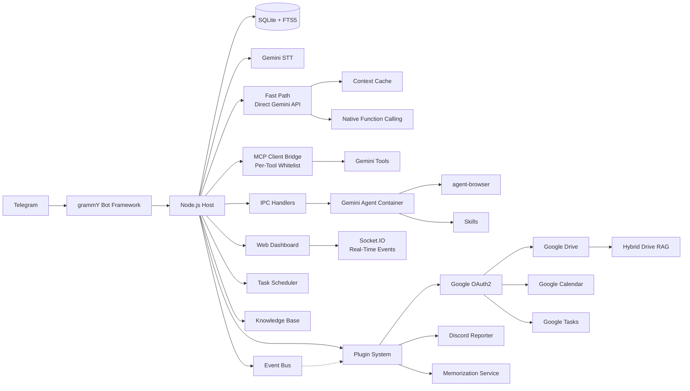

<p align="center">
  
</p>

<p align="center">
  <a href="https://github.com/Rlin1027/NanoGemClaw/blob/main/LICENSE"></a>
  <a href="https://nodejs.org/">=20"></a>
  <a href="https://github.com/Rlin1027/NanoGemClaw"></a>
</p>

<p align="center">
  Asistente de IA personal impulsado por <strong>Gemini</strong> con integración profunda del <strong>ecosistema de Google</strong>. Se ejecuta de forma segura en contenedores. Ligero y diseñado para ser entendido, personalizado y extendido.
</p>

<p align="center">
  <em>Bifurcado de <a href="https://github.com/gavrielc/nanoclaw">NanoClaw</a> - reemplazó Claude Agent SDK con Gemini y WhatsApp con Telegram</em>
</p>

<p align="center">
  <a href="README.md">English</a> |
  <a href="README.zh-TW.md">繁體中文</a> |
  <a href="README.zh-CN.md">简体中文</a> |
  <strong>Español</strong> |
  <a href="README.ja.md">日本語</a> |
  <a href="README.ko.md">한국어</a> |
  <a href="README.pt.md">Português</a> |
  <a href="README.ru.md">Русский</a>
</p>

---

## ¿Por qué NanoGemClaw?

**NanoGemClaw** es un asistente de IA ligero, seguro y extensible que ejecuta **Gemini** en contenedores aislados — entregado a través de Telegram con enrutamiento inteligente de ruta rápida, llamadas de función nativas e integración profunda con el ecosistema de Google.

| Característica           | NanoClaw             | NanoGemClaw                                                           |
| ----------------------- | -------------------- | --------------------------------------------------------------------- |
| **Tiempo de ejecución del agente** | Claude Agent SDK     | Gemini + MCP Client Bridge con lista blanca por herramienta           |
| **Marco de bot**        | node-telegram-bot-api| grammY (type-safe, event-driven)                                      |
| **Mensajería**         | WhatsApp (Baileys)   | Telegram Bot API                                                      |
| **Costo**              | Claude Max ($100/mes) | Nivel gratuito (60 req/min)                                          |
| **Arquitectura**       | Monolito             | Monorepo modular (8 paquetes + 7 plugins)                            |
| **Extensibilidad**    | Codificado           | Sistema de plugins con hooks de ciclo de vida                         |
| **Ecosistema Google** | -                    | Drive, Calendar, Tasks, Knowledge RAG                                 |
| **Notificaciones**    | -                    | Informes diarios/semanales de Discord                                 |
| **Soporte de medios** | Solo texto           | Foto, Voz (ruta rápida), Audio, Vídeo, Documento                     |
| **Exploración web**   | Solo búsqueda        | Completo `agent-browser` (Playwright)                                |
| **Base de conocimiento** | -                   | Búsqueda de texto completo FTS5 por grupo                            |
| **Programación**      | -                    | Lenguaje natural + cron, calendario iCal                             |
| **Panel de control**  | -                    | SPA de gestión de 12 módulos en tiempo real                          |
| **Herramientas avanzadas** | -               | STT, Generación de imágenes, Personas, Habilidades, Multi-modelo     |
| **Ruta rápida**       | -                    | Enrutamiento inteligente con almacenamiento en caché de contexto (ahorros de 75–90% de tokens) |

---

## Características principales

- **Monorepo modular** - 8 paquetes de espacio de trabajo npm. Utiliza paquetes individuales en tus propios proyectos o implementa la pila completa.
- **grammY Bot Framework** - Migrado de node-telegram-bot-api a grammY para integración de Telegram type-safe y dirigida por eventos con limitación de velocidad y consolidación de mensajes.
- **Puente cliente MCP** - Lista blanca por herramienta para Model Context Protocol, con validación de esquema Zod unificada en todas las entradas de herramientas.
- **Enrutamiento inteligente de mensajes** - El enrutamiento `preferredPath` selecciona entre ruta rápida (API de Gemini directo) y ejecución de contenedor basada en el tipo de consulta, con fallback perfecto.
- **Sistema de plugins** - Extiende con herramientas personalizadas de Gemini, hooks de mensaje, rutas de API, servicios de fondo, controladores IPC y extensiones del panel de control sin modificar el código central.
- **E/S multimodal** - Envía fotos, mensajes de voz, vídeos o documentos. Gemini los procesa de forma nativa.
- **Ruta rápida (API directo)** - Las consultas de texto simples omiten el inicio del contenedor, transmitiendo respuestas en tiempo real a través del SDK `@google/genai` con llamadas de función nativas. Los mensajes de voz se transcriben automáticamente y utilizan la ruta rápida. Se revierte a contenedores para ejecución de código.
- **Almacenamiento en caché de contexto** - Contenido estático almacenado en caché a través de la API de almacenamiento en caché de Gemini, reduciendo costos de tokens de entrada en un 75–90%.
- **Llamada de función nativa** - Las operaciones de herramientas utilizan llamadas de función nativa de Gemini con control de permisos por herramienta (principal/cualquier), reemplazando el sondeo de IPC basado en archivos.
- **Conversión de voz a texto** - Los mensajes de voz se transcriben automáticamente usando Gemini multimodal (predeterminado, sin necesidad de FFmpeg) o Google Cloud Speech.
- **Generación de imágenes** - Crea imágenes usando **Imagen 3** a través de lenguaje natural.
- **Automatización del navegador** - Los agentes utilizan `agent-browser` (Playwright) para tareas web complejas.
- **Base de conocimiento** - Almacén de documentos por grupo con búsqueda de texto completo SQLite FTS5 y escaneo de inyección para seguridad.
- **RAG de conducción híbrida** - Recuperación de dos capas: incrustaciones pre-indexadas a través del enfoque de archivo físico para búsqueda instantánea + búsqueda en vivo de Drive para cobertura más amplia. Comparte la misma carpeta de conocimiento con NotebookLM.
- **Tareas programadas** - Programación en lenguaje natural ("cada día a las 8 am") con soporte cron, intervalo y de una sola vez.
- **Google Calendar (Lectura/Escritura)** - Crea, actualiza, elimina eventos y verifica disponibilidad a través de la API de Google Calendar. Se revierte a iCal para acceso de solo lectura.
- **Google Tasks** - Operaciones CRUD completas con sincronización bidireccional entre tareas programadas de NanoGemClaw y Google Tasks.
- **Google Drive** - Busca archivos, lee contenido y resume documentos. Admite Docs, Sheets, PDF y texto sin formato.
- **Informes de Discord** - Informes de progreso diarios y semanales automatizados enviados a Discord a través de webhooks, con insignias codificadas por color y enlaces al panel de control.
- **Sistema de habilidades** - Asigna archivos de habilidad basados en Markdown a grupos para capacidades especializadas con protección de inyección.
- **Personas** - Personalidades predefinidas o crea personas personalizadas por grupo.
- **Soporte multi-modelo** - Elige el modelo Gemini por grupo (`gemini-3-flash-preview`, `gemini-3-pro-preview`, etc.).
- **Aislamiento de contenedor** - Cada grupo se ejecuta en su propia zona de pruebas (Apple Container o Docker) con límites de tiempo de espera y tamaño de salida.
- **Panel de control web** - Centro de comando en tiempo real de 12 módulos con transmisión de registros, editor de memoria, análisis, gestión de cuentas de Google, navegador Drive, configuración de Discord y gestión de MCP.
- **i18n (cobertura 100%)** - Soporte completo de interfaz para 8 idiomas: inglés, chino tradicional, chino simplificado, japonés, coreano, español, portugués y ruso.
- **Cobertura de pruebas** - Cobertura de sentencias del 92%, cobertura de ramas del 84% (35+ archivos de prueba, ~950 pruebas) con Vitest y pruebas de integración completas.

---

## Arquitectura del monorepo

```
nanogemclaw/
├── packages/
│   ├── core/          # @nanogemclaw/core      — tipos, config, logger, utilidades
│   ├── db/            # @nanogemclaw/db        — Persistencia SQLite (better-sqlite3)
│   ├── gemini/        # @nanogemclaw/gemini    — Cliente API de Gemini, caché de contexto, herramientas MCP
│   ├── telegram/      # @nanogemclaw/telegram  — Ayudantes de grammY bot, limitador de velocidad, consolidador
│   ├── server/        # @nanogemclaw/server    — Express + Socket.IO API del panel de control
│   ├── plugin-api/    # @nanogemclaw/plugin-api — Interfaz de plugin y tipos de ciclo de vida
│   ├── event-bus/     # @nanogemclaw/event-bus  — Sistema de eventos pub/sub tipado
│   └── dashboard/     # React + Vite SPA del frontend (privado)
├── plugins/
│   ├── google-auth/          # Gestión de tokens OAuth2 y auto-actualización
│   ├── google-drive/         # Búsqueda, lectura y resumen de archivos Drive
│   ├── google-tasks/         # CRUD de tareas con sincronización bidireccional
│   ├── google-calendar-rw/   # API de calendario de lectura/escritura completo (actualización de iCal)
│   ├── drive-knowledge-rag/  # RAG de dos capas (incrustaciones + búsqueda en vivo)
│   ├── discord-reporter/    # Informes de Discord diarios y semanales
│   └── memorization-service/ # Resumen automático de conversaciones
├── app/               # Punto de entrada de la aplicación — conecta todos los paquetes
├── src/               # Módulos de la aplicación (controlador de mensajes, bot, programador, etc.)
├── examples/
│   └── plugin-skeleton/  # Ejemplo de plugin mínimo
├── container/         # Contenedor de agentes (CLI de Gemini + herramientas)
└── docs/              # Documentación y guías
```

### Descripción general del paquete

| Paquete                   | Descripción                                              | Valor de reutilización |
| ------------------------- | -------------------------------------------------------- | ---------------------- |
| `@nanogemclaw/core`       | Tipos compartidos, fábrica de config, logger, utilidades | Medio                  |
| `@nanogemclaw/db`         | Capa de base de datos SQLite con búsqueda FTS5           | Medio                  |
| `@nanogemclaw/gemini`     | Cliente API de Gemini, almacenamiento en caché de contexto, llamada de función MCP | **Alto**    |
| `@nanogemclaw/telegram`   | Ayudantes de bot grammY, limitador de velocidad, consolidador de mensajes   | Medio      |
| `@nanogemclaw/server`     | Servidor del panel de control Express + Socket.IO + API tiempo real | Medio      |
| `@nanogemclaw/plugin-api` | Definiciones de interfaz de plugin y tipos de ciclo de vida | **Alto**    |
| `@nanogemclaw/event-bus`  | Sistema de eventos pub/sub tipado para comunicación entre plugins | Medio      |

---

## Inicio rápido

### Requisitos previos

| Herramienta         | Propósito          | Instalación                        |
| ------------------- | ---------------------- | ----------------------------------- |
| **Node.js 20+** | Tiempo de ejecución    | [nodejs.org](https://nodejs.org)    |
| **Gemini CLI**  | Agente de IA           | `npm install -g @google/gemini-cli` |
| **FFmpeg**      | Solo STT de GCP (opcional) | `brew install ffmpeg`               |

### 1. Clonar e instalar

```bash
git clone https://github.com/Rlin1027/NanoGemClaw.git
cd NanoGemClaw
npm install
```

### 2. Configurar

```bash
cp .env.example .env
```

Edita `.env` y rellena:

- `TELEGRAM_BOT_TOKEN` — Obtener de [@BotFather](https://t.me/BotFather) en Telegram
- `GEMINI_API_KEY` — Obtener de [Google AI Studio](https://aistudio.google.com/)

Opcionalmente, copia el archivo de configuración para autocompletado de TypeScript:

```bash
cp nanogemclaw.config.example.ts nanogemclaw.config.ts
```

### 3. Construir panel de control

```bash
cd packages/dashboard && npm install && cd ../..
npm run build:dashboard
```

### 4. Construir contenedor de agente

```bash
# macOS con Apple Container: inicia primero el servicio del sistema
container system start

bash container/build.sh
```

> Si usas Docker en lugar de Apple Container, omite `container system start`.

### 5. Iniciar

```bash
npm run dev
```

La API de backend se inicia en `http://localhost:3000`. Para acceder al panel de control web durante el desarrollo, inicia el servidor dev del frontend en una terminal separada:

```bash
cd packages/dashboard
npm run dev                # Panel de control en http://localhost:5173 (proxies /api → :3000)
```

> En producción (`npm start`), el panel de control se agrupa y sirve directamente en `http://localhost:3000`.

Para una guía paso a paso detallada, consulta [docs/GUIDE.md](docs/GUIDE.md).

---

## Sistema de plugins

NanoGemClaw admite plugins que extienden la funcionalidad sin modificar el código central. Los plugins pueden proporcionar:

- **Herramientas de Gemini** — Herramientas personalizadas de llamada de función con niveles de permiso (principal/cualquier) y lista blanca por herramienta
- **Hooks de mensaje** — Interceptar mensajes antes/después del procesamiento con escaneo de inyección
- **Rutas de API** — Puntos finales de API personalizados del panel de control
- **Servicios de fondo** — Tareas de fondo de larga duración
- **Controladores IPC** — Controladores de comunicación entre procesos personalizados
- **Extensiones del panel de control** — Componentes de interfaz de usuario personalizados para el panel de control web

### Escribir un plugin

1. Copia `examples/plugin-skeleton/` a un nuevo directorio.
2. Implementa la interfaz `NanoPlugin`:

```typescript
import type {
  NanoPlugin,
  PluginApi,
  GeminiToolContribution,
} from '@nanogemclaw/plugin-api';

const myPlugin: NanoPlugin = {
  id: 'my-plugin',
  name: 'My Plugin',
  version: '1.0.0',

  async init(api: PluginApi) {
    api.logger.info('Plugin initialized');
  },

  geminiTools: [
    {
      name: 'my_tool',
      description: 'Does something useful',
      parameters: {
        type: 'OBJECT',
        properties: {
          input: { type: 'STRING', description: 'The input value' },
        },
        required: ['input'],
      },
      permission: 'any',
      async execute(args) {
        return JSON.stringify({ result: `Processed: ${args.input}` });
      },
    },
  ],

  hooks: {
    async afterMessage(context) {
      // Log every message for analytics
    },
  },
};

export default myPlugin;
```

1. Registra en `data/plugins.json`:

```json
{
  "plugins": [
    {
      "source": "./path/to/my-plugin/src/index.ts",
      "config": { "myOption": "value" },
      "enabled": true
    }
  ]
}
```

Consulta `examples/plugin-skeleton/src/index.ts` para un ejemplo completamente documentado, y [docs/GUIDE.md](docs/GUIDE.md) para la guía completa de desarrollo de plugins.

### Plugins integrados

NanoGemClaw incluye 7 plugins integrados en el directorio `plugins/`:

| Plugin                      | Descripción                                                 | Herramientas Gemini | Servicio de fondo |
| --------------------------- | ----------------------------------------------------------- | :---------: | :--------: |
| **google-auth**             | OAuth2 core — gestión de tokens, auto-actualización, flujo de auth CLI |              |                    |
| **google-drive**            | Busca, lee y resume archivos Drive (Docs, Sheets, PDF) |      3       |                    |
| **google-tasks**            | Google Tasks CRUD con sincronización bidireccional  |      3       |    Sincronización cada 15 minutos     |
| **google-calendar-rw**      | API de calendario completo — crea, actualiza, elimina eventos |      5       |                    |
| **drive-knowledge-rag**     | RAG de dos capas: incrustaciones pre-indexadas + búsqueda en vivo de Drive |      1       |   Indexador cada 30 minutos   |
| **discord-reporter**        | Informes de progreso diarios y semanales a través de webhooks de Discord |              |   Programador cron   |
| **memorization-service**    | Resumen automático de conversaciones a través del Event Bus |              |  Dirigido por eventos      |

Todos los plugins de Google dependen de **google-auth** para tokens OAuth2. Ejecuta el flujo de autorización una vez desde la página de Configuración del panel de control.

---

## Variables de entorno

### Requerido

| Variable             | Descripción               |
| -------------------- | ------------------------- |
| `TELEGRAM_BOT_TOKEN` | Token bot de @BotFather |

### Opcional - IA y medios

| Variable         | Predeterminado                  | Descripción                                     |
| ---------------- | ------------------------ | ----------------------------------------------- |
| `GEMINI_API_KEY` | -                        | Clave API (requerida para generación de imágenes y ruta rápida)  |
| `GEMINI_MODEL`   | `gemini-3-flash-preview` | Modelo Gemini predeterminado para todos los grupos             |
| `ASSISTANT_NAME` | `Andy`                   | Nombre de activador del bot (usado para menciones `@Andy`)    |
| `STT_PROVIDER`   | `gemini`                 | Conversión de voz a texto: `gemini` (gratis) o `gcp` (pago) |

### Opcional - Panel de control y seguridad

| Variable                | Predeterminado     | Descripción                             |
| ----------------------- | ----------- | --------------------------------------- |
| `DASHBOARD_HOST`        | `127.0.0.1` | Dirección de enlace (`0.0.0.0` para acceso LAN) |
| `DASHBOARD_API_KEY`     | -           | Clave API para proteger acceso al panel de control     |
| `DASHBOARD_ACCESS_CODE` | -           | Código de acceso para pantalla de inicio de sesión del panel de control  |
| `DASHBOARD_ORIGINS`     | auto        | Orígenes CORS permitidos separados por comas    |

### Opcional - Ruta rápida

| Variable               | Predeterminado  | Descripción                               |
| ---------------------- | -------- | ----------------------------------------- |
| `FAST_PATH_ENABLED`    | `true`   | Habilitar API de Gemini directo para consultas de texto |
| `FAST_PATH_TIMEOUT_MS` | `180000` | Tiempo de espera de API (ms)                          |
| `CACHE_TTL_SECONDS`    | `21600`  | TTL de caché de contexto (6 horas)               |
| `MIN_CACHE_CHARS`      | `100000` | Longitud mínima de contenido para almacenamiento en caché            |

### Opcional - Ecosistema de Google (Plugins)

| Variable                     | Predeterminado     | Descripción                                      |
| ---------------------------- | ----------- | ------------------------------------------------ |
| `GOOGLE_CLIENT_ID`           | -           | ID de cliente OAuth2 de Google Cloud Console       |
| `GOOGLE_CLIENT_SECRET`       | -           | Secreto de cliente OAuth2                             |
| `DISCORD_WEBHOOK_URL`        | -           | URL del webhook del canal Discord para informes          |

### Opcional - Infraestructura

| Variable             | Predeterminado                    | Descripción                        |
| -------------------- | -------------------------- | ---------------------------------- |
| `CONTAINER_TIMEOUT`  | `300000`                   | Tiempo de espera de ejecución de contenedor (ms)   |
| `CONTAINER_IMAGE`    | `nanogemclaw-agent:latest` | Nombre de imagen de contenedor               |
| `RATE_LIMIT_ENABLED` | `true`                     | Habilitar limitación de velocidad de solicitud       |
| `RATE_LIMIT_MAX`     | `20`                       | Máximo de solicitudes por ventana por grupo  |
| `RATE_LIMIT_WINDOW`  | `5`                        | Ventana de límite de velocidad (minutos)        |
| `WEBHOOK_URL`        | -                          | Webhook externo para notificaciones |
| `WEBHOOK_EVENTS`     | `error,alert`              | Eventos que activan webhook        |
| `ALERTS_ENABLED`     | `true`                     | Habilitar alertas de error al grupo principal  |
| `CONTAINER_MAX_OUTPUT_SIZE` | `10485760`          | Tamaño máximo de salida del contenedor (bytes)  |
| `SCHEDULER_CONCURRENCY` | auto                    | Máximo de contenedores programados concurrentes |
| `BACKUP_RETENTION_DAYS` | `7`                     | Días para retener copias de seguridad de base de datos      |
| `HEALTH_CHECK_ENABLED` | `true`                   | Habilitar servidor HTTP de verificación de estado    |
| `HEALTH_CHECK_PORT`  | `8080`                     | Puerto del servidor de verificación de estado           |
| `TZ`                 | system                     | Zona horaria para tareas programadas       |
| `LOG_LEVEL`          | `info`                     | Nivel de registro                      |

Para la lista completa, consulta [.env.example](.env.example).

---

## Ejemplos de uso

### Mensajería y productividad

- `@Andy translate this voice message and summarize it`
- `@Andy generate a 16:9 image of a futuristic cyberpunk city`
- `@Andy browse https://news.google.com and give me the top headlines`

### Programación de tareas

- `@Andy every morning at 8am, check the weather and suggest what to wear`
- `@Andy monitor my website every 30 minutes and alert me if it goes down`

### Base de conocimiento

- Upload documents via the dashboard, then ask: `@Andy search the knowledge base for deployment guide`

### Ecosistema de Google

- `@Andy create a meeting with John tomorrow at 3pm`
- `@Andy what's on my calendar this week?`
- `@Andy add a task "Review PR #42" to my Google Tasks`
- `@Andy search my Drive for the Q4 budget spreadsheet`
- `@Andy summarize the project proposal document from Drive`
- `@Andy what do my knowledge docs say about deployment?`

### Administración

Envía estos comandos directamente al bot:

- `/admin help` - Lista todos los comandos de administración disponibles
- `/admin stats` - Mostrar tiempo de actividad, uso de memoria y estadísticas de tokens
- `/admin groups` - Listar todos los grupos registrados con estado
- `/admin tasks` - Listar todas las tareas programadas
- `/admin errors` - Mostrar grupos con errores recientes
- `/admin report` - Generar informe de uso diario
- `/admin language <lang>` - Cambiar idioma de interfaz del bot
- `/admin persona <name|list|set>` - Administrar personas del bot
- `/admin trigger <group> <on|off>` - Alternar requisito de activador @mention
- `/admin export <group>` - Exportar historial de conversación como Markdown

---

## Arquitectura


```mermaid
graph LR
    TG[Telegram] --> GramMY[grammY Bot Framework]
    GramMY --> Bot[Node.js Host]
    Bot --> DB[(SQLite + FTS5)]
    Bot --> STT[Gemini STT]
    Bot --> FP[Fast Path<br/>Direct Gemini API]
    FP --> Cache[Context Cache]
    FP --> FC[Native Function Calling]
    Bot --> MCP[MCP Client Bridge<br/>Per-Tool Whitelist]
    MCP --> Tools[Gemini Tools]
    Bot --> IPC[IPC Handlers]
    IPC --> Container[Gemini Agent Container]
    Container --> Browser[agent-browser]
    Container --> Skills[Skills]
    Bot --> Dashboard[Web Dashboard]
    Dashboard --> WS[Socket.IO<br/>Real-Time Events]
    Bot --> Scheduler[Task Scheduler]
    Bot --> Knowledge[Knowledge Base]
    Bot --> Plugins[Plugin System]
    Plugins --> GAuth[Google OAuth2]
    GAuth --> GDrive[Google Drive]
    GAuth --> GCal[Google Calendar]
    GAuth --> GTasks[Google Tasks]
    GDrive --> RAG[Hybrid Drive RAG]
    Plugins --> Discord[Discord Reporter]
    Plugins --> Memo[Memorization Service]
    Bot --> EB[Event Bus]
    EB -.-> Plugins
```

### Paquetes de backend

| Paquete                   | Módulos clave                                                                                  |
| ------------------------- | -------------------------------------------------------------------------------------------- |
| `@nanogemclaw/core`       | `config.ts`, `types.ts`, `logger.ts`, `utils.ts`, `safe-compare.ts`                          |
| `@nanogemclaw/db`         | `connection.ts`, `messages.ts`, `tasks.ts`, `stats.ts`, `preferences.ts`                     |
| `@nanogemclaw/gemini`     | `gemini-client.ts`, `context-cache.ts`, `mcp-client-bridge.ts`, `gemini-tools.ts`           |
| `@nanogemclaw/telegram`   | `grammY-helpers.ts`, `telegram-rate-limiter.ts`, `message-consolidator.ts`                   |
| `@nanogemclaw/server`     | `server.ts`, `routes/` (auth, groups, tasks, knowledge, calendar, skills, config, analytics) |
| `@nanogemclaw/plugin-api` | `NanoPlugin`, `PluginApi`, `GeminiToolContribution`, `HookContributions`                     |
| `@nanogemclaw/event-bus`  | `EventBus`, `NanoEventMap`, typed pub/sub singleton                                          |

### Capa de aplicación (`src/`)

| Módulo                | Propósito                                                  |
| --------------------- | -------------------------------------------------------- |
| `index.ts`            | Entrada del bot de Telegram, gestión de estado, distribución IPC       |
| `message-handler.ts`  | Procesamiento de mensajes, enrutamiento de ruta rápida, entrada multimodal |
| `fast-path.ts`        | Ejecución de API de Gemini directo con transmisión y almacenamiento en caché   |
| `container-runner.ts` | Ciclo de vida del contenedor y salida de transmisión                 |
| `task-scheduler.ts`   | Ejecución de tareas cron/intervalo/una sola vez                    |
| `knowledge.ts`        | Motor de base de conocimiento FTS5 con escaneo de inyección       |
| `personas.ts`         | Definiciones de persona y gestión de persona personalizada        |
| `natural-schedule.ts` | Analizador de lenguaje natural a cron (EN/ZH)                  |

### Frontend (`packages/dashboard/`)

React + Vite + TailwindCSS SPA con 12 módulos:

| Página                | Descripción                                                                     |
| ------------------- | ------------------------------------------------------------------------------- |
| **Overview**        | Tarjetas de estado del grupo con actividad de agente en tiempo real                                |
| **Logs**            | Flujo de registro universal con filtrado de nivel                                       |
| **Activity Logs**   | Historial de actividad por grupo y línea de tiempo de eventos                                   |
| **Memory Studio**   | Editor de Mónaco para indicaciones del sistema y resúmenes de conversaciones                     |
| **Group Detail**    | Configuración por grupo: persona, modelo, activador, búsqueda web alternar                  |
| **Tasks**           | CRUD de tareas programadas con historial de ejecución                                      |
| **Schedule**        | Descripción general del cronograma visual y línea de tiempo de tareas                                      |
| **Analytics**       | Gráficos de uso, registros de contenedores, estadísticas de mensajes                                |
| **Knowledge**       | Carga de documentos, búsqueda FTS5, gestión de documentos por grupo                     |
| **Drive**           | Navegador de archivos de Google Drive y visor de documentos                                   |
| **Calendar**        | Suscripción a canal iCal y visor de eventos próximos                                |
| **Settings**        | Modo de mantenimiento, registro de depuración, estado de secretos, cuenta de Google, config de Discord, gestión MCP |

### Persistencia

- **SQLite** (`store/messages.db`): Mensajes, tareas, estadísticas, preferencias, conocimiento (FTS5)
- **JSON** (`data/`): Sesiones, grupos registrados, personas personalizadas, configuraciones de calendario, habilidades de grupo
- **Sistema de archivos** (`groups/`): Espacio de trabajo por grupo (GEMINI.md, logs, media, IPC)
- **Copias de seguridad** (`store/backups/`): Copias de seguridad diarias automáticas de SQLite con retención configurable (`BACKUP_RETENTION_DAYS`)

### Verificación de estado

Un servidor HTTP ligero se ejecuta en el puerto `HEALTH_CHECK_PORT` (predeterminado 8080) con:

- `GET /health` — Estado de salud del sistema (healthy/degraded/unhealthy)
- `GET /ready` — Sonda de disponibilidad para orquestadores
- `GET /metrics` — Métricas en formato Prometheus

Deshabilita con `HEALTH_CHECK_ENABLED=false`.

---

## Panel de control web

### Desarrollo

```bash
# Terminal 1: Iniciar backend
npm run dev

# Terminal 2: Iniciar frontend del panel de control
cd packages/dashboard
npm run dev                # http://localhost:5173 (proxies /api → :3000)
```

### Producción

```bash
npm run build:dashboard    # Construir frontend
npm run build              # Construir backend
npm start                  # Sirve todo en http://localhost:3000
```

```bash
# Acceso LAN
DASHBOARD_HOST=0.0.0.0 npm start
```

Admite superposición de búsqueda global `Cmd+K` / `Ctrl+K`.

---

## Desarrollo

```bash
npm run dev               # Iniciar con tsx (recarga en caliente)
npm run typecheck         # Verificación de tipo TypeScript (backend)
npm test                  # Ejecutar todas las pruebas (Vitest, 35 archivos, ~950 pruebas)
npm run test:watch        # Modo de observación
npm run test:coverage     # Informe de cobertura (92% sentencias, 84% ramas)
npm run format:check      # Verificación de Prettier
```

Desarrollo del panel de control:

```bash
cd packages/dashboard
npm run dev               # Servidor de desarrollo Vite (puerto 5173, proxies /api -> :3000)
npx tsc --noEmit          # Verificar tipo frontend
```

---

## Solución de problemas

- **¿Bot no responde?** Comprueba los registros de `npm run dev` y asegúrate de que el bot sea administrador en el grupo.
- **¿Falla STT?** El proveedor predeterminado (`gemini`) no necesita dependencias adicionales. Si usas `STT_PROVIDER=gcp`, asegúrate de que FFmpeg esté instalado (`brew install ffmpeg`).
- **¿Medios no procesados?** Verifica que `GEMINI_API_KEY` esté configurado en `.env`.
- **¿Problemas de contenedor?** Ejecuta `bash container/build.sh` para reconstruir la imagen.
- **¿Página en blanco del panel de control?** Ejecuta `cd packages/dashboard && npm install` antes de compilar.
- **¿Errores CORS?** Comprueba la variable de entorno `DASHBOARD_ORIGINS`.
- **¿Error EROFS del contenedor?** Apple Container no admite enlaces de montaje anidados superpuestos.
- **¿Error XPC del contenedor?** Ejecuta `container system start` primero. El servicio de sistema de Apple Container debe estar ejecutándose antes de las compilaciones.
- **¿`Cannot GET /` en localhost:3000?** En modo dev, el puerto 3000 es solo API. Inicia el panel de control por separado: `cd packages/dashboard && npm run dev` (sirve en puerto 5173).
- **¿Ruta rápida no funcionando?** Asegúrate de que `GEMINI_API_KEY` esté configurado. Comprueba `FAST_PATH_ENABLED=true`. La configuración por grupo en el panel de control puede anular globalmente.
- **¿Limitación de velocidad?** Ajusta `RATE_LIMIT_MAX` y `RATE_LIMIT_WINDOW` en `.env`.
- **¿OAuth de Google no funcionando?** Asegúrate de que `GOOGLE_CLIENT_ID` y `GOOGLE_CLIENT_SECRET` estén configurados. Usa el tipo "Desktop App" en Google Cloud Console.
- **¿Drive/Calendar/Tasks no respondiendo?** Completa primero el flujo de OAuth desde Configuración del panel de control → Cuenta de Google.
- **¿Informes de Discord no enviándose?** Comprueba que `DISCORD_WEBHOOK_URL` sea válido. Prueba con el botón "Send Test" en Configuración del panel de control.
- **¿Herramientas MCP no ejecutándose?** Verifica la lista blanca por herramienta en Configuración del panel de control → MCP. Comprueba el nivel de permiso de herramienta (principal vs cualquier).
- **¿Mensajes de voz no usando ruta rápida?** Asegúrate de que la transcripción STT se complete correctamente. Comprueba los registros para errores de transcripción.

---

## Licencia

MIT

## Créditos

- Original [NanoClaw](https://github.com/gavrielc/nanoclaw) por [@gavrielc](https://github.com/gavrielc)
- Impulsado por [Gemini](https://ai.google.dev/)
