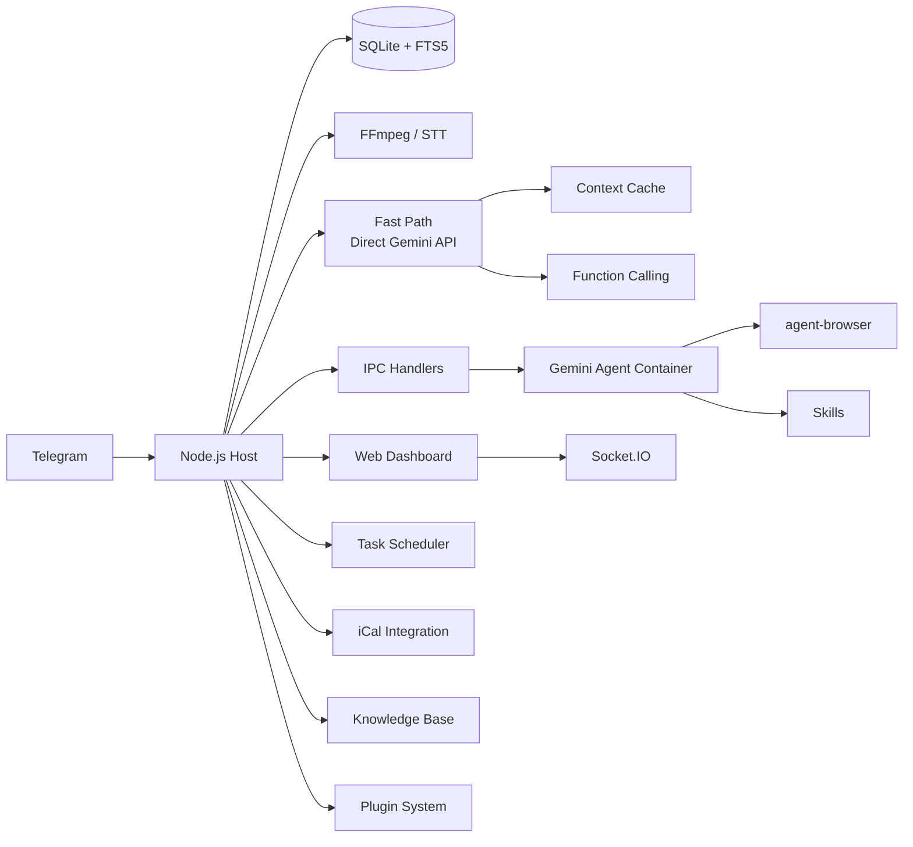

<p align="center">
  
</p>

<p align="center">
  Asistente de IA personal impulsado por <strong>Gemini</strong>. Se ejecuta de forma segura en contenedores. Liviano y diseñado para ser comprendido, personalizado y extendido.
</p>

<p align="center">
  <em>Bifurcado de <a href="https://github.com/gavrielc/nanoclaw">NanoClaw</a> - se reemplazó el Claude Agent SDK con Gemini y WhatsApp con Telegram</em>
</p>

<p align="center">
  <a href="README.md">English</a> |
  <a href="README.zh-TW.md">繁體中文</a> |
  <a href="README.zh-CN.md">简体中文</a> |
  <strong>Español</strong> |
  <a href="README.ja.md">日本語</a>
</p>

---

## ¿Por qué NanoGemClaw?

**NanoGemClaw** es un asistente de IA liviano, seguro y extensible que ejecuta **Gemini** en contenedores aislados — entregado a través de Telegram.

| Característica | NanoClaw | NanoGemClaw |
|----------------|----------|-------------|
| **Runtime del Agente** | Claude Agent SDK | Gemini CLI + Direct API |
| **Mensajería** | WhatsApp (Baileys) | Telegram Bot API |
| **Costo** | Claude Max ($100/mes) | Nivel gratuito (60 req/min) |
| **Arquitectura** | Monolito | Monorepo modular (7 paquetes) |
| **Extensibilidad** | Hardcodeada | Sistema de plugins con lifecycle hooks |
| **Soporte Multimedia** | Solo texto | Foto, Voz, Audio, Video, Documento |
| **Navegación Web** | Solo búsqueda | `agent-browser` completo (Playwright) |
| **Base de Conocimiento** | - | Búsqueda de texto completo FTS5 por grupo |
| **Programación de Tareas** | - | Lenguaje natural + cron, calendario iCal |
| **Panel de Control** | - | SPA de gestión en tiempo real con 9 módulos |
| **Herramientas Avanzadas** | - | STT, Generación de Imágenes, Personas, Skills, Multi-modelo |
| **Ruta Rápida** | - | Streaming directo de Gemini API, context caching, function calling nativo |

---

## Características Principales

- **Monorepo Modular** - 7 paquetes npm workspace. Usa paquetes individuales en tus propios proyectos o despliega el stack completo.
- **Sistema de Plugins** - Extiende con herramientas Gemini personalizadas, message hooks, rutas de API y servicios en segundo plano sin modificar el código central.
- **E/S Multimodal** - Envía fotos, mensajes de voz, videos o documentos. Gemini los procesa de forma nativa.
- **Ruta Rápida (Direct API)** - Las consultas de texto simples evitan el inicio del contenedor, transmitiendo respuestas en tiempo real mediante el SDK `@google/genai`. Vuelve a los contenedores para la ejecución de código.
- **Context Caching** - El contenido estático se almacena en caché mediante la API de caché de Gemini, reduciendo los costos de tokens de entrada entre un 75-90%.
- **Function Calling Nativo** - Las operaciones de herramientas utilizan el function calling nativo de Gemini en lugar del sondeo IPC basado en archivos.
- **Speech-to-Text** - Los mensajes de voz se transcriben automáticamente (Gemini multimodal o Google Cloud Speech).
- **Generación de Imágenes** - Crea imágenes usando **Imagen 3** mediante lenguaje natural.
- **Automatización del Navegador** - Los agentes usan `agent-browser` para tareas web complejas.
- **Base de Conocimiento** - Almacén de documentos por grupo con búsqueda de texto completo SQLite FTS5.
- **Tareas Programadas** - Programación en lenguaje natural ("every day at 8am") con soporte para cron, intervalos y tareas únicas.
- **Integración de Calendario** - Suscríbete a feeds iCal y consulta eventos próximos.
- **Sistema de Skills** - Asigna archivos de skills basados en Markdown a grupos para capacidades especializadas.
- **Personas** - Personalidades predefinidas o crea personas personalizadas por grupo.
- **Soporte Multi-modelo** - Elige el modelo Gemini por grupo (`gemini-3-flash-preview`, `gemini-3-pro-preview`, etc.).
- **Aislamiento en Contenedores** - Cada grupo se ejecuta en su propio sandbox (Apple Container o Docker).
- **Panel Web** - Centro de control en tiempo real con 9 módulos: streaming de logs, editor de memoria, analíticas y más.
- **i18n** - Soporte completo de interfaz para inglés, chino, japonés y español.

---

## Arquitectura del Monorepo

```
nanogemclaw/
├── packages/
│   ├── core/          # @nanogemclaw/core      — tipos, config, logger, utilidades
│   ├── db/            # @nanogemclaw/db        — persistencia SQLite (better-sqlite3)
│   ├── gemini/        # @nanogemclaw/gemini    — cliente Gemini API, context cache, herramientas
│   ├── telegram/      # @nanogemclaw/telegram  — helpers del bot, rate limiter, consolidator
│   ├── server/        # @nanogemclaw/server    — Express + Socket.IO dashboard API
│   ├── plugin-api/    # @nanogemclaw/plugin-api — interfaz de plugins y tipos de lifecycle
│   └── dashboard/     # SPA frontend React + Vite (privado)
├── app/               # Punto de entrada de la aplicación — conecta todos los paquetes
├── src/               # Módulos de la aplicación (manejador de mensajes, bot, scheduler, etc.)
├── examples/
│   └── plugin-skeleton/  # Ejemplo mínimo de plugin
├── container/         # Contenedor del agente (Gemini CLI + herramientas)
└── docs/              # Documentación y guías
```

### Descripción de Paquetes

| Paquete | Descripción | Valor de Reutilización |
|---------|-------------|------------------------|
| `@nanogemclaw/core` | Tipos compartidos, config factory, logger, utilidades | Medio |
| `@nanogemclaw/db` | Capa de base de datos SQLite con búsqueda FTS5 | Medio |
| `@nanogemclaw/gemini` | Cliente Gemini API, context caching, function calling | **Alto** |
| `@nanogemclaw/telegram` | Helpers del bot de Telegram, rate limiter, consolidador de mensajes | Medio |
| `@nanogemclaw/server` | Servidor Express del panel + eventos en tiempo real Socket.IO | Medio |
| `@nanogemclaw/plugin-api` | Definiciones de interfaz de plugins y tipos de lifecycle | **Alto** |

---

## Inicio Rápido

### Requisitos Previos

| Herramienta | Propósito | Instalación |
|-------------|-----------|-------------|
| **Node.js 20+** | Runtime | [nodejs.org](https://nodejs.org) |
| **Gemini CLI** | Agente de IA | `npm install -g @google/gemini-cli` |
| **FFmpeg** | Procesamiento de audio (STT) | `brew install ffmpeg` |

### 1. Clonar e Instalar

```bash
git clone https://github.com/Rlin1027/NanoGemClaw.git
cd NanoGemClaw
npm install
```

### 2. Configurar

```bash
cp .env.example .env
```

Edita `.env` y completa:
- `TELEGRAM_BOT_TOKEN` — Obtenlo de [@BotFather](https://t.me/BotFather) en Telegram
- `GEMINI_API_KEY` — Obtenlo de [Google AI Studio](https://aistudio.google.com/)

Opcionalmente copia el archivo de configuración para autocompletado de TypeScript:

```bash
cp nanogemclaw.config.example.ts nanogemclaw.config.ts
```

### 3. Compilar el Panel de Control

```bash
cd packages/dashboard && npm install && cd ../..
npm run build:dashboard
```

### 4. Compilar el Contenedor del Agente

```bash
bash container/build.sh
```

### 5. Iniciar

```bash
npm run dev
```

Abre `http://localhost:3000` para acceder al Panel Web.

> Para una guía detallada paso a paso, consulta [docs/GUIDE.md](docs/GUIDE.md).

---

## Sistema de Plugins

NanoGemClaw admite plugins que extienden la funcionalidad sin modificar el código central. Los plugins pueden proporcionar:

- **Herramientas Gemini** — Herramientas de function calling personalizadas disponibles para la IA
- **Message Hooks** — Interceptar mensajes antes/después del procesamiento
- **Rutas de API** — Endpoints personalizados para el dashboard
- **Servicios en Segundo Plano** — Tareas de larga duración en segundo plano
- **Manejadores IPC** — Manejadores de comunicación entre procesos personalizados

### Escribir un Plugin

1. Copia `examples/plugin-skeleton/` a un nuevo directorio.
2. Implementa la interfaz `NanoPlugin`:

```typescript
import type { NanoPlugin, PluginApi, GeminiToolContribution } from '@nanogemclaw/plugin-api';

const myPlugin: NanoPlugin = {
  id: 'my-plugin',
  name: 'My Plugin',
  version: '1.0.0',

  async init(api: PluginApi) {
    api.logger.info('Plugin initialized');
  },

  geminiTools: [
    {
      name: 'my_tool',
      description: 'Does something useful',
      parameters: {
        type: 'OBJECT',
        properties: {
          input: { type: 'STRING', description: 'The input value' },
        },
        required: ['input'],
      },
      permission: 'any',
      async execute(args) {
        return JSON.stringify({ result: `Processed: ${args.input}` });
      },
    },
  ],

  hooks: {
    async afterMessage(context) {
      // Registrar cada mensaje para analíticas
    },
  },
};

export default myPlugin;
```

3. Registra en `data/plugins.json`:

```json
{
  "plugins": [
    {
      "source": "./path/to/my-plugin/src/index.ts",
      "config": { "myOption": "value" },
      "enabled": true
    }
  ]
}
```

Consulta `examples/plugin-skeleton/src/index.ts` para un ejemplo completamente documentado, y [docs/GUIDE.md](docs/GUIDE.md) para la guía completa de desarrollo de plugins.

---

## Variables de Entorno

### Requeridas

| Variable | Descripción |
|----------|-------------|
| `TELEGRAM_BOT_TOKEN` | Token del bot de @BotFather |

### Opcionales - IA y Multimedia

| Variable | Por Defecto | Descripción |
|----------|-------------|-------------|
| `GEMINI_API_KEY` | - | Clave de API (requerida para generación de imágenes y ruta rápida) |
| `GEMINI_MODEL` | `gemini-3-flash-preview` | Modelo Gemini por defecto para todos los grupos |
| `ASSISTANT_NAME` | `Andy` | Nombre de activación del bot (usado para menciones `@Andy`) |
| `STT_PROVIDER` | `gemini` | Speech-to-text: `gemini` (gratuito) o `gcp` (de pago) |

### Opcionales - Panel de Control y Seguridad

| Variable | Por Defecto | Descripción |
|----------|-------------|-------------|
| `DASHBOARD_HOST` | `127.0.0.1` | Dirección de enlace (`0.0.0.0` para acceso LAN) |
| `DASHBOARD_API_KEY` | - | Clave de API para proteger el acceso al panel |
| `DASHBOARD_ACCESS_CODE` | - | Código de acceso para la pantalla de inicio de sesión |
| `DASHBOARD_ORIGINS` | auto | Orígenes CORS permitidos separados por coma |

### Opcionales - Ruta Rápida

| Variable | Por Defecto | Descripción |
|----------|-------------|-------------|
| `FAST_PATH_ENABLED` | `true` | Habilitar la Gemini API directa para consultas de texto |
| `FAST_PATH_TIMEOUT_MS` | `180000` | Tiempo de espera de la API (ms) |
| `CACHE_TTL_SECONDS` | `21600` | TTL del context cache (6 horas) |
| `MIN_CACHE_CHARS` | `100000` | Longitud mínima del contenido para el caché |

### Opcionales - Infraestructura

| Variable | Por Defecto | Descripción |
|----------|-------------|-------------|
| `CONTAINER_TIMEOUT` | `300000` | Tiempo de espera de ejecución del contenedor (ms) |
| `CONTAINER_IMAGE` | `nanogemclaw-agent:latest` | Nombre de la imagen del contenedor |
| `RATE_LIMIT_ENABLED` | `true` | Habilitar limitación de tasa de solicitudes |
| `RATE_LIMIT_MAX` | `20` | Solicitudes máximas por ventana por grupo |
| `RATE_LIMIT_WINDOW` | `5` | Ventana del rate limit (minutos) |
| `WEBHOOK_URL` | - | Webhook externo para notificaciones |
| `TZ` | sistema | Zona horaria para tareas programadas |
| `LOG_LEVEL` | `info` | Nivel de registro |

Para la lista completa, consulta [.env.example](.env.example).

---

## Ejemplos de Uso

### Mensajería y Productividad

- `@Andy translate this voice message and summarize it`
- `@Andy generate a 16:9 image of a futuristic cyberpunk city`
- `@Andy browse https://news.google.com and give me the top headlines`

### Programación de Tareas

- `@Andy every morning at 8am, check the weather and suggest what to wear`
- `@Andy monitor my website every 30 minutes and alert me if it goes down`

### Base de Conocimiento

- Sube documentos a través del panel y luego pregunta: `@Andy search the knowledge base for deployment guide`

### Administración

Envía estos comandos directamente al bot:

- `/admin language <lang>` - Cambia el idioma de la interfaz del bot
- `/admin persona <name>` - Cambia la personalidad del bot
- `/admin report` - Obtiene un resumen de actividad diaria

---

## Arquitectura



### Paquetes del Backend

| Paquete | Módulos Clave |
|---------|---------------|
| `@nanogemclaw/core` | `config.ts`, `types.ts`, `logger.ts`, `utils.ts`, `safe-compare.ts` |
| `@nanogemclaw/db` | `connection.ts`, `messages.ts`, `tasks.ts`, `stats.ts`, `preferences.ts` |
| `@nanogemclaw/gemini` | `gemini-client.ts`, `context-cache.ts`, `gemini-tools.ts` |
| `@nanogemclaw/telegram` | `telegram-helpers.ts`, `telegram-rate-limiter.ts`, `message-consolidator.ts` |
| `@nanogemclaw/server` | `server.ts`, `routes/` (auth, groups, tasks, knowledge, calendar, skills, config, analytics) |
| `@nanogemclaw/plugin-api` | `NanoPlugin`, `PluginApi`, `GeminiToolContribution`, `HookContributions` |

### Capa de Aplicación (`src/`)

| Módulo | Propósito |
|--------|-----------|
| `index.ts` | Entrada del bot de Telegram, gestión de estado, despacho IPC |
| `message-handler.ts` | Procesamiento de mensajes, enrutamiento de ruta rápida, entrada multimodal |
| `fast-path.ts` | Ejecución directa de Gemini API con streaming |
| `container-runner.ts` | Ciclo de vida del contenedor y salida en streaming |
| `task-scheduler.ts` | Ejecución de tareas cron/intervalo/únicas |
| `knowledge.ts` | Motor de base de conocimiento FTS5 |
| `personas.ts` | Definiciones de personas y gestión de personas personalizadas |
| `natural-schedule.ts` | Analizador de lenguaje natural a cron (EN/ZH) |

### Frontend (`packages/dashboard/`)

SPA React + Vite + TailwindCSS con 9 módulos:

| Página | Descripción |
|--------|-------------|
| **Overview** | Tarjetas de estado de grupo con actividad del agente en tiempo real |
| **Logs** | Stream de logs universal con filtrado por nivel |
| **Memory Studio** | Editor Monaco para prompts del sistema y resúmenes de conversación |
| **Group Detail** | Configuración por grupo: persona, modelo, trigger, toggle de búsqueda web |
| **Tasks** | CRUD de tareas programadas con historial de ejecución |
| **Analytics** | Gráficas de uso, logs de contenedor, estadísticas de mensajes |
| **Knowledge** | Carga de documentos, búsqueda FTS5, gestión de documentos por grupo |
| **Calendar** | Suscripción a feeds iCal y visualizador de eventos próximos |
| **Settings** | Modo de mantenimiento, registro de depuración, estado de secretos, preferencias |

### Persistencia

- **SQLite** (`store/messages.db`): Mensajes, tareas, estadísticas, preferencias, base de conocimiento (FTS5)
- **JSON** (`data/`): Sesiones, grupos registrados, personas personalizadas, configuraciones de calendario, skills de grupos
- **Sistema de Archivos** (`groups/`): Espacio de trabajo por grupo (GEMINI.md, logs, multimedia, IPC)

---

## Panel Web

```bash
# Acceso local (por defecto)
open http://localhost:3000

# Acceso LAN
DASHBOARD_HOST=0.0.0.0 npm run dev
```

Soporta la superposición de búsqueda global `Cmd+K` / `Ctrl+K`.

### Compilar para Producción

```bash
npm run build:dashboard    # Compila el frontend
npm run build              # Compila el backend
npm start                  # Sirve el panel en :3000
```

---

## Desarrollo

```bash
npm run dev               # Iniciar con tsx (hot reload)
npm run typecheck         # Verificación de tipos TypeScript (backend)
npm test                  # Ejecutar todas las pruebas (Vitest, 12 archivos, ~330 pruebas)
npm run test:watch        # Modo watch
npm run test:coverage     # Informe de cobertura
npm run format:check      # Verificación de Prettier
```

Desarrollo del panel:

```bash
cd packages/dashboard
npm run dev               # Servidor dev Vite (puerto 5173, proxies /api -> :3000)
npx tsc --noEmit          # Verificación de tipos del frontend
```

---

## Solución de Problemas

- **¿El bot no responde?** Revisa los logs de `npm run dev` y asegúrate de que el bot sea Admin en el grupo.
- **¿Falla el STT?** Asegúrate de que `ffmpeg` esté instalado (`brew install ffmpeg`).
- **¿No se procesa el multimedia?** Verifica que `GEMINI_API_KEY` esté configurado en `.env`.
- **¿Problemas con el contenedor?** Ejecuta `bash container/build.sh` para reconstruir la imagen.
- **¿Página en blanco en el panel?** Ejecuta `cd packages/dashboard && npm install` antes de compilar.
- **¿Errores CORS?** Revisa la variable de entorno `DASHBOARD_ORIGINS`.
- **¿Error EROFS en el contenedor?** Apple Container no admite montajes bind anidados que se superpongan.
- **¿La ruta rápida no funciona?** Asegúrate de que `GEMINI_API_KEY` esté configurado. Las configuraciones solo con OAuth vuelven a la ruta del contenedor.
- **¿Quieres deshabilitar la ruta rápida?** Establece `FAST_PATH_ENABLED=false` globalmente, o alterna por grupo en el panel.
- **¿Límite de tasa alcanzado?** Ajusta `RATE_LIMIT_MAX` y `RATE_LIMIT_WINDOW` en `.env`.

---

## Licencia

MIT

## Créditos

- Original [NanoClaw](https://github.com/gavrielc/nanoclaw) por [@gavrielc](https://github.com/gavrielc)
- Impulsado por [Gemini](https://ai.google.dev/)
