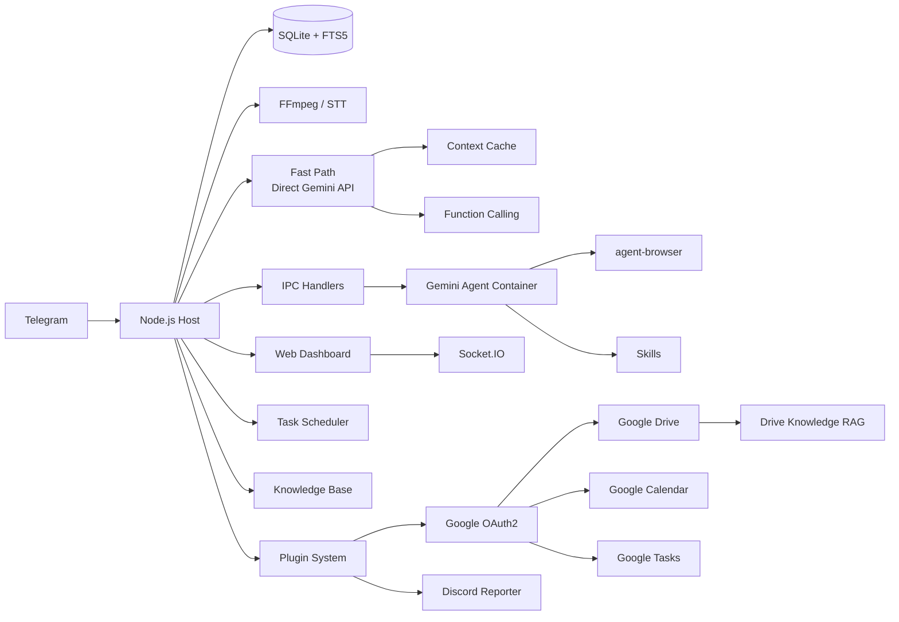

<p align="center">
  
</p>

<p align="center">
  <strong>Gemini</strong> を搭載し、<strong>Google エコシステム</strong>と深く統合されたパーソナル AI アシスタント。コンテナ内で安全に動作します。軽量で、理解・カスタマイズ・拡張しやすい設計です。
</p>

<p align="center">
  <em><a href="https://github.com/gavrielc/nanoclaw">NanoClaw</a> からフォーク — Claude Agent SDK を Gemini に、WhatsApp を Telegram に置き換えました</em>
</p>

<p align="center">
  <a href="README.md">English</a> |
  <a href="README.zh-TW.md">繁體中文</a> |
  <a href="README.zh-CN.md">简体中文</a> |
  <a href="README.es.md">Español</a> |
  <strong>日本語</strong> |
  <a href="README.ko.md">한국어</a> |
  <a href="README.pt.md">Português</a> |
  <a href="README.ru.md">Русский</a>
</p>

---

## NanoGemClaw とは

**NanoGemClaw** は、軽量・安全・拡張可能な AI アシスタントです。**Gemini** を独立したコンテナ内で実行し、Telegram 経由で利用できます。

| 機能                       | NanoClaw             | NanoGemClaw                                                                      |
| -------------------------- | -------------------- | -------------------------------------------------------------------------------- |
| **エージェントランタイム** | Claude Agent SDK     | Gemini CLI + Direct API                                                          |
| **メッセージング**         | WhatsApp (Baileys)   | Telegram Bot API                                                                 |
| **コスト**                 | Claude Max ($100/月) | 無料枠 (60 req/分)                                                               |
| **アーキテクチャ**         | モノリス             | モジュラーモノレポ (7 パッケージ + 6 プラグイン)                                 |
| **拡張性**                 | ハードコード         | ライフサイクルフック付きプラグインシステム                                       |
| **Google エコシステム**    | -                    | Drive・Calendar・Tasks・ナレッジ RAG                                             |
| **通知**                   | -                    | Discord 日次/週次レポート                                                        |
| **メディア対応**           | テキストのみ         | 写真・音声・動画・ドキュメント                                                   |
| **Web ブラウジング**       | 検索のみ             | フル `agent-browser` (Playwright)                                                |
| **ナレッジベース**         | -                    | グループ別 FTS5 全文検索                                                         |
| **スケジューリング**       | -                    | 自然言語 + cron、iCal カレンダー                                                 |
| **ダッシュボード**         | -                    | 9 モジュールのリアルタイム管理 SPA                                               |
| **高度なツール**           | -                    | STT・画像生成・ペルソナ・スキル・マルチモデル                                    |
| **Fast Path**              | -                    | Direct Gemini API ストリーミング・コンテキストキャッシュ・ネイティブ関数呼び出し |

---

## 主な機能

- **モジュラーモノレポ** - 7 つの npm ワークスペースパッケージ。個別パッケージを自分のプロジェクトで使用することも、フルスタックをデプロイすることもできます。
- **プラグインシステム** - カスタム Gemini ツール・メッセージフック・API ルート・バックグラウンドサービスをコアコードを変更せずに追加できます。
- **マルチモーダル I/O** - 写真・音声メッセージ・動画・ドキュメントを送信できます。Gemini がネイティブに処理します。
- **Fast Path (Direct API)** - シンプルなテキストクエリはコンテナ起動をバイパスし、`@google/genai` SDK を通じてリアルタイムにストリーミング応答します。コード実行が必要な場合はコンテナにフォールバックします。
- **コンテキストキャッシュ** - 静的コンテンツを Gemini キャッシング API でキャッシュし、入力トークンコストを 75〜90% 削減します。
- **ネイティブ関数呼び出し** - ツール操作にファイルベースの IPC ポーリングではなく Gemini のネイティブ関数呼び出しを使用します。
- **音声認識 (STT)** - 音声メッセージを自動で文字起こしします (Gemini マルチモーダルまたは Google Cloud Speech)。
- **画像生成** - 自然言語を使って **Imagen 3** で画像を生成します。
- **ブラウザ自動化** - エージェントが `agent-browser` を使って複雑な Web タスクを実行します。
- **ナレッジベース** - SQLite FTS5 全文検索付きのグループ別ドキュメントストア。
- **スケジュールタスク** - 「毎日午前 8 時に」などの自然言語スケジューリング。cron・インターバル・ワンタイム実行に対応。
- **Google Calendar（読み書き）** - Google Calendar API でイベントの作成・更新・削除・空き時間確認が可能。OAuth 未設定時は iCal 読み取り専用にフォールバック。
- **Google Tasks** - フル CRUD 操作。NanoGemClaw のスケジュールタスクと Google Tasks の双方向同期。
- **Google Drive** - ファイル検索・内容読み取り・ドキュメント要約。Docs・Sheets・PDF・プレーンテキストに対応。
- **Drive ナレッジ RAG** - 2 層検索: プリインデックスされたエンベディングによる即時ルックアップ + リアルタイム Drive 検索。NotebookLM と同じナレッジフォルダを共有可能。
- **Discord レポート** - カラーコード付きエンベッドとダッシュボードリンク付きの日次・週次レポートを Discord に自動プッシュ。
- **スキルシステム** - Markdown ベースのスキルファイルをグループに割り当て、専門的な機能を追加できます。
- **ペルソナ** - 事前定義されたキャラクター、またはグループごとにカスタムペルソナを作成できます。
- **マルチモデル対応** - グループごとに Gemini モデルを選択できます (`gemini-3-flash-preview`、`gemini-3-pro-preview` など)。
- **コンテナ分離** - 各グループが独自のサンドボックス (Apple Container または Docker) で動作します。
- **Web ダッシュボード** - ログストリーミング・メモリエディタ・アナリティクス・Google アカウント管理・Discord 設定などを備えた 9 モジュールのリアルタイム管理センター。
- **i18n** - 英語・中国語・日本語・スペイン語の完全なインターフェース対応。

---

## モノレポアーキテクチャ

```
nanogemclaw/
├── packages/
│   ├── core/          # @nanogemclaw/core      — 型・設定・ロガー・ユーティリティ
│   ├── db/            # @nanogemclaw/db        — SQLite 永続化 (better-sqlite3)
│   ├── gemini/        # @nanogemclaw/gemini    — Gemini API クライアント・コンテキストキャッシュ・ツール
│   ├── telegram/      # @nanogemclaw/telegram  — Bot ヘルパー・レートリミッター・コンソリデーター
│   ├── server/        # @nanogemclaw/server    — Express + Socket.IO ダッシュボード API
│   ├── plugin-api/    # @nanogemclaw/plugin-api — プラグインインターフェースとライフサイクル型
│   └── dashboard/     # React + Vite フロントエンド SPA (private)
├── plugins/
│   ├── google-auth/          # OAuth2 トークン管理と自動リフレッシュ
│   ├── google-drive/         # Drive ファイル検索・読み取り・要約
│   ├── google-tasks/         # Tasks CRUD と双方向同期
│   ├── google-calendar-rw/   # Calendar 読み書き (iCal からアップグレード)
│   ├── drive-knowledge-rag/  # 2 層 RAG (エンベディング + リアルタイム検索)
│   └── discord-reporter/     # 日次・週次 Discord エンベッドレポート
├── app/               # アプリケーションエントリーポイント — 全パッケージを結合
├── src/               # アプリケーションモジュール (メッセージハンドラー・Bot・スケジューラーなど)
├── examples/
│   └── plugin-skeleton/  # 最小プラグインサンプル
├── container/         # エージェントコンテナ (Gemini CLI + ツール)
└── docs/              # ドキュメント・ガイド
```

### パッケージ概要

| パッケージ                | 説明                                                                | 再利用価値 |
| ------------------------- | ------------------------------------------------------------------- | ---------- |
| `@nanogemclaw/core`       | 共有型・設定ファクトリー・ロガー・ユーティリティ                    | 中         |
| `@nanogemclaw/db`         | FTS5 検索付き SQLite データベース層                                 | 中         |
| `@nanogemclaw/gemini`     | Gemini API クライアント・コンテキストキャッシュ・関数呼び出し       | **高**     |
| `@nanogemclaw/telegram`   | Telegram Bot ヘルパー・レートリミッター・メッセージコンソリデーター | 中         |
| `@nanogemclaw/server`     | Express ダッシュボードサーバー + Socket.IO リアルタイムイベント     | 中         |
| `@nanogemclaw/plugin-api` | プラグインインターフェース定義とライフサイクル型                    | **高**     |

---

## クイックスタート

### 前提条件

| ツール          | 用途            | インストール                        |
| --------------- | --------------- | ----------------------------------- |
| **Node.js 20+** | ランタイム      | [nodejs.org](https://nodejs.org)    |
| **Gemini CLI**  | AI エージェント | `npm install -g @google/gemini-cli` |
| **FFmpeg**      | 音声処理 (STT)  | `brew install ffmpeg`               |

### 1. クローンとインストール

```bash
git clone https://github.com/Rlin1027/NanoGemClaw.git
cd NanoGemClaw
npm install
```

### 2. 設定

```bash
cp .env.example .env
```

`.env` を編集して以下を入力してください:

- `TELEGRAM_BOT_TOKEN` — Telegram の [@BotFather](https://t.me/BotFather) から取得
- `GEMINI_API_KEY` — [Google AI Studio](https://aistudio.google.com/) から取得

TypeScript のオートコンプリートのために設定ファイルをコピーすることもできます:

```bash
cp nanogemclaw.config.example.ts nanogemclaw.config.ts
```

### 3. ダッシュボードのビルド

```bash
cd packages/dashboard && npm install && cd ../..
npm run build:dashboard
```

### 4. エージェントコンテナのビルド

```bash
bash container/build.sh
```

### 5. 起動

```bash
npm run dev
```

`http://localhost:3000` を開いて Web ダッシュボードにアクセスしてください。

> 詳しいステップバイステップガイドは [docs/GUIDE.md](docs/GUIDE.md) をご覧ください。

---

## プラグインシステム

NanoGemClaw はコアコードを変更せずに機能を拡張するプラグインをサポートしています。プラグインが提供できるもの:

- **Gemini ツール** — AI が利用できるカスタム関数呼び出しツール
- **メッセージフック** — 処理前後のメッセージをインターセプト
- **API ルート** — カスタムダッシュボード API エンドポイント
- **バックグラウンドサービス** — 長時間実行されるバックグラウンドタスク
- **IPC ハンドラー** — カスタムプロセス間通信ハンドラー

### プラグインの作成

1. `examples/plugin-skeleton/` を新しいディレクトリにコピーします。
2. `NanoPlugin` インターフェースを実装します:

```typescript
import type {
  NanoPlugin,
  PluginApi,
  GeminiToolContribution,
} from '@nanogemclaw/plugin-api';

const myPlugin: NanoPlugin = {
  id: 'my-plugin',
  name: 'My Plugin',
  version: '1.0.0',

  async init(api: PluginApi) {
    api.logger.info('Plugin initialized');
  },

  geminiTools: [
    {
      name: 'my_tool',
      description: 'Does something useful',
      parameters: {
        type: 'OBJECT',
        properties: {
          input: { type: 'STRING', description: 'The input value' },
        },
        required: ['input'],
      },
      permission: 'any',
      async execute(args) {
        return JSON.stringify({ result: `Processed: ${args.input}` });
      },
    },
  ],

  hooks: {
    async afterMessage(context) {
      // アナリティクス用にすべてのメッセージをログ記録
    },
  },
};

export default myPlugin;
```

1. `data/plugins.json` に登録します:

```json
{
  "plugins": [
    {
      "source": "./path/to/my-plugin/src/index.ts",
      "config": { "myOption": "value" },
      "enabled": true
    }
  ]
}
```

完全なドキュメント付きサンプルは `examples/plugin-skeleton/src/index.ts`、プラグイン開発の完全ガイドは [docs/GUIDE.md](docs/GUIDE.md) を参照してください。

### ビルトインプラグイン

NanoGemClaw には `plugins/` ディレクトリに 6 つのビルトインプラグインが付属しています:

| プラグイン              | 説明                                                               | Gemini ツール | バックグラウンドサービス |
| ----------------------- | ------------------------------------------------------------------ | :-----------: | :----------------------: |
| **google-auth**         | OAuth2 コア — トークン管理・自動リフレッシュ・CLI 認証フロー       |               |                          |
| **google-drive**        | Drive ファイルの検索・読み取り・要約 (Docs・Sheets・PDF)           |       3       |                          |
| **google-tasks**        | Google Tasks CRUD と双方向同期                                     |       3       |        15 分同期         |
| **google-calendar-rw**  | フル Calendar API — イベントの作成・更新・削除                     |       5       |                          |
| **drive-knowledge-rag** | 2 層 RAG: プリインデックスエンベディング + リアルタイム Drive 検索 |       1       |    30 分インデクサー     |
| **discord-reporter**    | Discord Webhook による日次・週次レポート                           |               |   Cron スケジューラー    |

すべての Google プラグインは **google-auth** の OAuth2 トークンに依存しています。ダッシュボードの設定ページから一度認証フローを完了してください。

---

## 環境変数

### 必須

| 変数                 | 説明                                 |
| -------------------- | ------------------------------------ |
| `TELEGRAM_BOT_TOKEN` | @BotFather から取得した Bot トークン |

### オプション - AI とメディア

| 変数             | デフォルト               | 説明                                          |
| ---------------- | ------------------------ | --------------------------------------------- |
| `GEMINI_API_KEY` | -                        | API キー (画像生成と Fast Path に必須)        |
| `GEMINI_MODEL`   | `gemini-3-flash-preview` | 全グループのデフォルト Gemini モデル          |
| `ASSISTANT_NAME` | `Andy`                   | Bot のトリガー名 (`@Andy` メンションに使用)   |
| `STT_PROVIDER`   | `gemini`                 | 音声認識: `gemini` (無料) または `gcp` (有料) |

### オプション - ダッシュボードとセキュリティ

| 変数                    | デフォルト  | 説明                                        |
| ----------------------- | ----------- | ------------------------------------------- |
| `DASHBOARD_HOST`        | `127.0.0.1` | バインドアドレス (LAN アクセスは `0.0.0.0`) |
| `DASHBOARD_API_KEY`     | -           | ダッシュボードアクセスを保護する API キー   |
| `DASHBOARD_ACCESS_CODE` | -           | ダッシュボードログイン画面のアクセスコード  |
| `DASHBOARD_ORIGINS`     | 自動        | 許可する CORS オリジン (カンマ区切り)       |

### オプション - Fast Path

| 変数                   | デフォルト | 説明                                          |
| ---------------------- | ---------- | --------------------------------------------- |
| `FAST_PATH_ENABLED`    | `true`     | テキストクエリに Direct Gemini API を使用する |
| `FAST_PATH_TIMEOUT_MS` | `180000`   | API タイムアウト (ミリ秒)                     |
| `CACHE_TTL_SECONDS`    | `21600`    | コンテキストキャッシュ TTL (6 時間)           |
| `MIN_CACHE_CHARS`      | `100000`   | キャッシュする最小コンテンツ長                |

### オプション - Google エコシステム (プラグイン)

| 変数                         | デフォルト  | 説明                                                     |
| ---------------------------- | ----------- | -------------------------------------------------------- |
| `GOOGLE_CLIENT_ID`           | -           | Google Cloud Console の OAuth2 クライアント ID           |
| `GOOGLE_CLIENT_SECRET`       | -           | OAuth2 クライアントシークレット                          |
| `GOOGLE_KNOWLEDGE_FOLDER_ID` | -           | RAG ナレッジインデックス用の Drive フォルダ ID           |
| `DISCORD_WEBHOOK_URL`        | -           | Discord チャンネル Webhook URL                           |
| `DISCORD_DAILY_CRON`         | `0 9 * * *` | 日次レポートスケジュール (デフォルト: 毎日午前 9:00)     |
| `DISCORD_WEEKLY_CRON`        | `0 9 * * 1` | 週次レポートスケジュール (デフォルト: 毎週月曜午前 9:00) |

### オプション - インフラ

| 変数                 | デフォルト                 | 説明                                           |
| -------------------- | -------------------------- | ---------------------------------------------- |
| `CONTAINER_TIMEOUT`  | `300000`                   | コンテナ実行タイムアウト (ミリ秒)              |
| `CONTAINER_IMAGE`    | `nanogemclaw-agent:latest` | コンテナイメージ名                             |
| `RATE_LIMIT_ENABLED` | `true`                     | リクエストレート制限を有効にする               |
| `RATE_LIMIT_MAX`     | `20`                       | グループごとのウィンドウあたり最大リクエスト数 |
| `RATE_LIMIT_WINDOW`  | `5`                        | レート制限ウィンドウ (分)                      |
| `WEBHOOK_URL`        | -                          | 通知用外部 Webhook                             |
| `TZ`                 | システム                   | スケジュールタスクのタイムゾーン               |
| `LOG_LEVEL`          | `info`                     | ログレベル                                     |

完全な一覧は [.env.example](.env.example) を参照してください。

---

## 使用例

### メッセージングと生産性

- `@Andy この音声メッセージを翻訳して要約して`
- `@Andy 近未来的なサイバーパンクシティの 16:9 画像を生成して`
- `@Andy https://news.google.com を見てトップニュースを教えて`

### タスクスケジューリング

- `@Andy 毎朝 8 時に天気を確認して、何を着るか提案して`
- `@Andy 30 分ごとに私の Web サイトを監視して、ダウンしたら通知して`

### ナレッジベース

- ダッシュボードからドキュメントをアップロードして、こう聞く: `@Andy ナレッジベースからデプロイメントガイドを検索して`

### Google エコシステム

- `@Andy 明日の午後 3 時に John とのミーティングを作成して`
- `@Andy 今週のカレンダーには何がある？`
- `@Andy Google Tasks に「PR #42 をレビュー」を追加して`
- `@Andy Drive で Q4 予算スプレッドシートを検索して`
- `@Andy Drive のプロジェクト提案書を要約して`
- `@Andy ナレッジドキュメントにデプロイについての情報はある？`

### 管理

以下のコマンドを Bot に直接送信してください:

- `/admin language <lang>` - Bot インターフェースの言語を切り替える
- `/admin persona <name>` - Bot のキャラクターを変更する
- `/admin report` - 日次アクティビティサマリーを取得する

---

## アーキテクチャ



### バックエンドパッケージ

| パッケージ                | 主要モジュール                                                                               |
| ------------------------- | -------------------------------------------------------------------------------------------- |
| `@nanogemclaw/core`       | `config.ts`, `types.ts`, `logger.ts`, `utils.ts`, `safe-compare.ts`                          |
| `@nanogemclaw/db`         | `connection.ts`, `messages.ts`, `tasks.ts`, `stats.ts`, `preferences.ts`                     |
| `@nanogemclaw/gemini`     | `gemini-client.ts`, `context-cache.ts`, `gemini-tools.ts`                                    |
| `@nanogemclaw/telegram`   | `telegram-helpers.ts`, `telegram-rate-limiter.ts`, `message-consolidator.ts`                 |
| `@nanogemclaw/server`     | `server.ts`, `routes/` (auth, groups, tasks, knowledge, calendar, skills, config, analytics) |
| `@nanogemclaw/plugin-api` | `NanoPlugin`, `PluginApi`, `GeminiToolContribution`, `HookContributions`                     |

### アプリケーション層 (`src/`)

| モジュール            | 役割                                                       |
| --------------------- | ---------------------------------------------------------- |
| `index.ts`            | Telegram Bot エントリー・状態管理・IPC ディスパッチ        |
| `message-handler.ts`  | メッセージ処理・Fast Path ルーティング・マルチモーダル入力 |
| `fast-path.ts`        | ストリーミング付き Direct Gemini API 実行                  |
| `container-runner.ts` | コンテナのライフサイクルとストリーミング出力               |
| `task-scheduler.ts`   | Cron / インターバル / ワンタイムタスク実行                 |
| `knowledge.ts`        | FTS5 ナレッジベースエンジン                                |
| `personas.ts`         | ペルソナ定義とカスタムペルソナ管理                         |
| `natural-schedule.ts` | 自然言語から cron へのパーサー (英語・中国語)              |

### フロントエンド (`packages/dashboard/`)

React + Vite + TailwindCSS の SPA で 9 モジュール構成:

| ページ            | 説明                                                                                |
| ----------------- | ----------------------------------------------------------------------------------- |
| **Overview**      | リアルタイムエージェントアクティビティ付きグループステータスカード                  |
| **Logs**          | レベルフィルタリング付きユニバーサルログストリーム                                  |
| **Memory Studio** | システムプロンプトと会話サマリー用 Monaco エディタ                                  |
| **Group Detail**  | グループ別設定: ペルソナ・モデル・トリガー・Web 検索トグル                          |
| **Tasks**         | 実行履歴付きスケジュールタスクの CRUD                                               |
| **Analytics**     | 使用状況チャート・コンテナログ・メッセージ統計                                      |
| **Knowledge**     | ドキュメントアップロード・FTS5 検索・グループ別ドキュメント管理                     |
| **Calendar**      | iCal フィード購読と今後のイベントビューアー                                         |
| **Settings**      | メンテナンスモード・デバッグログ・シークレット状態・Google アカウント・Discord 設定 |

### データ永続化

- **SQLite** (`store/messages.db`): メッセージ・タスク・統計・設定・ナレッジ (FTS5)
- **JSON** (`data/`): セッション・登録グループ・カスタムペルソナ・カレンダー設定・グループスキル
- **ファイルシステム** (`groups/`): グループ別ワークスペース (GEMINI.md・ログ・メディア・IPC)

---

## Web ダッシュボード

```bash
# ローカルアクセス (デフォルト)
open http://localhost:3000

# LAN アクセス
DASHBOARD_HOST=0.0.0.0 npm run dev
```

`Cmd+K` / `Ctrl+K` のグローバル検索オーバーレイに対応しています。

### 本番環境向けビルド

```bash
npm run build:dashboard    # フロントエンドをビルド
npm run build              # バックエンドをビルド
npm start                  # :3000 でダッシュボードを配信
```

---

## 開発

```bash
npm run dev               # tsx で起動 (ホットリロード)
npm run typecheck         # TypeScript 型チェック (バックエンド)
npm test                  # 全テスト実行 (Vitest, 28 ファイル, ~600 テスト)
npm run test:watch        # ウォッチモード
npm run test:coverage     # カバレッジレポート
npm run format:check      # Prettier チェック
```

ダッシュボード開発:

```bash
cd packages/dashboard
npm run dev               # Vite 開発サーバー (ポート 5173、/api を :3000 にプロキシ)
npx tsc --noEmit          # フロントエンドの型チェック
```

---

## トラブルシューティング

- **Bot が応答しない?** `npm run dev` のログを確認し、Bot がグループの管理者になっているか確認してください。
- **STT が失敗する?** `ffmpeg` がインストールされているか確認してください (`brew install ffmpeg`)。
- **メディアが処理されない?** `.env` に `GEMINI_API_KEY` が設定されているか確認してください。
- **コンテナの問題?** `bash container/build.sh` を実行してイメージを再ビルドしてください。
- **ダッシュボードが空白?** ビルド前に `cd packages/dashboard && npm install` を実行してください。
- **CORS エラー?** `DASHBOARD_ORIGINS` 環境変数を確認してください。
- **コンテナ EROFS エラー?** Apple Container はネストされた重複バインドマウントをサポートしていません。
- **Fast Path が動作しない?** `GEMINI_API_KEY` が設定されているか確認してください。OAuth のみの設定はコンテナパスにフォールバックします。
- **Fast Path を無効にしたい?** `FAST_PATH_ENABLED=false` でグローバルに無効化するか、ダッシュボードでグループごとに切り替えてください。
- **レート制限された?** `.env` の `RATE_LIMIT_MAX` と `RATE_LIMIT_WINDOW` を調整してください。
- **Google OAuth が動作しない?** `GOOGLE_CLIENT_ID` と `GOOGLE_CLIENT_SECRET` が設定されているか確認してください。Google Cloud Console で「デスクトップアプリ」タイプを使用してください。
- **Drive/Calendar/Tasks が応答しない?** ダッシュボードの設定 → Google アカウントから OAuth 認証フローを完了してください。
- **Discord レポートが送信されない?** `DISCORD_WEBHOOK_URL` が有効か確認してください。ダッシュボードの設定から「テスト送信」ボタンでテストできます。

---

## ライセンス

MIT

## クレジット

- オリジナル [NanoClaw](https://github.com/gavrielc/nanoclaw) by [@gavrielc](https://github.com/gavrielc)
- [Gemini](https://ai.google.dev/) を搭載
