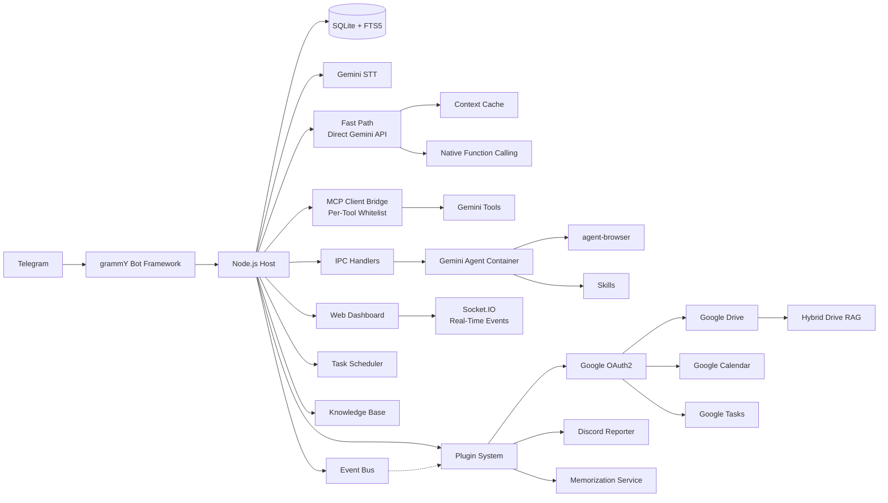

<p align="center">
  
</p>

<p align="center">
  <a href="https://github.com/Rlin1027/NanoGemClaw/blob/main/LICENSE"></a>
  <a href="https://nodejs.org/">=20"></a>
  <a href="https://github.com/Rlin1027/NanoGemClaw"></a>
</p>

<p align="center">
  **Gemini** を搭載した個人用 AI アシスタント。Google エコシステムとの深い統合を実現します。コンテナで安全に実行でき、軽量で理解しやすく、カスタマイズと拡張が簡単です。
</p>

<p align="center">
  <em><a href="https://github.com/gavrielc/nanoclaw">NanoClaw</a> からフォーク — Claude Agent SDK を Gemini に、WhatsApp を Telegram に置き換えました</em>
</p>

<p align="center">
  <a href="README.md">English</a> |
  <a href="README.zh-TW.md">繁體中文</a> |
  <a href="README.zh-CN.md">简体中文</a> |
  <a href="README.es.md">Español</a> |
  <strong>日本語</strong> |
  <a href="README.ko.md">한국어</a> |
  <a href="README.pt.md">Português</a> |
  <a href="README.ru.md">Русский</a>
</p>

---

## なぜ NanoGemClaw？

**NanoGemClaw** は、軽量でセキュアな拡張可能な AI アシスタントです。**Gemini** を隔離されたコンテナで実行し、Telegram 経由で配信されます。インテリジェントなファストパスルーティング、ネイティブな関数呼び出し、Google エコシステムとの深い統合を備えています。

| 機能              | NanoClaw             | NanoGemClaw                                                           |
| -------------------- | -------------------- | --------------------------------------------------------------------- |
| **エージェントランタイム**    | Claude Agent SDK     | Gemini + MCP クライアントブリッジ（ツール単位ホワイトリスト付き）                    |
| **ボットフレームワーク**    | node-telegram-bot-api| grammY（タイプセーフ、イベント駆動）                                      |
| **メッセージング**        | WhatsApp (Baileys)   | Telegram Bot API                                                      |
| **コスト**             | Claude Max ($100/月) | 無料枠（60 req/分）                                                |
| **アーキテクチャ**     | モノリシック             | モジュール型モノレポ（7 workspace パッケージ + app + 7プラグイン）                             |
| **拡張性**    | ハードコード            | ライフサイクルフック付きプラグインシステム                                    |
| **Google エコシステム** | -                    | Drive、Calendar、Tasks、Knowledge RAG                                 |
| **通知**    | -                    | Discord 日次/週次レポート                                          |
| **メディアサポート**    | テキストのみ            | 写真、音声（ファストパス）、オーディオ、ビデオ、ドキュメント                      |
| **ウェブブラウジング**     | 検索のみ          | フル `agent-browser`（Playwright）                                     |
| **知識ベース**   | -                    | グループごとの FTS5 フルテキスト検索                                       |
| **スケジューリング**       | -                    | 自然言語 + cron、iCal カレンダー                                |
| **ダッシュボード**        | -                    | 12モジュール リアルタイム管理 SPA                                    |
| **高度なツール**   | -                    | STT、画像生成、ペルソナ、スキル、マルチモデル                         |
| **ファストパス**        | -                    | コンテキストキャッシング付きスマートルーティング（75–90% トークン削減）             |

---

## 主な機能

- **モジュール型モノレポ** - 7 個の npm workspace パッケージに `app/` エントリポイントを加えた構成です。個別パッケージの再利用も、フルスタックの導入もできます。
- **grammY ボットフレームワーク** - node-telegram-bot-api から grammY に移行。タイプセーフでイベント駆動のTelegram統合、レート制限とメッセージ統合を実装。
- **MCP クライアントブリッジ** - ツール単位のホワイトリスト付き Model Context Protocol。すべてのツール入力に統一された Zod スキーマ検証。
- **スマートメッセージルーティング** - `preferredPath` インテリジェントルーティングはクエリタイプに基づいてファストパス（直接 Gemini API）とコンテナ実行を選択し、シームレスなフォールバックを実現。
- **プラグインシステム** - コアコードを変更せず、カスタム Gemini ツール、メッセージフック、API ルート、バックグラウンドサービス、IPC ハンドラー、ダッシュボード拡張で機能を拡張。
- **マルチモーダル I/O** - 写真、音声メッセージ、ビデオ、またはドキュメントを送信します。Gemini がネイティブに処理します。
- **ファストパス（ダイレクト API）** - シンプルなテキストクエリはコンテナ起動をスキップし、`@google/genai` SDK を使用してネイティブな関数呼び出しでリアルタイム応答をストリーミング。音声メッセージは自動的に文字起こしされファストパスを使用。コード実行にはコンテナへフォールバック。
- **コンテキストキャッシング** - Gemini キャッシング API 経由で静的コンテンツをキャッシュ。入力トークンコストを 75–90% 削減。
- **ネイティブ関数呼び出し** - ツール操作は Gemini のネイティブ関数呼び出しを使用。ツール単位の権限制御（main/any）。ファイルベースの IPC ポーリングを置き換え。
- **音声テキスト変換** - 音声メッセージは自動的に Gemini マルチモーダル（デフォルト、FFmpeg 不要）または Google Cloud Speech で文字起こし。
- **画像生成** - **Imagen 3** を使用して自然言語から画像を作成。
- **ブラウザ自動化** - エージェントは複雑なウェブタスクに `agent-browser`（Playwright）を使用。
- **知識ベース** - グループごとのドキュメントストア。SQLite FTS5 フルテキスト検索とセキュリティのためのインジェクションスキャン付き。
- **ハイブリッド Drive RAG** - 2層検索：瞬時に検索可能な物理ファイルアプローチによる事前インデックス埋め込み + より広い範囲に対応するライブ Drive 検索。NotebookLM と同じ知識フォルダを共有可能。
- **時間階層メモリ圧縮** - short/medium/long の3層メモリに対して、Gemini による compaction、正規表現ベースの fact extraction、scheduler 主導の context budget 管理を提供します。
- **スケジュール済みタスク** - 自然言語スケジューリング（「毎日午前8時」）。cron、インターバル、1回限りのサポート。
- **Google Calendar（読取/書込）** - Google Calendar API 経由でイベントを作成、更新、削除し、空き状況を確認。読み取り専用アクセスの場合は iCal にフォールバック。
- **Google Tasks** - 完全な CRUD 操作。NanoGemClaw スケジュール済みタスクと Google Tasks の双方向同期。
- **Google Drive** - ファイルを検索、コンテンツを読み取り、ドキュメントを要約。Docs、Sheets、PDF、プレーンテキストをサポート。
- **Discord レポート** - Discord ウェブフック経由で自動化された日次および週次進捗レポート。カラーコード化された埋め込みとダッシュボードリンク。
- **スキルシステム** - Markdown ベースのスキルファイルをグループに割り当て、特殊な機能を実現。インジェクション保護付き。
- **ペルソナ** - 事前定義されたペルソナまたはグループごとのカスタムペルソナを作成。
- **マルチモデルサポート** - グループごとに Gemini モデルを選択（`gemini-3-flash-preview`、`gemini-3-pro-preview`など）。
- **コンテナ隔離** - すべてのグループは独自のサンドボックス（Apple Container または Docker）で実行。タイムアウトと出力サイズの制限付き。
- **ウェブダッシュボード** - 12モジュール リアルタイムコマンドセンター。ログストリーミング、メモリエディタ、分析、Google アカウント管理、Drive ブラウザ、Discord 設定、MCP 管理。
- **i18n（100% カバレッジ）** - 8言語の完全インターフェースサポート：英語、繁体字中国語、簡体字中国語、日本語、韓国語、スペイン語、ポルトガル語、ロシア語。
- **テストカバレッジ** - fast path、hybrid RAG、スケジューリング、temporal memory フローを対象に、Vitest の単体テストと統合テストを広く整備しています。

## 最近の開発

- **2026-03-16** - Intelligence Layer のコアを追加。3層 temporal memory、Gemini-powered compaction、fact extraction、scheduler による context budget 管理を実装しました。
- **2026-03-11** - hybrid Drive RAG 検索を実装。query rewriting、embedding 検索の強化、similarity threshold、統合テストを追加しました。

---

## モノレポアーキテクチャ

```
nanogemclaw/
├── packages/
│   ├── core/          # @nanogemclaw/core      — 型、設定、ロガー、ユーティリティ
│   ├── db/            # @nanogemclaw/db        — SQLite 永続化（better-sqlite3）
│   ├── gemini/        # @nanogemclaw/gemini    — Gemini API クライアント、コンテキストキャッシュ、MCP ツール
│   ├── telegram/      # @nanogemclaw/telegram  — grammY ボットヘルパー、レート制限、統合機
│   ├── plugin-api/    # @nanogemclaw/plugin-api — プラグインインターフェース & ライフサイクル型
│   ├── event-bus/     # @nanogemclaw/event-bus  — 型付き pub/sub イベントシステム
│   └── dashboard/     # React + Vite フロントエンド SPA（プライベート）
├── plugins/
│   ├── google-auth/          # OAuth2 トークン管理 & 自動更新
│   ├── google-drive/         # Drive ファイル検索、読み取り & 要約
│   ├── google-tasks/         # Tasks CRUD と双方向同期
│   ├── google-calendar-rw/   # Calendar 読取/書込（iCal からのアップグレード）
│   ├── drive-knowledge-rag/  # 2層 RAG（埋め込み + ライブ検索）
│   ├── discord-reporter/    # Discord 埋め込みレポート（日次 & 週次）
│   └── memorization-service/ # 自動会話要約
├── app/               # アプリケーションエントリーポイント — すべてのパッケージを接続
├── src/               # アプリケーションモジュール（メッセージハンドラ、ボット、スケジューラなど）
├── examples/
│   └── plugin-skeleton/  # 最小限のプラグイン例
├── container/         # エージェントコンテナ（Gemini CLI + ツール）
└── docs/              # ドキュメント & ガイド
```

### パッケージ概要

| パッケージ                   | 説明                                              | 再利用価値 |
| ------------------------- | -------------------------------------------------------- | ----------- |
| `@nanogemclaw/core`       | 共有型、設定ファクトリ、ロガー、ユーティリティ          | 中程度      |
| `@nanogemclaw/db`         | SQLite データベースレイヤー（FTS5 検索付き）                   | 中程度      |
| `@nanogemclaw/gemini`     | Gemini API クライアント、コンテキストキャッシング、MCP 関数呼び出し | **高い**    |
| `@nanogemclaw/telegram`   | grammY ボットヘルパー、レート制限、メッセージ統合   | 中程度      |
| `@nanogemclaw/plugin-api` | プラグインインターフェース定義とライフサイクル型         | **高い**    |
| `@nanogemclaw/event-bus`  | 型付き pub/sub イベントシステム（プラグイン間通信用） | 中程度      |

---

## クイックスタート

### 前提条件

| ツール            | 目的                | インストール                        |
| --------------- | ---------------------- | ----------------------------------- |
| **Node.js 20+** | ランタイム                | [nodejs.org](https://nodejs.org)    |
| **Gemini CLI**  | AI エージェント               | `npm install -g @google/gemini-cli` |
| **FFmpeg**      | GCP STT のみ（オプション） | `brew install ffmpeg`               |

### 1. クローン & インストール

```bash
git clone https://github.com/Rlin1027/NanoGemClaw.git
cd NanoGemClaw
npm install
```

### 2. 設定

```bash
cp .env.example .env
```

`.env` を編集して以下を入力してください：

- `TELEGRAM_BOT_TOKEN` — Telegram の [@BotFather](https://t.me/BotFather) から取得
- `GEMINI_API_KEY` — [Google AI Studio](https://aistudio.google.com/) から取得

TypeScript オートコンプリート用に設定ファイルをコピーすることもできます：

```bash
cp nanogemclaw.config.example.ts nanogemclaw.config.ts
```

### 3. ダッシュボードのビルド

```bash
cd packages/dashboard && npm install && cd ../..
npm run build:dashboard
```

### 4. エージェントコンテナのビルド

```bash
# macOS with Apple Container: システムサービスを先に開始
container system start

bash container/build.sh
```

> Docker を使用する場合は `container system start` をスキップしてください。

### 5. 開始

```bash
npm run dev
```

バックエンド API は `http://localhost:3000` で開始します。開発中にウェブダッシュボードにアクセスするには、別のターミナルでフロントエンド開発サーバーを開始します：

```bash
cd packages/dashboard
npm run dev                # http://localhost:5173（/api → :3000 にプロキシ）
```

> 本番環境（`npm start`）では、ダッシュボードはバンドルされ、`http://localhost:3000` で直接配信されます。

詳細なステップバイステップガイドについては、[docs/GUIDE.md](docs/GUIDE.md) を参照してください。

---

## プラグインシステム

NanoGemClaw はコアコードを変更せず機能を拡張するプラグインをサポートします。プラグインは以下を提供できます：

- **Gemini ツール** — 権限レベル（main/any）とツール単位のホワイトリスト付きカスタム関数呼び出しツール
- **メッセージフック** — 処理の前後にメッセージをインターセプト（インジェクションスキャン付き）
- **API ルート** — カスタムダッシュボード API エンドポイント
- **バックグラウンドサービス** — 長時間実行するバックグラウンドタスク
- **IPC ハンドラー** — カスタム プロセス間通信ハンドラー
- **ダッシュボード拡張** — ウェブダッシュボード用カスタム UI コンポーネント

### プラグインの作成

1. `examples/plugin-skeleton/` を新しいディレクトリにコピーします。
2. `NanoPlugin` インターフェースを実装します：

```typescript
import type {
  NanoPlugin,
  PluginApi,
  GeminiToolContribution,
} from '@nanogemclaw/plugin-api';

const myPlugin: NanoPlugin = {
  id: 'my-plugin',
  name: 'My Plugin',
  version: '1.0.0',

  async init(api: PluginApi) {
    api.logger.info('Plugin initialized');
  },

  geminiTools: [
    {
      name: 'my_tool',
      description: 'Does something useful',
      parameters: {
        type: 'OBJECT',
        properties: {
          input: { type: 'STRING', description: 'The input value' },
        },
        required: ['input'],
      },
      permission: 'any',
      async execute(args) {
        return JSON.stringify({ result: `Processed: ${args.input}` });
      },
    },
  ],

  hooks: {
    async afterMessage(context) {
      // Log every message for analytics
    },
  },
};

export default myPlugin;
```

3. `data/plugins.json` に登録します：

```json
{
  "plugins": [
    {
      "source": "./path/to/my-plugin/src/index.ts",
      "config": { "myOption": "value" },
      "enabled": true
    }
  ]
}
```

完全なドキュメント例は `examples/plugin-skeleton/src/index.ts` を参照し、プラグイン開発ガイドは [docs/GUIDE.md](docs/GUIDE.md) を参照してください。

### ビルトインプラグイン

NanoGemClaw には `plugins/` ディレクトリに 7つのビルトインプラグインが付属しています：

| プラグイン                      | 説明                                                 | Gemini ツール | バックグラウンドサービス |
| --------------------------- | ----------------------------------------------------------- | :----------: | :----------------: |
| **google-auth**             | OAuth2 コア — トークン管理、自動更新、CLI 認証フロー |              |                    |
| **google-drive**            | Drive ファイルの検索、読み取り、要約（Docs、Sheets、PDF） |      3       |                    |
| **google-tasks**            | Google Tasks CRUD と双方向同期                   |      3       |    15分ごとの同期     |
| **google-calendar-rw**      | 完全な Calendar API — イベントの作成、更新、削除           |      5       |                    |
| **drive-knowledge-rag**     | 2層 RAG：事前インデックス埋め込み + ライブ Drive 検索   |      1       |   30分ごとのインデクサー   |
| **discord-reporter**        | Discord ウェブフック経由の日次および週次進捗レポート      |              |   Cron スケジューラ   |
| **memorization-service**    | イベントバス経由の自動会話要約          |              |  イベント駆動      |

すべての Google プラグインは OAuth2 トークンに **google-auth** に依存しています。ダッシュボード設定ページから認可フロー一度実行してください。

---

## 環境変数

### 必須

| 変数             | 説明               |
| -------------------- | ------------------------- |
| `TELEGRAM_BOT_TOKEN` | @BotFather からのボットトークン |

### オプション - AI & メディア

| 変数         | デフォルト                  | 説明                                     |
| ---------------- | ------------------------ | ----------------------------------------------- |
| `GEMINI_API_KEY` | -                        | API キー（画像生成とファストパスで必須）  |
| `GEMINI_MODEL`   | `gemini-3-flash-preview` | すべてのグループのデフォルト Gemini モデル             |
| `ASSISTANT_NAME` | `Andy`                   | ボットトリガー名（`@Andy` メンション用）    |
| `STT_PROVIDER`   | `gemini`                 | 音声テキスト変換：`gemini`（無料）または `gcp`（有料） |

### オプション - ダッシュボード & セキュリティ

| 変数                | デフォルト     | 説明                             |
| ----------------------- | ----------- | --------------------------------------- |
| `DASHBOARD_HOST`        | `127.0.0.1` | バインドアドレス（LAN アクセスは `0.0.0.0`） |
| `DASHBOARD_API_KEY`     | -           | ダッシュボードアクセス保護用 API キー     |
| `DASHBOARD_ACCESS_CODE` | -           | ダッシュボードログイン画面用アクセスコード  |
| `DASHBOARD_ORIGINS`     | auto        | カンマ区切りの許可 CORS オリジン    |

### オプション - ファストパス

| 変数               | デフォルト  | 説明                               |
| ---------------------- | -------- | ----------------------------------------- |
| `FAST_PATH_ENABLED`    | `true`   | テキストクエリ用直接 Gemini API を有効化 |
| `FAST_PATH_TIMEOUT_MS` | `180000` | API タイムアウト（ms）                          |
| `CACHE_TTL_SECONDS`    | `21600`  | コンテキストキャッシュ TTL（6時間）               |
| `MIN_CACHE_CHARS`      | `100000` | キャッシング用最小コンテンツ長            |

### オプション - Google エコシステム（プラグイン）

| 変数                     | デフォルト     | 説明                                      |
| ---------------------------- | ----------- | ------------------------------------------------ |
| `GOOGLE_CLIENT_ID`           | -           | Google Cloud Console からの OAuth2 クライアント ID       |
| `GOOGLE_CLIENT_SECRET`       | -           | OAuth2 クライアントシークレット                             |
| `DISCORD_WEBHOOK_URL`        | -           | レポート用 Discord チャネルウェブフック URL          |

### オプション - インフラストラクチャ

| 変数             | デフォルト                    | 説明                        |
| -------------------- | -------------------------- | ---------------------------------- |
| `CONTAINER_TIMEOUT`  | `300000`                   | コンテナ実行タイムアウト（ms）   |
| `CONTAINER_IMAGE`    | `nanogemclaw-agent:latest` | コンテナイメージ名               |
| `RATE_LIMIT_ENABLED` | `true`                     | リクエストレート制限を有効化       |
| `RATE_LIMIT_MAX`     | `20`                       | グループあたりウィンドウごとの最大リクエスト数  |
| `RATE_LIMIT_WINDOW`  | `5`                        | レート制限ウィンドウ（分）        |
| `WEBHOOK_URL`        | -                          | 通知用外部ウェブフック |
| `WEBHOOK_EVENTS`     | `error,alert`              | ウェブフックをトリガーするイベント        |
| `ALERTS_ENABLED`     | `true`                     | メイングループへのエラーアラートを有効化     |
| `CONTAINER_MAX_OUTPUT_SIZE` | `10485760`          | コンテナ出力最大サイズ（バイト）  |
| `SCHEDULER_CONCURRENCY` | auto                    | 同時実行コンテナ最大数 |
| `BACKUP_RETENTION_DAYS` | `7`                     | データベースバックアップ保持日数      |
| `HEALTH_CHECK_ENABLED` | `true`                   | ヘルスチェック HTTP サーバーを有効化    |
| `HEALTH_CHECK_PORT`  | `8080`                     | ヘルスチェックサーバーポート           |
| `TZ`                 | system                     | スケジュール済みタスク用タイムゾーン       |
| `LOG_LEVEL`          | `info`                     | ログレベル          |

完全な一覧については、[.env.example](.env.example) を参照してください。

---

## 使用例

### メッセージング & 生産性

- `@Andy translate this voice message and summarize it`
- `@Andy generate a 16:9 image of a futuristic cyberpunk city`
- `@Andy browse https://news.google.com and give me the top headlines`

### タスクスケジューリング

- `@Andy every morning at 8am, check the weather and suggest what to wear`
- `@Andy monitor my website every 30 minutes and alert me if it goes down`

### 知識ベース

- ダッシュボード経由でドキュメントをアップロードしてから、以下と尋ねます：`@Andy search the knowledge base for deployment guide`

### Google エコシステム

- `@Andy create a meeting with John tomorrow at 3pm`
- `@Andy what's on my calendar this week?`
- `@Andy add a task "Review PR #42" to my Google Tasks`
- `@Andy search my Drive for the Q4 budget spreadsheet`
- `@Andy summarize the project proposal document from Drive`
- `@Andy what do my knowledge docs say about deployment?`

### 管理

これらのコマンドをボットに直接送信します：

- `/admin help` - すべての管理コマンドの一覧表示
- `/admin stats` - アップタイム、メモリ使用量、トークン統計を表示
- `/admin groups` - ステータス付きのすべての登録グループをリスト
- `/admin tasks` - すべてのスケジュール済みタスクをリスト
- `/admin errors` - 最近のエラーがあるグループを表示
- `/admin report` - 日次使用レポートを生成
- `/admin language <lang>` - ボットインターフェース言語を切り替え
- `/admin persona <name|list|set>` - ボットペルソナを管理
- `/admin trigger <group> <on|off>` - @メンショントリガー要件を切り替え
- `/admin export <group>` - 会話履歴を Markdown としてエクスポート

---

## アーキテクチャ


```mermaid
graph LR
    TG[Telegram] --> GramMY[grammY Bot Framework]
    GramMY --> Bot[Node.js Host]
    Bot --> DB[(SQLite + FTS5)]
    Bot --> STT[Gemini STT]
    Bot --> FP[Fast Path<br/>Direct Gemini API]
    FP --> Cache[Context Cache]
    FP --> FC[Native Function Calling]
    Bot --> MCP[MCP Client Bridge<br/>Per-Tool Whitelist]
    MCP --> Tools[Gemini Tools]
    Bot --> IPC[IPC Handlers]
    IPC --> Container[Gemini Agent Container]
    Container --> Browser[agent-browser]
    Container --> Skills[Skills]
    Bot --> Dashboard[Web Dashboard]
    Dashboard --> WS[Socket.IO<br/>Real-Time Events]
    Bot --> Scheduler[Task Scheduler]
    Bot --> Knowledge[Knowledge Base]
    Bot --> Plugins[Plugin System]
    Plugins --> GAuth[Google OAuth2]
    GAuth --> GDrive[Google Drive]
    GAuth --> GCal[Google Calendar]
    GAuth --> GTasks[Google Tasks]
    GDrive --> RAG[Hybrid Drive RAG]
    Plugins --> Discord[Discord Reporter]
    Plugins --> Memo[Memorization Service]
    Bot --> EB[Event Bus]
    EB -.-> Plugins
```

### バックエンドパッケージ

| パッケージ                   | 主要モジュール                                                                                  |
| ------------------------- | -------------------------------------------------------------------------------------------- |
| `@nanogemclaw/core`       | `config.ts`、`types.ts`、`logger.ts`、`utils.ts`、`safe-compare.ts`                          |
| `@nanogemclaw/db`         | `connection.ts`、`messages.ts`、`tasks.ts`、`stats.ts`、`preferences.ts`                     |
| `@nanogemclaw/gemini`     | `gemini-client.ts`、`context-cache.ts`、`mcp-client-bridge.ts`、`gemini-tools.ts`           |
| `@nanogemclaw/telegram`   | `grammY-helpers.ts`、`telegram-rate-limiter.ts`、`message-consolidator.ts`                   |
| `@nanogemclaw/plugin-api` | `NanoPlugin`、`PluginApi`、`GeminiToolContribution`、`HookContributions`                     |
| `@nanogemclaw/event-bus`  | `EventBus`、`NanoEventMap`、型付き pub/sub シングルトン                                          |

### アプリケーションレイヤー（`src/`）

| モジュール                | 目的                                                  |
| --------------------- | -------------------------------------------------------- |
| `index.ts`            | Telegram ボットエントリ、状態管理、IPC ディスパッチ       |
| `message-handler.ts`  | メッセージ処理、ファストパスルーティング、マルチモーダル入力 |
| `fast-path.ts`        | ストリーミングとキャッシング付き直接 Gemini API 実行   |
| `container-runner.ts` | コンテナライフサイクルとストリーミング出力                 |
| `task-scheduler.ts`   | Cron/インターバル/1回限りのタスク実行                    |
| `knowledge.ts`        | インジェクションスキャン付き FTS5 知識ベースエンジン       |
| `personas.ts`         | ペルソナ定義とカスタムペルソナ管理        |
| `natural-schedule.ts` | 自然言語から cron へのパーサー（EN/ZH）                  |

### フロントエンド（`packages/dashboard/`）

React + Vite + TailwindCSS SPA（12モジュール）：

| ページ                | 説明                                                                     |
| ------------------- | ------------------------------------------------------------------------------- |
| **Overview**        | リアルタイムエージェント活動のグループステータスカード                                |
| **Logs**            | レベルフィルタリング付きユニバーサルログストリーム                                       |
| **Activity Logs**   | グループごとのアクティビティ履歴とイベントタイムライン                                   |
| **Memory Studio**   | システムプロンプトと会話要約用 Monaco エディタ                     |
| **Group Detail**    | グループごとの設定：ペルソナ、モデル、トリガー、ウェブ検索切り替え                  |
| **Tasks**           | スケジュール済みタスク CRUD と実行履歴                                      |
| **Schedule**        | ビジュアルスケジュール概要とタスクタイムライン                                      |
| **Analytics**       | 使用チャート、コンテナログ、メッセージ統計                                |
| **Knowledge**       | ドキュメントアップロード、FTS5 検索、グループごとのドキュメント管理                     |
| **Drive**           | Google Drive ファイルブラウザとドキュメントビューア                                   |
| **Calendar**        | iCal フィード購読と今後のイベントビューア                                |
| **Settings**        | メンテナンスモード、デバッグログ、シークレットステータス、Google アカウント、Discord 設定、MCP 管理 |

### 永続化

- **SQLite**（`store/messages.db`）：メッセージ、タスク、統計、設定、知識（FTS5）
- **JSON**（`data/`）：セッション、登録グループ、カスタムペルソナ、カレンダー設定、グループスキル
- **ファイルシステム**（`groups/`）：グループごとのワークスペース（GEMINI.md、ログ、メディア、IPC）
- **バックアップ**（`store/backups/`）：自動日次 SQLite バックアップ（設定可能な保持期間：`BACKUP_RETENTION_DAYS`）

### ヘルスチェック

ポート `HEALTH_CHECK_PORT`（デフォルト 8080）で軽量 HTTP サーバーが実行されます：

- `GET /health` — システムヘルスステータス（healthy/degraded/unhealthy）
- `GET /ready` — オーケストレータ用レディネスプローブ
- `GET /metrics` — Prometheus フォーマットメトリクス

`HEALTH_CHECK_ENABLED=false` で無効化します。

---

## ウェブダッシュボード

### 開発

```bash
# ターミナル 1: バックエンド開始
npm run dev

# ターミナル 2: ダッシュボードフロントエンド開始
cd packages/dashboard
npm run dev                # http://localhost:5173（/api → :3000 にプロキシ）
```

### 本番環境

```bash
npm run build:dashboard    # フロントエンドビルド
npm run build              # バックエンドビルド
npm start                  # http://localhost:3000 ですべてを配信
```

```bash
# LAN アクセス
DASHBOARD_HOST=0.0.0.0 npm start
```

`Cmd+K` / `Ctrl+K` グローバル検索オーバーレイをサポート。

---

## 開発

```bash
npm run dev               # tsx で開始（ホットリロード）
npm run typecheck         # TypeScript 型チェック（バックエンド）
npm test                  # すべてのテスト実行（Vitest の単体 + 統合テスト）
npm run test:watch        # ウォッチモード
npm run test:coverage     # カバレッジレポート
npm run format:check      # Prettier チェック
```

ダッシュボード開発：

```bash
cd packages/dashboard
npm run dev               # Vite 開発サーバー（ポート 5173、/api -> :3000 にプロキシ）
npx tsc --noEmit          # フロントエンド型チェック
```

---

## トラブルシューティング

- **ボットが応答しない?** `npm run dev` ログを確認し、ボットがグループの管理者であることを確認してください。
- **STT が失敗?** デフォルトプロバイダー（`gemini`）は追加の依存関係は不要です。`STT_PROVIDER=gcp` を使用する場合は、`ffmpeg` がインストールされていることを確認してください（`brew install ffmpeg`）。
- **メディアが処理されない?** `GEMINI_API_KEY` が `.env` で設定されていることを確認してください。
- **コンテナの問題?** `bash container/build.sh` を実行してイメージを再構築します。
- **ダッシュボードが空白ページ?** ビルド前に `cd packages/dashboard && npm install` を実行してください。
- **CORS エラー?** `DASHBOARD_ORIGINS` 環境変数を確認してください。
- **Container EROFS エラー?** Apple Container は入れ子のオーバーラップするバインドマウントをサポートしていません。
- **Container XPC エラー?** まず `container system start` を実行してください。Apple Container のシステムサービスはビルド前に実行されている必要があります。
- **localhost:3000 で `Cannot GET /` ?** 開発モードではポート 3000 は API のみです。ダッシュボードを別途開始します：`cd packages/dashboard && npm run dev`（ポート 5173 で配信）。
- **ファストパスが機能しない?** `GEMINI_API_KEY` が設定されていることを確認してください。`FAST_PATH_ENABLED=true` を確認します。ダッシュボードのグループごとの設定がグローバル設定をオーバーライドする場合があります。
- **レート制限?** `.env` で `RATE_LIMIT_MAX` と `RATE_LIMIT_WINDOW` を調整します。
- **Google OAuth が機能しない?** `GOOGLE_CLIENT_ID` と `GOOGLE_CLIENT_SECRET` が設定されていることを確認してください。Google Cloud Console で「Desktop App」タイプを使用してください。
- **Drive/Calendar/Tasks が応答しない?** ダッシュボード設定 → Google アカウントから OAuth フローを先に完了してください。
- **Discord レポートが送信されない?** `DISCORD_WEBHOOK_URL` が有効であることを確認してください。ダッシュボード設定で「Send Test」ボタンでテストしてください。
- **MCP ツールが実行されない?** ダッシュボード設定 → MCP のツール単位ホワイトリストを確認してください。ツール権限レベル（main vs any）を確認します。
- **音声メッセージがファストパスを使用しない?** STT が正常に完了することを確認してください。ログで文字起こしエラーを確認してください。

---

## ライセンス

MIT

## クレジット

- オリジナル [NanoClaw](https://github.com/gavrielc/nanoclaw) by [@gavrielc](https://github.com/gavrielc)
- [Gemini](https://ai.google.dev/) によって提供
