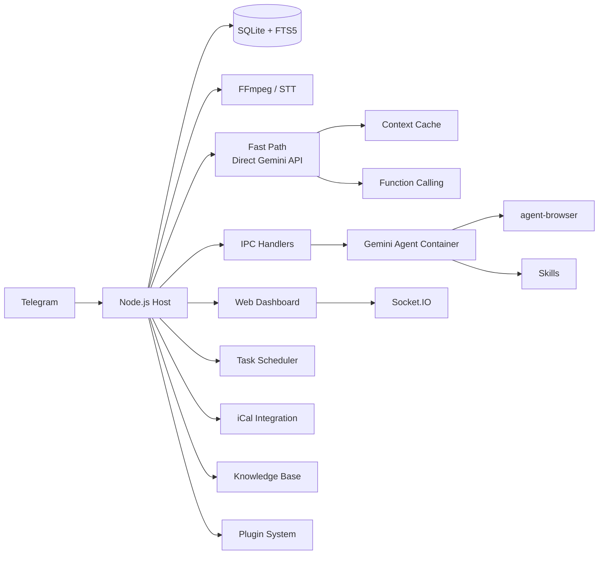

<p align="center">
  
</p>

<p align="center">
  <strong>Gemini</strong> 기반 개인 AI 어시스턴트. 컨테이너에서 안전하게 실행됩니다. 가볍고, 이해하기 쉽게 설계되었으며, 커스터마이징과 확장이 가능합니다.
</p>

<p align="center">
  <em><a href="https://github.com/gavrielc/nanoclaw">NanoClaw</a>에서 포크됨 - Claude Agent SDK를 Gemini로, WhatsApp을 Telegram으로 대체</em>
</p>

<p align="center">
  <a href="README.md">English</a> |
  <a href="README.zh-TW.md">繁體中文</a> |
  <a href="README.zh-CN.md">简体中文</a> |
  <a href="README.es.md">Español</a> |
  <a href="README.ja.md">日本語</a> |
  <strong>한국어</strong> |
  <a href="README.pt.md">Português</a> |
  <a href="README.ru.md">Русский</a>
</p>

---

## 왜 NanoGemClaw인가?

**NanoGemClaw**는 격리된 컨테이너에서 **Gemini**를 실행하는 가볍고, 안전하며, 확장 가능한 AI 어시스턴트입니다 — Telegram을 통해 제공됩니다.

| 기능 | NanoClaw | NanoGemClaw |
|------|----------|-------------|
| **에이전트 런타임** | Claude Agent SDK | Gemini CLI + Direct API |
| **메시징** | WhatsApp (Baileys) | Telegram Bot API |
| **비용** | Claude Max ($100/월) | 무료 티어 (60 req/min) |
| **아키텍처** | 모놀리식 | 모듈형 모노레포 (7 패키지) |
| **확장성** | 하드코딩 | 라이프사이클 훅을 갖춘 플러그인 시스템 |
| **미디어 지원** | 텍스트만 | 사진, 음성, 오디오, 비디오, 문서 |
| **웹 브라우징** | 검색만 | 전체 `agent-browser` (Playwright) |
| **지식 베이스** | - | 그룹별 FTS5 전문 검색 |
| **스케줄링** | - | 자연어 + cron, iCal 캘린더 |
| **대시보드** | - | 9개 모듈 실시간 관리 SPA |
| **고급 도구** | - | STT, 이미지 생성, 페르소나, 스킬, 멀티 모델 |
| **Fast Path** | - | Direct Gemini API 스트리밍, 컨텍스트 캐싱, 네이티브 함수 호출 |

---

## 주요 기능

- **모듈형 모노레포** - 7개의 npm 워크스페이스 패키지. 개별 패키지를 자체 프로젝트에 사용하거나 전체 스택을 배포할 수 있습니다.
- **플러그인 시스템** - 코어 코드 수정 없이 커스텀 Gemini 도구, 메시지 훅, API 라우트, 백그라운드 서비스로 확장 가능합니다.
- **멀티모달 I/O** - 사진, 음성 메시지, 비디오 또는 문서를 전송하세요. Gemini가 네이티브로 처리합니다.
- **Fast Path (Direct API)** - 간단한 텍스트 쿼리는 컨테이너 시작을 건너뛰고 `@google/genai` SDK를 통해 실시간 스트리밍 응답을 제공합니다. 코드 실행이 필요하면 컨테이너로 폴백합니다.
- **컨텍스트 캐싱** - Gemini 캐싱 API를 통해 정적 콘텐츠를 캐시하여 입력 토큰 비용을 75-90% 절감합니다.
- **네이티브 함수 호출** - 도구 작업은 파일 기반 IPC 폴링 대신 Gemini의 네이티브 함수 호출을 사용합니다.
- **음성 인식** - 음성 메시지가 자동으로 변환됩니다 (Gemini 멀티모달 또는 Google Cloud Speech).
- **이미지 생성** - 자연어를 통해 **Imagen 3**으로 이미지를 생성합니다.
- **브라우저 자동화** - 에이전트는 복잡한 웹 작업에 `agent-browser`를 사용합니다.
- **지식 베이스** - SQLite FTS5 전문 검색을 갖춘 그룹별 문서 저장소.
- **예약 작업** - 자연어 스케줄링("매일 오전 8시")과 cron, 인터벌, 일회성 지원.
- **캘린더 통합** - iCal 피드를 구독하고 다가오는 일정을 조회합니다.
- **스킬 시스템** - 마크다운 기반 스킬 파일을 그룹에 할당하여 전문 기능을 제공합니다.
- **페르소나** - 미리 정의된 성격을 사용하거나 그룹별 커스텀 페르소나를 생성합니다.
- **멀티 모델 지원** - 그룹별로 Gemini 모델을 선택합니다 (`gemini-3-flash-preview`, `gemini-3-pro-preview` 등).
- **컨테이너 격리** - 모든 그룹은 자체 샌드박스에서 실행됩니다 (Apple Container 또는 Docker).
- **웹 대시보드** - 로그 스트리밍, 메모리 편집기, 분석 등을 갖춘 9개 모듈 실시간 커맨드 센터.
- **i18n** - 영어, 중국어, 일본어, 스페인어에 대한 전체 인터페이스 지원.

---

## 모노레포 아키텍처

```
nanogemclaw/
├── packages/
│   ├── core/          # @nanogemclaw/core      — 타입, 설정, 로거, 유틸리티
│   ├── db/            # @nanogemclaw/db        — SQLite 영속성 (better-sqlite3)
│   ├── gemini/        # @nanogemclaw/gemini    — Gemini API 클라이언트, 컨텍스트 캐시, 도구
│   ├── telegram/      # @nanogemclaw/telegram  — 봇 헬퍼, 레이트 리미터, 통합기
│   ├── server/        # @nanogemclaw/server    — Express + Socket.IO 대시보드 API
│   ├── plugin-api/    # @nanogemclaw/plugin-api — 플러그인 인터페이스 & 라이프사이클 타입
│   └── dashboard/     # React + Vite 프론트엔드 SPA (private)
├── app/               # 애플리케이션 진입점 — 모든 패키지를 연결
├── src/               # 애플리케이션 모듈 (메시지 핸들러, 봇, 스케줄러 등)
├── examples/
│   └── plugin-skeleton/  # 최소 플러그인 예제
├── container/         # 에이전트 컨테이너 (Gemini CLI + 도구)
└── docs/              # 문서 & 가이드
```

### 패키지 개요

| 패키지 | 설명 | 재사용 가치 |
|--------|------|------------|
| `@nanogemclaw/core` | 공유 타입, 설정 팩토리, 로거, 유틸리티 | 중간 |
| `@nanogemclaw/db` | FTS5 검색을 갖춘 SQLite 데이터베이스 레이어 | 중간 |
| `@nanogemclaw/gemini` | Gemini API 클라이언트, 컨텍스트 캐싱, 함수 호출 | **높음** |
| `@nanogemclaw/telegram` | Telegram 봇 헬퍼, 레이트 리미터, 메시지 통합기 | 중간 |
| `@nanogemclaw/server` | Express 대시보드 서버 + Socket.IO 실시간 이벤트 | 중간 |
| `@nanogemclaw/plugin-api` | 플러그인 인터페이스 정의 및 라이프사이클 타입 | **높음** |

---

## 빠른 시작

### 사전 요구사항

| 도구 | 용도 | 설치 |
|------|------|------|
| **Node.js 20+** | 런타임 | [nodejs.org](https://nodejs.org) |
| **Gemini CLI** | AI 에이전트 | `npm install -g @google/gemini-cli` |
| **FFmpeg** | 오디오 처리 (STT) | `brew install ffmpeg` |

### 1. 클론 & 설치

```bash
git clone https://github.com/Rlin1027/NanoGemClaw.git
cd NanoGemClaw
npm install
```

### 2. 설정

```bash
cp .env.example .env
```

`.env`를 편집하고 다음을 입력하세요:

- `TELEGRAM_BOT_TOKEN` — Telegram의 [@BotFather](https://t.me/BotFather)에서 받으세요
- `GEMINI_API_KEY` — [Google AI Studio](https://aistudio.google.com/)에서 받으세요

TypeScript 자동완성을 위해 선택적으로 설정 파일을 복사하세요:

```bash
cp nanogemclaw.config.example.ts nanogemclaw.config.ts
```

### 3. 대시보드 빌드

```bash
cd packages/dashboard && npm install && cd ../..
npm run build:dashboard
```

### 4. 에이전트 컨테이너 빌드

```bash
bash container/build.sh
```

### 5. 시작

```bash
npm run dev
```

`http://localhost:3000`에서 웹 대시보드에 접속하세요.

> 자세한 단계별 가이드는 [docs/GUIDE.md](docs/GUIDE.md)를 참조하세요.

---

## 플러그인 시스템

NanoGemClaw는 코어 코드를 수정하지 않고 기능을 확장하는 플러그인을 지원합니다. 플러그인은 다음을 제공할 수 있습니다:

- **Gemini 도구** — AI에서 사용 가능한 커스텀 함수 호출 도구
- **메시지 훅** — 처리 전/후 메시지 가로채기
- **API 라우트** — 커스텀 대시보드 API 엔드포인트
- **백그라운드 서비스** — 장기 실행 백그라운드 작업
- **IPC 핸들러** — 커스텀 프로세스 간 통신 핸들러

### 플러그인 작성하기

1. `examples/plugin-skeleton/`을 새 디렉토리에 복사합니다.
2. `NanoPlugin` 인터페이스를 구현합니다:

```typescript
import type { NanoPlugin, PluginApi, GeminiToolContribution } from '@nanogemclaw/plugin-api';

const myPlugin: NanoPlugin = {
  id: 'my-plugin',
  name: 'My Plugin',
  version: '1.0.0',

  async init(api: PluginApi) {
    api.logger.info('Plugin initialized');
  },

  geminiTools: [
    {
      name: 'my_tool',
      description: 'Does something useful',
      parameters: {
        type: 'OBJECT',
        properties: {
          input: { type: 'STRING', description: 'The input value' },
        },
        required: ['input'],
      },
      permission: 'any',
      async execute(args) {
        return JSON.stringify({ result: `Processed: ${args.input}` });
      },
    },
  ],

  hooks: {
    async afterMessage(context) {
      // 분석을 위해 모든 메시지를 로깅
    },
  },
};

export default myPlugin;
```

1. `data/plugins.json`에 등록합니다:

```json
{
  "plugins": [
    {
      "source": "./path/to/my-plugin/src/index.ts",
      "config": { "myOption": "value" },
      "enabled": true
    }
  ]
}
```

완전히 문서화된 예제는 `examples/plugin-skeleton/src/index.ts`를 참조하고, 전체 플러그인 개발 가이드는 [docs/GUIDE.md](docs/GUIDE.md)를 참조하세요.

---

## 환경 변수

### 필수

| 변수 | 설명 |
|------|------|
| `TELEGRAM_BOT_TOKEN` | @BotFather에서 받은 봇 토큰 |

### 선택 - AI & 미디어

| 변수 | 기본값 | 설명 |
|------|--------|------|
| `GEMINI_API_KEY` | - | API 키 (이미지 생성 및 Fast Path에 필요) |
| `GEMINI_MODEL` | `gemini-3-flash-preview` | 모든 그룹의 기본 Gemini 모델 |
| `ASSISTANT_NAME` | `Andy` | 봇 트리거 이름 (`@Andy` 멘션에 사용) |
| `STT_PROVIDER` | `gemini` | 음성 인식: `gemini` (무료) 또는 `gcp` (유료) |

### 선택 - 대시보드 & 보안

| 변수 | 기본값 | 설명 |
|------|--------|------|
| `DASHBOARD_HOST` | `127.0.0.1` | 바인드 주소 (LAN 접근은 `0.0.0.0`) |
| `DASHBOARD_API_KEY` | - | 대시보드 접근 보호를 위한 API 키 |
| `DASHBOARD_ACCESS_CODE` | - | 대시보드 로그인 화면의 접근 코드 |
| `DASHBOARD_ORIGINS` | auto | 쉼표로 구분된 허용 CORS 오리진 |

### 선택 - Fast Path

| 변수 | 기본값 | 설명 |
|------|--------|------|
| `FAST_PATH_ENABLED` | `true` | 텍스트 쿼리에 대한 Direct Gemini API 활성화 |
| `FAST_PATH_TIMEOUT_MS` | `180000` | API 타임아웃 (ms) |
| `CACHE_TTL_SECONDS` | `21600` | 컨텍스트 캐시 TTL (6시간) |
| `MIN_CACHE_CHARS` | `100000` | 캐싱을 위한 최소 콘텐츠 길이 |

### 선택 - 인프라

| 변수 | 기본값 | 설명 |
|------|--------|------|
| `CONTAINER_TIMEOUT` | `300000` | 컨테이너 실행 타임아웃 (ms) |
| `CONTAINER_IMAGE` | `nanogemclaw-agent:latest` | 컨테이너 이미지 이름 |
| `RATE_LIMIT_ENABLED` | `true` | 요청 레이트 리미팅 활성화 |
| `RATE_LIMIT_MAX` | `20` | 그룹별 윈도우당 최대 요청 |
| `RATE_LIMIT_WINDOW` | `5` | 레이트 리미트 윈도우 (분) |
| `WEBHOOK_URL` | - | 알림을 위한 외부 웹훅 |
| `TZ` | system | 예약 작업의 시간대 |
| `LOG_LEVEL` | `info` | 로깅 레벨 |

전체 목록은 [.env.example](.env.example)을 참조하세요.

---

## 사용 예시

### 메시징 & 생산성

- `@Andy 이 음성 메시지를 번역하고 요약해줘`
- `@Andy 미래적인 사이버펑크 도시의 16:9 이미지를 생성해줘`
- `@Andy https://news.google.com을 브라우저로 열고 주요 헤드라인을 알려줘`

### 작업 스케줄링

- `@Andy 매일 아침 8시에 날씨를 확인하고 무엇을 입을지 추천해줘`
- `@Andy 30분마다 내 웹사이트를 모니터링하고 다운되면 알려줘`

### 지식 베이스

- 대시보드를 통해 문서를 업로드한 다음: `@Andy 지식 베이스에서 배포 가이드를 검색해줘`

### 관리

봇에 직접 다음 명령을 보내세요:

- `/admin language <lang>` - 봇 인터페이스 언어 변경
- `/admin persona <name>` - 봇 성격 변경
- `/admin report` - 일일 활동 요약 받기

---

## 아키텍처



### 백엔드 패키지

| 패키지 | 주요 모듈 |
|--------|-----------|
| `@nanogemclaw/core` | `config.ts`, `types.ts`, `logger.ts`, `utils.ts`, `safe-compare.ts` |
| `@nanogemclaw/db` | `connection.ts`, `messages.ts`, `tasks.ts`, `stats.ts`, `preferences.ts` |
| `@nanogemclaw/gemini` | `gemini-client.ts`, `context-cache.ts`, `gemini-tools.ts` |
| `@nanogemclaw/telegram` | `telegram-helpers.ts`, `telegram-rate-limiter.ts`, `message-consolidator.ts` |
| `@nanogemclaw/server` | `server.ts`, `routes/` (auth, groups, tasks, knowledge, calendar, skills, config, analytics) |
| `@nanogemclaw/plugin-api` | `NanoPlugin`, `PluginApi`, `GeminiToolContribution`, `HookContributions` |

### 애플리케이션 레이어 (`src/`)

| 모듈 | 용도 |
|------|------|
| `index.ts` | Telegram 봇 진입점, 상태 관리, IPC 디스패치 |
| `message-handler.ts` | 메시지 처리, Fast Path 라우팅, 멀티모달 입력 |
| `fast-path.ts` | 스트리밍을 갖춘 Direct Gemini API 실행 |
| `container-runner.ts` | 컨테이너 라이프사이클 및 스트리밍 출력 |
| `task-scheduler.ts` | Cron/인터벌/일회성 작업 실행 |
| `knowledge.ts` | FTS5 지식 베이스 엔진 |
| `personas.ts` | 페르소나 정의 및 커스텀 페르소나 관리 |
| `natural-schedule.ts` | 자연어를 cron으로 변환하는 파서 (EN/ZH) |

### 프론트엔드 (`packages/dashboard/`)

9개 모듈을 갖춘 React + Vite + TailwindCSS SPA:

| 페이지 | 설명 |
|--------|------|
| **개요** | 실시간 에이전트 활동이 포함된 그룹 상태 카드 |
| **로그** | 레벨 필터링을 갖춘 범용 로그 스트림 |
| **메모리 스튜디오** | 시스템 프롬프트 및 대화 요약을 위한 Monaco 편집기 |
| **그룹 상세** | 그룹별 설정: 페르소나, 모델, 트리거, 웹 검색 토글 |
| **작업** | 실행 기록을 갖춘 예약 작업 CRUD |
| **분석** | 사용 차트, 컨테이너 로그, 메시지 통계 |
| **지식** | 문서 업로드, FTS5 검색, 그룹별 문서 관리 |
| **캘린더** | iCal 피드 구독 및 다가오는 일정 뷰어 |
| **설정** | 유지보수 모드, 디버그 로깅, 시크릿 상태, 환경설정 |

### 영속성

- **SQLite** (`store/messages.db`): 메시지, 작업, 통계, 환경설정, 지식 (FTS5)
- **JSON** (`data/`): 세션, 등록된 그룹, 커스텀 페르소나, 캘린더 설정, 그룹 스킬
- **파일시스템** (`groups/`): 그룹별 워크스페이스 (GEMINI.md, 로그, 미디어, IPC)

---

## 웹 대시보드

```bash
# 로컬 접근 (기본)
open http://localhost:3000

# LAN 접근
DASHBOARD_HOST=0.0.0.0 npm run dev
```

`Cmd+K` / `Ctrl+K` 글로벌 검색 오버레이를 지원합니다.

### 프로덕션용 빌드

```bash
npm run build:dashboard    # 프론트엔드 빌드
npm run build              # 백엔드 빌드
npm start                  # :3000에서 대시보드 서빙
```

---

## 개발

```bash
npm run dev               # tsx로 시작 (핫 리로드)
npm run typecheck         # TypeScript 타입 체크 (백엔드)
npm test                  # 모든 테스트 실행 (Vitest, 12 파일, ~330 테스트)
npm run test:watch        # 감시 모드
npm run test:coverage     # 커버리지 리포트
npm run format:check      # Prettier 체크
```

대시보드 개발:

```bash
cd packages/dashboard
npm run dev               # Vite 개발 서버 (포트 5173, /api -> :3000 프록시)
npx tsc --noEmit          # 프론트엔드 타입 체크
```

---

## 문제 해결

- **봇이 응답하지 않나요?** `npm run dev` 로그를 확인하고 봇이 그룹의 관리자인지 확인하세요.
- **STT가 실패하나요?** `ffmpeg`가 설치되어 있는지 확인하세요 (`brew install ffmpeg`).
- **미디어가 처리되지 않나요?** `.env`에 `GEMINI_API_KEY`가 설정되어 있는지 확인하세요.
- **컨테이너 문제가 있나요?** `bash container/build.sh`를 실행하여 이미지를 다시 빌드하세요.
- **대시보드가 빈 페이지인가요?** 빌드 전에 `cd packages/dashboard && npm install`을 실행하세요.
- **CORS 에러가 있나요?** `DASHBOARD_ORIGINS` 환경 변수를 확인하세요.
- **컨테이너 EROFS 에러가 있나요?** Apple Container는 중첩 겹침 바인드 마운트를 지원하지 않습니다.
- **Fast Path가 작동하지 않나요?** `GEMINI_API_KEY`가 설정되어 있는지 확인하세요. OAuth 전용 설정은 컨테이너 경로로 폴백합니다.
- **Fast Path를 비활성화하고 싶으신가요?** 전역으로 `FAST_PATH_ENABLED=false`를 설정하거나, 대시보드에서 그룹별로 토글하세요.
- **레이트 리미트에 걸렸나요?** `.env`에서 `RATE_LIMIT_MAX`와 `RATE_LIMIT_WINDOW`를 조정하세요.

---

## 라이선스

MIT

## 크레딧

- 원본 [NanoClaw](https://github.com/gavrielc/nanoclaw) by [@gavrielc](https://github.com/gavrielc)
- [Gemini](https://ai.google.dev/) 기반
