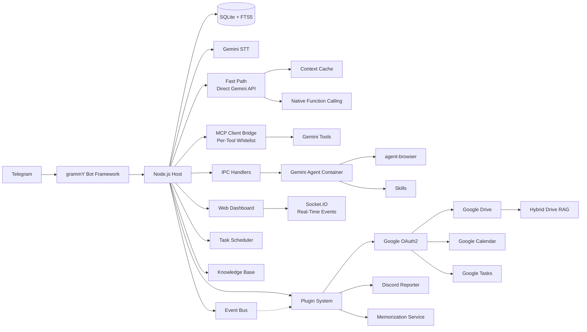

<p align="center">
  
</p>

<p align="center">
  <a href="https://github.com/Rlin1027/NanoGemClaw/blob/main/LICENSE"></a>
  <a href="https://nodejs.org/">=20"></a>
  <a href="https://github.com/Rlin1027/NanoGemClaw"></a>
</p>

<p align="center">
  강력한 <strong>Gemini</strong>로 구동되고 깊은 <strong>Google 생태계</strong> 통합을 갖춘 개인용 AI 어시스턴트입니다. 컨테이너에서 안전하게 실행되며 가볍고 이해하기 쉽게 구성되어 있어 사용자 정의 및 확장이 가능합니다.
</p>

<p align="center">
  <em><a href="https://github.com/gavrielc/nanoclaw">NanoClaw</a>에서 포크됨 - Claude Agent SDK를 Gemini로, WhatsApp을 Telegram으로 교체했습니다</em>
</p>

<p align="center">
  <a href="README.md">English</a> |
  <a href="README.zh-TW.md">繁體中文</a> |
  <a href="README.zh-CN.md">简体中文</a> |
  <a href="README.es.md">Español</a> |
  <a href="README.ja.md">日本語</a> |
  <strong>한국어</strong> |
  <a href="README.pt.md">Português</a> |
  <a href="README.ru.md">Русский</a>
</p>

---

## NanoGemClaw를 선택하는 이유?

**NanoGemClaw**는 격리된 컨테이너에서 **Gemini**를 실행하는 가볍고 안전하며 확장 가능한 AI 어시스턴트로, Telegram을 통해 제공되며 지능형 빠른 경로 라우팅, 네이티브 함수 호출 기능, 깊은 Google 생태계 통합을 갖추고 있습니다.

| 기능              | NanoClaw             | NanoGemClaw                                                           |
| -------------------- | -------------------- | --------------------------------------------------------------------- |
| **Agent Runtime**    | Claude Agent SDK     | Gemini + MCP Client Bridge with per-tool whitelist                    |
| **Bot Framework**    | node-telegram-bot-api| grammY (type-safe, event-driven)                                      |
| **Messaging**        | WhatsApp (Baileys)   | Telegram Bot API                                                      |
| **Cost**             | Claude Max ($100/mo) | Free tier (60 req/min)                                                |
| **Architecture**     | Monolith             | Modular monorepo (7 workspace packages + app + 7 plugins)             |
| **Extensibility**    | Hardcoded            | Plugin system with lifecycle hooks                                    |
| **Google Ecosystem** | -                    | Drive, Calendar, Tasks, Knowledge RAG                                 |
| **Notifications**    | -                    | Discord daily/weekly reports                                          |
| **Media Support**    | Text only            | Photo, Voice (fast path), Audio, Video, Document                      |
| **Web Browsing**     | Search only          | Full `agent-browser` (Playwright)                                     |
| **Knowledge Base**   | -                    | FTS5 full-text search per group                                       |
| **Scheduling**       | -                    | Natural language + cron, iCal calendar                                |
| **Dashboard**        | -                    | 12-module real-time management SPA                                    |
| **Advanced Tools**   | -                    | STT, Image Gen, Personas, Skills, Multi-model                         |
| **Fast Path**        | -                    | Smart routing with context caching (75–90% token savings)             |

---

## 주요 기능

- **모듈식 Monorepo** - 7개의 npm workspace 패키지와 `app/` 진입 계층으로 구성됩니다. 개별 패키지를 재사용하거나 전체 스택을 배포할 수 있습니다.
- **grammY Bot Framework** - node-telegram-bot-api에서 grammY로 마이그레이션했으며, 타입 안전하고 이벤트 기반의 Telegram 통합을 지원하며 속도 제한 및 메시지 통합 기능을 제공합니다.
- **MCP Client Bridge** - Model Context Protocol의 도구별 화이트리스트 기능을 제공하며, 모든 도구 입력에 대한 통합 Zod 스키마 검증을 수행합니다.
- **스마트 메시지 라우팅** - `preferredPath` 지능형 라우팅은 쿼리 유형에 따라 빠른 경로(직접 Gemini API)와 컨테이너 실행 중에서 선택하며, 매끄러운 폴백을 제공합니다.
- **플러그인 시스템** - 핵심 코드를 수정하지 않고 사용자 정의 Gemini 도구, 메시지 후크, API 경로, 백그라운드 서비스, IPC 핸들러, 대시보드 확장으로 기능을 확장합니다.
- **다중 모달 I/O** - 사진, 음성 메시지, 동영상 또는 문서를 보냅니다. Gemini가 기본적으로 처리합니다.
- **빠른 경로(직접 API)** - 간단한 텍스트 쿼리는 컨테이너 시작을 건너뛰고 `@google/genai` SDK를 통해 실시간으로 스트리밍 응답을 제공하며 네이티브 함수 호출 기능을 지원합니다. 음성 메시지는 자동으로 전사되어 빠른 경로를 사용합니다. 코드 실행의 경우 컨테이너로 폴백됩니다.
- **Context Caching** - Gemini 캐싱 API를 통해 정적 콘텐츠를 캐시하여 입력 토큰 비용을 75–90% 감소시킵니다.
- **네이티브 함수 호출** - 도구 작업은 Gemini의 네이티브 함수 호출을 사용하며 도구별 권한 제어(main/any)를 지원하고, 파일 기반 IPC 폴링을 대체합니다.
- **Speech-to-Text** - 음성 메시지는 Gemini 다중 모달(기본값, FFmpeg 불필요) 또는 Google Cloud Speech을 사용하여 자동으로 전사됩니다.
- **Image Generation** - **Imagen 3**을 사용하여 자연어로 이미지를 생성합니다.
- **Browser Automation** - 에이전트는 복잡한 웹 작업을 위해 `agent-browser`(Playwright)를 사용합니다.
- **Knowledge Base** - 그룹별 문서 저장소로 SQLite FTS5 전체 텍스트 검색 및 보안을 위한 주입 스캔을 제공합니다.
- **Hybrid Drive RAG** - 2계층 검색: 즉시 조회를 위한 사전 인덱싱된 임베딩(물리적 파일 접근 방식) + 광범위한 커버리지를 위한 라이브 드라이브 검색입니다. NotebookLM과 동일한 지식 폴더를 공유합니다.
- **Temporal Memory Compaction** - short/medium/long 3계층 메모리에 대해 Gemini 기반 compaction, regex fact extraction, scheduler 주도의 context budget 관리를 제공합니다.
- **Scheduled Tasks** - 자연 언어 일정 예약("매일 오전 8시")으로 cron, 간격 및 일회성 지원을 제공합니다.
- **Google Calendar(Read/Write)** - Google Calendar API를 통해 이벤트를 생성, 업데이트, 삭제하고 가용성을 확인합니다. iCal에 대한 읽기 전용 액세스 폴백을 제공합니다.
- **Google Tasks** - 완전한 CRUD 작업과 NanoGemClaw 예약 작업과 Google Tasks 간의 양방향 동기화를 지원합니다.
- **Google Drive** - 파일을 검색하고, 콘텐츠를 읽고, 문서를 요약합니다. Docs, Sheets, PDF 및 일반 텍스트를 지원합니다.
- **Discord Reports** - 웹훅을 통해 Discord로 자동화된 일일 및 주간 진행 상황 보고서가 푸시되며, 색상 코드된 임베드 및 대시보드 링크를 포함합니다.
- **Skills System** - 그룹에 마크다운 기반 스킬 파일을 할당하여 주입 보호를 통한 특수 기능을 제공합니다.
- **Personas** - 사전 정의된 성격 또는 그룹별 사용자 정의 페르소나를 생성합니다.
- **다중 모델 지원** - 그룹별로 Gemini 모델(`gemini-3-flash-preview`, `gemini-3-pro-preview` 등)을 선택합니다.
- **Container Isolation** - 모든 그룹은 시간 초과 및 출력 크기 제한이 있는 자체 샌드박스(Apple Container 또는 Docker)에서 실행됩니다.
- **Web Dashboard** - 로그 스트리밍, 메모리 편집기, 분석, Google 계정 관리, Drive 브라우저, Discord 설정, MCP 관리를 포함한 12개 모듈의 실시간 명령 센터입니다.
- **i18n(100% 커버리지)** - 8개 언어(영어, 繁體中文, 簡體中文, 日本語, 한국어, Español, Português, Русский) 완벽한 인터페이스 지원을 제공합니다.
- **Test Coverage** - fast path, hybrid RAG, scheduling, temporal memory 흐름을 포함한 Vitest 단위/통합 테스트를 폭넓게 갖추고 있습니다.

## Recent Development

- **2026-03-16** - Intelligence Layer 핵심 추가: 3계층 temporal memory, Gemini-powered compaction, fact extraction, scheduler 기반 context budget 관리.
- **2026-03-11** - hybrid Drive RAG 검색 추가: query rewriting, embedding 검색 강화, similarity threshold, 통합 테스트 보강.

---

## 모노레포 아키텍처

```
nanogemclaw/
├── packages/
│   ├── core/          # @nanogemclaw/core      — 타입, 설정, 로거, 유틸리티
│   ├── db/            # @nanogemclaw/db        — SQLite 영속성 (better-sqlite3)
│   ├── gemini/        # @nanogemclaw/gemini    — Gemini API 클라이언트, 컨텍스트 캐시, 도구
│   ├── telegram/      # @nanogemclaw/telegram  — 봇 헬퍼, 레이트 리미터, 통합기
│   ├── plugin-api/    # @nanogemclaw/plugin-api — 플러그인 인터페이스 & 라이프사이클 타입
│   ├── event-bus/     # @nanogemclaw/event-bus  — 타입화된 pub/sub 이벤트 시스템
│   └── dashboard/     # React + Vite 프론트엔드 SPA (private)
├── plugins/
│   ├── google-auth/          # OAuth2 토큰 관리 및 자동 갱신
│   ├── google-drive/         # Drive 파일 검색, 읽기 및 요약
│   ├── google-tasks/         # Tasks CRUD 및 양방향 동기화
│   ├── google-calendar-rw/   # Calendar 읽기/쓰기 (iCal에서 업그레이드)
│   ├── drive-knowledge-rag/  # 2계층 RAG (임베딩 + 실시간 검색)
│   ├── discord-reporter/     # 일일/주간 Discord 임베드 리포트
│   └── memorization-service/ # 자동 대화 요약
├── app/               # 애플리케이션 진입점 — 모든 패키지를 연결
├── src/               # 애플리케이션 모듈 (메시지 핸들러, 봇, 스케줄러 등)
├── examples/
│   └── plugin-skeleton/  # 최소 플러그인 예제
├── container/         # 에이전트 컨테이너 (Gemini CLI + 도구)
└── docs/              # 문서 & 가이드
```

### 패키지 개요

| 패키지                   | 설명                                              | 재사용 가치 |
| ------------------------- | -------------------------------------------------------- | ----------- |
| `@nanogemclaw/core`       | 공유 타입, 설정 팩토리, 로거, 유틸리티          | 보통      |
| `@nanogemclaw/db`         | FTS5 검색이 있는 SQLite 데이터베이스 계층                   | 보통      |
| `@nanogemclaw/gemini`     | Gemini API 클라이언트, context caching, MCP 함수 호출 | **높음**    |
| `@nanogemclaw/telegram`   | grammY bot 도우미, 속도 제한기, 메시지 통합기   | 보통      |
| `@nanogemclaw/plugin-api` | 플러그인 인터페이스 정의 및 라이프사이클 타입         | **높음**    |
| `@nanogemclaw/event-bus`  | 플러그인 간 통신을 위한 타입화된 pub/sub 이벤트 시스템 | 보통      |

---

## 빠른 시작

### 필수 조건

| 도구            | 목적                | 설치                        |
| --------------- | ---------------------- | ----------------------------------- |
| **Node.js 20+** | 런타임                | [nodejs.org](https://nodejs.org)    |
| **Gemini CLI**  | AI Agent               | `npm install -g @google/gemini-cli` |
| **FFmpeg**      | GCP STT만(선택 사항) | `brew install ffmpeg`               |

### 1. 복제 및 설치

```bash
git clone https://github.com/Rlin1027/NanoGemClaw.git
cd NanoGemClaw
npm install
```

### 2. 구성

```bash
cp .env.example .env
```

`.env`를 편집하고 다음을 입력합니다:

- `TELEGRAM_BOT_TOKEN` — Telegram의 [@BotFather](https://t.me/BotFather)에서 얻습니다
- `GEMINI_API_KEY` — [Google AI Studio](https://aistudio.google.com/)에서 얻습니다

선택적으로 TypeScript 자동 완성을 위해 설정 파일을 복사합니다:

```bash
cp nanogemclaw.config.example.ts nanogemclaw.config.ts
```

### 3. 대시보드 빌드

```bash
cd packages/dashboard && npm install && cd ../..
npm run build:dashboard
```

### 4. Agent 컨테이너 빌드

```bash
# macOS with Apple Container: start the system service first
container system start

bash container/build.sh
```

> Docker를 Apple Container 대신 사용하는 경우 `container system start`를 건너뜁니다.

### 5. 시작

```bash
npm run dev
```

백엔드 API가 `http://localhost:3000`에서 시작됩니다. 개발 중에 Web Dashboard에 액세스하려면 별도의 터미널에서 프론트엔드 개발 서버를 시작합니다:

```bash
cd packages/dashboard
npm run dev                # Dashboard at http://localhost:5173 (proxies /api → :3000)
```

> 프로덕션(`npm start`)에서는 대시보드가 번들되어 `http://localhost:3000`에서 직접 제공됩니다.

자세한 단계별 가이드는 [docs/GUIDE.md](docs/GUIDE.md)를 참조하세요.

---

## 플러그인 시스템

NanoGemClaw는 핵심 코드를 수정하지 않고 기능을 확장하는 플러그인을 지원합니다. 플러그인은 다음을 제공할 수 있습니다:

- **Gemini Tools** — 권한 수준(main/any) 및 도구별 화이트리스팅이 있는 사용자 정의 함수 호출 도구
- **Message Hooks** — 주입 스캔을 통해 처리 전후 메시지 가로채기
- **API Routes** — 사용자 정의 대시보드 API 엔드포인트
- **Background Services** — 장기 실행 백그라운드 작업
- **IPC Handlers** — 사용자 정의 프로세스 간 통신 핸들러
- **Dashboard Extensions** — 웹 대시보드용 사용자 정의 UI 컴포넌트

### 플러그인 작성

1. `examples/plugin-skeleton/`을 새 디렉토리에 복사합니다.
2. `NanoPlugin` 인터페이스를 구현합니다:

```typescript
import type {
  NanoPlugin,
  PluginApi,
  GeminiToolContribution,
} from '@nanogemclaw/plugin-api';

const myPlugin: NanoPlugin = {
  id: 'my-plugin',
  name: 'My Plugin',
  version: '1.0.0',

  async init(api: PluginApi) {
    api.logger.info('Plugin initialized');
  },

  geminiTools: [
    {
      name: 'my_tool',
      description: 'Does something useful',
      parameters: {
        type: 'OBJECT',
        properties: {
          input: { type: 'STRING', description: 'The input value' },
        },
        required: ['input'],
      },
      permission: 'any',
      async execute(args) {
        return JSON.stringify({ result: `Processed: ${args.input}` });
      },
    },
  ],

  hooks: {
    async afterMessage(context) {
      // Log every message for analytics
    },
  },
};

export default myPlugin;
```

1. `data/plugins.json`에 등록합니다:

```json
{
  "plugins": [
    {
      "source": "./path/to/my-plugin/src/index.ts",
      "config": { "myOption": "value" },
      "enabled": true
    }
  ]
}
```

완전히 문서화된 예제는 `examples/plugin-skeleton/src/index.ts`를 참조하고, 완전한 플러그인 개발 가이드는 [docs/GUIDE.md](docs/GUIDE.md)를 참조하세요.

### 내장 플러그인

NanoGemClaw는 `plugins/` 디렉토리에 7개의 내장 플러그인을 제공합니다:

| 플러그인                      | 설명                                                 | Gemini Tools | Background Service |
| --------------------------- | ----------------------------------------------------------- | :----------: | :----------------: |
| **google-auth**             | OAuth2 코어 — 토큰 관리, 자동 새로 고침, CLI 인증 흐름 |              |                    |
| **google-drive**            | Drive 파일 검색, 읽기 및 요약(Docs, Sheets, PDF) |      3       |                    |
| **google-tasks**            | Google Tasks CRUD with bidirectional sync                   |      3       |    15-min sync     |
| **google-calendar-rw**      | 전체 Calendar API — 이벤트 생성, 업데이트, 삭제           |      5       |                    |
| **drive-knowledge-rag**     | 2계층 RAG: 사전 인덱싱된 임베딩 + 라이브 Drive 검색   |      1       |   30-min indexer   |
| **discord-reporter**        | Discord 웹훅을 통한 일일 및 주간 진행 상황 보고서      |              |   Cron scheduler   |
| **memorization-service**    | Event Bus를 통한 자동 대화 요약          |              |  Event-driven      |

모든 Google 플러그인은 OAuth2 토큰에 대해 **google-auth**에 따라 다릅니다. 대시보드 설정 페이지에서 인증 흐름을 한 번 실행합니다.

---

## 환경 변수

### 필수

| 변수             | 설명               |
| -------------------- | ------------------------- |
| `TELEGRAM_BOT_TOKEN` | @BotFather의 봇 토큰 |

### 선택 사항 - AI & Media

| 변수         | 기본값                  | 설명                                     |
| ---------------- | ------------------------ | ----------------------------------------------- |
| `GEMINI_API_KEY` | -                        | API 키(이미지 생성 및 빠른 경로 필수)  |
| `GEMINI_MODEL`   | `gemini-3-flash-preview` | 모든 그룹의 기본 Gemini 모델             |
| `ASSISTANT_NAME` | `Andy`                   | Bot 트리거 이름(@Andy 언급에 사용)    |
| `STT_PROVIDER`   | `gemini`                 | Speech-to-text: `gemini`(무료) 또는 `gcp`(유료) |

### 선택 사항 - 대시보드 & 보안

| 변수                | 기본값     | 설명                             |
| ----------------------- | ----------- | --------------------------------------- |
| `DASHBOARD_HOST`        | `127.0.0.1` | 바인드 주소(`0.0.0.0` LAN 액세스용) |
| `DASHBOARD_API_KEY`     | -           | 대시보드 액세스를 보호하는 API 키     |
| `DASHBOARD_ACCESS_CODE` | -           | 대시보드 로그인 화면용 액세스 코드  |
| `DASHBOARD_ORIGINS`     | auto        | 쉼표로 구분된 허용 CORS origins    |

### 선택 사항 - 빠른 경로

| 변수               | 기본값  | 설명                               |
| ---------------------- | -------- | ----------------------------------------- |
| `FAST_PATH_ENABLED`    | `true`   | 텍스트 쿼리용 직접 Gemini API 활성화 |
| `FAST_PATH_TIMEOUT_MS` | `180000` | API 시간 초과(ms)                          |
| `CACHE_TTL_SECONDS`    | `21600`  | Context cache TTL(6시간)               |
| `MIN_CACHE_CHARS`      | `100000` | 캐싱을 위한 최소 콘텐츠 길이            |

### 선택 사항 - Google 생태계(플러그인)

| 변수                     | 기본값     | 설명                                      |
| ---------------------------- | ----------- | ------------------------------------------------ |
| `GOOGLE_CLIENT_ID`           | -           | Google Cloud Console의 OAuth2 클라이언트 ID       |
| `GOOGLE_CLIENT_SECRET`       | -           | OAuth2 클라이언트 보안                             |
| `DISCORD_WEBHOOK_URL`        | -           | 보고서용 Discord 채널 웹훅 URL          |

### 선택 사항 - 인프라

| 변수             | 기본값                    | 설명                        |
| -------------------- | -------------------------- | ---------------------------------- |
| `CONTAINER_TIMEOUT`  | `300000`                   | 컨테이너 실행 시간 초과(ms)   |
| `CONTAINER_IMAGE`    | `nanogemclaw-agent:latest` | 컨테이너 이미지 이름               |
| `RATE_LIMIT_ENABLED` | `true`                     | 요청 속도 제한 활성화       |
| `RATE_LIMIT_MAX`     | `20`                       | 윈도우당 그룹당 최대 요청  |
| `RATE_LIMIT_WINDOW`  | `5`                        | 속도 제한 윈도우(분)        |
| `WEBHOOK_URL`        | -                          | 알림용 외부 웹훅 |
| `WEBHOOK_EVENTS`     | `error,alert`              | 웹훅을 트리거하는 이벤트        |
| `ALERTS_ENABLED`     | `true`                     | 메인 그룹으로 오류 알림 활성화  |
| `CONTAINER_MAX_OUTPUT_SIZE` | `10485760`          | 최대 컨테이너 출력 크기(바이트)  |
| `SCHEDULER_CONCURRENCY` | auto                    | 최대 동시 예약된 컨테이너 |
| `BACKUP_RETENTION_DAYS` | `7`                     | 데이터베이스 백업 보관 일수      |
| `HEALTH_CHECK_ENABLED` | `true`                   | 상태 확인 HTTP 서버 활성화    |
| `HEALTH_CHECK_PORT`  | `8080`                     | 상태 확인 서버 포트           |
| `TZ`                 | system                     | 예약된 작업의 시간대       |
| `LOG_LEVEL`          | `info`                     | 로깅 수준                      |

완전한 목록은 [.env.example](.env.example)을 참조하세요.

---

## 사용 예제

### 메시징 & 생산성

- `@Andy translate this voice message and summarize it`
- `@Andy generate a 16:9 image of a futuristic cyberpunk city`
- `@Andy browse https://news.google.com and give me the top headlines`

### 작업 일정 예약

- `@Andy every morning at 8am, check the weather and suggest what to wear`
- `@Andy monitor my website every 30 minutes and alert me if it goes down`

### Knowledge Base

- 대시보드를 통해 문서를 업로드한 다음 물어봅니다: `@Andy search the knowledge base for deployment guide`

### Google 생태계

- `@Andy create a meeting with John tomorrow at 3pm`
- `@Andy what's on my calendar this week?`
- `@Andy add a task "Review PR #42" to my Google Tasks`
- `@Andy search my Drive for the Q4 budget spreadsheet`
- `@Andy summarize the project proposal document from Drive`
- `@Andy what do my knowledge docs say about deployment?`

### 관리

이 명령어를 봇에 직접 보냅니다:

- `/admin help` - 사용 가능한 모든 관리 명령 나열
- `/admin stats` - 가동 시간, 메모리 사용량, 토큰 통계 표시
- `/admin groups` - 상태와 함께 모든 등록된 그룹 나열
- `/admin tasks` - 모든 예약된 작업 나열
- `/admin errors` - 최근 오류가 있는 그룹 표시
- `/admin report` - 일일 사용 보고서 생성
- `/admin language <lang>` - 봇 인터페이스 언어 전환
- `/admin persona <name|list|set>` - 봇 페르소나 관리
- `/admin trigger <group> <on|off>` - @mention 트리거 요구 사항 토글
- `/admin export <group>` - 대화 기록을 Markdown으로 내보내기

---

## 아키텍처


```mermaid
graph LR
    TG[Telegram] --> GramMY[grammY Bot Framework]
    GramMY --> Bot[Node.js Host]
    Bot --> DB[(SQLite + FTS5)]
    Bot --> STT[Gemini STT]
    Bot --> FP[Fast Path<br/>Direct Gemini API]
    FP --> Cache[Context Cache]
    FP --> FC[Native Function Calling]
    Bot --> MCP[MCP Client Bridge<br/>Per-Tool Whitelist]
    MCP --> Tools[Gemini Tools]
    Bot --> IPC[IPC Handlers]
    IPC --> Container[Gemini Agent Container]
    Container --> Browser[agent-browser]
    Container --> Skills[Skills]
    Bot --> Dashboard[Web Dashboard]
    Dashboard --> WS[Socket.IO<br/>Real-Time Events]
    Bot --> Scheduler[Task Scheduler]
    Bot --> Knowledge[Knowledge Base]
    Bot --> Plugins[Plugin System]
    Plugins --> GAuth[Google OAuth2]
    GAuth --> GDrive[Google Drive]
    GAuth --> GCal[Google Calendar]
    GAuth --> GTasks[Google Tasks]
    GDrive --> RAG[Hybrid Drive RAG]
    Plugins --> Discord[Discord Reporter]
    Plugins --> Memo[Memorization Service]
    Bot --> EB[Event Bus]
    EB -.-> Plugins
```

### 백엔드 패키지

| 패키지                   | 주요 모듈                                                                                  |
| ------------------------- | -------------------------------------------------------------------------------------------- |
| `@nanogemclaw/core`       | `config.ts`, `types.ts`, `logger.ts`, `utils.ts`, `safe-compare.ts`                          |
| `@nanogemclaw/db`         | `connection.ts`, `messages.ts`, `tasks.ts`, `stats.ts`, `preferences.ts`                     |
| `@nanogemclaw/gemini`     | `gemini-client.ts`, `context-cache.ts`, `mcp-client-bridge.ts`, `gemini-tools.ts`           |
| `@nanogemclaw/telegram`   | `grammY-helpers.ts`, `telegram-rate-limiter.ts`, `message-consolidator.ts`                   |
| `@nanogemclaw/plugin-api` | `NanoPlugin`, `PluginApi`, `GeminiToolContribution`, `HookContributions`                     |
| `@nanogemclaw/event-bus`  | `EventBus`, `NanoEventMap`, typed pub/sub singleton                                          |

### 응용 프로그램 계층(`src/`)

| 모듈                | 목적                                                  |
| --------------------- | -------------------------------------------------------- |
| `index.ts`            | Telegram bot 엔트리, 상태 관리, IPC dispatch       |
| `message-handler.ts`  | 메시지 처리, 빠른 경로 라우팅, 다중 모달 입력 |
| `fast-path.ts`        | 스트리밍 및 캐싱을 사용한 직접 Gemini API 실행   |
| `container-runner.ts` | 컨테이너 라이프사이클 및 스트리밍 출력                 |
| `task-scheduler.ts`   | Cron/interval/one-time 작업 실행                    |
| `knowledge.ts`        | 주입 스캔을 통한 FTS5 knowledge base 엔진       |
| `personas.ts`         | 페르소나 정의 및 사용자 정의 페르소나 관리        |
| `natural-schedule.ts` | 자연 언어를 cron 파서(EN/ZH)로 변환          |

### 프론트엔드(`packages/dashboard/`)

React + Vite + TailwindCSS SPA with 12 모듈:

| 페이지                | 설명                                                                     |
| ------------------- | ------------------------------------------------------------------------------- |
| **Overview**        | 실시간 에이전트 활동이 있는 그룹 상태 카드                                |
| **Logs**            | 레벨 필터링이 있는 범용 로그 스트림                                       |
| **Activity Logs**   | 그룹별 활동 기록 및 이벤트 타임라인                                   |
| **Memory Studio**   | 시스템 프롬프트 및 대화 요약용 Monaco 편집기                     |
| **Group Detail**    | 그룹별 설정: 페르소나, 모델, 트리거, 웹 검색 토글                  |
| **Tasks**           | 예약된 작업 CRUD with 실행 기록                                      |
| **Schedule**        | 시각적 일정 개요 및 작업 타임라인                                      |
| **Analytics**       | 사용량 차트, 컨테이너 로그, 메시지 통계                                |
| **Knowledge**       | 문서 업로드, FTS5 검색, 그룹별 문서 관리                     |
| **Drive**           | Google Drive 파일 브라우저 및 문서 뷰어                                   |
| **Calendar**        | iCal feed 구독 및 예정된 이벤트 뷰어                                |
| **Settings**        | 유지 보수 모드, 디버그 로깅, 보안 상태, Google 계정, Discord 설정, MCP 관리 |

### 지속성

- **SQLite** (`store/messages.db`): 메시지, 작업, 통계, 기본 설정, 지식(FTS5)
- **JSON** (`data/`): 세션, 등록된 그룹, 사용자 정의 페르소나, 캘린더 설정, 그룹 스킬
- **Filesystem** (`groups/`): 그룹별 작업 영역(GEMINI.md, 로그, 미디어, IPC)
- **Backups** (`store/backups/`): 구성 가능한 보관(`BACKUP_RETENTION_DAYS`)을 포함한 자동 일일 SQLite 백업

### 상태 확인

경량 HTTP 서버가 포트 `HEALTH_CHECK_PORT`(기본값 8080)에서 실행됩니다:

- `GET /health` — 시스템 상태(healthy/degraded/unhealthy)
- `GET /ready` — 오케스트레이터용 준비 상태 프로브
- `GET /metrics` — Prometheus 형식 메트릭

`HEALTH_CHECK_ENABLED=false`로 비활성화합니다.

---

## Web Dashboard

### Development

```bash
# Terminal 1: Start backend
npm run dev

# Terminal 2: Start dashboard frontend
cd packages/dashboard
npm run dev                # http://localhost:5173 (proxies /api → :3000)
```

### 프로덕션

```bash
npm run build:dashboard    # Build frontend
npm run build              # Build backend
npm start                  # Serves everything at http://localhost:3000
```

```bash
# LAN access
DASHBOARD_HOST=0.0.0.0 npm start
```

`Cmd+K` / `Ctrl+K` 전역 검색 오버레이를 지원합니다.

---

## 개발

```bash
npm run dev               # Start with tsx (hot reload)
npm run typecheck         # TypeScript type check (backend)
npm test                  # Run all tests (Vitest unit + integration suites)
npm run test:watch        # Watch mode
npm run test:coverage     # Coverage report
npm run format:check      # Prettier check
```

대시보드 개발:

```bash
cd packages/dashboard
npm run dev               # Vite dev server (port 5173, proxies /api -> :3000)
npx tsc --noEmit          # Type check frontend
```

---

## 문제 해결

- **봇이 응답하지 않습니까?** `npm run dev` 로그를 확인하고 봇이 그룹의 관리자인지 확인합니다.
- **STT가 실패합니까?** 기본 제공자(`gemini`)는 추가 종속성이 필요하지 않습니다. `STT_PROVIDER=gcp`를 사용하는 경우 `ffmpeg`가 설치되어 있는지 확인합니다(`brew install ffmpeg`).
- **미디어가 처리되지 않습니까?** `.env`에서 `GEMINI_API_KEY`가 설정되어 있는지 확인합니다.
- **컨테이너 문제가 있습니까?** `bash container/build.sh`를 실행하여 이미지를 다시 빌드합니다.
- **Dashboard 빈 페이지입니까?** 빌드하기 전에 `cd packages/dashboard && npm install`을 실행합니다.
- **CORS 오류입니까?** `DASHBOARD_ORIGINS` env var을 확인합니다.
- **Container EROFS 오류입니까?** Apple Container는 중첩된 겹치는 바인드 마운트를 지원하지 않습니다.
- **Container XPC 오류입니까?** 먼저 `container system start`를 실행합니다. Apple Container의 시스템 서비스는 빌드 전에 실행 중이어야 합니다.
- **localhost:3000에서 `Cannot GET /`입니까?** 개발 모드에서 포트 3000은 API 전용입니다. 대시보드를 별도로 시작합니다: `cd packages/dashboard && npm run dev`(포트 5173에서 제공).
- **빠른 경로가 작동하지 않습니까?** `GEMINI_API_KEY`가 설정되어 있는지 확인합니다. `FAST_PATH_ENABLED=true`를 확인합니다. 대시보드의 그룹별 설정이 전역적으로 재정의할 수 있습니다.
- **속도 제한입니까?** `.env`에서 `RATE_LIMIT_MAX` 및 `RATE_LIMIT_WINDOW`를 조정합니다.
- **Google OAuth가 작동하지 않습니까?** `GOOGLE_CLIENT_ID` 및 `GOOGLE_CLIENT_SECRET`가 설정되어 있는지 확인합니다. Google Cloud Console에서 "Desktop App" 유형을 사용합니다.
- **Drive/Calendar/Tasks가 응답하지 않습니까?** 먼저 Dashboard Settings → Google Account에서 OAuth 흐름을 완료합니다.
- **Discord 보고서가 전송되지 않습니까?** `DISCORD_WEBHOOK_URL`이 유효한지 확인합니다. Dashboard Settings에서 "Send Test" 버튼으로 테스트합니다.
- **MCP 도구가 실행되지 않습니까?** Dashboard Settings → MCP에서 도구별 화이트리스트를 확인합니다. 도구 권한 수준(main vs any)을 확인합니다.
- **음성 메시지가 빠른 경로를 사용하지 않습니까?** STT가 성공적으로 완료되는지 확인합니다. 로그에서 전사 오류를 확인합니다.

---

---

## 라이선스

MIT

## 크레딧

- Original [NanoClaw](https://github.com/gavrielc/nanoclaw) by [@gavrielc](https://github.com/gavrielc)
- Powered by [Gemini](https://ai.google.dev/)
