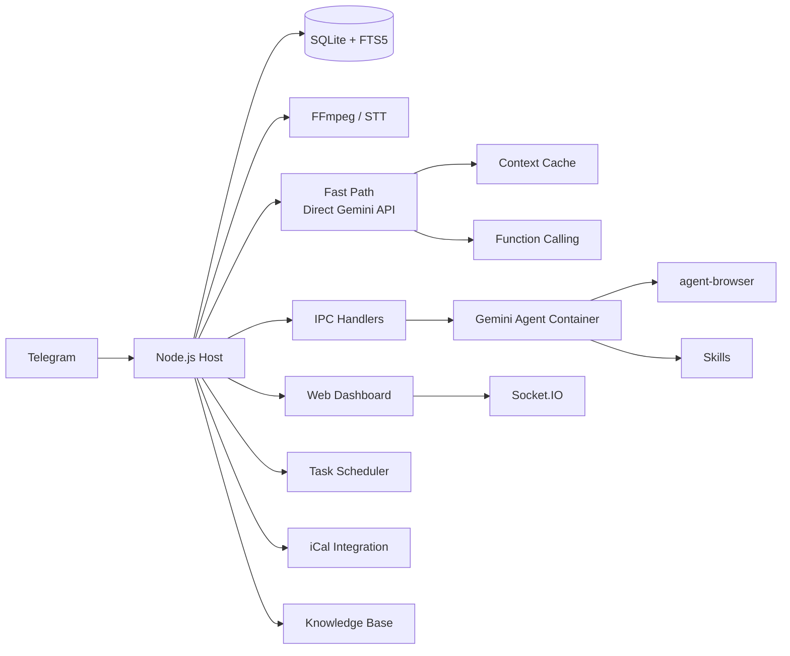

<p align="center">
  
</p>

<p align="center">
  Personal AI assistant powered by <strong>Gemini CLI</strong>. Runs securely in containers. Lightweight and built to be understood and customized.
</p>

<p align="center">
  <em>Forked from <a href="https://github.com/gavrielc/nanoclaw">NanoClaw</a> - replaced Claude Agent SDK with Gemini CLI and WhatsApp with Telegram</em>
</p>

<p align="center">
  <strong>English</strong> |
  <a href="README.zh-TW.md">繁體中文</a> |
  <a href="README.zh-CN.md">简体中文</a> |
  <a href="README.es.md">Español</a> |
  <a href="README.ja.md">日本語</a>
</p>

## Why NanoGemClaw?

**NanoGemClaw** is a lightweight, secure, and customizable AI assistant that runs **Gemini CLI** in isolated containers.

| Feature | NanoClaw | NanoGemClaw |
|---------|----------|-------------|
| **Agent Runtime** | Claude Agent SDK | Gemini CLI |
| **Messaging** | WhatsApp (Baileys) | Telegram Bot API |
| **Cost** | Claude Max ($100/mo) | Free tier (60 req/min) |
| **Media Support** | Text only | Photo, Voice, Audio, Video, Document |
| **Web Browsing** | Search only | Full `agent-browser` (Playwright) |
| **Knowledge Base** | - | FTS5 full-text search per group |
| **Scheduling** | - | Natural language + cron, iCal calendar |
| **Dashboard** | - | 9-module real-time management SPA |
| **Advanced Tools** | - | STT, Image Gen, Personas, Skills, Multi-model |
| **Fast Path** | - | Direct Gemini API streaming, context caching, native function calling |

---

## Key Features

- **Multi-modal I/O** - Send photos, voice messages, videos, or documents. Gemini processes them natively.
- **Speech-to-Text (STT)** - Voice messages are automatically transcribed (Gemini multimodal or Google Cloud Speech).
- **Image Generation** - Create images using **Imagen 3** via natural language.
- **Browser Automation** - Agents use `agent-browser` for complex web tasks (interaction, screenshots).
- **Knowledge Base** - Per-group document store with SQLite FTS5 full-text search. Upload and query documents from the dashboard.
- **Scheduled Tasks** - Natural language scheduling ("every day at 8am", "每天早上8點") with cron, interval, and one-time support.
- **Calendar Integration** - Subscribe to iCal feeds (Google Calendar, Apple Calendar, etc.) and query upcoming events.
- **Skills System** - Assign Markdown-based skill files to groups. Agents gain specialized capabilities (e.g. `agent-browser`, `long-memory`).
- **Personas** - Pre-defined personalities (coder, translator, writer, analyst) or create custom personas per group.
- **Multi-model Support** - Choose Gemini model per group (`gemini-3-flash-preview`, `gemini-3-pro-preview`, etc.).
- **Multi-turn Task Tracking** - Track and manage complex, multi-step background tasks with auto follow-up.
- **Fast Path (Direct API)** - Simple text queries bypass container startup entirely, streaming responses in real-time via the `@google/genai` SDK. Falls back to containers for media and code execution.
- **Context Caching** - Static content (system prompt, memory summaries) is cached via the Gemini caching API, reducing input token costs by 75–90%.
- **Native Function Calling** - Tool operations (scheduling, image gen, preferences) use Gemini's native function calling instead of file-based IPC polling — near-zero latency.
- **Container Isolation** - Every group runs in its own sandbox (Apple Container or Docker).
- **Web Dashboard** - 9-module real-time command center with log streaming, memory editor, analytics, knowledge management, and more.
- **i18n Support** - Full interface support for English, Chinese, Japanese, and Spanish.

---

## Installation

### Prerequisites

| Tool | Purpose | Installation |
|------|---------|--------------|
| **Node.js 20+** | Runtime | [nodejs.org](https://nodejs.org) |
| **Gemini CLI** | AI Agent | `npm install -g @google/gemini-cli` |
| **FFmpeg** | Audio processing (STT) | `brew install ffmpeg` |

### Quick Start

1. **Clone & Install:**

   ```bash
   git clone https://github.com/Rlin1027/NanoGemClaw.git
   cd NanoGemClaw
   npm install
   ```

2. **Configure Bot:**
   - Get a token from **@BotFather** on Telegram.
   - Create `.env` based on `.env.example`.
   - Run `npm run setup:telegram` to verify.

3. **Build Dashboard:**

   ```bash
   cd dashboard && npm install && cd ..
   npm run build:dashboard
   ```

4. **Build Agent Container:**

   ```bash
   bash container/build.sh
   ```

5. **Start:**

   ```bash
   npm run dev
   ```

   Open `http://localhost:3000` to access the Web Dashboard.

---

## Monorepo Architecture

This project is organized as a TypeScript monorepo with npm workspaces:

```
packages/
  core/          # @nanogemclaw/core   — shared types, config, logger, utilities
  db/            # @nanogemclaw/db     — SQLite database layer (better-sqlite3)
  gemini/        # @nanogemclaw/gemini — Gemini API client, context caching, function calling
  telegram/      # @nanogemclaw/telegram — Telegram bot helpers, rate limiter, consolidator
  server/        # @nanogemclaw/server — Express dashboard server + Socket.IO
  plugin-api/    # @nanogemclaw/plugin-api — Plugin interface & lifecycle types
  dashboard/     # @nanogemclaw/dashboard — React + Vite frontend (dashboard SPA)

app/             # Application entry point — wires all packages together
examples/
  plugin-skeleton/ — Minimal plugin example to get started
```

### Writing a Plugin

1. Copy `examples/plugin-skeleton/` to a new directory.
2. Implement the `NanoPlugin` interface (lifecycle, tools, hooks, routes).
3. Register it in `data/plugins.json`:

   ```json
   {
     "plugins": [
       {
         "source": "./my-plugin/src/index.ts",
         "config": { "myOption": "value" },
         "enabled": true
       }
     ]
   }
   ```

See `examples/plugin-skeleton/src/index.ts` for full documentation.

---

## Environment Variables

### Required

| Variable | Description |
|----------|-------------|
| `TELEGRAM_BOT_TOKEN` | Bot token from @BotFather |

### Optional - AI & Media

| Variable | Default | Description |
|----------|---------|-------------|
| `GEMINI_API_KEY` | - | API key (if not using OAuth). Required for image generation. |
| `GEMINI_MODEL` | `gemini-3-flash-preview` | Default Gemini model for all groups |
| `ASSISTANT_NAME` | `Andy` | Bot trigger name (used for `@Andy` mentions) |
| `STT_PROVIDER` | `gemini` | Speech-to-text: `gemini` (free) or `gcp` (paid) |
| `GOOGLE_APPLICATION_CREDENTIALS` | - | GCP service account JSON path (if `STT_PROVIDER=gcp`) |

### Optional - Dashboard & Security

| Variable | Default | Description |
|----------|---------|-------------|
| `DASHBOARD_HOST` | `127.0.0.1` | Bind address (`0.0.0.0` for LAN access) |
| `DASHBOARD_API_KEY` | - | API key to protect dashboard access |
| `DASHBOARD_ORIGINS` | auto | Comma-separated allowed CORS origins |

### Optional - Rate Limiting & Alerts

| Variable | Default | Description |
|----------|---------|-------------|
| `RATE_LIMIT_ENABLED` | `true` | Enable request rate limiting |
| `RATE_LIMIT_MAX` | `20` | Max requests per window per group |
| `RATE_LIMIT_WINDOW` | `5` | Rate limit window in minutes |
| `ALERTS_ENABLED` | `true` | Send error alerts to main group |

### Optional - Fast Path

| Variable | Default | Description |
|----------|---------|-------------|
| `FAST_PATH_ENABLED` | `true` | Enable direct Gemini API calls for text queries |
| `FAST_PATH_TIMEOUT_MS` | `180000` | Fast path API timeout (ms) |
| `CACHE_TTL_SECONDS` | `21600` | Context cache TTL (default: 6 hours) |
| `MIN_CACHE_CHARS` | `100000` | Minimum content length to trigger context caching |

### Optional - Infrastructure

| Variable | Default | Description |
|----------|---------|-------------|
| `CONTAINER_TIMEOUT` | `300000` | Container execution timeout (ms) |
| `CONTAINER_IMAGE` | `nanogemclaw-agent:latest` | Container image name |
| `HEALTH_CHECK_ENABLED` | `true` | Enable health check HTTP server |
| `HEALTH_CHECK_PORT` | `8080` | Health check server port |
| `WEBHOOK_URL` | - | External webhook for notifications (Slack/Discord) |
| `WEBHOOK_EVENTS` | `error,alert` | Events to trigger webhook |
| `TZ` | system | Timezone for scheduled tasks |
| `LOG_LEVEL` | `info` | Logging level |

---

## Usage Examples

### Messaging & Productivity

- `@Andy translate this voice message and summarize it`
- `@Andy generate a 16:9 image of a futuristic cyberpunk city`
- `@Andy browse https://news.google.com and give me the top headlines`

### Task Scheduling

- `@Andy every morning at 8am, check the weather and suggest what to wear`
- `@Andy 每天下午3點提醒我喝水`
- `@Andy monitor my website every 30 minutes and alert me if it goes down`

### Knowledge Base

- Upload documents via the dashboard, then ask: `@Andy search the knowledge base for deployment guide`

---

## Administration

Send these commands directly to the bot:

- `/admin language <lang>` - Switch bot interface language.
- `/admin persona <name>` - Change bot personality (default, coder, translator, writer, analyst).
- `/admin report` - Get a daily activity summary.

---

## Architecture



### Backend (`src/`)

| Module | Purpose |
|--------|---------|
| `index.ts` | Telegram bot entry, state management, IPC dispatch |
| `server.ts` | Express REST API + Socket.IO server |
| `routes/` | Modular API routes (auth, groups, tasks, knowledge, calendar, skills, config, analytics) |
| `db/` | Split SQLite modules (connection, messages, tasks, stats, preferences) |
| `ipc-handlers/` | Plugin-based IPC handlers (schedule, image gen, register, preferences, suggest actions) |
| `container-runner.ts` | Container lifecycle, streaming output |
| `fast-path.ts` | Direct Gemini API execution with streaming (bypasses container) |
| `gemini-client.ts` | `@google/genai` SDK client with streaming support |
| `context-cache.ts` | Per-group Gemini context cache manager |
| `gemini-tools.ts` | Native function calling declarations and execution |
| `message-handler.ts` | Message processing, fast path routing, multi-modal input |
| `knowledge.ts` | FTS5 knowledge base engine |
| `google-calendar.ts` | iCal feed parser |
| `skills.ts` | Skill file discovery and assignment |
| `natural-schedule.ts` | Natural language to cron parser (EN/ZH) |
| `personas.ts` | Persona definitions and custom persona management |
| `task-scheduler.ts` | Cron/interval/one-time task execution |

### Frontend (`dashboard/`)

React + Vite + TailwindCSS SPA with 9 modules:

| Page | Description |
|------|-------------|
| **Overview** | Group status cards with real-time agent activity |
| **Logs** | Universal log stream with level filtering |
| **Memory Studio** | Monaco editor for system prompts (GEMINI.md) and conversation summaries |
| **Group Detail** | Per-group settings: persona, model, trigger, web search toggle |
| **Tasks** | Scheduled task CRUD with execution history |
| **Analytics** | Usage charts, container logs, message statistics |
| **Knowledge** | Document upload, FTS5 search, per-group document management |
| **Calendar** | iCal feed subscription and upcoming event viewer |
| **Settings** | Maintenance mode, debug logging, secrets status, preferences |

### Persistence

- **SQLite** (`store/messages.db`): Messages, tasks, stats, preferences, knowledge (FTS5)
- **JSON** (`data/`): Sessions, registered groups, custom personas, calendar configs, group skills
- **Filesystem** (`groups/`): Per-group workspace (GEMINI.md, logs, media, IPC)

---

## Web Dashboard

### Access

```bash
# Local access (default)
open http://localhost:3000

# LAN access
DASHBOARD_HOST=0.0.0.0 npm run dev
```

Supports `Cmd+K` / `Ctrl+K` global search overlay.

### Build for Production

```bash
npm run build:dashboard    # Build frontend
npm run build              # Build backend
npm start                  # Serves dashboard at :3000
```

---

## Testing

```bash
npm test                  # Run all tests (Vitest)
npm run test:watch        # Watch mode
npm run test:coverage     # Coverage report
npm run typecheck         # TypeScript type check
```

---

## Troubleshooting

- **Bot not responding?** Check `npm run dev` logs and ensure the bot is an Admin in the group.
- **STT failing?** Ensure `ffmpeg` is installed (`brew install ffmpeg`).
- **Media not processing?** Verify `GEMINI_API_KEY` is set in `.env`.
- **Container issues?** Run `bash container/build.sh` to rebuild the image.
- **Dashboard blank page?** Run `cd dashboard && npm install` before building. The dashboard has its own `package.json`.
- **CORS errors?** Check `DASHBOARD_ORIGINS` env var or ensure your origin is in the allowed list.
- **Container EROFS error?** Apple Container doesn't support nested overlapping bind mounts. Ensure `~/.gemini` is mounted as read-write.
- **Fast path not working?** Ensure `GEMINI_API_KEY` is set. OAuth-only setups automatically fall back to container path.
- **Want to disable fast path?** Set `FAST_PATH_ENABLED=false` globally, or set `enableFastPath: false` per group in the dashboard.
- **Rate limited?** Adjust `RATE_LIMIT_MAX` and `RATE_LIMIT_WINDOW` in `.env`.
- **Health check port conflict?** Change `HEALTH_CHECK_PORT` or disable with `HEALTH_CHECK_ENABLED=false`.

---

## License

MIT

## Credits

- Original [NanoClaw](https://github.com/gavrielc/nanoclaw) by [@gavrielc](https://github.com/gavrielc)
- Powered by [Gemini CLI](https://github.com/google-gemini/gemini-cli)
