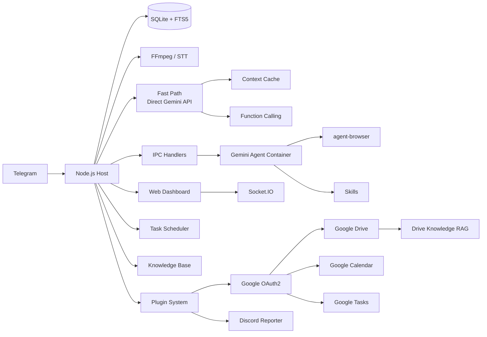

<p align="center">
  
</p>

<p align="center">
  Personal AI assistant powered by <strong>Gemini</strong> with deep <strong>Google ecosystem</strong> integration. Runs securely in containers. Lightweight and built to be understood, customized, and extended.
</p>

<p align="center">
  <em>Forked from <a href="https://github.com/gavrielc/nanoclaw">NanoClaw</a> - replaced Claude Agent SDK with Gemini and WhatsApp with Telegram</em>
</p>

<p align="center">
  <strong>English</strong> |
  <a href="README.zh-TW.md">繁體中文</a> |
  <a href="README.zh-CN.md">简体中文</a> |
  <a href="README.es.md">Español</a> |
  <a href="README.ja.md">日本語</a> |
  <a href="README.ko.md">한국어</a> |
  <a href="README.pt.md">Português</a> |
  <a href="README.ru.md">Русский</a>
</p>

---

## Why NanoGemClaw?

**NanoGemClaw** is a lightweight, secure, and extensible AI assistant that runs **Gemini** in isolated containers — delivered via Telegram.

| Feature              | NanoClaw             | NanoGemClaw                                                           |
| -------------------- | -------------------- | --------------------------------------------------------------------- |
| **Agent Runtime**    | Claude Agent SDK     | Gemini CLI + Direct API                                               |
| **Messaging**        | WhatsApp (Baileys)   | Telegram Bot API                                                      |
| **Cost**             | Claude Max ($100/mo) | Free tier (60 req/min)                                                |
| **Architecture**     | Monolith             | Modular monorepo (7 packages + 6 plugins)                             |
| **Extensibility**    | Hardcoded            | Plugin system with lifecycle hooks                                    |
| **Google Ecosystem** | -                    | Drive, Calendar, Tasks, Knowledge RAG                                 |
| **Notifications**    | -                    | Discord daily/weekly reports                                          |
| **Media Support**    | Text only            | Photo, Voice, Audio, Video, Document                                  |
| **Web Browsing**     | Search only          | Full `agent-browser` (Playwright)                                     |
| **Knowledge Base**   | -                    | FTS5 full-text search per group                                       |
| **Scheduling**       | -                    | Natural language + cron, iCal calendar                                |
| **Dashboard**        | -                    | 9-module real-time management SPA                                     |
| **Advanced Tools**   | -                    | STT, Image Gen, Personas, Skills, Multi-model                         |
| **Fast Path**        | -                    | Direct Gemini API streaming, context caching, native function calling |

---

## Key Features

- **Modular Monorepo** - 7 npm workspace packages. Use individual packages in your own projects or deploy the full stack.
- **Plugin System** - Extend with custom Gemini tools, message hooks, API routes, and background services without modifying core code.
- **Multi-modal I/O** - Send photos, voice messages, videos, or documents. Gemini processes them natively.
- **Fast Path (Direct API)** - Simple text queries bypass container startup, streaming responses in real-time via the `@google/genai` SDK. Falls back to containers for code execution.
- **Context Caching** - Static content cached via the Gemini caching API, reducing input token costs by 75-90%.
- **Native Function Calling** - Tool operations use Gemini's native function calling instead of file-based IPC polling.
- **Speech-to-Text** - Voice messages are automatically transcribed (Gemini multimodal or Google Cloud Speech).
- **Image Generation** - Create images using **Imagen 3** via natural language.
- **Browser Automation** - Agents use `agent-browser` for complex web tasks.
- **Knowledge Base** - Per-group document store with SQLite FTS5 full-text search.
- **Scheduled Tasks** - Natural language scheduling ("every day at 8am") with cron, interval, and one-time support.
- **Google Calendar (Read/Write)** - Create, update, delete events and check availability via Google Calendar API. Falls back to iCal for read-only access.
- **Google Tasks** - Full CRUD operations with bidirectional sync between NanoGemClaw scheduled tasks and Google Tasks.
- **Google Drive** - Search files, read content, and summarize documents. Supports Docs, Sheets, PDF, and plain text.
- **Drive Knowledge RAG** - Two-layer retrieval: pre-indexed embeddings for instant lookup + live Drive search for broader coverage. Share the same knowledge folder with NotebookLM.
- **Discord Reports** - Automated daily and weekly progress reports pushed to Discord via webhooks, with color-coded embeds and dashboard links.
- **Skills System** - Assign Markdown-based skill files to groups for specialized capabilities.
- **Personas** - Pre-defined personalities or create custom personas per group.
- **Multi-model Support** - Choose Gemini model per group (`gemini-3-flash-preview`, `gemini-3-pro-preview`, etc.).
- **Container Isolation** - Every group runs in its own sandbox (Apple Container or Docker).
- **Web Dashboard** - 9-module real-time command center with log streaming, memory editor, analytics, Google account management, and Discord settings.
- **i18n** - Full interface support for English, Chinese, Japanese, and Spanish.

---

## Monorepo Architecture

```
nanogemclaw/
├── packages/
│   ├── core/          # @nanogemclaw/core      — types, config, logger, utilities
│   ├── db/            # @nanogemclaw/db        — SQLite persistence (better-sqlite3)
│   ├── gemini/        # @nanogemclaw/gemini    — Gemini API client, context cache, tools
│   ├── telegram/      # @nanogemclaw/telegram  — Bot helpers, rate limiter, consolidator
│   ├── server/        # @nanogemclaw/server    — Express + Socket.IO dashboard API
│   ├── plugin-api/    # @nanogemclaw/plugin-api — Plugin interface & lifecycle types
│   └── dashboard/     # React + Vite frontend SPA (private)
├── plugins/
│   ├── google-auth/          # OAuth2 token management & auto-refresh
│   ├── google-drive/         # Drive file search, read & summarize
│   ├── google-tasks/         # Tasks CRUD with bidirectional sync
│   ├── google-calendar-rw/   # Calendar read/write (upgrade from iCal)
│   ├── drive-knowledge-rag/  # Two-layer RAG (embeddings + live search)
│   └── discord-reporter/     # Daily & weekly Discord embed reports
├── app/               # Application entry point — wires all packages together
├── src/               # Application modules (message handler, bot, scheduler, etc.)
├── examples/
│   └── plugin-skeleton/  # Minimal plugin example
├── container/         # Agent container (Gemini CLI + tools)
└── docs/              # Documentation & guides
```

### Package Overview

| Package                   | Description                                              | Reuse Value |
| ------------------------- | -------------------------------------------------------- | ----------- |
| `@nanogemclaw/core`       | Shared types, config factory, logger, utilities          | Medium      |
| `@nanogemclaw/db`         | SQLite database layer with FTS5 search                   | Medium      |
| `@nanogemclaw/gemini`     | Gemini API client, context caching, function calling     | **High**    |
| `@nanogemclaw/telegram`   | Telegram bot helpers, rate limiter, message consolidator | Medium      |
| `@nanogemclaw/server`     | Express dashboard server + Socket.IO real-time events    | Medium      |
| `@nanogemclaw/plugin-api` | Plugin interface definitions and lifecycle types         | **High**    |

---

## Quick Start

### Prerequisites

| Tool            | Purpose                | Installation                        |
| --------------- | ---------------------- | ----------------------------------- |
| **Node.js 20+** | Runtime                | [nodejs.org](https://nodejs.org)    |
| **Gemini CLI**  | AI Agent               | `npm install -g @google/gemini-cli` |
| **FFmpeg**      | Audio processing (STT) | `brew install ffmpeg`               |

### 1. Clone & Install

```bash
git clone https://github.com/Rlin1027/NanoGemClaw.git
cd NanoGemClaw
npm install
```

### 2. Configure

```bash
cp .env.example .env
```

Edit `.env` and fill in:

- `TELEGRAM_BOT_TOKEN` — Get from [@BotFather](https://t.me/BotFather) on Telegram
- `GEMINI_API_KEY` — Get from [Google AI Studio](https://aistudio.google.com/)

Optionally copy the config file for TypeScript autocompletion:

```bash
cp nanogemclaw.config.example.ts nanogemclaw.config.ts
```

### 3. Build Dashboard

```bash
cd packages/dashboard && npm install && cd ../..
npm run build:dashboard
```

### 4. Build Agent Container

```bash
# macOS with Apple Container: start the system service first
container system start

bash container/build.sh
```

> If using Docker instead of Apple Container, skip `container system start`.

### 5. Start

```bash
npm run dev
```

The backend API starts at `http://localhost:3000`. To access the Web Dashboard during development, start the frontend dev server in a separate terminal:

```bash
cd packages/dashboard
npm run dev                # Dashboard at http://localhost:5173 (proxies /api → :3000)
```

> In production (`npm start`), the dashboard is bundled and served directly at `http://localhost:3000`.

For a detailed step-by-step guide, see [docs/GUIDE.md](docs/GUIDE.md).

---

## Plugin System

NanoGemClaw supports plugins that extend functionality without modifying core code. Plugins can provide:

- **Gemini Tools** — Custom function calling tools available to the AI
- **Message Hooks** — Intercept messages before/after processing
- **API Routes** — Custom dashboard API endpoints
- **Background Services** — Long-running background tasks
- **IPC Handlers** — Custom inter-process communication handlers

### Writing a Plugin

1. Copy `examples/plugin-skeleton/` to a new directory.
2. Implement the `NanoPlugin` interface:

```typescript
import type {
  NanoPlugin,
  PluginApi,
  GeminiToolContribution,
} from '@nanogemclaw/plugin-api';

const myPlugin: NanoPlugin = {
  id: 'my-plugin',
  name: 'My Plugin',
  version: '1.0.0',

  async init(api: PluginApi) {
    api.logger.info('Plugin initialized');
  },

  geminiTools: [
    {
      name: 'my_tool',
      description: 'Does something useful',
      parameters: {
        type: 'OBJECT',
        properties: {
          input: { type: 'STRING', description: 'The input value' },
        },
        required: ['input'],
      },
      permission: 'any',
      async execute(args) {
        return JSON.stringify({ result: `Processed: ${args.input}` });
      },
    },
  ],

  hooks: {
    async afterMessage(context) {
      // Log every message for analytics
    },
  },
};

export default myPlugin;
```

1. Register in `data/plugins.json`:

```json
{
  "plugins": [
    {
      "source": "./path/to/my-plugin/src/index.ts",
      "config": { "myOption": "value" },
      "enabled": true
    }
  ]
}
```

See `examples/plugin-skeleton/src/index.ts` for a fully documented example, and [docs/GUIDE.md](docs/GUIDE.md) for the complete plugin development guide.

### Built-in Plugins

NanoGemClaw ships with 6 built-in plugins in the `plugins/` directory:

| Plugin                  | Description                                                 | Gemini Tools | Background Service |
| ----------------------- | ----------------------------------------------------------- | :----------: | :----------------: |
| **google-auth**         | OAuth2 core — token management, auto-refresh, CLI auth flow |              |                    |
| **google-drive**        | Search, read, and summarize Drive files (Docs, Sheets, PDF) |      3       |                    |
| **google-tasks**        | Google Tasks CRUD with bidirectional sync                   |      3       |    15-min sync     |
| **google-calendar-rw**  | Full Calendar API — create, update, delete events           |      5       |                    |
| **drive-knowledge-rag** | Two-layer RAG: pre-indexed embeddings + live Drive search   |      1       |   30-min indexer   |
| **discord-reporter**    | Daily and weekly progress reports via Discord webhooks      |              |   Cron scheduler   |

All Google plugins depend on **google-auth** for OAuth2 tokens. Run the authorization flow once from the Dashboard Settings page.

---

## Environment Variables

### Required

| Variable             | Description               |
| -------------------- | ------------------------- |
| `TELEGRAM_BOT_TOKEN` | Bot token from @BotFather |

### Optional - AI & Media

| Variable         | Default                  | Description                                     |
| ---------------- | ------------------------ | ----------------------------------------------- |
| `GEMINI_API_KEY` | -                        | API key (required for image gen and fast path)  |
| `GEMINI_MODEL`   | `gemini-3-flash-preview` | Default Gemini model for all groups             |
| `ASSISTANT_NAME` | `Andy`                   | Bot trigger name (used for `@Andy` mentions)    |
| `STT_PROVIDER`   | `gemini`                 | Speech-to-text: `gemini` (free) or `gcp` (paid) |

### Optional - Dashboard & Security

| Variable                | Default     | Description                             |
| ----------------------- | ----------- | --------------------------------------- |
| `DASHBOARD_HOST`        | `127.0.0.1` | Bind address (`0.0.0.0` for LAN access) |
| `DASHBOARD_API_KEY`     | -           | API key to protect dashboard access     |
| `DASHBOARD_ACCESS_CODE` | -           | Access code for dashboard login screen  |
| `DASHBOARD_ORIGINS`     | auto        | Comma-separated allowed CORS origins    |

### Optional - Fast Path

| Variable               | Default  | Description                               |
| ---------------------- | -------- | ----------------------------------------- |
| `FAST_PATH_ENABLED`    | `true`   | Enable direct Gemini API for text queries |
| `FAST_PATH_TIMEOUT_MS` | `180000` | API timeout (ms)                          |
| `CACHE_TTL_SECONDS`    | `21600`  | Context cache TTL (6 hours)               |
| `MIN_CACHE_CHARS`      | `100000` | Min content length for caching            |

### Optional - Google Ecosystem (Plugins)

| Variable                     | Default     | Description                                      |
| ---------------------------- | ----------- | ------------------------------------------------ |
| `GOOGLE_CLIENT_ID`           | -           | OAuth2 client ID from Google Cloud Console       |
| `GOOGLE_CLIENT_SECRET`       | -           | OAuth2 client secret                             |
| `GOOGLE_KNOWLEDGE_FOLDER_ID` | -           | Drive folder ID for RAG knowledge indexing       |
| `DISCORD_WEBHOOK_URL`        | -           | Discord channel webhook URL for reports          |
| `DISCORD_DAILY_CRON`         | `0 9 * * *` | Daily report schedule (default: 9:00 AM)         |
| `DISCORD_WEEKLY_CRON`        | `0 9 * * 1` | Weekly report schedule (default: Monday 9:00 AM) |

### Optional - Infrastructure

| Variable             | Default                    | Description                        |
| -------------------- | -------------------------- | ---------------------------------- |
| `CONTAINER_TIMEOUT`  | `300000`                   | Container execution timeout (ms)   |
| `CONTAINER_IMAGE`    | `nanogemclaw-agent:latest` | Container image name               |
| `RATE_LIMIT_ENABLED` | `true`                     | Enable request rate limiting       |
| `RATE_LIMIT_MAX`     | `20`                       | Max requests per window per group  |
| `RATE_LIMIT_WINDOW`  | `5`                        | Rate limit window (minutes)        |
| `WEBHOOK_URL`        | -                          | External webhook for notifications |
| `TZ`                 | system                     | Timezone for scheduled tasks       |
| `LOG_LEVEL`          | `info`                     | Logging level                      |

For the complete list, see [.env.example](.env.example).

---

## Usage Examples

### Messaging & Productivity

- `@Andy translate this voice message and summarize it`
- `@Andy generate a 16:9 image of a futuristic cyberpunk city`
- `@Andy browse https://news.google.com and give me the top headlines`

### Task Scheduling

- `@Andy every morning at 8am, check the weather and suggest what to wear`
- `@Andy monitor my website every 30 minutes and alert me if it goes down`

### Knowledge Base

- Upload documents via the dashboard, then ask: `@Andy search the knowledge base for deployment guide`

### Google Ecosystem

- `@Andy create a meeting with John tomorrow at 3pm`
- `@Andy what's on my calendar this week?`
- `@Andy add a task "Review PR #42" to my Google Tasks`
- `@Andy search my Drive for the Q4 budget spreadsheet`
- `@Andy summarize the project proposal document from Drive`
- `@Andy what do my knowledge docs say about deployment?`

### Administration

Send these commands directly to the bot:

- `/admin language <lang>` - Switch bot interface language
- `/admin persona <name>` - Change bot personality
- `/admin report` - Get a daily activity summary

---

## Architecture



### Backend Packages

| Package                   | Key Modules                                                                                  |
| ------------------------- | -------------------------------------------------------------------------------------------- |
| `@nanogemclaw/core`       | `config.ts`, `types.ts`, `logger.ts`, `utils.ts`, `safe-compare.ts`                          |
| `@nanogemclaw/db`         | `connection.ts`, `messages.ts`, `tasks.ts`, `stats.ts`, `preferences.ts`                     |
| `@nanogemclaw/gemini`     | `gemini-client.ts`, `context-cache.ts`, `gemini-tools.ts`                                    |
| `@nanogemclaw/telegram`   | `telegram-helpers.ts`, `telegram-rate-limiter.ts`, `message-consolidator.ts`                 |
| `@nanogemclaw/server`     | `server.ts`, `routes/` (auth, groups, tasks, knowledge, calendar, skills, config, analytics) |
| `@nanogemclaw/plugin-api` | `NanoPlugin`, `PluginApi`, `GeminiToolContribution`, `HookContributions`                     |

### Application Layer (`src/`)

| Module                | Purpose                                                  |
| --------------------- | -------------------------------------------------------- |
| `index.ts`            | Telegram bot entry, state management, IPC dispatch       |
| `message-handler.ts`  | Message processing, fast path routing, multi-modal input |
| `fast-path.ts`        | Direct Gemini API execution with streaming               |
| `container-runner.ts` | Container lifecycle and streaming output                 |
| `task-scheduler.ts`   | Cron/interval/one-time task execution                    |
| `knowledge.ts`        | FTS5 knowledge base engine                               |
| `personas.ts`         | Persona definitions and custom persona management        |
| `natural-schedule.ts` | Natural language to cron parser (EN/ZH)                  |

### Frontend (`packages/dashboard/`)

React + Vite + TailwindCSS SPA with 9 modules:

| Page              | Description                                                                     |
| ----------------- | ------------------------------------------------------------------------------- |
| **Overview**      | Group status cards with real-time agent activity                                |
| **Logs**          | Universal log stream with level filtering                                       |
| **Memory Studio** | Monaco editor for system prompts and conversation summaries                     |
| **Group Detail**  | Per-group settings: persona, model, trigger, web search toggle                  |
| **Tasks**         | Scheduled task CRUD with execution history                                      |
| **Analytics**     | Usage charts, container logs, message statistics                                |
| **Knowledge**     | Document upload, FTS5 search, per-group document management                     |
| **Calendar**      | iCal feed subscription and upcoming event viewer                                |
| **Settings**      | Maintenance mode, debug logging, secrets status, Google account, Discord config |

### Persistence

- **SQLite** (`store/messages.db`): Messages, tasks, stats, preferences, knowledge (FTS5)
- **JSON** (`data/`): Sessions, registered groups, custom personas, calendar configs, group skills
- **Filesystem** (`groups/`): Per-group workspace (GEMINI.md, logs, media, IPC)

---

## Web Dashboard

### Development

```bash
# Terminal 1: Start backend
npm run dev

# Terminal 2: Start dashboard frontend
cd packages/dashboard
npm run dev                # http://localhost:5173 (proxies /api → :3000)
```

### Production

```bash
npm run build:dashboard    # Build frontend
npm run build              # Build backend
npm start                  # Serves everything at http://localhost:3000
```

```bash
# LAN access
DASHBOARD_HOST=0.0.0.0 npm start
```

Supports `Cmd+K` / `Ctrl+K` global search overlay.

---

## Development

```bash
npm run dev               # Start with tsx (hot reload)
npm run typecheck         # TypeScript type check (backend)
npm test                  # Run all tests (Vitest, 28 files, ~600 tests)
npm run test:watch        # Watch mode
npm run test:coverage     # Coverage report
npm run format:check      # Prettier check
```

Dashboard development:

```bash
cd packages/dashboard
npm run dev               # Vite dev server (port 5173, proxies /api -> :3000)
npx tsc --noEmit          # Type check frontend
```

---

## Troubleshooting

- **Bot not responding?** Check `npm run dev` logs and ensure the bot is an Admin in the group.
- **STT failing?** Ensure `ffmpeg` is installed (`brew install ffmpeg`).
- **Media not processing?** Verify `GEMINI_API_KEY` is set in `.env`.
- **Container issues?** Run `bash container/build.sh` to rebuild the image.
- **Dashboard blank page?** Run `cd packages/dashboard && npm install` before building.
- **CORS errors?** Check `DASHBOARD_ORIGINS` env var.
- **Container EROFS error?** Apple Container doesn't support nested overlapping bind mounts.
- **Container XPC error?** Run `container system start` first. Apple Container's system service must be running before builds.
- **`Cannot GET /` on localhost:3000?** In dev mode, port 3000 is API-only. Start the dashboard separately: `cd packages/dashboard && npm run dev` (serves on port 5173).
- **Fast path not working?** Ensure `GEMINI_API_KEY` is set. OAuth-only setups fall back to container path.
- **Want to disable fast path?** Set `FAST_PATH_ENABLED=false` globally, or toggle per group in the dashboard.
- **Rate limited?** Adjust `RATE_LIMIT_MAX` and `RATE_LIMIT_WINDOW` in `.env`.
- **Google OAuth not working?** Ensure `GOOGLE_CLIENT_ID` and `GOOGLE_CLIENT_SECRET` are set. Use "Desktop App" type in Google Cloud Console.
- **Drive/Calendar/Tasks not responding?** Complete the OAuth flow from Dashboard Settings → Google Account first.
- **Discord reports not sending?** Check `DISCORD_WEBHOOK_URL` is valid. Test with the "Send Test" button in Dashboard Settings.

---

## License

MIT

## Credits

- Original [NanoClaw](https://github.com/gavrielc/nanoclaw) by [@gavrielc](https://github.com/gavrielc)
- Powered by [Gemini](https://ai.google.dev/)
