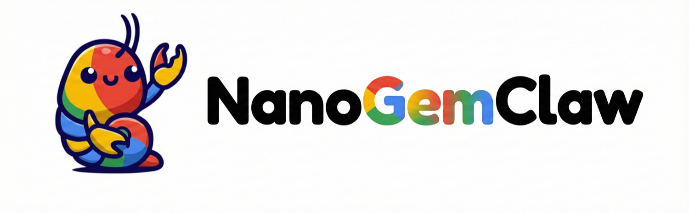
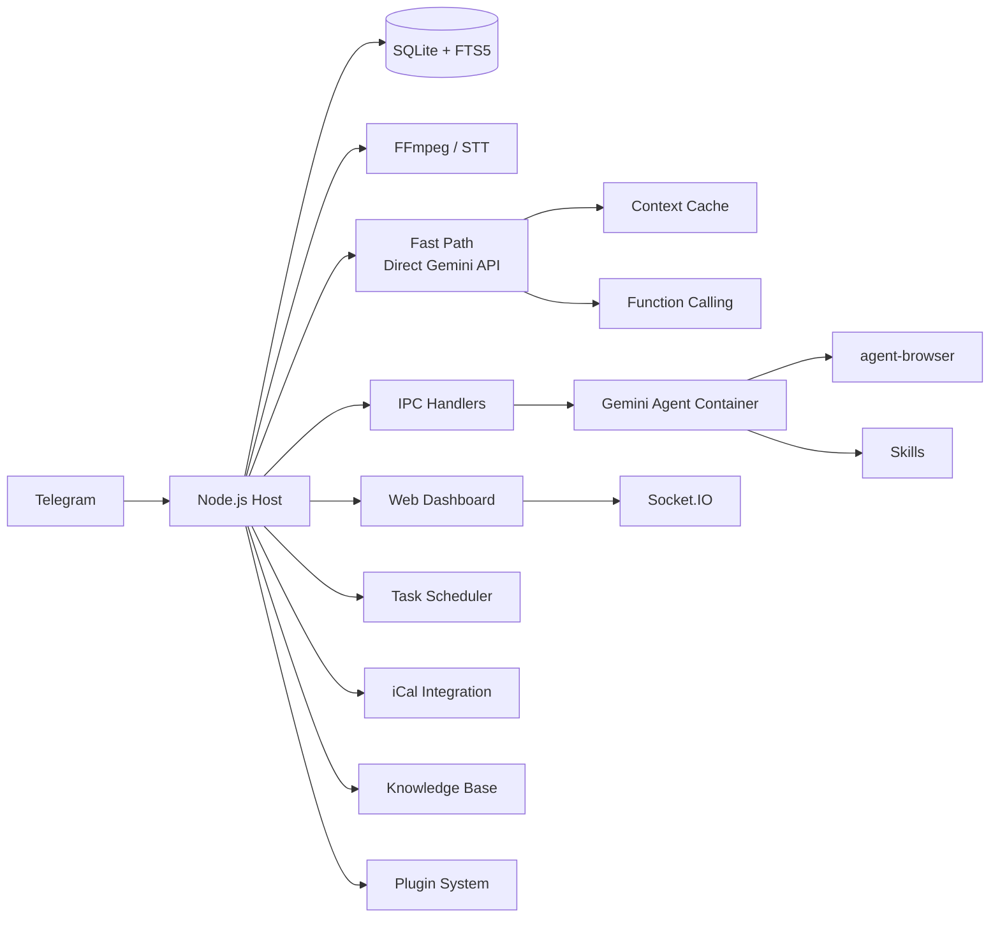

<p align="center">
  
</p>

<p align="center">
  Assistente pessoal de IA com <strong>Gemini</strong>. Executa de forma segura em contêineres. Leve e projetado para ser compreendido, personalizado e estendido.
</p>

<p align="center">
  <em>Fork do <a href="https://github.com/gavrielc/nanoclaw">NanoClaw</a> - substituiu o Claude Agent SDK pelo Gemini e o WhatsApp pelo Telegram</em>
</p>

<p align="center">
  <a href="README.md">English</a> |
  <a href="README.zh-TW.md">繁體中文</a> |
  <a href="README.zh-CN.md">简体中文</a> |
  <a href="README.es.md">Español</a> |
  <a href="README.ja.md">日本語</a> |
  <a href="README.ko.md">한국어</a> |
  <strong>Português</strong> |
  <a href="README.ru.md">Русский</a>
</p>

---

## Por que NanoGemClaw?

**NanoGemClaw** é um assistente de IA leve, seguro e extensível que executa o **Gemini** em contêineres isolados — entregue via Telegram.

| Recurso | NanoClaw | NanoGemClaw |
|---------|----------|-------------|
| **Runtime do Agente** | Claude Agent SDK | Gemini CLI + Direct API |
| **Mensagens** | WhatsApp (Baileys) | Telegram Bot API |
| **Custo** | Claude Max ($100/mês) | Tier gratuito (60 req/min) |
| **Arquitetura** | Monolito | Monorepo modular (7 pacotes) |
| **Extensibilidade** | Hardcoded | Sistema de plugins com hooks de ciclo de vida |
| **Suporte a Mídia** | Somente texto | Foto, Voz, Áudio, Vídeo, Documento |
| **Navegação Web** | Somente busca | `agent-browser` completo (Playwright) |
| **Base de Conhecimento** | - | Busca de texto completo FTS5 por grupo |
| **Agendamento** | - | Linguagem natural + cron, calendário iCal |
| **Dashboard** | - | SPA de gerenciamento em tempo real com 9 módulos |
| **Ferramentas Avançadas** | - | STT, Geração de Imagem, Personas, Skills, Multi-modelo |
| **Fast Path** | - | Streaming Direct Gemini API, cache de contexto, chamada de função nativa |

---

## Recursos Principais

- **Monorepo Modular** - 7 pacotes de workspace npm. Use pacotes individuais em seus próprios projetos ou implante a stack completa.
- **Sistema de Plugins** - Estenda com ferramentas Gemini customizadas, hooks de mensagem, rotas de API e serviços em background sem modificar o código principal.
- **I/O Multimodal** - Envie fotos, mensagens de voz, vídeos ou documentos. O Gemini os processa nativamente.
- **Fast Path (API Direta)** - Consultas de texto simples ignoram a inicialização do contêiner, transmitindo respostas em tempo real via SDK `@google/genai`. Faz fallback para contêineres para execução de código.
- **Cache de Contexto** - Conteúdo estático cacheado via API de cache do Gemini, reduzindo custos de tokens de entrada em 75-90%.
- **Chamada de Função Nativa** - Operações de ferramentas usam a chamada de função nativa do Gemini em vez de polling IPC baseado em arquivos.
- **Voz para Texto** - Mensagens de voz são automaticamente transcritas (Gemini multimodal ou Google Cloud Speech).
- **Geração de Imagem** - Crie imagens usando **Imagen 3** via linguagem natural.
- **Automação de Navegador** - Agentes usam `agent-browser` para tarefas web complexas.
- **Base de Conhecimento** - Armazenamento de documentos por grupo com busca de texto completo SQLite FTS5.
- **Tarefas Agendadas** - Agendamento em linguagem natural ("todos os dias às 8h") com suporte a cron, intervalo e execução única.
- **Integração de Calendário** - Assine feeds iCal e consulte eventos futuros.
- **Sistema de Skills** - Atribua arquivos de skill baseados em Markdown a grupos para capacidades especializadas.
- **Personas** - Personalidades pré-definidas ou crie personas customizadas por grupo.
- **Suporte Multi-modelo** - Escolha o modelo Gemini por grupo (`gemini-3-flash-preview`, `gemini-3-pro-preview`, etc.).
- **Isolamento de Contêiner** - Cada grupo executa em seu próprio sandbox (Apple Container ou Docker).
- **Dashboard Web** - Centro de comando em tempo real com 9 módulos incluindo streaming de logs, editor de memória, analytics e mais.
- **i18n** - Suporte completo de interface para inglês, chinês, japonês e espanhol.

---

## Arquitetura Monorepo

```
nanogemclaw/
├── packages/
│   ├── core/          # @nanogemclaw/core      — tipos, config, logger, utilitários
│   ├── db/            # @nanogemclaw/db        — persistência SQLite (better-sqlite3)
│   ├── gemini/        # @nanogemclaw/gemini    — cliente API Gemini, cache de contexto, ferramentas
│   ├── telegram/      # @nanogemclaw/telegram  — helpers do bot, rate limiter, consolidador
│   ├── server/        # @nanogemclaw/server    — Express + Socket.IO dashboard API
│   ├── plugin-api/    # @nanogemclaw/plugin-api — interface de plugin & tipos de ciclo de vida
│   └── dashboard/     # React + Vite frontend SPA (privado)
├── app/               # Ponto de entrada da aplicação — conecta todos os pacotes
├── src/               # Módulos da aplicação (handler de mensagem, bot, agendador, etc.)
├── examples/
│   └── plugin-skeleton/  # Exemplo mínimo de plugin
├── container/         # Contêiner do agente (Gemini CLI + ferramentas)
└── docs/              # Documentação & guias
```

### Visão Geral dos Pacotes

| Pacote | Descrição | Valor de Reuso |
|--------|-----------|----------------|
| `@nanogemclaw/core` | Tipos compartilhados, fábrica de config, logger, utilitários | Médio |
| `@nanogemclaw/db` | Camada de banco de dados SQLite com busca FTS5 | Médio |
| `@nanogemclaw/gemini` | Cliente API Gemini, cache de contexto, chamada de função | **Alto** |
| `@nanogemclaw/telegram` | Helpers do bot Telegram, rate limiter, consolidador de mensagens | Médio |
| `@nanogemclaw/server` | Servidor dashboard Express + eventos em tempo real Socket.IO | Médio |
| `@nanogemclaw/plugin-api` | Definições de interface de plugin e tipos de ciclo de vida | **Alto** |

---

## Início Rápido

### Pré-requisitos

| Ferramenta | Propósito | Instalação |
|------------|-----------|------------|
| **Node.js 20+** | Runtime | [nodejs.org](https://nodejs.org) |
| **Gemini CLI** | Agente de IA | `npm install -g @google/gemini-cli` |
| **FFmpeg** | Processamento de áudio (STT) | `brew install ffmpeg` |

### 1. Clonar & Instalar

```bash
git clone https://github.com/Rlin1027/NanoGemClaw.git
cd NanoGemClaw
npm install
```

### 2. Configurar

```bash
cp .env.example .env
```

Edite `.env` e preencha:

- `TELEGRAM_BOT_TOKEN` — Obtenha do [@BotFather](https://t.me/BotFather) no Telegram
- `GEMINI_API_KEY` — Obtenha do [Google AI Studio](https://aistudio.google.com/)

Opcionalmente copie o arquivo de config para autocompletar TypeScript:

```bash
cp nanogemclaw.config.example.ts nanogemclaw.config.ts
```

### 3. Build do Dashboard

```bash
cd packages/dashboard && npm install && cd ../..
npm run build:dashboard
```

### 4. Build do Contêiner do Agente

```bash
bash container/build.sh
```

### 5. Iniciar

```bash
npm run dev
```

Abra `http://localhost:3000` para acessar o Dashboard Web.

> Para um guia detalhado passo a passo, veja [docs/GUIDE.md](docs/GUIDE.md).

---

## Sistema de Plugins

NanoGemClaw suporta plugins que estendem funcionalidades sem modificar o código principal. Plugins podem fornecer:

- **Ferramentas Gemini** — Ferramentas de chamada de função customizadas disponíveis para a IA
- **Hooks de Mensagem** — Intercepte mensagens antes/depois do processamento
- **Rotas de API** — Endpoints de API customizados para o dashboard
- **Serviços em Background** — Tarefas de longa execução em background
- **Handlers IPC** — Handlers customizados de comunicação entre processos

### Escrevendo um Plugin

1. Copie `examples/plugin-skeleton/` para um novo diretório.
2. Implemente a interface `NanoPlugin`:

```typescript
import type { NanoPlugin, PluginApi, GeminiToolContribution } from '@nanogemclaw/plugin-api';

const myPlugin: NanoPlugin = {
  id: 'my-plugin',
  name: 'My Plugin',
  version: '1.0.0',

  async init(api: PluginApi) {
    api.logger.info('Plugin initialized');
  },

  geminiTools: [
    {
      name: 'my_tool',
      description: 'Does something useful',
      parameters: {
        type: 'OBJECT',
        properties: {
          input: { type: 'STRING', description: 'The input value' },
        },
        required: ['input'],
      },
      permission: 'any',
      async execute(args) {
        return JSON.stringify({ result: `Processed: ${args.input}` });
      },
    },
  ],

  hooks: {
    async afterMessage(context) {
      // Registrar todas as mensagens para analytics
    },
  },
};

export default myPlugin;
```

1. Registre em `data/plugins.json`:

```json
{
  "plugins": [
    {
      "source": "./path/to/my-plugin/src/index.ts",
      "config": { "myOption": "value" },
      "enabled": true
    }
  ]
}
```

Veja `examples/plugin-skeleton/src/index.ts` para um exemplo totalmente documentado, e [docs/GUIDE.md](docs/GUIDE.md) para o guia completo de desenvolvimento de plugins.

---

## Variáveis de Ambiente

### Obrigatórias

| Variável | Descrição |
|----------|-----------|
| `TELEGRAM_BOT_TOKEN` | Token do bot do @BotFather |

### Opcionais - IA & Mídia

| Variável | Padrão | Descrição |
|----------|--------|-----------|
| `GEMINI_API_KEY` | - | Chave de API (necessária para geração de imagem e fast path) |
| `GEMINI_MODEL` | `gemini-3-flash-preview` | Modelo Gemini padrão para todos os grupos |
| `ASSISTANT_NAME` | `Andy` | Nome de gatilho do bot (usado para menções `@Andy`) |
| `STT_PROVIDER` | `gemini` | Voz para texto: `gemini` (gratuito) ou `gcp` (pago) |

### Opcionais - Dashboard & Segurança

| Variável | Padrão | Descrição |
|----------|--------|-----------|
| `DASHBOARD_HOST` | `127.0.0.1` | Endereço de bind (`0.0.0.0` para acesso LAN) |
| `DASHBOARD_API_KEY` | - | Chave de API para proteger acesso ao dashboard |
| `DASHBOARD_ACCESS_CODE` | - | Código de acesso para tela de login do dashboard |
| `DASHBOARD_ORIGINS` | auto | Origens CORS permitidas separadas por vírgula |

### Opcionais - Fast Path

| Variável | Padrão | Descrição |
|----------|--------|-----------|
| `FAST_PATH_ENABLED` | `true` | Ativar API direta do Gemini para consultas de texto |
| `FAST_PATH_TIMEOUT_MS` | `180000` | Timeout da API (ms) |
| `CACHE_TTL_SECONDS` | `21600` | TTL do cache de contexto (6 horas) |
| `MIN_CACHE_CHARS` | `100000` | Comprimento mínimo de conteúdo para cache |

### Opcionais - Infraestrutura

| Variável | Padrão | Descrição |
|----------|--------|-----------|
| `CONTAINER_TIMEOUT` | `300000` | Timeout de execução do contêiner (ms) |
| `CONTAINER_IMAGE` | `nanogemclaw-agent:latest` | Nome da imagem do contêiner |
| `RATE_LIMIT_ENABLED` | `true` | Ativar limitação de taxa de requisições |
| `RATE_LIMIT_MAX` | `20` | Máximo de requisições por janela por grupo |
| `RATE_LIMIT_WINDOW` | `5` | Janela de limitação de taxa (minutos) |
| `WEBHOOK_URL` | - | Webhook externo para notificações |
| `TZ` | system | Fuso horário para tarefas agendadas |
| `LOG_LEVEL` | `info` | Nível de logging |

Para a lista completa, veja [.env.example](.env.example).

---

## Exemplos de Uso

### Mensagens & Produtividade

- `@Andy traduza esta mensagem de voz e resuma`
- `@Andy gere uma imagem 16:9 de uma cidade cyberpunk futurista`
- `@Andy navegue em https://news.google.com e me dê as principais manchetes`

### Agendamento de Tarefas

- `@Andy toda manhã às 8h, verifique o clima e sugira o que vestir`
- `@Andy monitore meu site a cada 30 minutos e me avise se cair`

### Base de Conhecimento

- Faça upload de documentos via dashboard, depois pergunte: `@Andy pesquise na base de conhecimento por guia de implantação`

### Administração

Envie estes comandos diretamente para o bot:

- `/admin language <lang>` - Alterar idioma da interface do bot
- `/admin persona <name>` - Alterar personalidade do bot
- `/admin report` - Obter resumo de atividade diária

---

## Arquitetura



### Pacotes Backend

| Pacote | Módulos Principais |
|--------|-------------------|
| `@nanogemclaw/core` | `config.ts`, `types.ts`, `logger.ts`, `utils.ts`, `safe-compare.ts` |
| `@nanogemclaw/db` | `connection.ts`, `messages.ts`, `tasks.ts`, `stats.ts`, `preferences.ts` |
| `@nanogemclaw/gemini` | `gemini-client.ts`, `context-cache.ts`, `gemini-tools.ts` |
| `@nanogemclaw/telegram` | `telegram-helpers.ts`, `telegram-rate-limiter.ts`, `message-consolidator.ts` |
| `@nanogemclaw/server` | `server.ts`, `routes/` (auth, groups, tasks, knowledge, calendar, skills, config, analytics) |
| `@nanogemclaw/plugin-api` | `NanoPlugin`, `PluginApi`, `GeminiToolContribution`, `HookContributions` |

### Camada de Aplicação (`src/`)

| Módulo | Propósito |
|--------|-----------|
| `index.ts` | Entrada do bot Telegram, gerenciamento de estado, dispatch IPC |
| `message-handler.ts` | Processamento de mensagem, roteamento fast path, entrada multimodal |
| `fast-path.ts` | Execução Direct Gemini API com streaming |
| `container-runner.ts` | Ciclo de vida do contêiner e saída streaming |
| `task-scheduler.ts` | Execução de tarefas cron/intervalo/única |
| `knowledge.ts` | Motor de base de conhecimento FTS5 |
| `personas.ts` | Definições de persona e gerenciamento de persona customizada |
| `natural-schedule.ts` | Parser de linguagem natural para cron (EN/ZH) |

### Frontend (`packages/dashboard/`)

SPA React + Vite + TailwindCSS com 9 módulos:

| Página | Descrição |
|--------|-----------|
| **Visão Geral** | Cards de status de grupo com atividade de agente em tempo real |
| **Logs** | Stream de log universal com filtragem por nível |
| **Memory Studio** | Editor Monaco para prompts de sistema e resumos de conversa |
| **Detalhe do Grupo** | Configurações por grupo: persona, modelo, gatilho, toggle de busca web |
| **Tarefas** | CRUD de tarefas agendadas com histórico de execução |
| **Analytics** | Gráficos de uso, logs de contêiner, estatísticas de mensagem |
| **Conhecimento** | Upload de documentos, busca FTS5, gerenciamento de documentos por grupo |
| **Calendário** | Assinatura de feed iCal e visualizador de eventos futuros |
| **Configurações** | Modo de manutenção, logging de debug, status de secrets, preferências |

### Persistência

- **SQLite** (`store/messages.db`): Mensagens, tarefas, estatísticas, preferências, conhecimento (FTS5)
- **JSON** (`data/`): Sessões, grupos registrados, personas customizadas, configs de calendário, skills de grupo
- **Sistema de Arquivos** (`groups/`): Workspace por grupo (GEMINI.md, logs, mídia, IPC)

---

## Dashboard Web

```bash
# Acesso local (padrão)
open http://localhost:3000

# Acesso LAN
DASHBOARD_HOST=0.0.0.0 npm run dev
```

Suporta overlay de busca global `Cmd+K` / `Ctrl+K`.

### Build para Produção

```bash
npm run build:dashboard    # Build do frontend
npm run build              # Build do backend
npm start                  # Serve o dashboard em :3000
```

---

## Desenvolvimento

```bash
npm run dev               # Iniciar com tsx (hot reload)
npm run typecheck         # Verificação de tipos TypeScript (backend)
npm test                  # Executar todos os testes (Vitest, 12 arquivos, ~330 testes)
npm run test:watch        # Modo observação
npm run test:coverage     # Relatório de cobertura
npm run format:check      # Verificação Prettier
```

Desenvolvimento do dashboard:

```bash
cd packages/dashboard
npm run dev               # Servidor dev Vite (porta 5173, proxy /api -> :3000)
npx tsc --noEmit          # Verificação de tipos do frontend
```

---

## Solução de Problemas

- **Bot não responde?** Verifique os logs do `npm run dev` e certifique-se de que o bot é Admin no grupo.
- **STT falhando?** Certifique-se de que o `ffmpeg` está instalado (`brew install ffmpeg`).
- **Mídia não processa?** Verifique se `GEMINI_API_KEY` está definida no `.env`.
- **Problemas com contêiner?** Execute `bash container/build.sh` para reconstruir a imagem.
- **Dashboard com página em branco?** Execute `cd packages/dashboard && npm install` antes do build.
- **Erros de CORS?** Verifique a variável de ambiente `DASHBOARD_ORIGINS`.
- **Erro EROFS no contêiner?** Apple Container não suporta bind mounts sobrepostos aninhados.
- **Fast path não funciona?** Certifique-se de que `GEMINI_API_KEY` está definida. Configurações somente OAuth fazem fallback para o caminho do contêiner.
- **Deseja desativar o fast path?** Defina `FAST_PATH_ENABLED=false` globalmente, ou alterne por grupo no dashboard.
- **Limitado por taxa?** Ajuste `RATE_LIMIT_MAX` e `RATE_LIMIT_WINDOW` no `.env`.

---

## Licença

MIT

## Créditos

- [NanoClaw](https://github.com/gavrielc/nanoclaw) original por [@gavrielc](https://github.com/gavrielc)
- Desenvolvido com [Gemini](https://ai.google.dev/)
