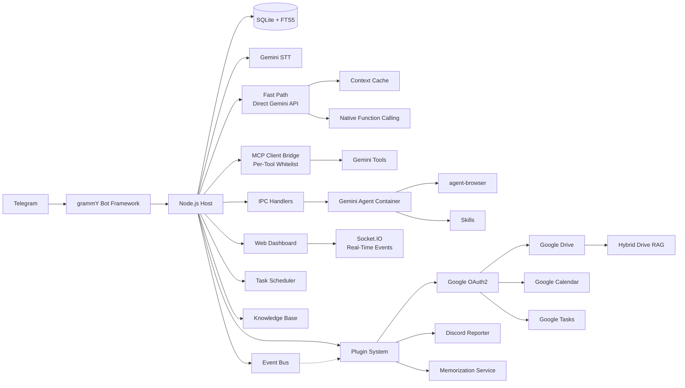

<p align="center">
  
</p>

<p align="center">
  <a href="https://github.com/Rlin1027/NanoGemClaw/blob/main/LICENSE"></a>
  <a href="https://nodejs.org/">=20"></a>
  <a href="https://github.com/Rlin1027/NanoGemClaw"></a>
</p>

<p align="center">
  Assistente de IA pessoal alimentado por <strong>Gemini</strong> com integração profunda ao <strong>ecossistema Google</strong>. Executa com segurança em containers. Leve e construído para ser compreendido, personalizado e estendido.
</p>

<p align="center">
  <em>Forked do <a href="https://github.com/gavrielc/nanoclaw">NanoClaw</a> - substituído Claude Agent SDK por Gemini e WhatsApp por Telegram</em>
</p>

<p align="center">
  <a href="README.md">English</a> |
  <a href="README.zh-TW.md">繁體中文</a> |
  <a href="README.zh-CN.md">简体中文</a> |
  <a href="README.es.md">Español</a> |
  <a href="README.ja.md">日本語</a> |
  <a href="README.ko.md">한국어</a> |
  <strong>Português</strong> |
  <a href="README.ru.md">Русский</a>
</p>

---

## Por que NanoGemClaw?

**NanoGemClaw** é um assistente de IA leve, seguro e extensível que executa **Gemini** em containers isolados — entregue via Telegram com roteamento inteligente de fast path, chamada nativa de funções e integração profunda ao ecossistema Google.

| Funcionalidade           | NanoClaw             | NanoGemClaw                                                           |
| ----------------------- | -------------------- | --------------------------------------------------------------------- |
| **Agent Runtime**       | Claude Agent SDK     | Gemini + MCP Client Bridge com whitelist por ferramenta                |
| **Bot Framework**       | node-telegram-bot-api| grammY (type-safe, event-driven)                                      |
| **Messaging**           | WhatsApp (Baileys)   | Telegram Bot API                                                      |
| **Custo**              | Claude Max ($100/mês)| Camada gratuita (60 req/min)                                          |
| **Arquitetura**         | Monolito             | Monorepo modular (8 packages + 7 plugins)                             |
| **Extensibilidade**     | Hardcoded            | Sistema de plugins com hooks de lifecycle                             |
| **Ecossistema Google**  | -                    | Drive, Calendar, Tasks, Knowledge RAG                                 |
| **Notificações**        | -                    | Relatórios diários/semanais Discord                                   |
| **Suporte a Mídia**     | Apenas texto         | Foto, Voz (fast path), Áudio, Vídeo, Documento                        |
| **Web Browsing**        | Apenas busca         | `agent-browser` completo (Playwright)                                 |
| **Knowledge Base**      | -                    | Busca full-text FTS5 por grupo                                        |
| **Agendamento**         | -                    | Linguagem natural + cron, calendário iCal                             |
| **Dashboard**           | -                    | SPA de gerenciamento real-time com 12 módulos                         |
| **Ferramentas Avançadas**| -                    | STT, Image Gen, Personas, Skills, Multi-model                        |
| **Fast Path**           | -                    | Roteamento inteligente com cache de contexto (economia 75–90% tokens) |

---

## Recursos-Chave

- **Monorepo Modular** - 8 packages npm workspaces. Use packages individuais em seus próprios projetos ou implante a stack completa.
- **grammY Bot Framework** - Migrado de node-telegram-bot-api para grammY para integração Telegram type-safe e event-driven com rate limiting e consolidação de mensagens.
- **MCP Client Bridge** - Whitelist por ferramenta para Model Context Protocol, com validação unificada de schema Zod em todas as entradas de ferramentas.
- **Smart Message Routing** - `preferredPath` roteamento inteligente seleciona entre fast path (Gemini API direto) e execução em container baseado no tipo de query, com fallback transparente.
- **Sistema de Plugins** - Estenda com ferramentas Gemini customizadas, message hooks, rotas API, serviços de background, IPC handlers e extensões de dashboard sem modificar o código core.
- **Multi-modal I/O** - Envie fotos, mensagens de voz, vídeos ou documentos. Gemini os processa nativamente.
- **Fast Path (API Direto)** - Queries de texto simples contornam a inicialização de container, fazendo streaming de respostas em tempo real via SDK `@google/genai` com chamada de função nativa. Mensagens de voz transcrevem automaticamente e usam fast path. Fallback para containers para execução de código.
- **Context Caching** - Conteúdo estático cached via Gemini caching API, reduzindo custos de input token em 75–90%.
- **Native Function Calling** - Operações de ferramentas usam chamada de função nativa do Gemini com controle de permissão por ferramenta (main/any), substituindo polling de IPC baseado em arquivo.
- **Speech-to-Text** - Mensagens de voz são transcritas automaticamente usando Gemini multimodal (padrão, sem FFmpeg necessário) ou Google Cloud Speech.
- **Image Generation** - Crie imagens usando **Imagen 3** via linguagem natural.
- **Browser Automation** - Agents usam `agent-browser` (Playwright) para tarefas web complexas.
- **Knowledge Base** - Armazenamento de documentos por grupo com busca full-text SQLite FTS5 e scanning de injeção para segurança.
- **Hybrid Drive RAG** - Recuperação em duas camadas: embeddings pré-indexados via abordagem de arquivo físico para busca instantânea + busca em Drive em tempo real para cobertura mais ampla. Compartilhe a mesma pasta de conhecimento com NotebookLM.
- **Scheduled Tasks** - Agendamento em linguagem natural ("todo dia às 8am") com suporte a cron, intervalo e uma única vez.
- **Google Calendar (Leitura/Escrita)** - Crie, atualize, delete eventos e verifique disponibilidade via Google Calendar API. Fallback para iCal para acesso somente leitura.
- **Google Tasks** - Operações CRUD completas com sincronização bidirecional entre tarefas agendadas NanoGemClaw e Google Tasks.
- **Google Drive** - Busque arquivos, leia conteúdo e resuma documentos. Suporta Docs, Sheets, PDF e texto simples.
- **Discord Reports** - Relatórios de progresso diários e semanais automatizados enviados para Discord via webhooks, com embeds coloridos e links de dashboard.
- **Skills System** - Atribua arquivos de skill baseados em Markdown aos grupos para capacidades especializadas com proteção contra injeção.
- **Personas** - Personalidades pré-definidas ou crie personas customizadas por grupo.
- **Multi-model Support** - Escolha modelo Gemini por grupo (`gemini-3-flash-preview`, `gemini-3-pro-preview`, etc.).
- **Container Isolation** - Cada grupo executa em sua própria sandbox (Apple Container ou Docker) com limites de timeout e tamanho de output.
- **Web Dashboard** - Centro de comando real-time com 12 módulos com streaming de logs, editor de memória, analytics, gerenciamento de conta Google, navegador Drive, configurações Discord e gerenciamento MCP.
- **i18n (100% Cobertura)** - Suporte completo de interface para 8 idiomas: English, Traditional Chinese, Simplified Chinese, Japanese, Korean, Spanish, Portuguese e Russian.
- **Test Coverage** - Cobertura de 92% em statements, 84% em branches (35+ arquivos de teste, ~950 testes) com Vitest e testing de integração abrangente.

---

## Arquitetura de Monorepo

```
nanogemclaw/
├── packages/
│   ├── core/          # @nanogemclaw/core      — types, config, logger, utilities
│   ├── db/            # @nanogemclaw/db        — SQLite persistence (better-sqlite3)
│   ├── gemini/        # @nanogemclaw/gemini    — Gemini API client, context cache, MCP tools
│   ├── telegram/      # @nanogemclaw/telegram  — grammY bot helpers, rate limiter, consolidator
│   ├── server/        # @nanogemclaw/server    — Express + Socket.IO dashboard API
│   ├── plugin-api/    # @nanogemclaw/plugin-api — Plugin interface & lifecycle types
│   ├── event-bus/     # @nanogemclaw/event-bus  — Typed pub/sub event system
│   └── dashboard/     # React + Vite frontend SPA (private)
├── plugins/
│   ├── google-auth/          # OAuth2 token management & auto-refresh
│   ├── google-drive/         # Drive file search, read & summarize
│   ├── google-tasks/         # Tasks CRUD with bidirectional sync
│   ├── google-calendar-rw/   # Calendar read/write (upgrade from iCal)
│   ├── drive-knowledge-rag/  # Two-layer RAG (embeddings + live search)
│   ├── discord-reporter/    # Daily & weekly Discord embed reports
│   └── memorization-service/ # Automatic conversation summarization
├── app/               # Application entry point — wires all packages together
├── src/               # Application modules (message handler, bot, scheduler, etc.)
├── examples/
│   └── plugin-skeleton/  # Minimal plugin example
├── container/         # Agent container (Gemini CLI + tools)
└── docs/              # Documentation & guides
```

### Visão Geral de Packages

| Package                   | Descrição                                              | Valor de Reuso |
| ------------------------- | -------------------------------------------------------- | ----------- |
| `@nanogemclaw/core`       | Shared types, config factory, logger, utilities          | Médio      |
| `@nanogemclaw/db`         | SQLite database layer with FTS5 search                   | Médio      |
| `@nanogemclaw/gemini`     | Gemini API client, context caching, MCP function calling | **Alto**    |
| `@nanogemclaw/telegram`   | grammY bot helpers, rate limiter, message consolidator   | Médio      |
| `@nanogemclaw/server`     | Express dashboard server + Socket.IO real-time events    | Médio      |
| `@nanogemclaw/plugin-api` | Plugin interface definitions and lifecycle types         | **Alto**    |
| `@nanogemclaw/event-bus`  | Typed pub/sub event system for inter-plugin communication | Médio      |

---

## Quick Start

### Pré-requisitos

| Ferramenta          | Propósito              | Instalação                        |
| --------------- | ---------------------- | ----------------------------------- |
| **Node.js 20+** | Runtime                | [nodejs.org](https://nodejs.org)    |
| **Gemini CLI**  | AI Agent               | `npm install -g @google/gemini-cli` |
| **FFmpeg**      | GCP STT apenas (opcional) | `brew install ffmpeg`               |

### 1. Clone & Instale

```bash
git clone https://github.com/Rlin1027/NanoGemClaw.git
cd NanoGemClaw
npm install
```

### 2. Configure

```bash
cp .env.example .env
```

Edite `.env` e preencha:

- `TELEGRAM_BOT_TOKEN` — Obtenha de [@BotFather](https://t.me/BotFather) no Telegram
- `GEMINI_API_KEY` — Obtenha de [Google AI Studio](https://aistudio.google.com/)

Opcionalmente copie o arquivo config para autocompletar TypeScript:

```bash
cp nanogemclaw.config.example.ts nanogemclaw.config.ts
```

### 3. Build Dashboard

```bash
cd packages/dashboard && npm install && cd ../..
npm run build:dashboard
```

### 4. Build Agent Container

```bash
# macOS com Apple Container: inicie o serviço do sistema primeiro
container system start

bash container/build.sh
```

> Se usar Docker em vez de Apple Container, pule `container system start`.

### 5. Inicie

```bash
npm run dev
```

O backend API inicia em `http://localhost:3000`. Para acessar o Web Dashboard durante desenvolvimento, inicie o servidor dev do frontend em um terminal separado:

```bash
cd packages/dashboard
npm run dev                # Dashboard em http://localhost:5173 (proxies /api → :3000)
```

> Em produção (`npm start`), o dashboard é bundled e servido diretamente em `http://localhost:3000`.

Para um guia passo-a-passo detalhado, veja [docs/GUIDE.md](docs/GUIDE.md).

---

## Sistema de Plugins

NanoGemClaw suporta plugins que estendem funcionalidade sem modificar código core. Plugins podem fornecer:

- **Gemini Tools** — Ferramentas de chamada de função customizadas com níveis de permissão (main/any) e whitelist por ferramenta
- **Message Hooks** — Intercepte mensagens antes/depois do processamento com scanning de injeção
- **API Routes** — Endpoints customizados de API de dashboard
- **Background Services** — Tarefas de background de longa duração
- **IPC Handlers** — Custom handlers de comunicação inter-processo
- **Dashboard Extensions** — Componentes UI customizados para o dashboard web

### Escrevendo um Plugin

1. Copie `examples/plugin-skeleton/` para um novo diretório.
2. Implemente a interface `NanoPlugin`:

```typescript
import type {
  NanoPlugin,
  PluginApi,
  GeminiToolContribution,
} from '@nanogemclaw/plugin-api';

const myPlugin: NanoPlugin = {
  id: 'my-plugin',
  name: 'My Plugin',
  version: '1.0.0',

  async init(api: PluginApi) {
    api.logger.info('Plugin initialized');
  },

  geminiTools: [
    {
      name: 'my_tool',
      description: 'Does something useful',
      parameters: {
        type: 'OBJECT',
        properties: {
          input: { type: 'STRING', description: 'The input value' },
        },
        required: ['input'],
      },
      permission: 'any',
      async execute(args) {
        return JSON.stringify({ result: `Processed: ${args.input}` });
      },
    },
  ],

  hooks: {
    async afterMessage(context) {
      // Log every message for analytics
    },
  },
};

export default myPlugin;
```

3. Registre em `data/plugins.json`:

```json
{
  "plugins": [
    {
      "source": "./path/to/my-plugin/src/index.ts",
      "config": { "myOption": "value" },
      "enabled": true
    }
  ]
}
```

Veja `examples/plugin-skeleton/src/index.ts` para um exemplo completamente documentado, e [docs/GUIDE.md](docs/GUIDE.md) para o guia completo de desenvolvimento de plugin.

### Plugins Built-in

NanoGemClaw vem com 7 plugins built-in no diretório `plugins/`:

| Plugin                      | Descrição                                                 | Gemini Tools | Background Service |
| --------------------------- | ----------------------------------------------------------- | :----------: | :----------------: |
| **google-auth**             | OAuth2 core — token management, auto-refresh, CLI auth flow |              |                    |
| **google-drive**            | Search, read, and summarize Drive files (Docs, Sheets, PDF) |      3       |                    |
| **google-tasks**            | Google Tasks CRUD with bidirectional sync                   |      3       |    15-min sync     |
| **google-calendar-rw**      | Full Calendar API — create, update, delete events           |      5       |                    |
| **drive-knowledge-rag**     | Two-layer RAG: pre-indexed embeddings + live Drive search   |      1       |   30-min indexer   |
| **discord-reporter**        | Daily and weekly progress reports via Discord webhooks      |              |   Cron scheduler   |
| **memorization-service**    | Automatic conversation summarization via Event Bus          |              |  Event-driven      |

Todos os plugins Google dependem de **google-auth** para tokens OAuth2. Execute o fluxo de autorização uma vez a partir da página Dashboard Settings.

---

## Variáveis de Ambiente

### Obrigatórias

| Variável             | Descrição               |
| -------------------- | ------------------------- |
| `TELEGRAM_BOT_TOKEN` | Bot token de @BotFather |

### Opcionais - IA & Mídia

| Variável         | Padrão                  | Descrição                                     |
| ---------------- | ------------------------ | ----------------------------------------------- |
| `GEMINI_API_KEY` | -                        | API key (obrigatório para image gen e fast path)  |
| `GEMINI_MODEL`   | `gemini-3-flash-preview` | Default Gemini model para todos os grupos             |
| `ASSISTANT_NAME` | `Andy`                   | Bot trigger name (usado para menções `@Andy`)    |
| `STT_PROVIDER`   | `gemini`                 | Speech-to-text: `gemini` (gratuito) ou `gcp` (pago) |

### Opcionais - Dashboard & Segurança

| Variável                | Padrão     | Descrição                             |
| ----------------------- | ----------- | --------------------------------------- |
| `DASHBOARD_HOST`        | `127.0.0.1` | Bind address (`0.0.0.0` para acesso LAN) |
| `DASHBOARD_API_KEY`     | -           | API key para proteger acesso ao dashboard     |
| `DASHBOARD_ACCESS_CODE` | -           | Access code para tela de login do dashboard  |
| `DASHBOARD_ORIGINS`     | auto        | Comma-separated CORS origins permitidas    |

### Opcionais - Fast Path

| Variável               | Padrão  | Descrição                               |
| ---------------------- | -------- | ----------------------------------------- |
| `FAST_PATH_ENABLED`    | `true`   | Enable direct Gemini API para text queries |
| `FAST_PATH_TIMEOUT_MS` | `180000` | API timeout (ms)                          |
| `CACHE_TTL_SECONDS`    | `21600`  | Context cache TTL (6 horas)               |
| `MIN_CACHE_CHARS`      | `100000` | Min content length para caching            |

### Opcionais - Google Ecosystem (Plugins)

| Variável                     | Padrão     | Descrição                                      |
| ---------------------------- | ----------- | ------------------------------------------------ |
| `GOOGLE_CLIENT_ID`           | -           | OAuth2 client ID de Google Cloud Console       |
| `GOOGLE_CLIENT_SECRET`       | -           | OAuth2 client secret                             |
| `DISCORD_WEBHOOK_URL`        | -           | Discord channel webhook URL para relatórios          |

### Opcionais - Infrastructure

| Variável             | Padrão                    | Descrição                        |
| -------------------- | -------------------------- | ---------------------------------- |
| `CONTAINER_TIMEOUT`  | `300000`                   | Container execution timeout (ms)   |
| `CONTAINER_IMAGE`    | `nanogemclaw-agent:latest` | Container image name               |
| `RATE_LIMIT_ENABLED` | `true`                     | Enable request rate limiting       |
| `RATE_LIMIT_MAX`     | `20`                       | Max requests per window por grupo  |
| `RATE_LIMIT_WINDOW`  | `5`                        | Rate limit window (minutos)        |
| `WEBHOOK_URL`        | -                          | External webhook para notificações |
| `WEBHOOK_EVENTS`     | `error,alert`              | Events que disparam webhook        |
| `ALERTS_ENABLED`     | `true`                     | Enable error alerts para main group  |
| `CONTAINER_MAX_OUTPUT_SIZE` | `10485760`          | Max container output size (bytes)  |
| `SCHEDULER_CONCURRENCY` | auto                    | Max concurrent scheduled containers |
| `BACKUP_RETENTION_DAYS` | `7`                     | Days para manter database backups      |
| `HEALTH_CHECK_ENABLED` | `true`                   | Enable health check HTTP server    |
| `HEALTH_CHECK_PORT`  | `8080`                     | Health check server port           |
| `TZ`                 | system                     | Timezone para scheduled tasks       |
| `LOG_LEVEL`          | `info`                     | Logging level                      |

Para a lista completa, veja [.env.example](.env.example).

---

## Exemplos de Uso

### Mensagens & Produtividade

- `@Andy translate this voice message and summarize it`
- `@Andy generate a 16:9 image of a futuristic cyberpunk city`
- `@Andy browse https://news.google.com and give me the top headlines`

### Task Scheduling

- `@Andy every morning at 8am, check the weather and suggest what to wear`
- `@Andy monitor my website every 30 minutes and alert me if it goes down`

### Knowledge Base

- Upload documents via o dashboard, depois pergunte: `@Andy search the knowledge base for deployment guide`

### Google Ecosystem

- `@Andy create a meeting with John tomorrow at 3pm`
- `@Andy what's on my calendar this week?`
- `@Andy add a task "Review PR #42" to my Google Tasks`
- `@Andy search my Drive for the Q4 budget spreadsheet`
- `@Andy summarize the project proposal document from Drive`
- `@Andy what do my knowledge docs say about deployment?`

### Administração

Envie esses comandos diretamente para o bot:

- `/admin help` - List all available admin commands
- `/admin stats` - Show uptime, memory usage, and token statistics
- `/admin groups` - List all registered groups with status
- `/admin tasks` - List all scheduled tasks
- `/admin errors` - Show groups with recent errors
- `/admin report` - Generate daily usage report
- `/admin language <lang>` - Switch bot interface language
- `/admin persona <name|list|set>` - Manage bot personas
- `/admin trigger <group> <on|off>` - Toggle @mention trigger requirement
- `/admin export <group>` - Export conversation history as Markdown

---

## Arquitetura


```mermaid
graph LR
    TG[Telegram] --> GramMY[grammY Bot Framework]
    GramMY --> Bot[Node.js Host]
    Bot --> DB[(SQLite + FTS5)]
    Bot --> STT[Gemini STT]
    Bot --> FP[Fast Path<br/>Direct Gemini API]
    FP --> Cache[Context Cache]
    FP --> FC[Native Function Calling]
    Bot --> MCP[MCP Client Bridge<br/>Per-Tool Whitelist]
    MCP --> Tools[Gemini Tools]
    Bot --> IPC[IPC Handlers]
    IPC --> Container[Gemini Agent Container]
    Container --> Browser[agent-browser]
    Container --> Skills[Skills]
    Bot --> Dashboard[Web Dashboard]
    Dashboard --> WS[Socket.IO<br/>Real-Time Events]
    Bot --> Scheduler[Task Scheduler]
    Bot --> Knowledge[Knowledge Base]
    Bot --> Plugins[Plugin System]
    Plugins --> GAuth[Google OAuth2]
    GAuth --> GDrive[Google Drive]
    GAuth --> GCal[Google Calendar]
    GAuth --> GTasks[Google Tasks]
    GDrive --> RAG[Hybrid Drive RAG]
    Plugins --> Discord[Discord Reporter]
    Plugins --> Memo[Memorization Service]
    Bot --> EB[Event Bus]
    EB -.-> Plugins
```

### Backend Packages

| Package                   | Key Modules                                                                                  |
| ------------------------- | -------------------------------------------------------------------------------------------- |
| `@nanogemclaw/core`       | `config.ts`, `types.ts`, `logger.ts`, `utils.ts`, `safe-compare.ts`                          |
| `@nanogemclaw/db`         | `connection.ts`, `messages.ts`, `tasks.ts`, `stats.ts`, `preferences.ts`                     |
| `@nanogemclaw/gemini`     | `gemini-client.ts`, `context-cache.ts`, `mcp-client-bridge.ts`, `gemini-tools.ts`           |
| `@nanogemclaw/telegram`   | `grammY-helpers.ts`, `telegram-rate-limiter.ts`, `message-consolidator.ts`                   |
| `@nanogemclaw/server`     | `server.ts`, `routes/` (auth, groups, tasks, knowledge, calendar, skills, config, analytics) |
| `@nanogemclaw/plugin-api` | `NanoPlugin`, `PluginApi`, `GeminiToolContribution`, `HookContributions`                     |
| `@nanogemclaw/event-bus`  | `EventBus`, `NanoEventMap`, typed pub/sub singleton                                          |

### Application Layer (`src/`)

| Module                | Purpose                                                  |
| --------------------- | -------------------------------------------------------- |
| `index.ts`            | Telegram bot entry, state management, IPC dispatch       |
| `message-handler.ts`  | Message processing, fast path routing, multi-modal input |
| `fast-path.ts`        | Direct Gemini API execution with streaming and caching   |
| `container-runner.ts` | Container lifecycle and streaming output                 |
| `task-scheduler.ts`   | Cron/interval/one-time task execution                    |
| `knowledge.ts`        | FTS5 knowledge base engine with injection scanning       |
| `personas.ts`         | Persona definitions and custom persona management        |
| `natural-schedule.ts` | Natural language to cron parser (EN/ZH)                  |

### Frontend (`packages/dashboard/`)

React + Vite + TailwindCSS SPA com 12 módulos:

| Page                | Description                                                                     |
| ------------------- | ------------------------------------------------------------------------------- |
| **Overview**        | Group status cards with real-time agent activity                                |
| **Logs**            | Universal log stream with level filtering                                       |
| **Activity Logs**   | Per-group activity history and event timeline                                   |
| **Memory Studio**   | Monaco editor for system prompts and conversation summaries                     |
| **Group Detail**    | Per-group settings: persona, model, trigger, web search toggle                  |
| **Tasks**           | Scheduled task CRUD with execution history                                      |
| **Schedule**        | Visual schedule overview and task timeline                                      |
| **Analytics**       | Usage charts, container logs, message statistics                                |
| **Knowledge**       | Document upload, FTS5 search, per-group document management                     |
| **Drive**           | Google Drive file browser and document viewer                                   |
| **Calendar**        | iCal feed subscription and upcoming event viewer                                |
| **Settings**        | Maintenance mode, debug logging, secrets status, Google account, Discord config, MCP management |

### Persistência

- **SQLite** (`store/messages.db`): Messages, tasks, stats, preferences, knowledge (FTS5)
- **JSON** (`data/`): Sessions, registered groups, custom personas, calendar configs, group skills
- **Filesystem** (`groups/`): Per-group workspace (GEMINI.md, logs, media, IPC)
- **Backups** (`store/backups/`): Automatic daily SQLite backups com configurable retention (`BACKUP_RETENTION_DAYS`)

### Health Check

Um lightweight HTTP server executa no port `HEALTH_CHECK_PORT` (padrão 8080) com:

- `GET /health` — System health status (healthy/degraded/unhealthy)
- `GET /ready` — Readiness probe para orchestrators
- `GET /metrics` — Prometheus-format metrics

Desabilite com `HEALTH_CHECK_ENABLED=false`.

---

## Web Dashboard

### Desenvolvimento

```bash
# Terminal 1: Start backend
npm run dev

# Terminal 2: Start dashboard frontend
cd packages/dashboard
npm run dev                # http://localhost:5173 (proxies /api → :3000)
```

### Produção

```bash
npm run build:dashboard    # Build frontend
npm run build              # Build backend
npm start                  # Serves everything at http://localhost:3000
```

```bash
# LAN access
DASHBOARD_HOST=0.0.0.0 npm start
```

Suporta `Cmd+K` / `Ctrl+K` global search overlay.

---

## Desenvolvimento

```bash
npm run dev               # Start with tsx (hot reload)
npm run typecheck         # TypeScript type check (backend)
npm test                  # Run all tests (Vitest, 35 files, ~950 tests)
npm run test:watch        # Watch mode
npm run test:coverage     # Coverage report (92% statements, 84% branches)
npm run format:check      # Prettier check
```

Dashboard development:

```bash
cd packages/dashboard
npm run dev               # Vite dev server (port 5173, proxies /api -> :3000)
npx tsc --noEmit          # Type check frontend
```

---

## Troubleshooting

- **Bot not responding?** Check `npm run dev` logs and ensure the bot is an Admin in the group.
- **STT failing?** Default provider (`gemini`) needs no extra dependencies. If using `STT_PROVIDER=gcp`, ensure `ffmpeg` is installed (`brew install ffmpeg`).
- **Media not processing?** Verify `GEMINI_API_KEY` is set in `.env`.
- **Container issues?** Run `bash container/build.sh` to rebuild the image.
- **Dashboard blank page?** Run `cd packages/dashboard && npm install` before building.
- **CORS errors?** Check `DASHBOARD_ORIGINS` env var.
- **Container EROFS error?** Apple Container doesn't support nested overlapping bind mounts.
- **Container XPC error?** Run `container system start` first. Apple Container's system service must be running before builds.
- **`Cannot GET /` on localhost:3000?** In dev mode, port 3000 is API-only. Start the dashboard separately: `cd packages/dashboard && npm run dev` (serves on port 5173).
- **Fast path not working?** Ensure `GEMINI_API_KEY` is set. Check `FAST_PATH_ENABLED=true`. Per-group setting in dashboard may override globally.
- **Rate limited?** Adjust `RATE_LIMIT_MAX` and `RATE_LIMIT_WINDOW` in `.env`.
- **Google OAuth not working?** Ensure `GOOGLE_CLIENT_ID` and `GOOGLE_CLIENT_SECRET` are set. Use "Desktop App" type in Google Cloud Console.
- **Drive/Calendar/Tasks not responding?** Complete the OAuth flow from Dashboard Settings → Google Account first.
- **Discord reports not sending?** Check `DISCORD_WEBHOOK_URL` is valid. Test with the "Send Test" button in Dashboard Settings.
- **MCP tools not executing?** Verify per-tool whitelist in Dashboard Settings → MCP. Check tool permission level (main vs any).
- **Voice messages not using fast path?** Ensure STT completes successfully. Check logs for transcription errors.

---

## Licença

MIT

## Créditos

- Original [NanoClaw](https://github.com/gavrielc/nanoclaw) by [@gavrielc](https://github.com/gavrielc)
- Powered by [Gemini](https://ai.google.dev/)
