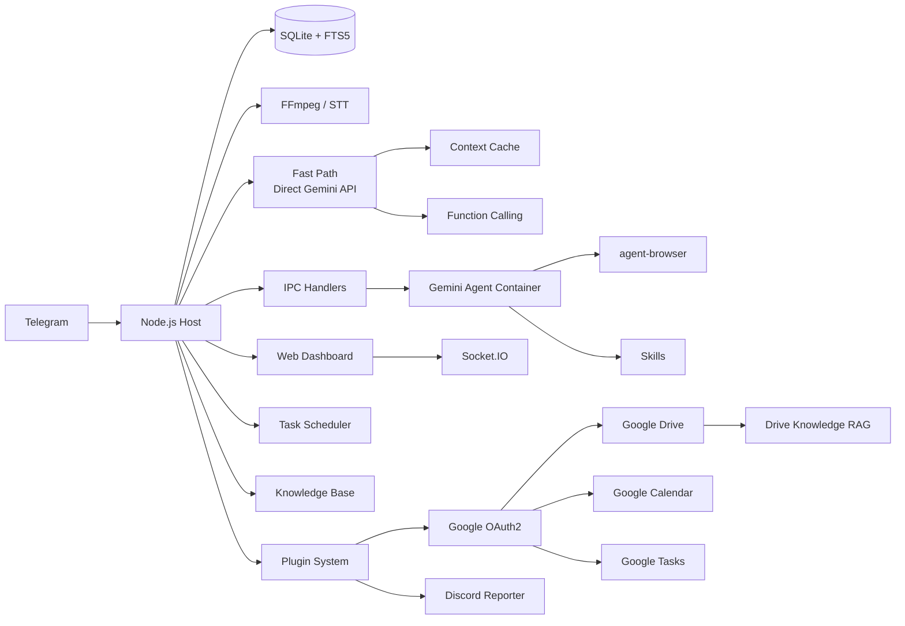

<p align="center">
  
</p>

<p align="center">
  Персональный ИИ-ассистент на базе <strong>Gemini</strong> с глубокой интеграцией экосистемы Google. Безопасно работает в контейнерах. Лёгкий и создан для понимания, настройки и расширения.
</p>

<p align="center">
  <em>Форк <a href="https://github.com/gavrielc/nanoclaw">NanoClaw</a> — Claude Agent SDK заменён на Gemini, WhatsApp — на Telegram</em>
</p>

<p align="center">
  <a href="README.md">English</a> |
  <a href="README.zh-TW.md">繁體中文</a> |
  <a href="README.zh-CN.md">简体中文</a> |
  <a href="README.es.md">Español</a> |
  <a href="README.ja.md">日本語</a> |
  <a href="README.ko.md">한국어</a> |
  <a href="README.pt.md">Português</a> |
  <strong>Русский</strong>
</p>

---

## Почему NanoGemClaw?

**NanoGemClaw** — лёгкий, безопасный и расширяемый ИИ-ассистент, запускающий **Gemini** в изолированных контейнерах — доставляется через Telegram.

| Функция                     | NanoClaw              | NanoGemClaw                                                                         |
| --------------------------- | --------------------- | ----------------------------------------------------------------------------------- |
| **Среда выполнения агента** | Claude Agent SDK      | Gemini CLI + Direct API                                                             |
| **Обмен сообщениями**       | WhatsApp (Baileys)    | Telegram Bot API                                                                    |
| **Стоимость**               | Claude Max ($100/мес) | Бесплатный уровень (60 зап/мин)                                                     |
| **Архитектура**             | Монолит               | Модульный монорепо (7 пакетов + 6 плагинов)                                         |
| **Расширяемость**           | Жёстко закодировано   | Система плагинов с хуками жизненного цикла                                          |
| **Поддержка медиа**         | Только текст          | Фото, голос, аудио, видео, документы                                                |
| **Веб-браузинг**            | Только поиск          | Полный `agent-browser` (Playwright)                                                 |
| **База знаний**             | -                     | Полнотекстовый поиск FTS5 по группам                                                |
| **Планирование**            | -                     | Естественный язык + cron, календарь iCal                                            |
| **Панель управления**       | -                     | SPA управления в реальном времени с 9 модулями                                      |
| **Продвинутые инструменты** | -                     | STT, генерация изображений, персоны, навыки, мульти-модель                          |
| **Fast Path**               | -                     | Потоковая передача Direct Gemini API, кэширование контекста, нативный вызов функций |
| **Экосистема Google**       | -                     | Drive, Calendar, Tasks — полный доступ на чтение/запись через OAuth2                |
| **Уведомления**             | -                     | Ежедневные/еженедельные отчёты в Discord с rich-embed                               |

---

## Основные возможности

- **Модульный монорепо** — 7 npm workspace-пакетов. Используйте отдельные пакеты в своих проектах или разверните полный стек.
- **Система плагинов** — Расширяйте пользовательскими инструментами Gemini, хуками сообщений, API-маршрутами и фоновыми сервисами без изменения основного кода.
- **Мультимодальный ввод/вывод** — Отправляйте фото, голосовые сообщения, видео или документы. Gemini обрабатывает их нативно.
- **Fast Path (Direct API)** — Простые текстовые запросы обходят запуск контейнера, передавая ответы в реальном времени через SDK `@google/genai`. При необходимости выполнения кода откатывается к контейнерам.
- **Кэширование контекста** — Статический контент кэшируется через API кэширования Gemini, снижая затраты на входные токены на 75-90%.
- **Нативный вызов функций** — Операции инструментов используют нативный вызов функций Gemini вместо файлового IPC-опроса.
- **Распознавание речи** — Голосовые сообщения автоматически транскрибируются (мультимодальный Gemini или Google Cloud Speech).
- **Генерация изображений** — Создавайте изображения с помощью **Imagen 3** на естественном языке.
- **Автоматизация браузера** — Агенты используют `agent-browser` для сложных веб-задач.
- **База знаний** — Хранилище документов по группам с полнотекстовым поиском SQLite FTS5.
- **Запланированные задачи** — Планирование на естественном языке («каждый день в 8 утра») с поддержкой cron, интервалов и одноразового выполнения.
- **Google Calendar чтение/запись** — Полный CRUD событий календаря, обнаружение конфликтов и проверка доступности через Google Calendar API.
- **Google Tasks** — Полное управление задачами с двусторонней синхронизацией между NanoGemClaw и Google Tasks.
- **Google Drive** — Поиск, чтение и резюмирование файлов Drive. Поддержка Docs, Sheets, PDF и обычного текста.
- **Drive Knowledge RAG** — Двухуровневая система RAG: локальный индекс с Gemini embeddings + поиск в реальном времени по Drive как запасной вариант.
- **Отчёты Discord** — Автоматические ежедневные и еженедельные отчёты через Discord-вебхуки с цветовой кодировкой embed.
- **Система навыков** — Назначайте файлы навыков на основе Markdown группам для специализированных возможностей.
- **Персоны** — Предопределённые личности или создание пользовательских персон для каждой группы.
- **Поддержка нескольких моделей** — Выбор модели Gemini для каждой группы (`gemini-3-flash-preview`, `gemini-3-pro-preview` и т.д.).
- **Изоляция контейнеров** — Каждая группа работает в собственной песочнице (Apple Container или Docker).
- **Веб-панель управления** — Командный центр в реальном времени с 9 модулями, включая управление аккаунтом Google и настройку Discord.
- **i18n** — Полная поддержка интерфейса на английском, китайском, японском и испанском языках.

---

## Архитектура монорепо

```
nanogemclaw/
├── packages/
│   ├── core/          # @nanogemclaw/core      — типы, конфиг, логгер, утилиты
│   ├── db/            # @nanogemclaw/db        — SQLite хранение (better-sqlite3)
│   ├── gemini/        # @nanogemclaw/gemini    — клиент API Gemini, кэш контекста, инструменты
│   ├── telegram/      # @nanogemclaw/telegram  — помощники бота, ограничитель запросов, консолидатор
│   ├── server/        # @nanogemclaw/server    — Express + Socket.IO API панели
│   ├── plugin-api/    # @nanogemclaw/plugin-api — интерфейс плагинов и типы жизненного цикла
│   └── dashboard/     # React + Vite фронтенд SPA (приватный)
├── app/               # Точка входа приложения — связывает все пакеты
├── src/               # Модули приложения (обработчик сообщений, бот, планировщик и т.д.)
├── examples/
│   └── plugin-skeleton/  # Минимальный пример плагина
├── plugins/             # Встроенные плагины экосистемы Google + Discord
│   ├── google-auth/        # Аутентификация OAuth2 для сервисов Google
│   ├── google-drive/       # Поиск, чтение и резюмирование файлов Drive
│   ├── google-tasks/       # CRUD Google Tasks с двусторонней синхронизацией
│   ├── google-calendar-rw/ # Чтение/запись Google Calendar (замена iCal только для чтения)
│   ├── drive-knowledge-rag/# Система RAG с индексом Drive + Gemini embeddings
│   └── discord-reporter/   # Ежедневные/еженедельные отчёты через Discord webhook
├── container/         # Контейнер агента (Gemini CLI + инструменты)
└── docs/              # Документация и руководства
```

### Обзор пакетов

| Пакет                     | Описание                                                               | Ценность повторного использования |
| ------------------------- | ---------------------------------------------------------------------- | --------------------------------- |
| `@nanogemclaw/core`       | Общие типы, фабрика конфигурации, логгер, утилиты                      | Средняя                           |
| `@nanogemclaw/db`         | Слой базы данных SQLite с поиском FTS5                                 | Средняя                           |
| `@nanogemclaw/gemini`     | Клиент API Gemini, кэширование контекста, вызов функций                | **Высокая**                       |
| `@nanogemclaw/telegram`   | Помощники бота Telegram, ограничитель запросов, консолидатор сообщений | Средняя                           |
| `@nanogemclaw/server`     | Сервер панели Express + события реального времени Socket.IO            | Средняя                           |
| `@nanogemclaw/plugin-api` | Определения интерфейса плагинов и типы жизненного цикла                | **Высокая**                       |

---

## Быстрый старт

### Предварительные требования

| Инструмент      | Назначение            | Установка                           |
| --------------- | --------------------- | ----------------------------------- |
| **Node.js 20+** | Среда выполнения      | [nodejs.org](https://nodejs.org)    |
| **Gemini CLI**  | ИИ-агент              | `npm install -g @google/gemini-cli` |
| **FFmpeg**      | Обработка аудио (STT) | `brew install ffmpeg`               |

### 1. Клонирование и установка

```bash
git clone https://github.com/Rlin1027/NanoGemClaw.git
cd NanoGemClaw
npm install
```

### 2. Настройка

```bash
cp .env.example .env
```

Отредактируйте `.env` и заполните:

- `TELEGRAM_BOT_TOKEN` — Получите у [@BotFather](https://t.me/BotFather) в Telegram
- `GEMINI_API_KEY` — Получите в [Google AI Studio](https://aistudio.google.com/)

При необходимости скопируйте файл конфигурации для автодополнения TypeScript:

```bash
cp nanogemclaw.config.example.ts nanogemclaw.config.ts
```

### 3. Сборка панели управления

```bash
cd packages/dashboard && npm install && cd ../..
npm run build:dashboard
```

### 4. Сборка контейнера агента

```bash
bash container/build.sh
```

### 5. Запуск

```bash
npm run dev
```

Откройте `http://localhost:3000` для доступа к веб-панели управления.

> Подробное пошаговое руководство смотрите в [docs/GUIDE.md](docs/GUIDE.md).

---

## Система плагинов

NanoGemClaw поддерживает плагины, расширяющие функциональность без изменения основного кода. Плагины могут предоставлять:

- **Инструменты Gemini** — Пользовательские инструменты вызова функций, доступные ИИ
- **Хуки сообщений** — Перехват сообщений до/после обработки
- **API-маршруты** — Пользовательские эндпоинты API панели управления
- **Фоновые сервисы** — Долгоработающие фоновые задачи
- **Обработчики IPC** — Пользовательские обработчики межпроцессного взаимодействия

### Написание плагина

1. Скопируйте `examples/plugin-skeleton/` в новую директорию.
2. Реализуйте интерфейс `NanoPlugin`:

```typescript
import type {
  NanoPlugin,
  PluginApi,
  GeminiToolContribution,
} from '@nanogemclaw/plugin-api';

const myPlugin: NanoPlugin = {
  id: 'my-plugin',
  name: 'My Plugin',
  version: '1.0.0',

  async init(api: PluginApi) {
    api.logger.info('Plugin initialized');
  },

  geminiTools: [
    {
      name: 'my_tool',
      description: 'Does something useful',
      parameters: {
        type: 'OBJECT',
        properties: {
          input: { type: 'STRING', description: 'The input value' },
        },
        required: ['input'],
      },
      permission: 'any',
      async execute(args) {
        return JSON.stringify({ result: `Processed: ${args.input}` });
      },
    },
  ],

  hooks: {
    async afterMessage(context) {
      // Логирование всех сообщений для аналитики
    },
  },
};

export default myPlugin;
```

1. Зарегистрируйте в `data/plugins.json`:

```json
{
  "plugins": [
    {
      "source": "./path/to/my-plugin/src/index.ts",
      "config": { "myOption": "value" },
      "enabled": true
    }
  ]
}
```

Смотрите `examples/plugin-skeleton/src/index.ts` для полностью документированного примера и [docs/GUIDE.md](docs/GUIDE.md) для полного руководства по разработке плагинов.

### Встроенные плагины

NanoGemClaw включает 6 встроенных плагинов в каталоге `plugins/`:

| Плагин                  | Описание                                             | Инструменты Gemini |           Фоновый сервис           |
| ----------------------- | ---------------------------------------------------- | :----------------: | :--------------------------------: |
| **google-auth**         | Аутентификация OAuth2 для всех сервисов Google       |         -          |                 -                  |
| **google-drive**        | Поиск, чтение и резюмирование файлов Drive           |         3          |                 -                  |
| **google-tasks**        | CRUD Google Tasks с двусторонней синхронизацией      |         3          |    Синхронизация каждые 15 мин     |
| **google-calendar-rw**  | CRUD Calendar с обнаружением конфликтов              |         5          |                 -                  |
| **drive-knowledge-rag** | Двухуровневая RAG (локальный индекс + поиск в Drive) |         1          | Сканирование индекса каждые 30 мин |
| **discord-reporter**    | Ежедневные/еженедельные отчёты через Discord webhook |         -          |     Отчёты по cron-расписанию      |

---

## Переменные окружения

### Обязательные

| Переменная           | Описание                 |
| -------------------- | ------------------------ |
| `TELEGRAM_BOT_TOKEN` | Токен бота от @BotFather |

### Необязательные — ИИ и медиа

| Переменная       | По умолч.                | Описание                                                    |
| ---------------- | ------------------------ | ----------------------------------------------------------- |
| `GEMINI_API_KEY` | -                        | API-ключ (необходим для генерации изображений и fast path)  |
| `GEMINI_MODEL`   | `gemini-3-flash-preview` | Модель Gemini по умолчанию для всех групп                   |
| `ASSISTANT_NAME` | `Andy`                   | Имя-триггер бота (для упоминаний `@Andy`)                   |
| `STT_PROVIDER`   | `gemini`                 | Распознавание речи: `gemini` (бесплатно) или `gcp` (платно) |

### Необязательные — Панель управления и безопасность

| Переменная              | По умолч.   | Описание                                      |
| ----------------------- | ----------- | --------------------------------------------- |
| `DASHBOARD_HOST`        | `127.0.0.1` | Адрес привязки (`0.0.0.0` для доступа по LAN) |
| `DASHBOARD_API_KEY`     | -           | API-ключ для защиты доступа к панели          |
| `DASHBOARD_ACCESS_CODE` | -           | Код доступа для экрана входа                  |
| `DASHBOARD_ORIGINS`     | auto        | Разрешённые CORS-источники через запятую      |

### Необязательные — Fast Path

| Переменная             | По умолч. | Описание                                          |
| ---------------------- | --------- | ------------------------------------------------- |
| `FAST_PATH_ENABLED`    | `true`    | Включить прямой API Gemini для текстовых запросов |
| `FAST_PATH_TIMEOUT_MS` | `180000`  | Таймаут API (мс)                                  |
| `CACHE_TTL_SECONDS`    | `21600`   | TTL кэша контекста (6 часов)                      |
| `MIN_CACHE_CHARS`      | `100000`  | Минимальная длина контента для кэширования        |

### Необязательные — Экосистема Google (Плагины)

| Переменная                   | Описание                                                 |
| ---------------------------- | -------------------------------------------------------- |
| `GOOGLE_CLIENT_ID`           | ID клиента OAuth2 (из Google Cloud Console)              |
| `GOOGLE_CLIENT_SECRET`       | Секрет клиента OAuth2                                    |
| `GOOGLE_KNOWLEDGE_FOLDER_ID` | ID папки Drive для базы знаний RAG                       |
| `DISCORD_WEBHOOK_URL`        | URL вебхука Discord для отчётов                          |
| `DISCORD_DAILY_CRON`         | Расписание ежедневного отчёта (по умолч.: `0 9 * * *`)   |
| `DISCORD_WEEKLY_CRON`        | Расписание еженедельного отчёта (по умолч.: `0 9 * * 1`) |

### Необязательные — Инфраструктура

| Переменная           | По умолч.                  | Описание                               |
| -------------------- | -------------------------- | -------------------------------------- |
| `CONTAINER_TIMEOUT`  | `300000`                   | Таймаут выполнения контейнера (мс)     |
| `CONTAINER_IMAGE`    | `nanogemclaw-agent:latest` | Имя образа контейнера                  |
| `RATE_LIMIT_ENABLED` | `true`                     | Включить ограничение частоты запросов  |
| `RATE_LIMIT_MAX`     | `20`                       | Максимум запросов на окно на группу    |
| `RATE_LIMIT_WINDOW`  | `5`                        | Окно ограничения частоты (минуты)      |
| `WEBHOOK_URL`        | -                          | Внешний вебхук для уведомлений         |
| `TZ`                 | system                     | Часовой пояс для запланированных задач |
| `LOG_LEVEL`          | `info`                     | Уровень логирования                    |

Полный список смотрите в [.env.example](.env.example).

---

## Примеры использования

### Сообщения и продуктивность

- `@Andy переведи это голосовое сообщение и подведи итог`
- `@Andy сгенерируй изображение 16:9 футуристического города в стиле киберпанк`
- `@Andy открой https://news.google.com и покажи главные заголовки`

### Планирование задач

- `@Andy каждое утро в 8:00 проверяй погоду и предлагай, что надеть`
- `@Andy мониторь мой сайт каждые 30 минут и предупреди, если он упадёт`

### База знаний

- Загрузите документы через панель управления, затем спросите: `@Andy найди в базе знаний руководство по развёртыванию`

### Экосистема Google

- `@Andy найди в моём Drive отчёт по проекту за Q4`
- `@Andy создай событие в календаре на завтра в 15:00 — командное совещание`
- `@Andy добавь задачу: подготовить презентацию к пятнице`
- `@Andy покажи мои незавершённые задачи в Google Tasks`
- `@Andy проверь мою доступность на следующую неделю`
- `@Andy найди в базе знаний лучшие практики развёртывания`

### Администрирование

Отправьте эти команды напрямую боту:

- `/admin language <lang>` — Сменить язык интерфейса бота
- `/admin persona <name>` — Сменить личность бота
- `/admin report` — Получить ежедневную сводку активности

---

## Архитектура



### Бэкенд-пакеты

| Пакет                     | Основные модули                                                                              |
| ------------------------- | -------------------------------------------------------------------------------------------- |
| `@nanogemclaw/core`       | `config.ts`, `types.ts`, `logger.ts`, `utils.ts`, `safe-compare.ts`                          |
| `@nanogemclaw/db`         | `connection.ts`, `messages.ts`, `tasks.ts`, `stats.ts`, `preferences.ts`                     |
| `@nanogemclaw/gemini`     | `gemini-client.ts`, `context-cache.ts`, `gemini-tools.ts`                                    |
| `@nanogemclaw/telegram`   | `telegram-helpers.ts`, `telegram-rate-limiter.ts`, `message-consolidator.ts`                 |
| `@nanogemclaw/server`     | `server.ts`, `routes/` (auth, groups, tasks, knowledge, calendar, skills, config, analytics) |
| `@nanogemclaw/plugin-api` | `NanoPlugin`, `PluginApi`, `GeminiToolContribution`, `HookContributions`                     |

### Слой приложения (`src/`)

| Модуль                | Назначение                                                            |
| --------------------- | --------------------------------------------------------------------- |
| `index.ts`            | Точка входа бота Telegram, управление состоянием, диспетчеризация IPC |
| `message-handler.ts`  | Обработка сообщений, маршрутизация fast path, мультимодальный ввод    |
| `fast-path.ts`        | Выполнение Direct Gemini API с потоковой передачей                    |
| `container-runner.ts` | Жизненный цикл контейнера и потоковый вывод                           |
| `task-scheduler.ts`   | Выполнение задач cron/интервал/одноразовых                            |
| `knowledge.ts`        | Движок базы знаний FTS5                                               |
| `personas.ts`         | Определения персон и управление пользовательскими персонами           |
| `natural-schedule.ts` | Парсер естественного языка в cron (EN/ZH)                             |

### Фронтенд (`packages/dashboard/`)

React + Vite + TailwindCSS SPA с 9 модулями:

| Страница          | Описание                                                            |
| ----------------- | ------------------------------------------------------------------- |
| **Обзор**         | Карточки состояния групп с активностью агента в реальном времени    |
| **Логи**          | Универсальный поток логов с фильтрацией по уровню                   |
| **Memory Studio** | Редактор Monaco для системных промптов и сводок разговоров          |
| **Детали группы** | Настройки группы: персона, модель, триггер, веб-поиск               |
| **Задачи**        | CRUD запланированных задач с историей выполнения                    |
| **Аналитика**     | Графики использования, логи контейнеров, статистика сообщений       |
| **Знания**        | Загрузка документов, поиск FTS5, управление документами по группам  |
| **Календарь**     | Подписка на поток iCal и просмотр предстоящих событий               |
| **Настройки**     | Режим обслуживания, аккаунт Google, настройка Discord, предпочтения |

### Хранение данных

- **SQLite** (`store/messages.db`): Сообщения, задачи, статистика, предпочтения, знания (FTS5)
- **JSON** (`data/`): Сессии, зарегистрированные группы, пользовательские персоны, конфигурации календаря, навыки групп
- **Файловая система** (`groups/`): Рабочее пространство группы (GEMINI.md, логи, медиа, IPC)

---

## Веб-панель управления

```bash
# Локальный доступ (по умолчанию)
open http://localhost:3000

# Доступ по LAN
DASHBOARD_HOST=0.0.0.0 npm run dev
```

Поддерживает глобальный оверлей поиска `Cmd+K` / `Ctrl+K`.

### Сборка для продакшена

```bash
npm run build:dashboard    # Сборка фронтенда
npm run build              # Сборка бэкенда
npm start                  # Панель на порту :3000
```

---

## Разработка

```bash
npm run dev               # Запуск с tsx (горячая перезагрузка)
npm run typecheck         # Проверка типов TypeScript (бэкенд)
npm test                  # Все тесты (Vitest, 28 файлов, ~600 тестов)
npm run test:watch        # Режим наблюдения
npm run test:coverage     # Отчёт о покрытии
npm run format:check      # Проверка Prettier
```

Разработка панели управления:

```bash
cd packages/dashboard
npm run dev               # Dev сервер Vite (порт 5173, прокси /api -> :3000)
npx tsc --noEmit          # Проверка типов фронтенда
```

---

## Устранение неполадок

- **Бот не отвечает?** Проверьте логи `npm run dev` и убедитесь, что бот — админ в группе.
- **STT не работает?** Убедитесь, что `ffmpeg` установлен (`brew install ffmpeg`).
- **Медиа не обрабатывается?** Проверьте, что `GEMINI_API_KEY` установлен в `.env`.
- **Проблемы с контейнером?** Запустите `bash container/build.sh` для пересборки образа.
- **Пустая страница панели?** Запустите `cd packages/dashboard && npm install` перед сборкой.
- **Ошибки CORS?** Проверьте переменную окружения `DASHBOARD_ORIGINS`.
- **Ошибка EROFS контейнера?** Apple Container не поддерживает вложенные перекрывающиеся bind-монтирования.
- **Fast path не работает?** Убедитесь, что `GEMINI_API_KEY` установлен. Настройки только с OAuth откатываются к контейнерному пути.
- **Хотите отключить fast path?** Установите `FAST_PATH_ENABLED=false` глобально или переключите по группам в панели.
- **Превышен лимит запросов?** Настройте `RATE_LIMIT_MAX` и `RATE_LIMIT_WINDOW` в `.env`.
- **Ошибка Google OAuth?** Проверьте `GOOGLE_CLIENT_ID` и `GOOGLE_CLIENT_SECRET` в `.env`. Убедитесь, что тип OAuth-приложения — «Desktop App».
- **Drive/Calendar/Tasks не работают?** Подключите аккаунт Google в Настройках панели. Токены хранятся в `store/google-auth.json`.
- **Отчёты Discord не приходят?** Проверьте `DISCORD_WEBHOOK_URL` в `.env`. Протестируйте кнопкой «Отправить тестовый отчёт» в Настройках панели.

---

## Лицензия

MIT

## Благодарности

- Оригинальный [NanoClaw](https://github.com/gavrielc/nanoclaw) от [@gavrielc](https://github.com/gavrielc)
- На базе [Gemini](https://ai.google.dev/)
