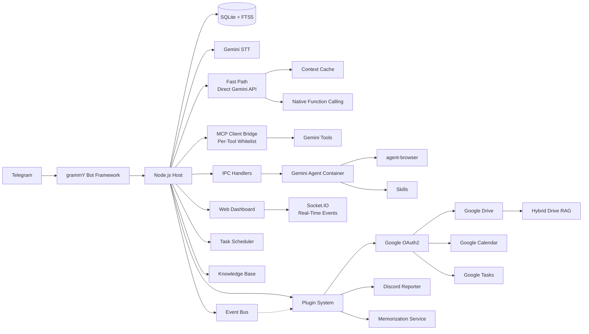

<p align="center">
  
</p>

<p align="center">
  <a href="https://github.com/Rlin1027/NanoGemClaw/blob/main/LICENSE"></a>
  <a href="https://nodejs.org/">=20"></a>
  <a href="https://github.com/Rlin1027/NanoGemClaw"></a>
</p>

<p align="center">
  Личный ИИ-помощник на основе <strong>Gemini</strong> с глубокой интеграцией <strong>экосистемы Google</strong>. Безопасно работает в контейнерах. Лёгкий и разработан для понимания, настройки и расширения.
</p>

<p align="center">
  <em>Форк <a href="https://github.com/gavrielc/nanoclaw">NanoClaw</a> — заменён Claude Agent SDK на Gemini и WhatsApp на Telegram</em>
</p>

<p align="center">
  <a href="README.md">English</a> |
  <a href="README.zh-TW.md">繁體中文</a> |
  <a href="README.zh-CN.md">简体中文</a> |
  <a href="README.es.md">Español</a> |
  <a href="README.ja.md">日本語</a> |
  <a href="README.ko.md">한국어</a> |
  <a href="README.pt.md">Português</a> |
  <strong>Русский</strong>
</p>

---

## Почему NanoGemClaw?

**NanoGemClaw** — это лёгкий, безопасный и расширяемый ИИ-помощник, работающий с **Gemini** в изолированных контейнерах, доставляемый через Telegram с интеллектуальной маршрутизацией быстрого пути, встроенным вызовом функций и глубокой интеграцией экосистемы Google.

| Функция              | NanoClaw             | NanoGemClaw                                                           |
| -------------------- | -------------------- | --------------------------------------------------------------------- |
| **Agent Runtime**    | Claude Agent SDK     | Gemini + MCP Client Bridge с белым списком инструментов               |
| **Bot Framework**    | node-telegram-bot-api| grammY (типобезопасный, управляемый событиями)                        |
| **Обмен сообщениями**| WhatsApp (Baileys)   | Telegram Bot API                                                      |
| **Стоимость**        | Claude Max ($100/мес)| Бесплатный уровень (60 запр/мин)                                      |
| **Архитектура**      | Монолит              | Модульный монорепо (7 workspace-пакетов + app + 7 плагинов)          |
| **Расширяемость**    | Встроена в код       | Система плагинов с хуками жизненного цикла                           |
| **Google Ecosystem** | -                    | Drive, Calendar, Tasks, Knowledge RAG                                 |
| **Уведомления**      | -                    | Ежедневные/еженедельные отчёты Discord                               |
| **Поддержка медиа**  | Только текст         | Фото, Голос (быстрый путь), Аудио, Видео, Документы                 |
| **Веб-просмотр**     | Только поиск         | Полный `agent-browser` (Playwright)                                   |
| **База знаний**      | -                    | FTS5 полнотекстовый поиск на группу                                   |
| **Планирование**     | -                    | Естественный язык + cron, iCal календарь                              |
| **Dashboard**        | -                    | 12-модульное управление в реальном времени SPA                        |
| **Продвинутые инструменты** | -            | STT, Image Gen, Personas, Skills, Multi-model                         |
| **Быстрый путь**     | -                    | Интеллектуальная маршрутизация с кэшированием контекста (75–90% экономии токенов) |

---

## Ключевые возможности

- **Модульный монорепо** — 7 npm workspace-пакетов плюс входной слой `app/`. Можно переиспользовать отдельные пакеты или развернуть полный стек.
- **Фреймворк grammY Bot** — Миграция с node-telegram-bot-api на grammY для типобезопасной, управляемой событиями интеграции Telegram с ограничением скорости и консолидацией сообщений.
- **MCP Client Bridge** — Белый список инструментов на инструмент для Model Context Protocol с единой валидацией Zod схемы для всех входов инструментов.
- **Умная маршрутизация сообщений** — `preferredPath` интеллектуальная маршрутизация выбирает между быстрым путём (прямой Gemini API) и выполнением контейнера на основе типа запроса с плавной переходом на резервное.
- **Система плагинов** — Расширяйте пользовательскими инструментами Gemini, хуками сообщений, маршрутами API, фоновыми сервисами, обработчиками IPC и расширениями dashboard без изменения основного кода.
- **Multi-modal I/O** — Отправляйте фотографии, голосовые сообщения, видео или документы. Gemini обрабатывает их встроенно.
- **Быстрый путь (Direct API)** — Простые текстовые запросы обходят запуск контейнера, потоковые ответы в реальном времени через SDK `@google/genai` с встроенным вызовом функций. Голосовые сообщения автоматически транскрибируются и используют быстрый путь. Переход на контейнеры для выполнения кода.
- **Context Caching** — Статическое содержимое кэшируется через API кэширования Gemini, снижая затраты входных токенов на 75–90%.
- **Встроенный вызов функций** — Операции инструментов используют встроенный вызов функций Gemini с контролем разрешений на инструмент (main/any), заменяя опрос на основе файлов IPC.
- **Speech-to-Text** — Голосовые сообщения автоматически транскрибируются с использованием мультимодального Gemini (по умолчанию, FFmpeg не требуется) или Google Cloud Speech.
- **Image Generation** — Создавайте изображения с использованием **Imagen 3** через естественный язык.
- **Browser Automation** — Агенты используют `agent-browser` (Playwright) для сложных веб-задач.
- **База знаний** — Хранилище документов на группу с полнотекстовым поиском SQLite FTS5 и сканированием инъекций для безопасности.
- **Hybrid Drive RAG** — Двухслойное получение: предварительно индексированные embeddings через физический подход к файлам для мгновенного поиска + живой поиск Drive для более широкого охвата. Поделитесь той же папкой знаний с NotebookLM.
- **Temporal Memory Compaction** — Трёхслойная память short/medium/long с Gemini-powered compaction, regex-based fact extraction и управлением context budget через scheduler.
- **Запланированные задачи** — Естественное языковое планирование («каждый день в 8 утра») с поддержкой cron, interval и one-time.
- **Google Calendar (Read/Write)** — Создавайте, обновляйте, удаляйте события и проверяйте доступность через Google Calendar API. Переход на резервное iCal для доступа только для чтения.
- **Google Tasks** — Полные операции CRUD с двусторонней синхронизацией между запланированными задачами NanoGemClaw и Google Tasks.
- **Google Drive** — Ищите файлы, читайте содержимое и резюмируйте документы. Поддерживает Docs, Sheets, PDF и простой текст.
- **Discord Reports** — Автоматизированные ежедневные и еженедельные отчёты о прогрессе, переданные в Discord через webhooks, с цветными эмбедами и ссылками на dashboard.
- **Skills System** — Назначьте файлы навыков на основе Markdown группам для специализированных возможностей с защитой от инъекций.
- **Personas** — Предопределённые личности или создавайте пользовательские персоны на группу.
- **Multi-model Support** — Выбирайте модель Gemini на группу (`gemini-3-flash-preview`, `gemini-3-pro-preview` и т. д.).
- **Container Isolation** — Каждая группа работает в своей собственной песочнице (Apple Container или Docker) с ограничениями по времени ожидания и размеру вывода.
- **Web Dashboard** — 12-модульный центр управления в реальном времени с потоковой передачей логов, редактором памяти, аналитикой, управлением учётной записью Google, браузером Drive, параметрами Discord и управлением MCP.
- **i18n (100% Coverage)** — Полная поддержка интерфейса для 8 языков: английский, традиционный китайский, упрощённый китайский, японский, корейский, испанский, португальский и русский.
- **Test Coverage** — Широкое покрытие Vitest для unit и integration тестов fast path, hybrid RAG, scheduling и temporal memory сценариев.

## Последние изменения

- **2026-03-16** — Добавлено ядро Intelligence Layer: трёхслойная temporal memory, Gemini-powered compaction, fact extraction и управление context budget через scheduler.
- **2026-03-11** — Добавлен hybrid Drive RAG: query rewriting, усиленный embedding search, similarity thresholds и покрытие integration-тестами.

---

## Архитектура Монорепо

```
nanogemclaw/
├── packages/
│   ├── core/          # @nanogemclaw/core      — типы, конфиг, logger, утилиты
│   ├── db/            # @nanogemclaw/db        — SQLite сохранение (better-sqlite3)
│   ├── gemini/        # @nanogemclaw/gemini    — Gemini API клиент, кэш контекста, MCP инструменты
│   ├── telegram/      # @nanogemclaw/telegram  — grammY bot помощники, rate limiter, consolidator
│   ├── plugin-api/    # @nanogemclaw/plugin-api — Plugin интерфейс & типы жизненного цикла
│   ├── event-bus/     # @nanogemclaw/event-bus  — Типизированная система pub/sub событий
│   └── dashboard/     # React + Vite frontend SPA (приватный)
├── plugins/
│   ├── google-auth/          # OAuth2 управление токенами & auto-refresh
│   ├── google-drive/         # Drive поиск файлов, чтение & резюмирование
│   ├── google-tasks/         # Tasks CRUD с двусторонней синхронизацией
│   ├── google-calendar-rw/   # Calendar read/write (обновление от iCal)
│   ├── drive-knowledge-rag/  # Двухслойное RAG (embeddings + живой поиск)
│   ├── discord-reporter/    # Ежедневные & еженедельные Discord embed отчёты
│   └── memorization-service/ # Автоматическое резюмирование разговоров
├── app/               # Application entry point — подключает все пакеты вместе
├── src/               # Application модули (обработчик сообщений, bot, scheduler и т. д.)
├── examples/
│   └── plugin-skeleton/  # Минимальный пример плагина
├── container/         # Agent контейнер (Gemini CLI + инструменты)
└── docs/              # Документация & руководства
```

### Обзор пакетов

| Package                   | Описание                                              | Значение переиспользования |
| ------------------------- | -------------------------------------------------------- | ----------- |
| `@nanogemclaw/core`       | Общие типы, фабрика конфига, logger, утилиты          | Medium      |
| `@nanogemclaw/db`         | Слой базы данных SQLite с поиском FTS5                   | Medium      |
| `@nanogemclaw/gemini`     | Gemini API клиент, кэширование контекста, вызов функций MCP | **High**    |
| `@nanogemclaw/telegram`   | grammY bot помощники, rate limiter, consolidator сообщений   | Medium      |
| `@nanogemclaw/plugin-api` | Определения интерфейса плагина и типы жизненного цикла         | **High**    |
| `@nanogemclaw/event-bus`  | Типизированная система pub/sub событий для связи между плагинами | Medium      |

---

## Быстрый старт

### Предварительные требования

| Инструмент          | Назначение                | Установка                        |
| --------------- | ---------------------- | ----------------------------------- |
| **Node.js 20+** | Runtime                | [nodejs.org](https://nodejs.org)    |
| **Gemini CLI**  | AI Agent               | `npm install -g @google/gemini-cli` |
| **FFmpeg**      | GCP STT только (опционально) | `brew install ffmpeg`               |

### 1. Клонирование & Установка

```bash
git clone https://github.com/Rlin1027/NanoGemClaw.git
cd NanoGemClaw
npm install
```

### 2. Конфигурация

```bash
cp .env.example .env
```

Отредактируйте `.env` и заполните:

- `TELEGRAM_BOT_TOKEN` — Получите от [@BotFather](https://t.me/BotFather) на Telegram
- `GEMINI_API_KEY` — Получите с [Google AI Studio](https://aistudio.google.com/)

Опционально скопируйте файл конфига для автодополнения TypeScript:

```bash
cp nanogemclaw.config.example.ts nanogemclaw.config.ts
```

### 3. Сборка Dashboard

```bash
cd packages/dashboard && npm install && cd ../..
npm run build:dashboard
```

### 4. Сборка Agent контейнера

```bash
# macOS с Apple Container: сначала запустите системный сервис
container system start

bash container/build.sh
```

> Если используете Docker вместо Apple Container, пропустите `container system start`.

### 5. Запуск

```bash
npm run dev
```

Backend API запускается на `http://localhost:3000`. Для доступа к Web Dashboard во время разработки запустите frontend dev сервер в отдельном терминале:

```bash
cd packages/dashboard
npm run dev                # Dashboard на http://localhost:5173 (проксирует /api → :3000)
```

> В production (`npm start`) dashboard встроен и обслуживается прямо на `http://localhost:3000`.

Подробное пошаговое руководство см. в [docs/GUIDE.md](docs/GUIDE.md).

---

## Система плагинов

NanoGemClaw поддерживает плагины, расширяющие функциональность без изменения основного кода. Плагины могут предоставить:

- **Gemini Tools** — Пользовательские инструменты вызова функций с уровнями разрешений (main/any) и белым списком на инструмент
- **Message Hooks** — Перехватывайте сообщения до/после обработки с сканированием инъекций
- **API Routes** — Пользовательские конечные точки dashboard API
- **Background Services** — Долгоживущие фоновые задачи
- **IPC Handlers** — Пользовательские обработчики inter-process communication
- **Dashboard Extensions** — Пользовательские компоненты UI для web dashboard

### Написание плагина

1. Скопируйте `examples/plugin-skeleton/` в новую директорию.
2. Реализуйте интерфейс `NanoPlugin`:

```typescript
import type {
  NanoPlugin,
  PluginApi,
  GeminiToolContribution,
} from '@nanogemclaw/plugin-api';

const myPlugin: NanoPlugin = {
  id: 'my-plugin',
  name: 'My Plugin',
  version: '1.0.0',

  async init(api: PluginApi) {
    api.logger.info('Plugin initialized');
  },

  geminiTools: [
    {
      name: 'my_tool',
      description: 'Does something useful',
      parameters: {
        type: 'OBJECT',
        properties: {
          input: { type: 'STRING', description: 'The input value' },
        },
        required: ['input'],
      },
      permission: 'any',
      async execute(args) {
        return JSON.stringify({ result: `Processed: ${args.input}` });
      },
    },
  ],

  hooks: {
    async afterMessage(context) {
      // Log every message for analytics
    },
  },
};

export default myPlugin;
```

1. Зарегистрируйте в `data/plugins.json`:

```json
{
  "plugins": [
    {
      "source": "./path/to/my-plugin/src/index.ts",
      "config": { "myOption": "value" },
      "enabled": true
    }
  ]
}
```

Полный задокументированный пример см. в `examples/plugin-skeleton/src/index.ts`, а полное руководство по разработке плагинов см. в [docs/GUIDE.md](docs/GUIDE.md).

### Встроенные плагины

NanoGemClaw поставляется с 7 встроенными плагинами в директории `plugins/`:

| Plugin                      | Описание                                                 | Gemini Tools | Background Service |
| --------------------------- | ----------------------------------------------------------- | :----------: | :----------------: |
| **google-auth**             | OAuth2 ядро — управление токенами, auto-refresh, CLI auth flow |              |                    |
| **google-drive**            | Поиск, чтение и резюмирование файлов Drive (Docs, Sheets, PDF) |      3       |                    |
| **google-tasks**            | Google Tasks CRUD с двусторонней синхронизацией                   |      3       |    15-мин синхр    |
| **google-calendar-rw**      | Полный Calendar API — создание, обновление, удаление событий           |      5       |                    |
| **drive-knowledge-rag**     | Двухслойное RAG: предварительно индексированные embeddings + живой Drive поиск   |      1       |   30-мин индексер  |
| **discord-reporter**        | Ежедневные и еженедельные отчёты прогресса через Discord webhooks      |              |   Cron планировщик |
| **memorization-service**    | Автоматическое резюмирование разговоров через Event Bus          |              |  Event-driven      |

Все плагины Google зависят от **google-auth** для OAuth2 токенов. Запустите поток авторизации один раз со страницы Dashboard Settings.

---

## Переменные окружения

### Требуется

| Переменная             | Описание               |
| -------------------- | ------------------------- |
| `TELEGRAM_BOT_TOKEN` | Bot токен от @BotFather |

### Опционально - AI & Media

| Переменная         | По умолчанию                  | Описание                                     |
| ---------------- | ------------------------ | ----------------------------------------------- |
| `GEMINI_API_KEY` | -                        | API ключ (требуется для генерации изображений и быстрого пути)  |
| `GEMINI_MODEL`   | `gemini-3-flash-preview` | Модель Gemini по умолчанию для всех групп             |
| `ASSISTANT_NAME` | `Andy`                   | Имя триггера Bot (используется для упоминаний `@Andy`)    |
| `STT_PROVIDER`   | `gemini`                 | Speech-to-text: `gemini` (бесплатно) или `gcp` (платно) |

### Опционально - Dashboard & Security

| Переменная                | По умолчанию | Описание                             |
| ----------------------- | ----------- | --------------------------------------- |
| `DASHBOARD_HOST`        | `127.0.0.1` | Bind адрес (`0.0.0.0` для доступа LAN) |
| `DASHBOARD_API_KEY`     | -           | API ключ для защиты доступа к dashboard     |
| `DASHBOARD_ACCESS_CODE` | -           | Код доступа для экрана входа dashboard  |
| `DASHBOARD_ORIGINS`     | auto        | Comma-separated разрешённые CORS origins    |

### Опционально - Быстрый путь

| Переменная               | По умолчанию  | Описание                               |
| ---------------------- | -------- | ----------------------------------------- |
| `FAST_PATH_ENABLED`    | `true`   | Включить прямой Gemini API для текстовых запросов |
| `FAST_PATH_TIMEOUT_MS` | `180000` | API timeout (мс)                          |
| `CACHE_TTL_SECONDS`    | `21600`  | Context cache TTL (6 часов)               |
| `MIN_CACHE_CHARS`      | `100000` | Min длина контента для кэширования            |

### Опционально - Google Ecosystem (Плагины)

| Переменная                     | По умолчанию     | Описание                                      |
| ---------------------------- | ----------- | ------------------------------------------------ |
| `GOOGLE_CLIENT_ID`           | -           | OAuth2 client ID из Google Cloud Console       |
| `GOOGLE_CLIENT_SECRET`       | -           | OAuth2 client secret                             |
| `DISCORD_WEBHOOK_URL`        | -           | Discord канал webhook URL для отчётов          |

### Опционально - Infrastructure

| Переменная             | По умолчанию                    | Описание                        |
| -------------------- | -------------------------- | ---------------------------------- |
| `CONTAINER_TIMEOUT`  | `300000`                   | Container execution timeout (мс)   |
| `CONTAINER_IMAGE`    | `nanogemclaw-agent:latest` | Имя образа контейнера               |
| `RATE_LIMIT_ENABLED` | `true`                     | Включить rate limiting запросов       |
| `RATE_LIMIT_MAX`     | `20`                       | Max запросов на окно на группу  |
| `RATE_LIMIT_WINDOW`  | `5`                        | Rate limit окно (минут)        |
| `WEBHOOK_URL`        | -                          | External webhook для уведомлений |
| `WEBHOOK_EVENTS`     | `error,alert`              | События, запускающие webhook        |
| `ALERTS_ENABLED`     | `true`                     | Включить оповещения об ошибках в основной группе  |
| `CONTAINER_MAX_OUTPUT_SIZE` | `10485760`          | Max размер вывода контейнера (bytes)  |
| `SCHEDULER_CONCURRENCY` | auto                    | Max concurrent контейнеров планировщика |
| `BACKUP_RETENTION_DAYS` | `7`                     | Дни сохранения резервных копий БД      |
| `HEALTH_CHECK_ENABLED` | `true`                   | Включить health check HTTP сервер    |
| `HEALTH_CHECK_PORT`  | `8080`                     | Порт health check сервера           |
| `TZ`                 | system                     | Timezone для запланированных задач       |
| `LOG_LEVEL`          | `info`                     | Уровень логирования                     |

Полный список см. в [.env.example](.env.example).

---

## Примеры использования

### Обмен сообщениями & Продуктивность

- `@Andy translate this voice message and summarize it`
- `@Andy generate a 16:9 image of a futuristic cyberpunk city`
- `@Andy browse https://news.google.com and give me the top headlines`

### Планирование задач

- `@Andy every morning at 8am, check the weather and suggest what to wear`
- `@Andy monitor my website every 30 minutes and alert me if it goes down`

### База знаний

- Загрузите документы через dashboard, затем спросите: `@Andy search the knowledge base for deployment guide`

### Google Ecosystem

- `@Andy create a meeting with John tomorrow at 3pm`
- `@Andy what's on my calendar this week?`
- `@Andy add a task "Review PR #42" to my Google Tasks`
- `@Andy search my Drive for the Q4 budget spreadsheet`
- `@Andy summarize the project proposal document from Drive`
- `@Andy what do my knowledge docs say about deployment?`

### Administration

Отправляйте эти команды прямо боту:

- `/admin help` - Список всех доступных admin команд
- `/admin stats` - Показать uptime, использование памяти и статистику токенов
- `/admin groups` - Список всех зарегистрированных групп с статусом
- `/admin tasks` - Список всех запланированных задач
- `/admin errors` - Показать группы с недавними ошибками
- `/admin report` - Генерировать ежедневный отчёт об использовании
- `/admin language <lang>` - Переключить язык интерфейса бота
- `/admin persona <name|list|set>` - Управление personas бота
- `/admin trigger <group> <on|off>` - Переключить требование триггера @mention
- `/admin export <group>` - Экспортировать историю разговоров как Markdown

---

## Архитектура


```mermaid
graph LR
    TG[Telegram] --> GramMY[grammY Bot Framework]
    GramMY --> Bot[Node.js Host]
    Bot --> DB[(SQLite + FTS5)]
    Bot --> STT[Gemini STT]
    Bot --> FP[Fast Path<br/>Direct Gemini API]
    FP --> Cache[Context Cache]
    FP --> FC[Native Function Calling]
    Bot --> MCP[MCP Client Bridge<br/>Per-Tool Whitelist]
    MCP --> Tools[Gemini Tools]
    Bot --> IPC[IPC Handlers]
    IPC --> Container[Gemini Agent Container]
    Container --> Browser[agent-browser]
    Container --> Skills[Skills]
    Bot --> Dashboard[Web Dashboard]
    Dashboard --> WS[Socket.IO<br/>Real-Time Events]
    Bot --> Scheduler[Task Scheduler]
    Bot --> Knowledge[Knowledge Base]
    Bot --> Plugins[Plugin System]
    Plugins --> GAuth[Google OAuth2]
    GAuth --> GDrive[Google Drive]
    GAuth --> GCal[Google Calendar]
    GAuth --> GTasks[Google Tasks]
    GDrive --> RAG[Hybrid Drive RAG]
    Plugins --> Discord[Discord Reporter]
    Plugins --> Memo[Memorization Service]
    Bot --> EB[Event Bus]
    EB -.-> Plugins
```

### Backend пакеты

| Package                   | Ключевые модули                                                                                  |
| ------------------------- | -------------------------------------------------------------------------------------------- |
| `@nanogemclaw/core`       | `config.ts`, `types.ts`, `logger.ts`, `utils.ts`, `safe-compare.ts`                          |
| `@nanogemclaw/db`         | `connection.ts`, `messages.ts`, `tasks.ts`, `stats.ts`, `preferences.ts`                     |
| `@nanogemclaw/gemini`     | `gemini-client.ts`, `context-cache.ts`, `mcp-client-bridge.ts`, `gemini-tools.ts`           |
| `@nanogemclaw/telegram`   | `grammY-helpers.ts`, `telegram-rate-limiter.ts`, `message-consolidator.ts`                   |
| `@nanogemclaw/plugin-api` | `NanoPlugin`, `PluginApi`, `GeminiToolContribution`, `HookContributions`                     |
| `@nanogemclaw/event-bus`  | `EventBus`, `NanoEventMap`, типизированный pub/sub singleton                                          |

### Слой приложения (`src/`)

| Module                | Назначение                                                  |
| --------------------- | -------------------------------------------------------- |
| `index.ts`            | Telegram bot entry, управление состоянием, dispatch IPC       |
| `message-handler.ts`  | Обработка сообщений, маршрутизация быстрого пути, multi-modal ввод |
| `fast-path.ts`        | Прямое выполнение Gemini API со streaming и кэшированием   |
| `container-runner.ts` | Container жизненный цикл и потоковый вывод                 |
| `task-scheduler.ts`   | Выполнение задач Cron/interval/one-time                    |
| `knowledge.ts`        | FTS5 движок базы знаний с сканированием инъекций       |
| `personas.ts`         | Определения persona и управление пользовательскими persona        |
| `natural-schedule.ts` | Парсер естественного языка в cron (EN/ZH)                  |

### Frontend (`packages/dashboard/`)

React + Vite + TailwindCSS SPA с 12 модулями:

| Page                | Описание                                                                     |
| ------------------- | ------------------------------------------------------------------------------- |
| **Overview**        | Карточки статуса группы с активностью агента в реальном времени                                |
| **Logs**            | Универсальный поток логов с фильтрацией уровня                                       |
| **Activity Logs**   | История активности на группу и временная шкала событий                                   |
| **Memory Studio**   | Monaco редактор для системных подсказок и резюме разговоров                     |
| **Group Detail**    | Параметры на группу: persona, модель, триггер, переключение веб-поиска                  |
| **Tasks**           | CRUD запланированных задач с историей выполнения                                      |
| **Schedule**        | Визуальный обзор расписания и временная шкала задач                                      |
| **Analytics**       | Диаграммы использования, логи контейнера, статистика сообщений                                |
| **Knowledge**       | Загрузка документов, FTS5 поиск, управление документами на группу                     |
| **Drive**           | Браузер файлов Google Drive и просмотр документов                                   |
| **Calendar**        | Подписка на iCal feed и просмотр предстоящих событий                                |
| **Settings**        | Режим обслуживания, отладочное логирование, статус secrets, учётная запись Google, конфиг Discord, управление MCP |

### Persistence

- **SQLite** (`store/messages.db`): Сообщения, задачи, статистика, предпочтения, база знаний (FTS5)
- **JSON** (`data/`): Сессии, зарегистрированные группы, пользовательские personas, конфиги календаря, навыки групп
- **Filesystem** (`groups/`): Рабочее пространство на группу (GEMINI.md, логи, медиа, IPC)
- **Backups** (`store/backups/`): Автоматические ежедневные резервные копии SQLite с настраиваемым сохранением (`BACKUP_RETENTION_DAYS`)

### Health Check

Лёгкий HTTP сервер работает на порте `HEALTH_CHECK_PORT` (по умолчанию 8080) с:

- `GET /health` — Статус здоровья системы (healthy/degraded/unhealthy)
- `GET /ready` — Readiness probe для оркестраторов
- `GET /metrics` — Метрики в формате Prometheus

Отключите с `HEALTH_CHECK_ENABLED=false`.

---

## Web Dashboard

### Разработка

```bash
# Terminal 1: Запуск backend
npm run dev

# Terminal 2: Запуск frontend dashboard
cd packages/dashboard
npm run dev                # http://localhost:5173 (проксирует /api → :3000)
```

### Production

```bash
npm run build:dashboard    # Сборка frontend
npm run build              # Сборка backend
npm start                  # Обслуживает всё на http://localhost:3000
```

```bash
# LAN доступ
DASHBOARD_HOST=0.0.0.0 npm start
```

Поддерживает оверлей глобального поиска `Cmd+K` / `Ctrl+K`.

---

## Разработка

```bash
npm run dev               # Запуск с tsx (горячая перезагрузка)
npm run typecheck         # TypeScript проверка типов (backend)
npm test                  # Запуск всех тестов (Vitest unit + integration suites)
npm run test:watch        # Watch режим
npm run test:coverage     # Отчёт о покрытии
npm run format:check      # Prettier проверка
```

Разработка dashboard:

```bash
cd packages/dashboard
npm run dev               # Vite dev сервер (порт 5173, проксирует /api -> :3000)
npx tsc --noEmit          # Проверка типов frontend
```

---

## Troubleshooting

- **Bot не отвечает?** Проверьте логи `npm run dev` и убедитесь, что bot является Admin в группе.
- **STT не работает?** Поставщик по умолчанию (`gemini`) не требует дополнительных зависимостей. Если используете `STT_PROVIDER=gcp`, убедитесь, что FFmpeg установлен (`brew install ffmpeg`).
- **Медиа не обрабатывается?** Проверьте, что `GEMINI_API_KEY` установлен в `.env`.
- **Проблемы контейнера?** Запустите `bash container/build.sh` для перестройки образа.
- **Dashboard пустая страница?** Запустите `cd packages/dashboard && npm install` перед сборкой.
- **CORS ошибки?** Проверьте переменную окружения `DASHBOARD_ORIGINS`.
- **Container EROFS ошибка?** Apple Container не поддерживает вложенные перекрывающиеся bind mount'ы.
- **Container XPC ошибка?** Сначала запустите `container system start`. Системный сервис Apple Container должен работать перед сборками.
- **`Cannot GET /` на localhost:3000?** В режиме разработки порт 3000 только для API. Запустите dashboard отдельно: `cd packages/dashboard && npm run dev` (обслуживает на порту 5173).
- **Быстрый путь не работает?** Убедитесь, что `GEMINI_API_KEY` установлен. Проверьте `FAST_PATH_ENABLED=true`. Параметр на группу в dashboard может переопределить глобально.
- **Rate limited?** Отрегулируйте `RATE_LIMIT_MAX` и `RATE_LIMIT_WINDOW` в `.env`.
- **Google OAuth не работает?** Убедитесь, что `GOOGLE_CLIENT_ID` и `GOOGLE_CLIENT_SECRET` установлены. Используйте тип "Desktop App" в Google Cloud Console.
- **Drive/Calendar/Tasks не отвечают?** Сначала завершите OAuth поток из Dashboard Settings → Google Account.
- **Discord отчёты не отправляются?** Проверьте, что `DISCORD_WEBHOOK_URL` валидный. Тестируйте с кнопкой "Send Test" в Dashboard Settings.
- **MCP инструменты не выполняются?** Проверьте белый список инструментов на инструмент в Dashboard Settings → MCP. Проверьте уровень разрешений инструмента (main vs any).
- **Голосовые сообщения не используют быстрый путь?** Убедитесь, что STT успешно завершается. Проверьте логи на ошибки транскрипции.

---

## Лицензия

MIT

## Кредиты

- Оригинальный [NanoClaw](https://github.com/gavrielc/nanoclaw) от [@gavrielc](https://github.com/gavrielc)
- Powered by [Gemini](https://ai.google.dev/)
