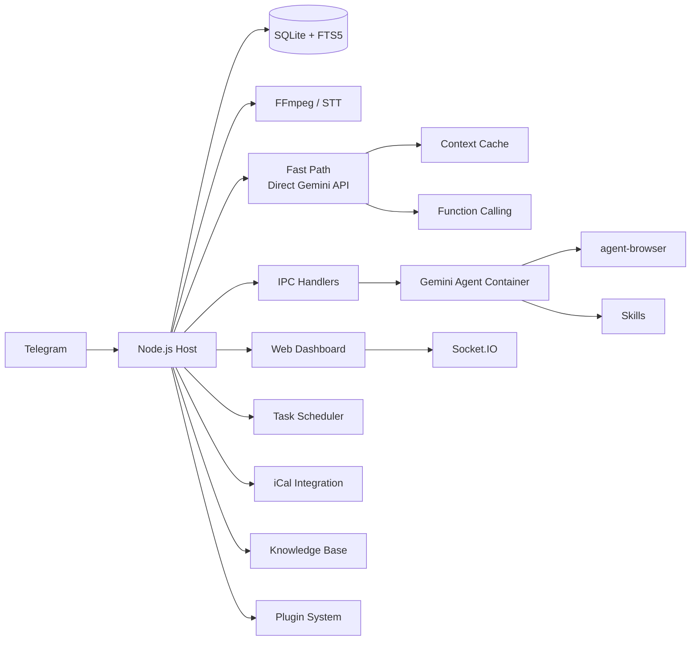

<p align="center">
  
</p>

<p align="center">
  由 <strong>Gemini</strong> 驱动的个人 AI 助手。在容器中安全运行。轻量级，易于理解、定制和扩展。
</p>

<p align="center">
  <em>派生自 <a href="https://github.com/gavrielc/nanoclaw">NanoClaw</a> — 将 Claude Agent SDK 替换为 Gemini，将 WhatsApp 替换为 Telegram</em>
</p>

<p align="center">
  <a href="README.md">English</a> |
  <a href="README.zh-TW.md">繁體中文</a> |
  <strong>简体中文</strong> |
  <a href="README.es.md">Español</a> |
  <a href="README.ja.md">日本語</a> |
  <a href="README.ko.md">한국어</a> |
  <a href="README.pt.md">Português</a> |
  <a href="README.ru.md">Русский</a>
</p>

---

## 为什么选择 NanoGemClaw？

**NanoGemClaw** 是一款轻量、安全、可扩展的 AI 助手，在隔离容器中运行 **Gemini**，通过 Telegram 交付。

| 特性 | NanoClaw | NanoGemClaw |
|------|----------|-------------|
| **Agent 运行时** | Claude Agent SDK | Gemini CLI + Direct API |
| **消息平台** | WhatsApp (Baileys) | Telegram Bot API |
| **费用** | Claude Max（$100/月） | 免费额度（60 请求/分钟） |
| **架构** | 单体 | 模块化 monorepo（7 个包） |
| **可扩展性** | 硬编码 | 带生命周期钩子的插件系统 |
| **媒体支持** | 仅文本 | 照片、语音、音频、视频、文档 |
| **网页浏览** | 仅搜索 | 完整 `agent-browser`（Playwright） |
| **知识库** | - | 每个群组独立的 FTS5 全文搜索 |
| **定时任务** | - | 自然语言 + cron、iCal 日历 |
| **控制面板** | - | 9 模块实时管理 SPA |
| **高级工具** | - | STT、图像生成、人格、技能、多模型 |
| **快速通道** | - | 直接 Gemini API 流式传输、上下文缓存、原生函数调用 |

---

## 核心功能

- **模块化 Monorepo** — 7 个 npm workspace 包。可在自己的项目中单独使用各个包，也可部署完整技术栈。
- **插件系统** — 通过自定义 Gemini 工具、消息钩子、API 路由和后台服务进行扩展，无需修改核心代码。
- **多模态输入输出** — 发送照片、语音消息、视频或文档，Gemini 原生处理。
- **快速通道（Direct API）** — 简单文本查询绕过容器启动，通过 `@google/genai` SDK 实时流式返回响应。代码执行时回退到容器模式。
- **上下文缓存** — 静态内容通过 Gemini 缓存 API 缓存，将输入 token 成本降低 75-90%。
- **原生函数调用** — 工具操作使用 Gemini 原生函数调用，而非基于文件的 IPC 轮询。
- **语音转文字** — 语音消息自动转录（Gemini 多模态或 Google Cloud Speech）。
- **图像生成** — 通过自然语言使用 **Imagen 3** 创建图像。
- **浏览器自动化** — Agent 使用 `agent-browser` 执行复杂的网页任务。
- **知识库** — 每个群组独立的文档存储，支持 SQLite FTS5 全文搜索。
- **定时任务** — 自然语言排期（"每天早上 8 点"），支持 cron、间隔和一次性任务。
- **日历集成** — 订阅 iCal 源并查询即将到来的日程。
- **技能系统** — 为群组分配基于 Markdown 的技能文件以获得专项能力。
- **人格** — 使用预定义人格，或为每个群组创建自定义人格。
- **多模型支持** — 按群组选择 Gemini 模型（`gemini-3-flash-preview`、`gemini-3-pro-preview` 等）。
- **容器隔离** — 每个群组在独立沙盒中运行（Apple Container 或 Docker）。
- **Web 控制面板** — 9 模块实时指挥中心，包含日志流、内存编辑器、数据分析等功能。
- **国际化** — 完整支持英语、中文、日语和西班牙语界面。

---

## Monorepo 架构

```
nanogemclaw/
├── packages/
│   ├── core/          # @nanogemclaw/core      — 类型、配置、日志、工具函数
│   ├── db/            # @nanogemclaw/db        — SQLite 持久化（better-sqlite3）
│   ├── gemini/        # @nanogemclaw/gemini    — Gemini API 客户端、上下文缓存、工具
│   ├── telegram/      # @nanogemclaw/telegram  — Bot 辅助工具、速率限制器、消息合并器
│   ├── server/        # @nanogemclaw/server    — Express + Socket.IO 控制面板 API
│   ├── plugin-api/    # @nanogemclaw/plugin-api — 插件接口与生命周期类型
│   └── dashboard/     # React + Vite 前端 SPA（私有）
├── app/               # 应用入口 — 将所有包连接在一起
├── src/               # 应用模块（消息处理器、Bot、调度器等）
├── examples/
│   └── plugin-skeleton/  # 最小化插件示例
├── container/         # Agent 容器（Gemini CLI + 工具）
└── docs/              # 文档与指南
```

### 包概览

| 包 | 描述 | 复用价值 |
|----|------|---------|
| `@nanogemclaw/core` | 共享类型、配置工厂、日志、工具函数 | 中 |
| `@nanogemclaw/db` | 带 FTS5 搜索的 SQLite 数据库层 | 中 |
| `@nanogemclaw/gemini` | Gemini API 客户端、上下文缓存、函数调用 | **高** |
| `@nanogemclaw/telegram` | Telegram Bot 辅助工具、速率限制器、消息合并器 | 中 |
| `@nanogemclaw/server` | Express 控制面板服务器 + Socket.IO 实时事件 | 中 |
| `@nanogemclaw/plugin-api` | 插件接口定义与生命周期类型 | **高** |

---

## 快速开始

### 前置条件

| 工具 | 用途 | 安装方式 |
|------|------|---------|
| **Node.js 20+** | 运行时 | [nodejs.org](https://nodejs.org) |
| **Gemini CLI** | AI Agent | `npm install -g @google/gemini-cli` |
| **FFmpeg** | 音频处理（STT） | `brew install ffmpeg` |

### 1. 克隆并安装

```bash
git clone https://github.com/Rlin1027/NanoGemClaw.git
cd NanoGemClaw
npm install
```

### 2. 配置

```bash
cp .env.example .env
```

编辑 `.env` 并填写：

- `TELEGRAM_BOT_TOKEN` — 在 Telegram 上从 [@BotFather](https://t.me/BotFather) 获取
- `GEMINI_API_KEY` — 从 [Google AI Studio](https://aistudio.google.com/) 获取

可选：复制配置文件以获得 TypeScript 自动补全：

```bash
cp nanogemclaw.config.example.ts nanogemclaw.config.ts
```

### 3. 构建控制面板

```bash
cd packages/dashboard && npm install && cd ../..
npm run build:dashboard
```

### 4. 构建 Agent 容器

```bash
bash container/build.sh
```

### 5. 启动

```bash
npm run dev
```

打开 `http://localhost:3000` 访问 Web 控制面板。

> 详细的分步骤指南请参阅 [docs/GUIDE.md](docs/GUIDE.md)。

---

## 插件系统

NanoGemClaw 支持在不修改核心代码的情况下扩展功能的插件。插件可以提供：

- **Gemini 工具** — AI 可用的自定义函数调用工具
- **消息钩子** — 在处理前/后拦截消息
- **API 路由** — 自定义控制面板 API 端点
- **后台服务** — 长期运行的后台任务
- **IPC 处理器** — 自定义进程间通信处理器

### 编写插件

1. 将 `examples/plugin-skeleton/` 复制到新目录。
2. 实现 `NanoPlugin` 接口：

```typescript
import type { NanoPlugin, PluginApi, GeminiToolContribution } from '@nanogemclaw/plugin-api';

const myPlugin: NanoPlugin = {
  id: 'my-plugin',
  name: 'My Plugin',
  version: '1.0.0',

  async init(api: PluginApi) {
    api.logger.info('Plugin initialized');
  },

  geminiTools: [
    {
      name: 'my_tool',
      description: 'Does something useful',
      parameters: {
        type: 'OBJECT',
        properties: {
          input: { type: 'STRING', description: 'The input value' },
        },
        required: ['input'],
      },
      permission: 'any',
      async execute(args) {
        return JSON.stringify({ result: `Processed: ${args.input}` });
      },
    },
  ],

  hooks: {
    async afterMessage(context) {
      // 记录每条消息用于数据分析
    },
  },
};

export default myPlugin;
```

1. 在 `data/plugins.json` 中注册：

```json
{
  "plugins": [
    {
      "source": "./path/to/my-plugin/src/index.ts",
      "config": { "myOption": "value" },
      "enabled": true
    }
  ]
}
```

完整文档示例请参阅 `examples/plugin-skeleton/src/index.ts`，插件开发完整指南请参阅 [docs/GUIDE.md](docs/GUIDE.md)。

---

## 环境变量

### 必填

| 变量 | 描述 |
|------|------|
| `TELEGRAM_BOT_TOKEN` | 从 @BotFather 获取的 Bot token |

### 可选 — AI 与媒体

| 变量 | 默认值 | 描述 |
|------|--------|------|
| `GEMINI_API_KEY` | - | API 密钥（图像生成和快速通道必填） |
| `GEMINI_MODEL` | `gemini-3-flash-preview` | 所有群组的默认 Gemini 模型 |
| `ASSISTANT_NAME` | `Andy` | Bot 触发名称（用于 `@Andy` 提及） |
| `STT_PROVIDER` | `gemini` | 语音转文字：`gemini`（免费）或 `gcp`（付费） |

### 可选 — 控制面板与安全

| 变量 | 默认值 | 描述 |
|------|--------|------|
| `DASHBOARD_HOST` | `127.0.0.1` | 绑定地址（`0.0.0.0` 用于局域网访问） |
| `DASHBOARD_API_KEY` | - | 保护控制面板访问的 API 密钥 |
| `DASHBOARD_ACCESS_CODE` | - | 控制面板登录界面的访问码 |
| `DASHBOARD_ORIGINS` | 自动 | 逗号分隔的允许 CORS 来源 |

### 可选 — 快速通道

| 变量 | 默认值 | 描述 |
|------|--------|------|
| `FAST_PATH_ENABLED` | `true` | 为文本查询启用直连 Gemini API |
| `FAST_PATH_TIMEOUT_MS` | `180000` | API 超时时间（毫秒） |
| `CACHE_TTL_SECONDS` | `21600` | 上下文缓存 TTL（6 小时） |
| `MIN_CACHE_CHARS` | `100000` | 触发缓存的最小内容长度 |

### 可选 — 基础设施

| 变量 | 默认值 | 描述 |
|------|--------|------|
| `CONTAINER_TIMEOUT` | `300000` | 容器执行超时时间（毫秒） |
| `CONTAINER_IMAGE` | `nanogemclaw-agent:latest` | 容器镜像名称 |
| `RATE_LIMIT_ENABLED` | `true` | 启用请求速率限制 |
| `RATE_LIMIT_MAX` | `20` | 每个群组每个窗口期的最大请求数 |
| `RATE_LIMIT_WINDOW` | `5` | 速率限制窗口期（分钟） |
| `WEBHOOK_URL` | - | 通知的外部 webhook |
| `TZ` | 系统 | 定时任务的时区 |
| `LOG_LEVEL` | `info` | 日志级别 |

完整列表请参阅 [.env.example](.env.example)。

---

## 使用示例

### 消息与效率

- `@Andy 翻译这条语音消息并总结`
- `@Andy 生成一张 16:9 的赛博朋克城市未来主义图像`
- `@Andy 浏览 https://news.google.com 并给我最新头条`

### 任务调度

- `@Andy 每天早上 8 点查看天气并建议穿什么衣服`
- `@Andy 每 30 分钟监控我的网站，如果宕机就提醒我`

### 知识库

- 通过控制面板上传文档，然后询问：`@Andy 在知识库中搜索部署指南`

### 管理命令

直接向 Bot 发送以下命令：

- `/admin language <lang>` — 切换 Bot 界面语言
- `/admin persona <name>` — 更改 Bot 人格
- `/admin report` — 获取每日活动摘要

---

## 架构



### 后端包

| 包 | 核心模块 |
|----|---------|
| `@nanogemclaw/core` | `config.ts`, `types.ts`, `logger.ts`, `utils.ts`, `safe-compare.ts` |
| `@nanogemclaw/db` | `connection.ts`, `messages.ts`, `tasks.ts`, `stats.ts`, `preferences.ts` |
| `@nanogemclaw/gemini` | `gemini-client.ts`, `context-cache.ts`, `gemini-tools.ts` |
| `@nanogemclaw/telegram` | `telegram-helpers.ts`, `telegram-rate-limiter.ts`, `message-consolidator.ts` |
| `@nanogemclaw/server` | `server.ts`, `routes/`（auth、groups、tasks、knowledge、calendar、skills、config、analytics） |
| `@nanogemclaw/plugin-api` | `NanoPlugin`, `PluginApi`, `GeminiToolContribution`, `HookContributions` |

### 应用层（`src/`）

| 模块 | 用途 |
|------|------|
| `index.ts` | Telegram Bot 入口、状态管理、IPC 分发 |
| `message-handler.ts` | 消息处理、快速通道路由、多模态输入 |
| `fast-path.ts` | 带流式传输的直连 Gemini API 执行 |
| `container-runner.ts` | 容器生命周期与流式输出 |
| `task-scheduler.ts` | Cron/间隔/一次性任务执行 |
| `knowledge.ts` | FTS5 知识库引擎 |
| `personas.ts` | 人格定义与自定义人格管理 |
| `natural-schedule.ts` | 自然语言转 cron 解析器（中英文） |

### 前端（`packages/dashboard/`）

React + Vite + TailwindCSS SPA，包含 9 个模块：

| 页面 | 描述 |
|------|------|
| **Overview** | 带实时 Agent 活动的群组状态卡片 |
| **Logs** | 带级别过滤的通用日志流 |
| **Memory Studio** | 用于系统提示词和对话摘要的 Monaco 编辑器 |
| **Group Detail** | 每个群组的设置：人格、模型、触发词、网页搜索开关 |
| **Tasks** | 带执行历史的定时任务增删改查 |
| **Analytics** | 使用图表、容器日志、消息统计 |
| **Knowledge** | 文档上传、FTS5 搜索、每个群组的文档管理 |
| **Calendar** | iCal 源订阅与即将到来的日程查看器 |
| **Settings** | 维护模式、调试日志、密钥状态、偏好设置 |

### 持久化

- **SQLite**（`store/messages.db`）：消息、任务、统计、偏好设置、知识库（FTS5）
- **JSON**（`data/`）：会话、已注册群组、自定义人格、日历配置、群组技能
- **文件系统**（`groups/`）：每个群组的工作区（GEMINI.md、日志、媒体、IPC）

---

## Web 控制面板

```bash
# 本地访问（默认）
open http://localhost:3000

# 局域网访问
DASHBOARD_HOST=0.0.0.0 npm run dev
```

支持 `Cmd+K` / `Ctrl+K` 全局搜索浮层。

### 生产环境构建

```bash
npm run build:dashboard    # 构建前端
npm run build              # 构建后端
npm start                  # 在 :3000 提供控制面板
```

---

## 开发

```bash
npm run dev               # 使用 tsx 启动（热重载）
npm run typecheck         # TypeScript 类型检查（后端）
npm test                  # 运行所有测试（Vitest，12 个文件，约 330 个测试）
npm run test:watch        # 监视模式
npm run test:coverage     # 覆盖率报告
npm run format:check      # Prettier 检查
```

控制面板开发：

```bash
cd packages/dashboard
npm run dev               # Vite 开发服务器（端口 5173，代理 /api -> :3000）
npx tsc --noEmit          # 前端类型检查
```

---

## 故障排查

- **Bot 没有响应？** 检查 `npm run dev` 的日志，确保 Bot 在群组中具有管理员权限。
- **STT 失败？** 确保已安装 `ffmpeg`（`brew install ffmpeg`）。
- **媒体无法处理？** 确认 `.env` 中已设置 `GEMINI_API_KEY`。
- **容器问题？** 运行 `bash container/build.sh` 重新构建镜像。
- **控制面板空白页？** 构建前先运行 `cd packages/dashboard && npm install`。
- **CORS 错误？** 检查 `DASHBOARD_ORIGINS` 环境变量。
- **容器 EROFS 错误？** Apple Container 不支持嵌套重叠绑定挂载。
- **快速通道不工作？** 确保已设置 `GEMINI_API_KEY`。仅使用 OAuth 的配置会回退到容器通道。
- **想禁用快速通道？** 全局设置 `FAST_PATH_ENABLED=false`，或在控制面板中按群组切换。
- **被速率限制？** 在 `.env` 中调整 `RATE_LIMIT_MAX` 和 `RATE_LIMIT_WINDOW`。

---

## 许可证

MIT

## 致谢

- 原版 [NanoClaw](https://github.com/gavrielc/nanoclaw) 由 [@gavrielc](https://github.com/gavrielc) 创建
- 由 [Gemini](https://ai.google.dev/) 提供支持
