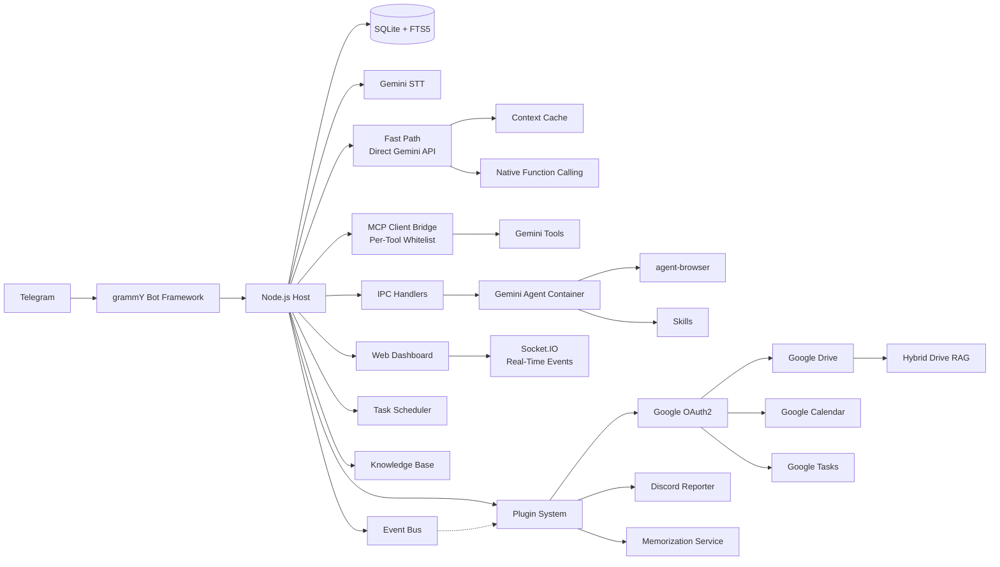

<p align="center">
  
</p>

<p align="center">
  <a href="https://github.com/Rlin1027/NanoGemClaw/blob/main/LICENSE"></a>
  <a href="https://nodejs.org/">=20"></a>
  <a href="https://github.com/Rlin1027/NanoGemClaw"></a>
</p>

<p align="center">
  由 <strong>Gemini</strong> 驱动的个人 AI 助手，深度整合 <strong>Google 生态系统</strong>。在容器中安全运行，轻量级设计且易于理解、自定义和扩展。
</p>

<p align="center">
  <em>派生自 <a href="https://github.com/gavrielc/nanoclaw">NanoClaw</a> - 将 Claude Agent SDK 替换为 Gemini，WhatsApp 替换为 Telegram</em>
</p>

<p align="center">
  <a href="README.md">English</a> |
  <a href="README.zh-TW.md">繁體中文</a> |
  <strong>简体中文</strong> |
  <a href="README.es.md">Español</a> |
  <a href="README.ja.md">日本語</a> |
  <a href="README.ko.md">한국어</a> |
  <a href="README.pt.md">Português</a> |
  <a href="README.ru.md">Русский</a>
</p>

---

## 为什么选择 NanoGemClaw？

**NanoGemClaw** 是一款轻量、安全、可扩展的 AI 助手，在隔离容器中运行 **Gemini**，通过 Telegram 交付。具有智能快速路径路由、原生函数调用和深度 Google 生态系统集成。

| 功能                | NanoClaw             | NanoGemClaw                                                           |
| -------------------- | -------------------- | --------------------------------------------------------------------- |
| **Agent 运行时**    | Claude Agent SDK     | Gemini + MCP 客户端桥接，支持按工具白名单                    |
| **Bot 框架**    | node-telegram-bot-api| grammY（类型安全、事件驱动）                                      |
| **消息平台**        | WhatsApp (Baileys)   | Telegram Bot API                                                      |
| **成本**             | Claude Max（$100/月） | 免费层（60 请求/分钟）                                                |
| **架构**     | 单体应用             | 模块化 monorepo（8 个包 + 7 个插件）                             |
| **可扩展性**    | 硬编码              | 具有生命周期钩子的插件系统                                    |
| **Google 生态系统** | -                    | Drive、Calendar、Tasks、Knowledge RAG                 |
| **通知**    | -                    | Discord 每日/每周报告                                          |
| **媒体支持**    | 仅文本            | 照片、语音（快速路径）、音频、视频、文档                      |
| **Web 浏览**     | 仅搜索          | 完整 `agent-browser`（Playwright）                                     |
| **知识库**   | -                    | 每组 FTS5 全文搜索                                       |
| **计划安排**       | -                    | 自然语言 + cron、iCal 日历                                |
| **仪表板**        | -                    | 12 模块实时管理 SPA                                    |
| **高级工具**   | -                    | STT、图像生成、角色、技能、多模型                         |
| **快速路径**        | -                    | 智能路由，支持上下文缓存（节省 75–90% token）             |

---

## 主要功能

- **模块化 Monorepo** - 8 个 npm 工作区包。可在自己的项目中使用单个包或部署完整堆栈。
- **grammY Bot 框架** - 从 node-telegram-bot-api 迁移到 grammY，实现类型安全、事件驱动的 Telegram 集成，支持速率限制和消息合并。
- **MCP 客户端桥接** - 按工具白名单的 Model Context Protocol，支持统一的 Zod 架构验证。
- **智能消息路由** - `preferredPath` 在快速路径（直接 Gemini API）和容器执行之间智能选择，支持无缝回退。
- **插件系统** - 通过自定义 Gemini 工具、消息钩子、API 路由、后台服务、IPC 处理程序和仪表板扩展，在无需修改核心代码的情况下进行扩展。
- **多模态 I/O** - 发送照片、语音消息、视频或文档。Gemini 原生处理。
- **快速路径（直接 API）** - 简单文本查询绕过容器启动，通过 `@google/genai` SDK 流式传输实时响应，支持原生函数调用。语音消息自动转录并使用快速路径。对于代码执行回退到容器。
- **上下文缓存** - 通过 Gemini 缓存 API 缓存静态内容，将输入 token 成本降低 75–90%。
- **原生函数调用** - 工具操作使用 Gemini 原生函数调用，支持按工具权限控制（main/any），替代基于文件的 IPC 轮询。
- **语音转文本** - 语音消息使用 Gemini 多模态（默认，无需 FFmpeg）或 Google Cloud Speech 自动转录。
- **图像生成** - 使用 **Imagen 3** 通过自然语言创建图像。
- **浏览器自动化** - Agent 使用 `agent-browser`（Playwright）进行复杂 Web 任务。
- **知识库** - 每组文档存储，支持 SQLite FTS5 全文搜索和安全注入扫描。
- **混合 Drive RAG** - 双层检索：通过物理文件方法预索引嵌入以实现即时查找 + 实时 Drive 搜索以获得更广泛的覆盖。与 NotebookLM 共享同一知识文件夹。
- **计划任务** - 自然语言计划（"每天早上 8 点"），支持 cron、间隔和一次性执行。
- **Google Calendar（读/写）** - 通过 Google Calendar API 创建、更新、删除事件并检查可用性。回退到 iCal 以进行只读访问。
- **Google Tasks** - 完整 CRUD 操作，支持 NanoGemClaw 计划任务与 Google Tasks 的双向同步。
- **Google Drive** - 搜索文件、读取内容和总结文档。支持 Docs、Sheets、PDF 和纯文本。
- **Discord 报告** - 通过 webhook 自动推送每日和每周进度报告到 Discord，支持彩色嵌入和仪表板链接。
- **技能系统** - 为组分配基于 Markdown 的技能文件以获得专业功能，支持注入保护。
- **角色** - 预定义的个性或为每个组创建自定义角色。
- **多模型支持** - 为每个组选择 Gemini 模型（`gemini-3-flash-preview`、`gemini-3-pro-preview` 等）。
- **容器隔离** - 每个组在自己的沙箱（Apple Container 或 Docker）中运行，支持超时和输出大小限制。
- **Web 仪表板** - 12 模块实时命令中心，支持日志流、内存编辑器、分析、Google 帐户管理、Drive 浏览器、Discord 设置和 MCP 管理。
- **国际化（100% 覆盖）** - 完整支持 8 种语言：英语、繁体中文、简体中文、日语、韩语、西班牙语、葡萄牙语和俄语。
- **测试覆盖** - 92% 语句覆盖率，84% 分支覆盖率（35+ 测试文件，~950 个测试），使用 Vitest 和全面集成测试。

---

## Monorepo 架構

```
nanogemclaw/
├── packages/
│   ├── core/          # @nanogemclaw/core      — 类型、配置、日志、工具
│   ├── db/            # @nanogemclaw/db        — SQLite 持久化（better-sqlite3）
│   ├── gemini/        # @nanogemclaw/gemini    — Gemini API 客户端、上下文缓存、MCP 工具
│   ├── telegram/      # @nanogemclaw/telegram  — grammY bot 帮助、速率限制器、合并器
│   ├── server/        # @nanogemclaw/server    — Express + Socket.IO 仪表板 API
│   ├── plugin-api/    # @nanogemclaw/plugin-api — 插件接口和生命周期类型
│   ├── event-bus/     # @nanogemclaw/event-bus  — 类型化 pub/sub 事件系统
│   └── dashboard/     # React + Vite 前端 SPA（私有）
├── plugins/
│   ├── google-auth/          # OAuth2 token 管理与自动刷新
│   ├── google-drive/         # Drive 文件搜索、读取和总结
│   ├── google-tasks/         # Tasks CRUD，支持双向同步
│   ├── google-calendar-rw/   # Calendar 读写（iCal 升级版）
│   ├── drive-knowledge-rag/  # 双层 RAG（嵌入 + 实时搜索）
│   ├── discord-reporter/    # 每日和每周 Discord 嵌入报告
│   └── memorization-service/ # 自动对话总结
├── app/               # 应用程序入口点 — 连接所有包
├── src/               # 应用程序模块（消息处理、bot、调度器等）
├── examples/
│   └── plugin-skeleton/  # 最小插件示例
├── container/         # Agent 容器（Gemini CLI + 工具）
└── docs/              # 文檔與指南
```

### 包概述

| 包                        | 说明                                                        | 重用价值 |
| ------------------------- | ----------------------------------------------------------- | ----------- |
| `@nanogemclaw/core`       | 共享类型、配置工厂、日志、工具          | 中等      |
| `@nanogemclaw/db`         | SQLite 数据库层，支持 FTS5 搜索                   | 中等      |
| `@nanogemclaw/gemini`     | Gemini API 客户端、上下文缓存、MCP 函数调用 | **高**    |
| `@nanogemclaw/telegram`   | grammY bot 帮助、速率限制、消息合并器   | 中等      |
| `@nanogemclaw/server`     | Express 仪表板服务器 + Socket.IO 实时事件    | 中等      |
| `@nanogemclaw/plugin-api` | 插件接口定义和生命周期类型         | **高**    |
| `@nanogemclaw/event-bus`  | 类型化 pub/sub 事件系统，用于插件间通信 | 中等      |

---

## 快速开始

### 前置条件

| 工具            | 用途            | 安装方式                            |
| --------------- | --------------- | ----------------------------------- |
| **Node.js 20+** | 运行时          | [nodejs.org](https://nodejs.org)    |
| **Gemini CLI**  | AI Agent        | `npm install -g @google/gemini-cli` |
| **FFmpeg**      | 仅 GCP STT（可选） | `brew install ffmpeg`               |

### 1. 克隆并安装

```bash
git clone https://github.com/Rlin1027/NanoGemClaw.git
cd NanoGemClaw
npm install
```

### 2. 配置

```bash
cp .env.example .env
```

编辑 `.env` 并填写：

- `TELEGRAM_BOT_TOKEN` — 在 Telegram 上从 [@BotFather](https://t.me/BotFather) 获取
- `GEMINI_API_KEY` — 从 [Google AI Studio](https://aistudio.google.com/) 获取

可选：复制配置文件以获得 TypeScript 自动补全：

```bash
cp nanogemclaw.config.example.ts nanogemclaw.config.ts
```

### 3. 构建控制面板

```bash
cd packages/dashboard && npm install && cd ../..
npm run build:dashboard
```

### 4. 构建 Agent 容器

```bash
# macOS 使用 Apple Container：需先启动系统服务
container system start

bash container/build.sh
```

> 若使用 Docker 而非 Apple Container，可跳过 `container system start`。

### 5. 启动

```bash
npm run dev
```

后端 API 启动于 `http://localhost:3000`。开发模式下若要访问 Web 控制面板，需在另一个终端启动前端开发服务器：

```bash
cd packages/dashboard
npm run dev                # 控制面板位于 http://localhost:5173（/api 代理至 :3000）
```

> 生产环境（`npm start`）下，控制面板直接由 `http://localhost:3000` 提供服务。

详细的分步骤指南请参阅 [docs/GUIDE.md](docs/GUIDE.md)。

---

## 插件系统

NanoGemClaw 支持在不修改核心代码的情况下扩展功能的插件。插件可以提供：

- **Gemini 工具** — AI 可用的自定义函数调用工具
- **消息钩子** — 在处理前/后拦截消息
- **API 路由** — 自定义控制面板 API 端点
- **后台服务** — 长期运行的后台任务
- **IPC 处理器** — 自定义进程间通信处理器
- **控制面板扩展** — 供 Web 控制面板使用的自定义 UI 组件

### 编写插件

1. 将 `examples/plugin-skeleton/` 复制到新目录。
2. 实现 `NanoPlugin` 接口：

```typescript
import type {
  NanoPlugin,
  PluginApi,
  GeminiToolContribution,
} from '@nanogemclaw/plugin-api';

const myPlugin: NanoPlugin = {
  id: 'my-plugin',
  name: 'My Plugin',
  version: '1.0.0',

  async init(api: PluginApi) {
    api.logger.info('Plugin initialized');
  },

  geminiTools: [
    {
      name: 'my_tool',
      description: 'Does something useful',
      parameters: {
        type: 'OBJECT',
        properties: {
          input: { type: 'STRING', description: 'The input value' },
        },
        required: ['input'],
      },
      permission: 'any',
      async execute(args) {
        return JSON.stringify({ result: `Processed: ${args.input}` });
      },
    },
  ],

  hooks: {
    async afterMessage(context) {
      // 记录每条消息用于数据分析
    },
  },
};

export default myPlugin;
```

1. 在 `data/plugins.json` 中注册：

```json
{
  "plugins": [
    {
      "source": "./path/to/my-plugin/src/index.ts",
      "config": { "myOption": "value" },
      "enabled": true
    }
  ]
}
```

完整文档示例请参阅 `examples/plugin-skeleton/src/index.ts`，插件开发完整指南请参阅 [docs/GUIDE.md](docs/GUIDE.md)。

### 内置插件

NanoGemClaw 在 `plugins/` 目录中内置 7 个插件：

| 插件                    | 描述                                             | Gemini 工具 |  后台服务   |
| ----------------------- | ------------------------------------------------ | :---------: | :---------: |
| **google-auth**         | OAuth2 核心 — token 管理、自动刷新、CLI 授权流程 |             |             |
| **google-drive**        | 搜索、读取及摘要 Drive 文件（Docs、Sheets、PDF） |      3      |             |
| **google-tasks**        | Google Tasks CRUD 与双向同步                     |      3      | 15 分钟同步 |
| **google-calendar-rw**  | 完整 Calendar API — 创建、更新、删除日程         |      5      |             |
| **drive-knowledge-rag** | 两层 RAG：预索引 embedding + 实时 Drive 搜索     |      1      | 30 分钟索引 |
| **discord-reporter**    | 通过 Discord webhook 推送日报与周报              |             |  Cron 调度  |
| **memorization-service**    | 通过 Event Bus 自动对话摘要          |             |  事件驱动  |

所有 Google 插件依赖 **google-auth** 提供 OAuth2 token。在控制面板设置页面完成一次授权流程即可。

---

## 环境变量

### 必需

| 变量             | 说明               |
| -------------------- | ------------------------- |
| `TELEGRAM_BOT_TOKEN` | @BotFather 的 Bot token |

### 可选 - AI 与媒体

| 变量         | 默认                  | 说明                                     |
| ---------------- | ------------------------ | ----------------------------------------------- |
| `GEMINI_API_KEY` | -                        | API key（图像生成和快速路径必需）  |
| `GEMINI_MODEL`   | `gemini-3-flash-preview` | 所有组的默认 Gemini 模型             |
| `ASSISTANT_NAME` | `Andy`                   | Bot 触发名称（用于 `@Andy` 提及）    |
| `STT_PROVIDER`   | `gemini`                 | 语音转文本：`gemini`（免费）或 `gcp`（付费） |

### 可选 - 仪表板与安全

| 变量                | 默认     | 说明                             |
| ----------------------- | ----------- | --------------------------------------- |
| `DASHBOARD_HOST`        | `127.0.0.1` | 绑定地址（`0.0.0.0` 用于 LAN 访问） |
| `DASHBOARD_API_KEY`     | -           | API key 以保护仪表板访问     |
| `DASHBOARD_ACCESS_CODE` | -           | 仪表板登录屏幕的访问代码  |
| `DASHBOARD_ORIGINS`     | auto        | 逗号分隔的允许 CORS 来源    |

### 可选 - 快速路径

| 变量               | 默认  | 说明                               |
| ---------------------- | -------- | ----------------------------------------- |
| `FAST_PATH_ENABLED`    | `true`   | 为文本查询启用直接 Gemini API |
| `FAST_PATH_TIMEOUT_MS` | `180000` | API 超时（ms）                          |
| `CACHE_TTL_SECONDS`    | `21600`  | 上下文缓存 TTL（6 小时）               |
| `MIN_CACHE_CHARS`      | `100000` | 缓存的最小内容长度            |

### 可选 - Google 生态系统（插件）

| 变量                     | 默认     | 说明                                      |
| ---------------------------- | ----------- | ------------------------------------------------ |
| `GOOGLE_CLIENT_ID`           | -           | Google Cloud Console 的 OAuth2 客户端 ID       |
| `GOOGLE_CLIENT_SECRET`       | -           | OAuth2 客户端密钥                             |
| `DISCORD_WEBHOOK_URL`        | -           | 用于报告的 Discord 频道 webhook URL          |

### 可选 - 基础设施

| 变量             | 默认                    | 说明                        |
| -------------------- | -------------------------- | ---------------------------------- |
| `CONTAINER_TIMEOUT`  | `300000`                   | 容器执行超时（ms）   |
| `CONTAINER_IMAGE`    | `nanogemclaw-agent:latest` | 容器镜像名称               |
| `RATE_LIMIT_ENABLED` | `true`                     | 启用请求速率限制       |
| `RATE_LIMIT_MAX`     | `20`                       | 每个窗口每组最大请求数  |
| `RATE_LIMIT_WINDOW`  | `5`                        | 速率限制窗口（分钟）        |
| `WEBHOOK_URL`        | -                          | 通知的外部 webhook |
| `WEBHOOK_EVENTS`     | `error,alert`              | 触发 webhook 的事件        |
| `ALERTS_ENABLED`     | `true`                     | 启用向主组发送错误警报  |
| `CONTAINER_MAX_OUTPUT_SIZE` | `10485760`          | 最大容器输出大小（字节）  |
| `SCHEDULER_CONCURRENCY` | auto                    | 最大并发计划容器 |
| `BACKUP_RETENTION_DAYS` | `7`                     | 保留数据库备份的天数      |
| `HEALTH_CHECK_ENABLED` | `true`                   | 启用健康检查 HTTP 服务器    |
| `HEALTH_CHECK_PORT`  | `8080`                     | 健康检查服务器端口           |
| `TZ`                 | system                     | 计划任务的时区       |
| `LOG_LEVEL`          | `info`                     | 日志级别          |

完整列表请参阅 [.env.example](.env.example)。

---

## 使用示例

### 消息传递与生产力

- `@Andy 翻译这条语音消息并总结`
- `@Andy 生成一张 16:9 的未来赛博朋克城市图像`
- `@Andy 浏览 https://news.google.com 并告诉我最热门的新闻`

### 任务计划

- `@Andy 每天早上 8 点检查天气并建议我穿什么`
- `@Andy 每 30 分钟监控我的网站，如果它宕机请提醒我`

### 知识库

- 通过仪表板上传文档，然后询问：`@Andy 在知识库中搜索部署指南`

### Google 生态系统

- `@Andy 明天下午 3 点与 John 开会`
- `@Andy 本周我的日历上有什么？`
- `@Andy 在我的 Google Tasks 中添加任务"审查 PR #42"`
- `@Andy 搜索我的 Drive 以查找 Q4 预算电子表格`
- `@Andy 总结 Drive 中的项目提案文档`
- `@Andy 我的知识文档中关于部署的内容是什么？`

### 管理

直接向 bot 发送这些命令：

- `/admin help` - 列出所有可用的管理员命令
- `/admin stats` - 显示运行时间、内存使用情况和 token 统计
- `/admin groups` - 列出所有已注册的组及其状态
- `/admin tasks` - 列出所有计划任务
- `/admin errors` - 显示有最近错误的组
- `/admin report` - 生成每日使用情况报告
- `/admin language <lang>` - 切换 bot 界面语言
- `/admin persona <name|list|set>` - 管理 bot 角色
- `/admin trigger <group> <on|off>` - 切换 @mention 触发要求
- `/admin export <group>` - 将对话历史导出为 Markdown

---

## 架构


```mermaid
graph LR
    TG[Telegram] --> GramMY[grammY Bot Framework]
    GramMY --> Bot[Node.js Host]
    Bot --> DB[(SQLite + FTS5)]
    Bot --> STT[Gemini STT]
    Bot --> FP[Fast Path<br/>Direct Gemini API]
    FP --> Cache[Context Cache]
    FP --> FC[Native Function Calling]
    Bot --> MCP[MCP Client Bridge<br/>Per-Tool Whitelist]
    MCP --> Tools[Gemini Tools]
    Bot --> IPC[IPC Handlers]
    IPC --> Container[Gemini Agent Container]
    Container --> Browser[agent-browser]
    Container --> Skills[Skills]
    Bot --> Dashboard[Web Dashboard]
    Dashboard --> WS[Socket.IO<br/>Real-Time Events]
    Bot --> Scheduler[Task Scheduler]
    Bot --> Knowledge[Knowledge Base]
    Bot --> Plugins[Plugin System]
    Plugins --> GAuth[Google OAuth2]
    GAuth --> GDrive[Google Drive]
    GAuth --> GCal[Google Calendar]
    GAuth --> GTasks[Google Tasks]
    GDrive --> RAG[Hybrid Drive RAG]
    Plugins --> Discord[Discord Reporter]
    Plugins --> Memo[Memorization Service]
    Bot --> EB[Event Bus]
    EB -.-> Plugins
```

### 后端包

| 包                        | 主要模块                                                                                  |
| ------------------------- | -------------------------------------------------------------------------------------------- |
| `@nanogemclaw/core`       | `config.ts`、`types.ts`、`logger.ts`、`utils.ts`、`safe-compare.ts`                          |
| `@nanogemclaw/db`         | `connection.ts`、`messages.ts`、`tasks.ts`、`stats.ts`、`preferences.ts`                     |
| `@nanogemclaw/gemini`     | `gemini-client.ts`、`context-cache.ts`、`mcp-client-bridge.ts`、`gemini-tools.ts`           |
| `@nanogemclaw/telegram`   | `grammY-helpers.ts`、`telegram-rate-limiter.ts`、`message-consolidator.ts`                   |
| `@nanogemclaw/server`     | `server.ts`、`routes/`（认证、组、任务、知识、日历、技能、配置、分析） |
| `@nanogemclaw/plugin-api` | `NanoPlugin`、`PluginApi`、`GeminiToolContribution`、`HookContributions`                     |
| `@nanogemclaw/event-bus`  | `EventBus`、`NanoEventMap`、类型化 pub/sub 单例                                          |

### 应用层（`src/`）

| 模块                | 用途                                                  |
| --------------------- | -------------------------------------------------------- |
| `index.ts`            | Telegram bot 入口、状态管理、IPC 分发       |
| `message-handler.ts`  | 消息处理、快速路径路由、多模态输入 |
| `fast-path.ts`        | 直接 Gemini API 执行，支持流和缓存   |
| `container-runner.ts` | 容器生命周期和流式输出                 |
| `task-scheduler.ts`   | Cron/间隔/一次性任务执行                    |
| `knowledge.ts`        | FTS5 知识库引擎，支持注入扫描       |
| `personas.ts`         | 角色定义和自定义角色管理        |
| `natural-schedule.ts` | 自然语言到 cron 解析器（EN/ZH）                  |

### 前端（`packages/dashboard/`）

React + Vite + TailwindCSS SPA，包含 12 个模块：

| 页面                | 说明                                                                     |
| ------------------- | ------------------------------------------------------------------------------- |
| **Overview**        | 具有实时 agent 活动的组状态卡片                                |
| **Logs**            | 带级别过滤的通用日志流                                       |
| **Activity Logs**   | 每组活动历史和事件时间线                                   |
| **Memory Studio**   | Monaco 编辑器用于系统提示和对话摘要                     |
| **Group Detail**    | 每组设置：角色、模型、触发、Web 搜索切换                  |
| **Tasks**           | 计划任务 CRUD，包含执行历史                                      |
| **Schedule**        | 视觉化计划概览和任务时间线                                       |
| **Analytics**       | 使用情况图表、容器日志、消息统计                                |
| **Knowledge**       | 文档上传、FTS5 搜索、每组文档管理                     |
| **Drive**           | Google Drive 文件浏览器和文档查看器                                   |
| **Calendar**        | iCal 订阅源和即将举行的事件查看器                                |
| **Settings**        | 维护模式、调试日志、密钥状态、Google 帐户、Discord 配置、MCP 管理 |

### 持久化

- **SQLite**（`store/messages.db`）：消息、任务、统计、首选项、知识（FTS5）
- **JSON**（`data/`）：会话、已注册的组、自定义角色、日历配置、组技能
- **文件系统**（`groups/`）：每组工作区（GEMINI.md、日志、媒体、IPC）
- **备份**（`store/backups/`）：自动每日 SQLite 备份，支持可配置的保留时间（`BACKUP_RETENTION_DAYS`）

### 健康检查

轻量级 HTTP 服务器在 `HEALTH_CHECK_PORT` 端口（默认 8080）上运行，提供：

- `GET /health` — 系统健康状态（healthy/degraded/unhealthy）
- `GET /ready` — 编排器的就绪探针
- `GET /metrics` — Prometheus 格式的指标

使用 `HEALTH_CHECK_ENABLED=false` 禁用。

---

## Web 仪表板

### 开发

```bash
# 终端 1：启动后端
npm run dev

# 终端 2：启动仪表板前端
cd packages/dashboard
npm run dev                # http://localhost:5173（代理 /api → :3000）
```

### 生产

```bash
npm run build:dashboard    # 构建前端
npm run build              # 构建后端
npm start                  # 在 http://localhost:3000 提供所有内容
```

```bash
# LAN 访问
DASHBOARD_HOST=0.0.0.0 npm start
```

支持 `Cmd+K` / `Ctrl+K` 全局搜索覆蓋層。

---

## 开发

```bash
npm run dev               # 使用 tsx 启动（热重载）
npm run typecheck         # TypeScript 类型检查（后端）
npm test                  # 运行所有测试（Vitest，35 个文件，~950 个测试）
npm run test:watch        # 监视模式
npm run test:coverage     # 覆盖率报告（92% 语句、84% 分支）
npm run format:check      # Prettier 检查
```

仪表板开发：

```bash
cd packages/dashboard
npm run dev               # Vite 开发服务器（端口 5173，代理 /api -> :3000）
npx tsc --noEmit          # 类型检查前端
```

---

## 故障排查

- **Bot 没有响应？** 检查 `npm run dev` 日志并确保 bot 是组中的管理员。
- **STT 失败？** 默认提供者（`gemini`）不需要额外依赖。如果使用 `STT_PROVIDER=gcp`，请确保安装了 `ffmpeg`（`brew install ffmpeg`）。
- **媒体无法处理？** 验证 `.env` 中设置了 `GEMINI_API_KEY`。
- **容器问题？** 运行 `bash container/build.sh` 重新构建镜像。
- **仪表板空白页？** 在构建之前运行 `cd packages/dashboard && npm install`。
- **CORS 错误？** 检查 `DASHBOARD_ORIGINS` 环境变量。
- **容器 EROFS 错误？** Apple Container 不支持嵌套重叠的绑定挂载。
- **容器 XPC 错误？** 首先运行 `container system start`。构建前 Apple Container 的系统服务必须运行。
- **localhost:3000 上无法 `GET /`？** 在开发模式中，端口 3000 仅用于 API。单独启动仪表板：`cd packages/dashboard && npm run dev`（在端口 5173 上提供）。
- **快速路径不工作？** 确保设置了 `GEMINI_API_KEY`。检查 `FAST_PATH_ENABLED=true`。仪表板中的每组设置可能会全局覆盖。
- **被速率限制？** 调整 `.env` 中的 `RATE_LIMIT_MAX` 和 `RATE_LIMIT_WINDOW`。
- **Google OAuth 不工作？** 确保设置了 `GOOGLE_CLIENT_ID` 和 `GOOGLE_CLIENT_SECRET`。在 Google Cloud Console 中使用"Desktop App"类型。
- **Drive/Calendar/Tasks 没有响应？** 首先从仪表板设置 → Google 帐户完成 OAuth 流程。
- **Discord 报告未发送？** 检查 `DISCORD_WEBHOOK_URL` 是否有效。在仪表板设置中使用"发送测试"按钮测试。
- **MCP 工具无法执行？** 验证仪表板设置 → MCP 中的按工具白名单。检查工具权限级别（main vs any）。
- **语音消息不使用快速路径？** 确保 STT 成功完成。检查日志中的转录错误。

---

## 授权

MIT

## 鸣谢

- 原始 [NanoClaw](https://github.com/gavrielc/nanoclaw) 由 [@gavrielc](https://github.com/gavrielc) 开发
- 由 [Gemini](https://ai.google.dev/) 提供支持
