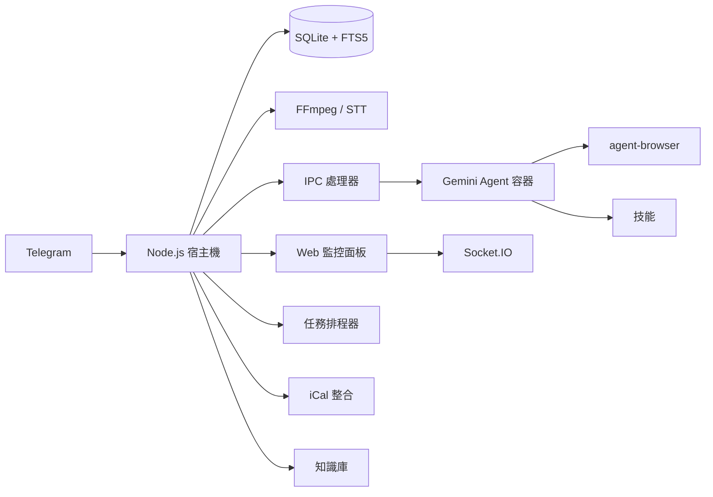

<p align="center">
  
</p>

<p align="center">
  由 <strong>Gemini CLI</strong> 驅動的個人 AI 助手。在容器中安全運行，輕量且易於理解和自訂。
</p>

<p align="center">
  <em>Fork 自 <a href="https://github.com/gavrielc/nanoclaw">NanoClaw</a> - 將 Claude Agent SDK 替換為 Gemini CLI，WhatsApp 替換為 Telegram</em>
</p>

<p align="center">
  <a href="README.md">English</a> |
  <strong>繁體中文</strong> |
  <a href="README.zh-CN.md">简体中文</a> |
  <a href="README.es.md">Español</a> |
  <a href="README.ja.md">日本語</a>
</p>

## 為什麼選擇 NanoGemClaw？

**NanoGemClaw** 是一個輕量、安全且可自訂的 AI 助手，在隔離的容器中執行 **Gemini CLI**。

| 功能 | NanoClaw | NanoGemClaw |
|------|----------|-------------|
| **Agent 運行時** | Claude Agent SDK | Gemini CLI |
| **訊息平台** | WhatsApp (Baileys) | Telegram Bot API |
| **費用** | Claude Max ($100/月) | 免費方案 (60 次/分鐘) |
| **多媒體支援** | 僅文字 | 圖片、語音、音訊、影片、文件 |
| **網頁瀏覽** | 僅搜尋 | 完整 `agent-browser` (Playwright) |
| **知識庫** | - | FTS5 全文搜尋，每群組獨立 |
| **排程** | - | 自然語言 + cron，iCal 行事曆整合 |
| **監控面板** | - | 9 模組即時管理 SPA |
| **進階工具** | - | STT、圖片生成、人格、技能、多模型 |

---

## 核心功能

- **多模態 I/O** - 傳送圖片、語音訊息、影片或文件，Gemini 會直接處理。
- **語音轉文字 (STT)** - 語音訊息自動轉錄（支援 Gemini 多模態或 Google Cloud Speech）。
- **圖片生成** - 透過自然語言使用 **Imagen 3** 建立圖片。
- **瀏覽器自動化** - Agent 使用 `agent-browser` 處理複雜網頁任務（互動、截圖）。
- **知識庫** - 每群組獨立的文件庫，搭配 SQLite FTS5 全文搜尋。可從 Dashboard 上傳與查詢文件。
- **排程任務** - 自然語言排程（"every day at 8am"、"每天早上8點"），支援 cron、間隔及一次性任務。
- **行事曆整合** - 訂閱 iCal 來源（Google Calendar、Apple Calendar 等），查詢近期行程。
- **技能系統** - 將 Markdown 技能檔指派給群組。Agent 可獲得專業能力（如 `agent-browser`、`long-memory`）。
- **人格定義 (Persona)** - 內建人格（coder、translator、writer、analyst）或建立自訂人格。
- **多模型支援** - 可為每個群組選擇 Gemini 模型（`gemini-3-flash-preview`、`gemini-3-pro-preview` 等）。
- **多輪任務追蹤** - 追蹤並管理複雜的多步驟背景任務，支援自動跟進。
- **容器隔離** - 每個群組在各自的沙盒（Apple Container 或 Docker）中執行。
- **Web 監控面板** - 9 模組即時指揮中心，內建 Log 串流、記憶編輯器、數據分析、知識管理等。
- **多語言支援 (i18n)** - 介面完整支援繁中、簡中、英文、日文及西班牙文。

---

## 安裝說明

### 前置需求

| 工具 | 用途 | 安裝方式 |
|------|------|----------|
| **Node.js 20+** | 執行環境 | [nodejs.org](https://nodejs.org) |
| **Gemini CLI** | AI Agent | `npm install -g @google/gemini-cli` |
| **FFmpeg** | 音訊處理 (STT) | `brew install ffmpeg` |

### 快速開始

1. **Clone 與安裝：**

   ```bash
   git clone https://github.com/Rlin1027/NanoGemClaw.git
   cd NanoGemClaw
   npm install
   ```

2. **設定 Bot：**
   - 在 Telegram 向 **@BotFather** 取得 Token。
   - 根據 `.env.example` 建立 `.env`。
   - 執行 `npm run setup:telegram` 驗證。

3. **建置 Dashboard：**

   ```bash
   cd dashboard && npm install && cd ..
   npm run build:dashboard
   ```

4. **建置 Agent 容器：**

   ```bash
   bash container/build.sh
   ```

5. **啟動：**

   ```bash
   npm run dev
   ```

   開啟 `http://localhost:3000` 存取 Web 監控面板。

---

## 環境變數

### 必填

| 變數 | 說明 |
|------|------|
| `TELEGRAM_BOT_TOKEN` | 從 @BotFather 取得的 Bot Token |

### 選填 - AI 與多媒體

| 變數 | 預設值 | 說明 |
|------|--------|------|
| `GEMINI_API_KEY` | - | API 金鑰（若未使用 OAuth）。圖片生成必需。 |
| `GEMINI_MODEL` | `gemini-3-flash-preview` | 所有群組的預設 Gemini 模型 |
| `ASSISTANT_NAME` | `Andy` | Bot 觸發名稱（用於 `@Andy` 提及） |
| `STT_PROVIDER` | `gemini` | 語音轉文字：`gemini`（免費）或 `gcp`（付費） |
| `GOOGLE_APPLICATION_CREDENTIALS` | - | GCP 服務帳戶 JSON 路徑（`STT_PROVIDER=gcp` 時使用） |

### 選填 - 面板與安全

| 變數 | 預設值 | 說明 |
|------|--------|------|
| `DASHBOARD_HOST` | `127.0.0.1` | 綁定位址（LAN 存取使用 `0.0.0.0`） |
| `DASHBOARD_API_KEY` | - | 保護面板存取的 API 金鑰 |
| `DASHBOARD_ORIGINS` | 自動 | 逗號分隔的允許 CORS 來源 |

### 選填 - 速率限制與警報

| 變數 | 預設值 | 說明 |
|------|--------|------|
| `RATE_LIMIT_ENABLED` | `true` | 啟用請求速率限制 |
| `RATE_LIMIT_MAX` | `20` | 每個時間窗口每群組最大請求數 |
| `RATE_LIMIT_WINDOW` | `5` | 速率限制時間窗口（分鐘） |
| `ALERTS_ENABLED` | `true` | 向主群組發送錯誤警報 |

### 選填 - 基礎設施

| 變數 | 預設值 | 說明 |
|------|--------|------|
| `CONTAINER_TIMEOUT` | `300000` | 容器執行逾時（毫秒） |
| `CONTAINER_IMAGE` | `nanogemclaw-agent:latest` | 容器映像名稱 |
| `HEALTH_CHECK_ENABLED` | `true` | 啟用健康檢查 HTTP 伺服器 |
| `HEALTH_CHECK_PORT` | `8080` | 健康檢查伺服器埠號 |
| `WEBHOOK_URL` | - | 外部通知 Webhook（Slack/Discord） |
| `WEBHOOK_EVENTS` | `error,alert` | 觸發 Webhook 的事件類型 |
| `TZ` | 系統預設 | 排程任務使用的時區 |
| `LOG_LEVEL` | `info` | 日誌等級 |

---

## 使用範例

### 訊息處理與生產力

- `@Andy 翻譯這段語音訊息並摘要`
- `@Andy 生成一張 16:9 的未來網路龐克城市圖片`
- `@Andy 瀏覽 https://news.google.com 並告訴我今日頭條`

### 排程任務

- `@Andy every morning at 8am, check the weather and suggest what to wear`
- `@Andy 每天下午3點提醒我喝水`
- `@Andy 每 30 分鐘監控我的網站，斷線時通知我`

### 知識庫

- 透過 Dashboard 上傳文件後詢問：`@Andy 搜尋知識庫中的部署指南`

---

## 管理控制

直接對機器人發送以下指令：

- `/admin language <lang>` - 切換機器人介面語言。
- `/admin persona <name>` - 變更機器人人格（default、coder、translator、writer、analyst）。
- `/admin report` - 取得每日活動摘要報告。

---

## 架構設計



### 後端 (`src/`)

| 模組 | 用途 |
|------|------|
| `index.ts` | Telegram Bot 入口、狀態管理、IPC 派發 |
| `server.ts` | Express REST API + Socket.IO 伺服器 |
| `routes/` | 模組化 API 路由（auth、groups、tasks、knowledge、calendar、skills、config、analytics） |
| `db/` | 分層 SQLite 模組（connection、messages、tasks、stats、preferences） |
| `ipc-handlers/` | 插件式 IPC 處理器（排程、圖片生成、註冊、偏好設定、建議動作） |
| `container-runner.ts` | 容器生命週期、串流輸出 |
| `message-handler.ts` | 訊息處理、多模態輸入 |
| `knowledge.ts` | FTS5 知識庫引擎 |
| `google-calendar.ts` | iCal 來源解析器 |
| `skills.ts` | 技能檔探索與指派 |
| `natural-schedule.ts` | 自然語言轉 cron 解析器（中/英文） |
| `personas.ts` | 人格定義與自訂人格管理 |
| `task-scheduler.ts` | Cron/間隔/一次性任務執行 |

### 前端 (`dashboard/`)

React + Vite + TailwindCSS SPA，包含 9 個模組：

| 頁面 | 說明 |
|------|------|
| **總覽** | 群組狀態卡片，顯示即時 Agent 活動 |
| **日誌** | 全域 Log 串流，支援等級篩選 |
| **記憶工作室** | Monaco 編輯器，編輯系統提示詞 (GEMINI.md) 及對話摘要 |
| **群組詳情** | 群組設定：人格、模型、觸發方式、網頁搜尋開關 |
| **任務** | 排程任務 CRUD 及執行歷史 |
| **數據分析** | 使用量圖表、容器日誌、訊息統計 |
| **知識庫** | 文件上傳、FTS5 搜尋、群組文件管理 |
| **行事曆** | iCal 來源訂閱及近期行程檢視 |
| **設定** | 維護模式、Debug 日誌、密鑰狀態、偏好設定 |

### 持久化

- **SQLite** (`store/messages.db`)：訊息、任務、統計、偏好設定、知識庫（FTS5）
- **JSON** (`data/`)：Session、已註冊群組、自訂人格、行事曆設定、群組技能
- **檔案系統** (`groups/`)：群組工作區（GEMINI.md、日誌、多媒體、IPC）

---

## Web 監控面板

### 存取方式

```bash
# 本地存取（預設）
open http://localhost:3000

# LAN 存取
DASHBOARD_HOST=0.0.0.0 npm run dev
```

支援 `Cmd+K` / `Ctrl+K` 全域搜尋。

### 生產環境建置

```bash
npm run build:dashboard    # 建置前端
npm run build              # 建置後端
npm start                  # 在 :3000 提供面板服務
```

---

## 測試

```bash
npm test                  # 執行所有測試 (Vitest)
npm run test:watch        # 監看模式
npm run test:coverage     # 覆蓋率報告
npm run typecheck         # TypeScript 型別檢查
```

---

## 問題排解

- **機器人無回應？** 檢查 `npm run dev` 日誌，確認機器人已設為群組管理員。
- **STT 失敗？** 確認已安裝 `ffmpeg` (`brew install ffmpeg`)。
- **無法處理多媒體？** 確認 `.env` 中的 `GEMINI_API_KEY` 已正確設定。
- **容器問題？** 執行 `bash container/build.sh` 重新建置映像。
- **Dashboard 空白頁面？** 建置前先執行 `cd dashboard && npm install`。Dashboard 有獨立的 `package.json`。
- **CORS 錯誤？** 檢查 `DASHBOARD_ORIGINS` 環境變數，確認您的來源在允許清單中。
- **容器 EROFS 錯誤？** Apple Container 不支援巢狀掛載覆蓋。確認 `~/.gemini` 以 read-write 方式掛載。
- **被速率限制？** 在 `.env` 中調整 `RATE_LIMIT_MAX` 和 `RATE_LIMIT_WINDOW`。
- **健康檢查埠號衝突？** 變更 `HEALTH_CHECK_PORT` 或設定 `HEALTH_CHECK_ENABLED=false` 停用。

---

## 授權

MIT

## 致謝

- 原始 [NanoClaw](https://github.com/gavrielc/nanoclaw) 由 [@gavrielc](https://github.com/gavrielc) 開發
- 由 [Gemini CLI](https://github.com/google-gemini/gemini-cli) 驅動
