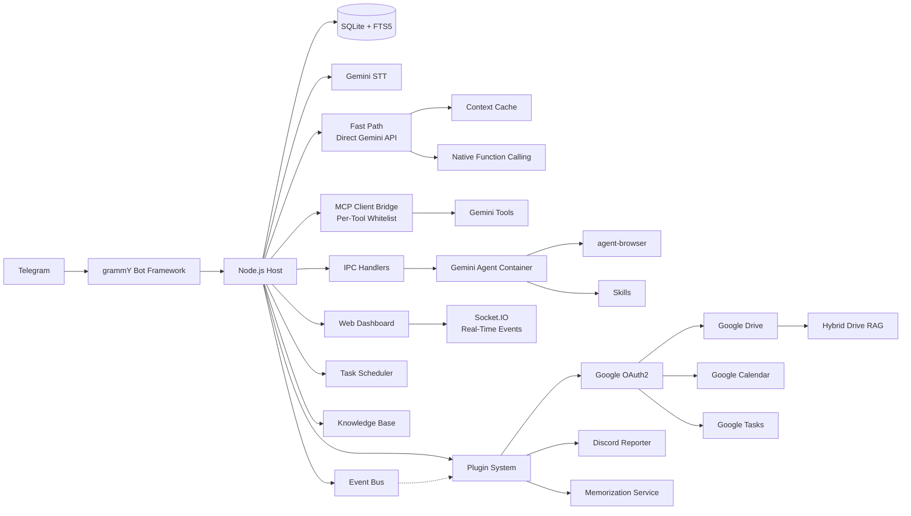

<p align="center">
  
</p>

<p align="center">
  <a href="https://github.com/Rlin1027/NanoGemClaw/blob/main/LICENSE"></a>
  <a href="https://nodejs.org/">=20"></a>
  <a href="https://github.com/Rlin1027/NanoGemClaw"></a>
</p>

<p align="center">
  由 <strong>Gemini</strong> 驅動的個人 AI 助手，深度整合 <strong>Google 生態系統</strong>。在容器中安全運行、輕量級設計，易於理解、自訂和擴展。
</p>

<p align="center">
  <em>衍生自 <a href="https://github.com/gavrielc/nanoclaw">NanoClaw</a> — 將 Claude Agent SDK 替換為 Gemini、WhatsApp 替換為 Telegram</em>
</p>

<p align="center">
  <a href="README.md">English</a> |
  <strong>繁體中文</strong> |
  <a href="README.zh-CN.md">简体中文</a> |
  <a href="README.es.md">Español</a> |
  <a href="README.ja.md">日本語</a> |
  <a href="README.ko.md">한국어</a> |
  <a href="README.pt.md">Português</a> |
  <a href="README.ru.md">Русский</a>
</p>

---

## 為什麼選擇 NanoGemClaw？

**NanoGemClaw** 是一款輕量級、安全且可擴展的 AI 助手，在隔離的容器中運行 **Gemini**，透過 Telegram 提供服務，具備智能快速路徑路由、原生函數調用和深度 Google 生態系統整合。

| 功能              | NanoClaw             | NanoGemClaw                                                           |
| -------------------- | -------------------- | --------------------------------------------------------------------- |
| **代理運行時**    | Claude Agent SDK     | Gemini + MCP Client Bridge with per-tool whitelist                    |
| **機器人框架**    | node-telegram-bot-api| grammY (type-safe, event-driven)                                      |
| **通訊平台**        | WhatsApp (Baileys)   | Telegram Bot API                                                      |
| **成本**             | Claude Max ($100/月) | 免費方案（60 req/min）                                                |
| **架構**     | 單體式             | 模組化單元回購（8 個套件 + 7 個外掛）                             |
| **可擴展性**    | 硬編碼            | 具有生命週期鉤子的外掛系統                                    |
| **Google 生態系統** | -                    | Drive、Calendar、Tasks、Knowledge RAG                                 |
| **通知**    | -                    | Discord 每日/每週報告                                          |
| **媒體支援**    | 僅文字            | 照片、語音（快速路徑）、音訊、視訊、文件                      |
| **網路瀏覽**     | 搜尋功能          | 完整的 `agent-browser`（Playwright）                                     |
| **知識庫**   | -                    | 每個群組的 FTS5 全文搜尋                                       |
| **排程**       | -                    | 自然語言 + cron、iCal 日曆                |
| **儀表板**        | -                    | 12 個模組的實時管理 SPA                                    |
| **進階工具**   | -                    | STT、Image Gen、Personas、Skills、Multi-model                         |
| **快速路徑**        | -                    | 具有上下文快取的智能路由（75–90% 令牌節省）             |

---

## 主要功能

- **模組化單元回購** - 8 個 npm 工作區套件。在自己的專案中使用個別套件，或部署完整堆疊。
- **grammY 機器人框架** - 從 node-telegram-bot-api 遷移至 grammY，提供類型安全、事件驅動的 Telegram 整合、速率限制和訊息合併。
- **MCP 客戶端橋接** - Model Context Protocol 的每個工具白名單，採用統一的 Zod 架構驗證。
- **智能訊息路由** - `preferredPath` 在快速路徑（直接 Gemini API）和容器執行之間智能選擇，具備無縫回退機制。
- **外掛系統** - 使用自訂 Gemini 工具、訊息鉤子、API 路由、背景服務、IPC 處理程式和儀表板擴展，無需修改核心程式碼。
- **多模態 I/O** - 傳送照片、語音訊息、影片或文件。Gemini 原生處理。
- **快速路徑（直接 API）** - 簡單文字查詢跳過容器啟動，透過 `@google/genai` SDK 串流回應，支持原生函數調用。語音訊息自動轉錄並使用快速路徑。容器執行程式碼會自動回退。
- **上下文快取** - 透過 Gemini 快取 API 快取靜態內容，將輸入令牌成本減少 75–90%。
- **原生函數調用** - 工具操作使用 Gemini 原生函數調用，支持每個工具權限控制（main/any），取代基於檔案的 IPC 輪詢。
- **語音轉文字** - 使用 Gemini 多模態（預設，無需 FFmpeg）或 Google Cloud Speech 自動轉錄語音訊息。
- **圖像生成** - 使用 **Imagen 3** 透過自然語言建立影像。
- **瀏覽器自動化** - 代理使用 `agent-browser`（Playwright）進行複雜網頁任務。
- **知識庫** - 每個群組的文件儲存，採用 SQLite FTS5 全文搜尋和安全檢注掃描。
- **混合 Drive RAG** - 兩層檢索：透過物理檔案方法預先索引的嵌入（即時查詢）+ 實時 Drive 搜尋（更廣泛的涵蓋範圍）。與 NotebookLM 共享相同的知識資料夾。
- **排程任務** - 自然語言排程（「每天早上 8 點」），支援 cron、間隔和一次性執行。
- **Google Calendar（讀/寫）** - 透過 Google Calendar API 建立、更新、刪除事件並檢查可用時間。無法存取時回退至 iCal（唯讀）。
- **Google Tasks** - 完整的 CRUD 操作，NanoGemClaw 排程任務與 Google Tasks 之間的雙向同步。
- **Google Drive** - 搜尋檔案、讀取內容並摘要文件。支援 Docs、Sheets、PDF 和純文字。
- **Discord 報告** - 透過 Webhook 自動推送每日和每週進度報告至 Discord，包含顏色編碼的嵌入和儀表板連結。
- **Skills 系統** - 將基於 Markdown 的技能檔案指派給群組，提供專門功能和注入保護。
- **Personas** - 預定義的個性或為每個群組建立自訂角色。
- **多模型支援** - 為每個群組選擇 Gemini 模型（`gemini-3-flash-preview`、`gemini-3-pro-preview` 等）。
- **容器隔離** - 每個群組在自己的沙盒（Apple Container 或 Docker）中運行，具備逾時和輸出大小限制。
- **Web 儀表板** - 12 個模組的實時命令中心，具備日誌串流、記憶編輯器、分析、Google 帳戶管理、Drive 瀏覽器、Discord 設定和 MCP 管理。
- **i18n（100% 涵蓋）** - 完整的介面支援 8 種語言：英文、繁體中文、簡體中文、日文、韓文、西班牙文、葡萄牙文和俄文。
- **測試涵蓋範圍** - 92% 語句涵蓋範圍、84% 分支涵蓋範圍（35+ 測試檔案，~950 個測試），採用 Vitest 和全面的整合測試。

---

## 單元回購架構

```
nanogemclaw/
├── packages/
│   ├── core/          # @nanogemclaw/core      — 類型、配置、日誌記錄、公用程式
│   ├── db/            # @nanogemclaw/db        — SQLite 持久化（better-sqlite3）
│   ├── gemini/        # @nanogemclaw/gemini    — Gemini API 客戶端、上下文快取、MCP 工具
│   ├── telegram/      # @nanogemclaw/telegram  — grammY 機器人幫手、速率限制器、合併器
│   ├── server/        # @nanogemclaw/server    — Express + Socket.IO 儀表板 API
│   ├── plugin-api/    # @nanogemclaw/plugin-api — 外掛介面和生命週期類型
│   ├── event-bus/     # @nanogemclaw/event-bus  — 類型化 pub/sub 事件系統
│   └── dashboard/     # React + Vite 前端 SPA（私有）
├── plugins/
│   ├── google-auth/          # OAuth2 令牌管理和自動重新整理
│   ├── google-drive/         # Drive 檔案搜尋、讀取和摘要
│   ├── google-tasks/         # Tasks CRUD 與雙向同步
│   ├── google-calendar-rw/   # 日曆讀/寫（從 iCal 升級）
│   ├── drive-knowledge-rag/  # 兩層 RAG（嵌入 + 實時搜尋）
│   ├── discord-reporter/    # 每日和每週 Discord 嵌入報告
│   └── memorization-service/ # 自動對話摘要
├── app/               # 應用程式進入點 — 連接所有套件
├── src/               # 應用程式模組（訊息處理程式、機器人、排程器等）
├── examples/
│   └── plugin-skeleton/  # 最小外掛範例
├── container/         # 代理容器（Gemini CLI + 工具）
└── docs/              # 文件和指南
```

### 套件概述

| 套件                   | 描述                                              | 重用價值 |
| ------------------------- | -------------------------------------------------------- | ----------- |
| `@nanogemclaw/core`       | 共享類型、配置工廠、日誌記錄、公用程式          | 中等      |
| `@nanogemclaw/db`         | SQLite 資料庫層，具備 FTS5 搜尋                   | 中等      |
| `@nanogemclaw/gemini`     | Gemini API 客戶端、上下文快取、MCP 函數調用 | **高**    |
| `@nanogemclaw/telegram`   | grammY 機器人幫手、速率限制器、訊息合併器   | 中等      |
| `@nanogemclaw/server`     | Express 儀表板伺服器 + Socket.IO 即時事件    | 中等      |
| `@nanogemclaw/plugin-api` | 外掛介面定義和生命週期類型         | **高**    |
| `@nanogemclaw/event-bus`  | 類型化 pub/sub 事件系統，用於外掛間通訊 | 中等      |

---

## 快速開始

### 前置條件

| 工具            | 用途                | 安裝                        |
| --------------- | ---------------------- | ----------------------------------- |
| **Node.js 20+** | 運行時                | [nodejs.org](https://nodejs.org)    |
| **Gemini CLI**  | AI 代理               | `npm install -g @google/gemini-cli` |
| **FFmpeg**      | GCP STT 僅限（可選） | `brew install ffmpeg`               |

### 1. 複製和安裝

```bash
git clone https://github.com/Rlin1027/NanoGemClaw.git
cd NanoGemClaw
npm install
```

### 2. 配置

```bash
cp .env.example .env
```

編輯 `.env` 並填入：

- `TELEGRAM_BOT_TOKEN` — 從 Telegram 上的 [@BotFather](https://t.me/BotFather) 獲取
- `GEMINI_API_KEY` — 從 [Google AI Studio](https://aistudio.google.com/) 獲取

可選地複製配置檔以進行 TypeScript 自動完成：

```bash
cp nanogemclaw.config.example.ts nanogemclaw.config.ts
```

### 3. 建置儀表板

```bash
cd packages/dashboard && npm install && cd ../..
npm run build:dashboard
```

### 4. 建置代理容器

```bash
# macOS 搭配 Apple Container：首先啟動系統服務
container system start

bash container/build.sh
```

> 如果改用 Docker 而非 Apple Container，請跳過 `container system start`。

### 5. 啟動

```bash
npm run dev
```

後端 API 啟動於 `http://localhost:3000`。若要在開發期間存取 Web 儀表板，請在另一個終端機啟動前端開發伺服器：

```bash
cd packages/dashboard
npm run dev                # 儀表板位於 http://localhost:5173（代理 /api → :3000）
```

> 在生產環境（`npm start`）中，儀表板會被打包並直接在 `http://localhost:3000` 提供。

詳細的分步指南，請參閱 [docs/GUIDE.md](docs/GUIDE.md)。

---

## 外掛系統

NanoGemClaw 支援外掛，可在不修改核心程式碼的情況下擴展功能。外掛可提供：

- **Gemini 工具** — 具備權限等級（main/any）和每個工具白名單的自訂函數調用工具
- **訊息鉤子** — 在處理前/後攔截訊息，具備注入掃描
- **API 路由** — 自訂儀表板 API 端點
- **背景服務** — 長期執行的背景任務
- **IPC 處理程式** — 自訂進程間通訊處理程式
- **儀表板擴展** — Web 儀表板的自訂 UI 元件

### 編寫外掛

1. 複製 `examples/plugin-skeleton/` 至新目錄。
2. 實作 `NanoPlugin` 介面：

```typescript
import type {
  NanoPlugin,
  PluginApi,
  GeminiToolContribution,
} from '@nanogemclaw/plugin-api';

const myPlugin: NanoPlugin = {
  id: 'my-plugin',
  name: 'My Plugin',
  version: '1.0.0',

  async init(api: PluginApi) {
    api.logger.info('Plugin initialized');
  },

  geminiTools: [
    {
      name: 'my_tool',
      description: 'Does something useful',
      parameters: {
        type: 'OBJECT',
        properties: {
          input: { type: 'STRING', description: 'The input value' },
        },
        required: ['input'],
      },
      permission: 'any',
      async execute(args) {
        return JSON.stringify({ result: `Processed: ${args.input}` });
      },
    },
  ],

  hooks: {
    async afterMessage(context) {
      // Log every message for analytics
    },
  },
};

export default myPlugin;
```

1. 在 `data/plugins.json` 中註冊：

```json
{
  "plugins": [
    {
      "source": "./path/to/my-plugin/src/index.ts",
      "config": { "myOption": "value" },
      "enabled": true
    }
  ]
}
```

如需完整文件化的範例，請參閱 `examples/plugin-skeleton/src/index.ts`，以及 [docs/GUIDE.md](docs/GUIDE.md) 以了解完整的外掛開發指南。

### 內建外掛

NanoGemClaw 在 `plugins/` 目錄中提供 7 個內建外掛：

| 外掛                      | 描述                                                 | Gemini 工具 | 背景服務 |
| --------------------------- | ----------------------------------------------------------- | :----------: | :----------------: |
| **google-auth**             | OAuth2 核心 — 令牌管理、自動重新整理、CLI 認證流 |              |                    |
| **google-drive**            | 搜尋、讀取和摘要 Drive 檔案（Docs、Sheets、PDF） |      3       |                    |
| **google-tasks**            | Google Tasks CRUD 與雙向同步                   |      3       |    15 分鐘同步     |
| **google-calendar-rw**      | 完整的日曆 API — 建立、更新、刪除事件           |      5       |                    |
| **drive-knowledge-rag**     | 兩層 RAG：預先索引的嵌入 + 實時 Drive 搜尋   |      1       |   30 分鐘索引器   |
| **discord-reporter**        | 透過 Discord Webhook 的每日和每週進度報告      |              |   Cron 排程器   |
| **memorization-service**    | 透過事件匯流排的自動對話摘要          |              |  事件驅動      |

所有 Google 外掛都依賴 **google-auth** 以獲得 OAuth2 令牌。從儀表板設定頁面執行授權流程一次。

---

## 環境變數

### 必需

| 變數             | 描述               |
| -------------------- | ------------------------- |
| `TELEGRAM_BOT_TOKEN` | 來自 @BotFather 的機器人令牌 |

### 可選 - AI 和媒體

| 變數         | 預設                  | 描述                                     |
| ---------------- | ------------------------ | ----------------------------------------------- |
| `GEMINI_API_KEY` | -                        | API 金鑰（影像生成和快速路徑所需）  |
| `GEMINI_MODEL`   | `gemini-3-flash-preview` | 所有群組的預設 Gemini 模型             |
| `ASSISTANT_NAME` | `Andy`                   | 機器人觸發名稱（用於 `@Andy` 提及）    |
| `STT_PROVIDER`   | `gemini`                 | 語音轉文字：`gemini`（免費）或 `gcp`（付費） |

### 可選 - 儀表板和安全性

| 變數                | 預設     | 描述                             |
| ----------------------- | ----------- | --------------------------------------- |
| `DASHBOARD_HOST`        | `127.0.0.1` | 繫結位址（`0.0.0.0` 用於 LAN 存取） |
| `DASHBOARD_API_KEY`     | -           | 保護儀表板存取的 API 金鑰     |
| `DASHBOARD_ACCESS_CODE` | -           | 儀表板登入畫面的存取碼  |
| `DASHBOARD_ORIGINS`     | 自動        | 逗號分隔的允許 CORS 來源    |

### 可選 - 快速路徑

| 變數               | 預設  | 描述                               |
| ---------------------- | -------- | ----------------------------------------- |
| `FAST_PATH_ENABLED`    | `true`   | 為文字查詢啟用直接 Gemini API |
| `FAST_PATH_TIMEOUT_MS` | `180000` | API 逾時（毫秒）                          |
| `CACHE_TTL_SECONDS`    | `21600`  | 上下文快取 TTL（6 小時）               |
| `MIN_CACHE_CHARS`      | `100000` | 快取的最小內容長度            |

### 可選 - Google 生態系統（外掛）

| 變數                     | 預設     | 描述                                      |
| ---------------------------- | ----------- | ------------------------------------------------ |
| `GOOGLE_CLIENT_ID`           | -           | 來自 Google Cloud Console 的 OAuth2 客戶端 ID       |
| `GOOGLE_CLIENT_SECRET`       | -           | OAuth2 客戶端密鑰                             |
| `DISCORD_WEBHOOK_URL`        | -           | 報告用的 Discord 頻道 Webhook URL          |

### 可選 - 基礎設施

| 變數             | 預設                    | 描述                        |
| -------------------- | -------------------------- | ---------------------------------- |
| `CONTAINER_TIMEOUT`  | `300000`                   | 容器執行逾時（毫秒）   |
| `CONTAINER_IMAGE`    | `nanogemclaw-agent:latest` | 容器影像名稱               |
| `RATE_LIMIT_ENABLED` | `true`                     | 啟用請求速率限制       |
| `RATE_LIMIT_MAX`     | `20`                       | 每個視窗每個群組的最大請求數  |
| `RATE_LIMIT_WINDOW`  | `5`                        | 速率限制視窗（分鐘）        |
| `WEBHOOK_URL`        | -                          | 用於通知的外部 Webhook |
| `WEBHOOK_EVENTS`     | `error,alert`              | 觸發 Webhook 的事件        |
| `ALERTS_ENABLED`     | `true`                     | 啟用向主群組發送錯誤警報  |
| `CONTAINER_MAX_OUTPUT_SIZE` | `10485760`          | 最大容器輸出大小（位元組）  |
| `SCHEDULER_CONCURRENCY` | 自動                    | 最大並發排程容器數 |
| `BACKUP_RETENTION_DAYS` | `7`                     | 保留資料庫備份的天數      |
| `HEALTH_CHECK_ENABLED` | `true`                   | 啟用健康檢查 HTTP 伺服器    |
| `HEALTH_CHECK_PORT`  | `8080`                     | 健康檢查伺服器連接埠           |
| `TZ`                 | 系統                     | 排程任務的時區           |
| `LOG_LEVEL`          | `info`                     | 日誌記錄等級          |

完整清單，請參閱 [.env.example](.env.example)。

---

## 使用範例

### 訊息和生產力

- `@Andy 翻譯這則語音訊息並摘要`
- `@Andy 生成一張 16:9 的未來賽博龐克城市影像`
- `@Andy 瀏覽 https://news.google.com 並告訴我頭條新聞`

### 任務排程

- `@Andy 每天早上 8 點檢查天氣並建議穿什麼`
- `@Andy 每 30 分鐘監控我的網站，如果宕機就提醒我`

### 知識庫

- 透過儀表板上傳文件，然後詢問：`@Andy 在知識庫中搜尋部署指南`

### Google 生態系統

- `@Andy 明天下午 3 點與 John 創建會議`
- `@Andy 我本週行事曆有什麼？`
- `@Andy 將「審查 PR #42」任務新增至我的 Google Tasks`
- `@Andy 在我的 Drive 中搜尋 Q4 預算試算表`
- `@Andy 摘要 Drive 中的專案提案文件`
- `@Andy 我的知識文件對部署說了什麼？`

### 管理

直接向機器人傳送這些指令：

- `/admin help` - 列出所有可用的管理員指令
- `/admin stats` - 顯示正常運行時間、記憶體使用量和令牌統計
- `/admin groups` - 列出所有已註冊的群組及其狀態
- `/admin tasks` - 列出所有排程任務
- `/admin errors` - 顯示有近期錯誤的群組
- `/admin report` - 生成每日使用報告
- `/admin language <lang>` - 切換機器人介面語言
- `/admin persona <name|list|set>` - 管理機器人角色
- `/admin trigger <group> <on|off>` - 切換 @mention 觸發需求
- `/admin export <group>` - 將對話歷史匯出為 Markdown

---

## 架構


```mermaid
graph LR
    TG[Telegram] --> GramMY[grammY Bot Framework]
    GramMY --> Bot[Node.js Host]
    Bot --> DB[(SQLite + FTS5)]
    Bot --> STT[Gemini STT]
    Bot --> FP[Fast Path<br/>Direct Gemini API]
    FP --> Cache[Context Cache]
    FP --> FC[Native Function Calling]
    Bot --> MCP[MCP Client Bridge<br/>Per-Tool Whitelist]
    MCP --> Tools[Gemini Tools]
    Bot --> IPC[IPC Handlers]
    IPC --> Container[Gemini Agent Container]
    Container --> Browser[agent-browser]
    Container --> Skills[Skills]
    Bot --> Dashboard[Web Dashboard]
    Dashboard --> WS[Socket.IO<br/>Real-Time Events]
    Bot --> Scheduler[Task Scheduler]
    Bot --> Knowledge[Knowledge Base]
    Bot --> Plugins[Plugin System]
    Plugins --> GAuth[Google OAuth2]
    GAuth --> GDrive[Google Drive]
    GAuth --> GCal[Google Calendar]
    GAuth --> GTasks[Google Tasks]
    GDrive --> RAG[Hybrid Drive RAG]
    Plugins --> Discord[Discord Reporter]
    Plugins --> Memo[Memorization Service]
    Bot --> EB[Event Bus]
    EB -.-> Plugins
```

### 後端套件

| 套件                   | 關鍵模組                                                                                  |
| ------------------------- | -------------------------------------------------------------------------------------------- |
| `@nanogemclaw/core`       | `config.ts`、`types.ts`、`logger.ts`、`utils.ts`、`safe-compare.ts`                          |
| `@nanogemclaw/db`         | `connection.ts`、`messages.ts`、`tasks.ts`、`stats.ts`、`preferences.ts`                     |
| `@nanogemclaw/gemini`     | `gemini-client.ts`、`context-cache.ts`、`mcp-client-bridge.ts`、`gemini-tools.ts`           |
| `@nanogemclaw/telegram`   | `grammY-helpers.ts`、`telegram-rate-limiter.ts`、`message-consolidator.ts`                   |
| `@nanogemclaw/server`     | `server.ts`、`routes/`（auth、groups、tasks、knowledge、calendar、skills、config、analytics） |
| `@nanogemclaw/plugin-api` | `NanoPlugin`、`PluginApi`、`GeminiToolContribution`、`HookContributions`                     |
| `@nanogemclaw/event-bus`  | `EventBus`、`NanoEventMap`、類型化 pub/sub 單例                                          |

### 應用層（`src/`）

| 模組                | 用途                                                  |
| --------------------- | -------------------------------------------------------- |
| `index.ts`            | Telegram 機器人進入、狀態管理、IPC 調度       |
| `message-handler.ts`  | 訊息處理、快速路徑路由、多模態輸入 |
| `fast-path.ts`        | 直接 Gemini API 執行，具備串流和快取   |
| `container-runner.ts` | 容器生命週期和串流輸出                 |
| `task-scheduler.ts`   | Cron/interval/one-time 任務執行                    |
| `knowledge.ts`        | FTS5 知識庫引擎，具備注入掃描       |
| `personas.ts`         | 角色定義和自訂角色管理        |
| `natural-schedule.ts` | 自然語言至 cron 解析器（EN/ZH）                  |

### 前端（`packages/dashboard/`）

React + Vite + TailwindCSS SPA，12 個模組：

| 頁面                | 描述                                                                     |
| ------------------- | ------------------------------------------------------------------------------- |
| **Overview**        | 群組狀態卡，具備實時代理活動                                |
| **Logs**            | 通用日誌串流，具備等級篩選                                       |
| **Activity Logs**   | 每個群組的活動歷史和事件時間線                                   |
| **Memory Studio**   | Monaco 編輯器，用於系統提示和對話摘要                     |
| **Group Detail**    | 每個群組的設定：角色、模型、觸發、網路搜尋切換                  |
| **Tasks**           | 排程任務 CRUD，具備執行歷史                                      |
| **Schedule**        | 視覺化排程概覽和任務時間線                                      |
| **Analytics**       | 使用圖表、容器日誌、訊息統計                                |
| **Knowledge**       | 文件上傳、FTS5 搜尋、每個群組的文件管理                     |
| **Drive**           | Google Drive 檔案瀏覽器和文件檢視器                                   |
| **Calendar**        | iCal 供應源訂閱和即將發生的事件檢視器                                |
| **Settings**        | 維護模式、偵錯日誌記錄、密鑰狀態、Google 帳戶、Discord 配置、MCP 管理 |

### 持久化

- **SQLite**（`store/messages.db`）：訊息、任務、統計、偏好設定、知識（FTS5）
- **JSON**（`data/`）：工作階段、已註冊的群組、自訂角色、日曆配置、群組技能
- **檔案系統**（`groups/`）：每個群組的工作區（GEMINI.md、logs、media、IPC）
- **備份**（`store/backups/`）：自動每日 SQLite 備份，可配置的保留期限（`BACKUP_RETENTION_DAYS`）

### 健康檢查

輕量級 HTTP 伺服器在 `HEALTH_CHECK_PORT` 連接埠（預設 8080）執行：

- `GET /health` — 系統健康狀態（healthy/degraded/unhealthy）
- `GET /ready` — 用於協調器的就緒狀態探針
- `GET /metrics` — Prometheus 格式的指標

使用 `HEALTH_CHECK_ENABLED=false` 停用。

---

## Web 儀表板

### 開發

```bash
# 終端機 1：啟動後端
npm run dev

# 終端機 2：啟動儀表板前端
cd packages/dashboard
npm run dev                # http://localhost:5173（代理 /api → :3000）
```

### 生產

```bash
npm run build:dashboard    # 建置前端
npm run build              # 建置後端
npm start                  # 在 http://localhost:3000 提供所有服務
```

```bash
# LAN 存取
DASHBOARD_HOST=0.0.0.0 npm start
```

支援 `Cmd+K` / `Ctrl+K` 全域搜尋疊加層。

---

## 開發

```bash
npm run dev               # 以 tsx 啟動（熱重新載入）
npm run typecheck         # TypeScript 類型檢查（後端）
npm test                  # 執行所有測試（Vitest、35 個檔案、~950 個測試）
npm run test:watch        # 監視模式
npm run test:coverage     # 涵蓋範圍報告（92% 語句、84% 分支）
npm run format:check      # Prettier 檢查
```

儀表板開發：

```bash
cd packages/dashboard
npm run dev               # Vite 開發伺服器（連接埠 5173，代理 /api -> :3000）
npx tsc --noEmit          # 類型檢查前端
```

---

## 疑難排解

- **機器人沒有回應？** 檢查 `npm run dev` 日誌，並確保機器人是群組的管理員。
- **STT 失敗？** 預設提供者（`gemini`）無需額外依賴。如果使用 `STT_PROVIDER=gcp`，請確保安裝了 `ffmpeg`（`brew install ffmpeg`）。
- **媒體未處理？** 驗證 `.env` 中已設定 `GEMINI_API_KEY`。
- **容器問題？** 執行 `bash container/build.sh` 重新建置影像。
- **儀表板空白頁？** 在建置前執行 `cd packages/dashboard && npm install`。
- **CORS 錯誤？** 檢查 `DASHBOARD_ORIGINS` 環境變數。
- **容器 EROFS 錯誤？** Apple Container 不支援嵌套的重疊繫結掛載。
- **容器 XPC 錯誤？** 首先執行 `container system start`。Apple Container 的系統服務必須在建置前執行。
- **localhost:3000 上的 `Cannot GET /`？** 在開發模式中，連接埠 3000 僅用於 API。單獨啟動儀表板：`cd packages/dashboard && npm run dev`（在連接埠 5173 上提供）。
- **快速路徑不工作？** 確保已設定 `GEMINI_API_KEY`。檢查 `FAST_PATH_ENABLED=true`。儀表板中的每個群組設定可能會在全域設定上覆寫。
- **速率限制？** 在 `.env` 中調整 `RATE_LIMIT_MAX` 和 `RATE_LIMIT_WINDOW`。
- **Google OAuth 不工作？** 確保已設定 `GOOGLE_CLIENT_ID` 和 `GOOGLE_CLIENT_SECRET`。在 Google Cloud Console 中使用「Desktop App」類型。
- **Drive/Calendar/Tasks 沒有回應？** 首先從儀表板設定 → Google 帳戶完成 OAuth 流程。
- **Discord 報告未傳送？** 檢查 `DISCORD_WEBHOOK_URL` 有效。在儀表板設定中使用「Send Test」按鈕測試。
- **MCP 工具未執行？** 驗證儀表板設定 → MCP 中的每個工具白名單。檢查工具權限等級（main vs any）。
- **語音訊息未使用快速路徑？** 確保 STT 成功完成。檢查日誌中的轉錄錯誤。

---

## 授權

MIT

## 致謝

- 原始 [NanoClaw](https://github.com/gavrielc/nanoclaw) 由 [@gavrielc](https://github.com/gavrielc) 開發
- 由 [Gemini](https://ai.google.dev/) 提供支援
