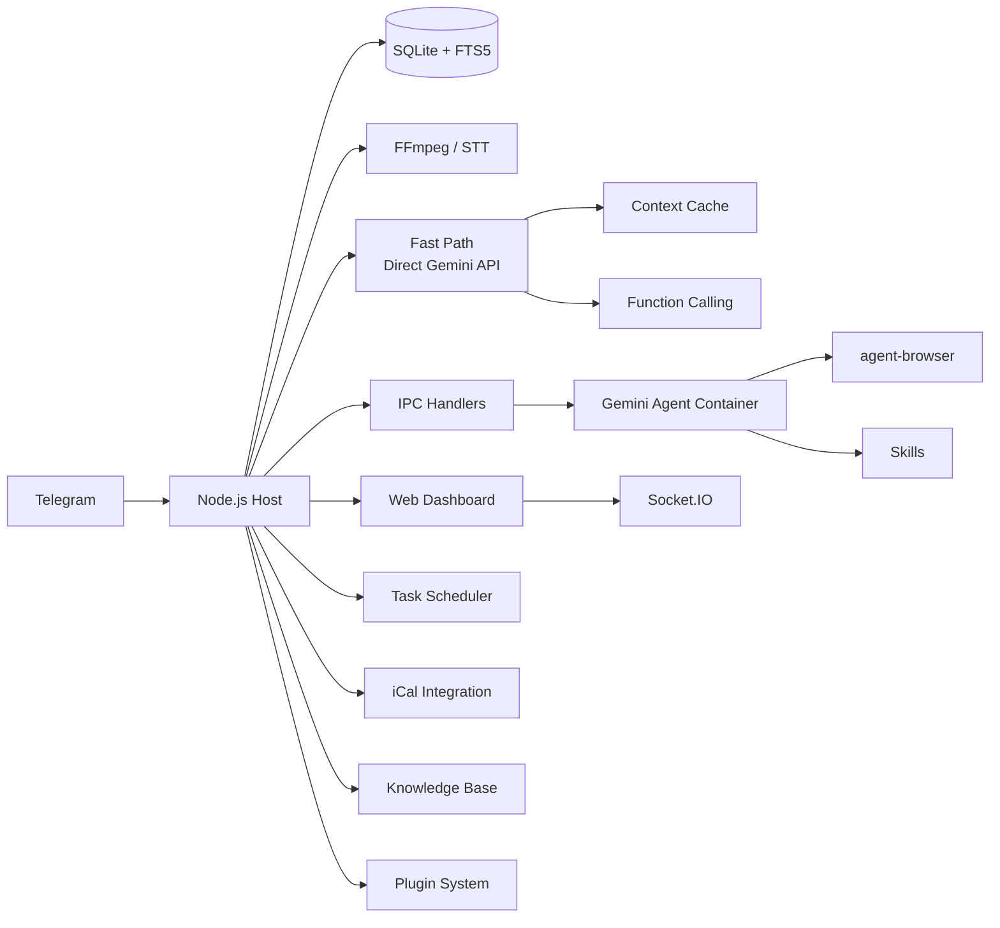

<p align="center">
  
</p>

<p align="center">
  由 <strong>Gemini</strong> 驅動的個人 AI 助理。在容器中安全運行。輕量、易於理解、可自訂與擴充。
</p>

<p align="center">
  <em>從 <a href="https://github.com/gavrielc/nanoclaw">NanoClaw</a> fork 而來 — 以 Gemini 取代 Claude Agent SDK、以 Telegram 取代 WhatsApp</em>
</p>

<p align="center">
  <a href="README.md">English</a> |
  <strong>繁體中文</strong> |
  <a href="README.zh-CN.md">简体中文</a> |
  <a href="README.es.md">Español</a> |
  <a href="README.ja.md">日本語</a> |
  <a href="README.ko.md">한국어</a> |
  <a href="README.pt.md">Português</a> |
  <a href="README.ru.md">Русский</a>
</p>

---

## 為什麼選擇 NanoGemClaw？

**NanoGemClaw** 是一個輕量、安全、可擴充的 AI 助理，在隔離容器中運行 **Gemini**，透過 Telegram 提供服務。

| 功能 | NanoClaw | NanoGemClaw |
|------|----------|-------------|
| **Agent 執行環境** | Claude Agent SDK | Gemini CLI + Direct API |
| **訊息平台** | WhatsApp (Baileys) | Telegram Bot API |
| **費用** | Claude Max（$100/月） | 免費方案（60 req/min） |
| **架構** | 單體式 | 模組化 monorepo（7 個套件） |
| **擴充性** | 硬編碼 | 具生命週期 hooks 的插件系統 |
| **媒體支援** | 純文字 | 照片、語音、音訊、影片、文件 |
| **網頁瀏覽** | 僅搜尋 | 完整 `agent-browser`（Playwright） |
| **知識庫** | - | 每個群組獨立的 FTS5 全文搜尋 |
| **排程** | - | 自然語言 + cron、iCal 行事曆 |
| **儀表板** | - | 9 模組即時管理 SPA |
| **進階工具** | - | STT、圖片生成、Personas、Skills、多模型 |
| **快速路徑** | - | 直接 Gemini API 串流、內容快取、原生函式呼叫 |

---

## 主要功能

- **模組化 Monorepo** — 7 個 npm workspace 套件。可在自己的專案中單獨使用各套件，或部署完整堆疊。
- **插件系統** — 透過自訂 Gemini 工具、訊息 hooks、API 路由和背景服務進行擴充，無需修改核心程式碼。
- **多模態 I/O** — 支援傳送照片、語音訊息、影片或文件，Gemini 可原生處理。
- **快速路徑（Direct API）** — 簡單文字查詢略過容器啟動，透過 `@google/genai` SDK 即時串流回應，需要程式碼執行時自動回退至容器。
- **內容快取** — 靜態內容透過 Gemini caching API 快取，可降低 75–90% 的輸入 token 費用。
- **原生函式呼叫** — 工具操作使用 Gemini 的原生 function calling，取代基於檔案的 IPC polling。
- **語音轉文字** — 語音訊息自動轉錄（Gemini 多模態或 Google Cloud Speech）。
- **圖片生成** — 透過自然語言使用 **Imagen 3** 生成圖片。
- **瀏覽器自動化** — Agent 使用 `agent-browser` 執行複雜的網頁任務。
- **知識庫** — 每個群組獨立的文件庫，搭配 SQLite FTS5 全文搜尋。
- **排程任務** — 自然語言排程（「每天早上 8 點」），支援 cron、interval 和單次執行。
- **行事曆整合** — 訂閱 iCal feeds 並查詢即將到來的活動。
- **Skills 系統** — 為群組指派基於 Markdown 的技能檔案，賦予專門能力。
- **Personas** — 使用預定義人格或為每個群組建立自訂 persona。
- **多模型支援** — 可為每個群組選擇 Gemini 模型（`gemini-3-flash-preview`、`gemini-3-pro-preview` 等）。
- **容器隔離** — 每個群組在獨立的沙箱中運行（Apple Container 或 Docker）。
- **網頁儀表板** — 9 模組即時指揮中心，包含日誌串流、記憶體編輯器、分析報表等功能。
- **i18n** — 完整介面支援英文、中文、日文和西班牙文。

---

## Monorepo 架構

```
nanogemclaw/
├── packages/
│   ├── core/          # @nanogemclaw/core      — 型別、設定、日誌、工具函式
│   ├── db/            # @nanogemclaw/db        — SQLite 持久化（better-sqlite3）
│   ├── gemini/        # @nanogemclaw/gemini    — Gemini API 用戶端、內容快取、工具
│   ├── telegram/      # @nanogemclaw/telegram  — Bot 輔助函式、速率限制、訊息整合器
│   ├── server/        # @nanogemclaw/server    — Express + Socket.IO 儀表板 API
│   ├── plugin-api/    # @nanogemclaw/plugin-api — 插件介面與生命週期型別
│   └── dashboard/     # React + Vite 前端 SPA（private）
├── app/               # 應用程式進入點 — 整合所有套件
├── src/               # 應用程式模組（訊息處理器、bot、排程器等）
├── examples/
│   └── plugin-skeleton/  # 最小插件範例
├── container/         # Agent 容器（Gemini CLI + 工具）
└── docs/              # 文件與指南
```

### 套件概覽

| 套件 | 描述 | 再利用價值 |
|------|------|-----------|
| `@nanogemclaw/core` | 共用型別、設定工廠、日誌、工具函式 | 中 |
| `@nanogemclaw/db` | 具 FTS5 搜尋的 SQLite 資料庫層 | 中 |
| `@nanogemclaw/gemini` | Gemini API 用戶端、內容快取、函式呼叫 | **高** |
| `@nanogemclaw/telegram` | Telegram bot 輔助函式、速率限制器、訊息整合器 | 中 |
| `@nanogemclaw/server` | Express 儀表板伺服器 + Socket.IO 即時事件 | 中 |
| `@nanogemclaw/plugin-api` | 插件介面定義與生命週期型別 | **高** |

---

## 快速開始

### 前置需求

| 工具 | 用途 | 安裝方式 |
|------|------|---------|
| **Node.js 20+** | 執行環境 | [nodejs.org](https://nodejs.org) |
| **Gemini CLI** | AI Agent | `npm install -g @google/gemini-cli` |
| **FFmpeg** | 音訊處理（STT） | `brew install ffmpeg` |

### 1. 複製並安裝

```bash
git clone https://github.com/Rlin1027/NanoGemClaw.git
cd NanoGemClaw
npm install
```

### 2. 設定環境變數

```bash
cp .env.example .env
```

編輯 `.env` 並填入：

- `TELEGRAM_BOT_TOKEN` — 從 Telegram 的 [@BotFather](https://t.me/BotFather) 取得
- `GEMINI_API_KEY` — 從 [Google AI Studio](https://aistudio.google.com/) 取得

可選擇性複製設定檔以啟用 TypeScript 自動補全：

```bash
cp nanogemclaw.config.example.ts nanogemclaw.config.ts
```

### 3. 建置儀表板

```bash
cd packages/dashboard && npm install && cd ../..
npm run build:dashboard
```

### 4. 建置 Agent 容器

```bash
bash container/build.sh
```

### 5. 啟動

```bash
npm run dev
```

開啟 `http://localhost:3000` 即可存取網頁儀表板。

> 如需詳細的逐步指南，請參閱 [docs/GUIDE.md](docs/GUIDE.md)。

---

## 插件系統

NanoGemClaw 支援插件，可在不修改核心程式碼的情況下擴充功能。插件可提供：

- **Gemini 工具** — 供 AI 使用的自訂 function calling 工具
- **訊息 Hooks** — 在處理前後攔截訊息
- **API 路由** — 自訂儀表板 API 端點
- **背景服務** — 長時間運行的背景任務
- **IPC 處理器** — 自訂程序間通訊處理器

### 撰寫插件

1. 將 `examples/plugin-skeleton/` 複製到新目錄。
2. 實作 `NanoPlugin` 介面：

```typescript
import type { NanoPlugin, PluginApi, GeminiToolContribution } from '@nanogemclaw/plugin-api';

const myPlugin: NanoPlugin = {
  id: 'my-plugin',
  name: 'My Plugin',
  version: '1.0.0',

  async init(api: PluginApi) {
    api.logger.info('Plugin initialized');
  },

  geminiTools: [
    {
      name: 'my_tool',
      description: 'Does something useful',
      parameters: {
        type: 'OBJECT',
        properties: {
          input: { type: 'STRING', description: 'The input value' },
        },
        required: ['input'],
      },
      permission: 'any',
      async execute(args) {
        return JSON.stringify({ result: `Processed: ${args.input}` });
      },
    },
  ],

  hooks: {
    async afterMessage(context) {
      // 記錄每則訊息以供分析
    },
  },
};

export default myPlugin;
```

1. 在 `data/plugins.json` 中註冊：

```json
{
  "plugins": [
    {
      "source": "./path/to/my-plugin/src/index.ts",
      "config": { "myOption": "value" },
      "enabled": true
    }
  ]
}
```

完整文件範例請參閱 `examples/plugin-skeleton/src/index.ts`，插件開發完整指南請參閱 [docs/GUIDE.md](docs/GUIDE.md)。

---

## 環境變數

### 必填

| 變數 | 描述 |
|------|------|
| `TELEGRAM_BOT_TOKEN` | 從 @BotFather 取得的 bot token |

### 選填 — AI 與媒體

| 變數 | 預設值 | 描述 |
|------|--------|------|
| `GEMINI_API_KEY` | - | API 金鑰（圖片生成與快速路徑必填） |
| `GEMINI_MODEL` | `gemini-3-flash-preview` | 所有群組的預設 Gemini 模型 |
| `ASSISTANT_NAME` | `Andy` | Bot 觸發名稱（用於 `@Andy` 提及） |
| `STT_PROVIDER` | `gemini` | 語音轉文字：`gemini`（免費）或 `gcp`（付費） |

### 選填 — 儀表板與安全性

| 變數 | 預設值 | 描述 |
|------|--------|------|
| `DASHBOARD_HOST` | `127.0.0.1` | 綁定位址（`0.0.0.0` 供區域網路存取） |
| `DASHBOARD_API_KEY` | - | 保護儀表板存取的 API 金鑰 |
| `DASHBOARD_ACCESS_CODE` | - | 儀表板登入畫面的存取碼 |
| `DASHBOARD_ORIGINS` | 自動 | 以逗號分隔的允許 CORS 來源 |

### 選填 — 快速路徑

| 變數 | 預設值 | 描述 |
|------|--------|------|
| `FAST_PATH_ENABLED` | `true` | 為文字查詢啟用直接 Gemini API |
| `FAST_PATH_TIMEOUT_MS` | `180000` | API 逾時（毫秒） |
| `CACHE_TTL_SECONDS` | `21600` | 內容快取 TTL（6 小時） |
| `MIN_CACHE_CHARS` | `100000` | 觸發快取的最小內容長度 |

### 選填 — 基礎設施

| 變數 | 預設值 | 描述 |
|------|--------|------|
| `CONTAINER_TIMEOUT` | `300000` | 容器執行逾時（毫秒） |
| `CONTAINER_IMAGE` | `nanogemclaw-agent:latest` | 容器映像名稱 |
| `RATE_LIMIT_ENABLED` | `true` | 啟用請求速率限制 |
| `RATE_LIMIT_MAX` | `20` | 每個群組每時間窗口的最大請求數 |
| `RATE_LIMIT_WINDOW` | `5` | 速率限制時間窗口（分鐘） |
| `WEBHOOK_URL` | - | 通知用的外部 webhook |
| `TZ` | 系統 | 排程任務的時區 |
| `LOG_LEVEL` | `info` | 日誌級別 |

完整清單請參閱 [.env.example](.env.example)。

---

## 使用範例

### 訊息與生產力

- `@Andy translate this voice message and summarize it`
- `@Andy generate a 16:9 image of a futuristic cyberpunk city`
- `@Andy browse https://news.google.com and give me the top headlines`

### 任務排程

- `@Andy every morning at 8am, check the weather and suggest what to wear`
- `@Andy monitor my website every 30 minutes and alert me if it goes down`

### 知識庫

- 透過儀表板上傳文件，然後詢問：`@Andy search the knowledge base for deployment guide`

### 管理指令

直接傳送以下指令給 bot：

- `/admin language <lang>` — 切換 bot 介面語言
- `/admin persona <name>` — 變更 bot 人格
- `/admin report` — 取得每日活動摘要

---

## 架構



### 後端套件

| 套件 | 主要模組 |
|------|---------|
| `@nanogemclaw/core` | `config.ts`, `types.ts`, `logger.ts`, `utils.ts`, `safe-compare.ts` |
| `@nanogemclaw/db` | `connection.ts`, `messages.ts`, `tasks.ts`, `stats.ts`, `preferences.ts` |
| `@nanogemclaw/gemini` | `gemini-client.ts`, `context-cache.ts`, `gemini-tools.ts` |
| `@nanogemclaw/telegram` | `telegram-helpers.ts`, `telegram-rate-limiter.ts`, `message-consolidator.ts` |
| `@nanogemclaw/server` | `server.ts`, `routes/`（auth, groups, tasks, knowledge, calendar, skills, config, analytics） |
| `@nanogemclaw/plugin-api` | `NanoPlugin`, `PluginApi`, `GeminiToolContribution`, `HookContributions` |

### 應用程式層（`src/`）

| 模組 | 用途 |
|------|------|
| `index.ts` | Telegram bot 進入點、狀態管理、IPC 派送 |
| `message-handler.ts` | 訊息處理、快速路徑路由、多模態輸入 |
| `fast-path.ts` | 具串流功能的直接 Gemini API 執行 |
| `container-runner.ts` | 容器生命週期與串流輸出 |
| `task-scheduler.ts` | Cron/interval/單次任務執行 |
| `knowledge.ts` | FTS5 知識庫引擎 |
| `personas.ts` | Persona 定義與自訂 persona 管理 |
| `natural-schedule.ts` | 自然語言轉 cron 解析器（EN/ZH） |

### 前端（`packages/dashboard/`）

React + Vite + TailwindCSS SPA，包含 9 個模組：

| 頁面 | 描述 |
|------|------|
| **Overview** | 含即時 agent 活動的群組狀態卡片 |
| **Logs** | 具級別篩選的通用日誌串流 |
| **Memory Studio** | 系統提示與對話摘要的 Monaco 編輯器 |
| **Group Detail** | 每群組設定：persona、模型、觸發詞、網頁搜尋開關 |
| **Tasks** | 含執行歷史的排程任務 CRUD |
| **Analytics** | 使用量圖表、容器日誌、訊息統計 |
| **Knowledge** | 文件上傳、FTS5 搜尋、每群組文件管理 |
| **Calendar** | iCal feed 訂閱與即將到來的活動檢視器 |
| **Settings** | 維護模式、除錯日誌、密鑰狀態、偏好設定 |

### 持久化

- **SQLite**（`store/messages.db`）：訊息、任務、統計、偏好設定、知識庫（FTS5）
- **JSON**（`data/`）：Sessions、已註冊群組、自訂 personas、行事曆設定、群組 skills
- **檔案系統**（`groups/`）：每群組工作區（GEMINI.md、日誌、媒體、IPC）

---

## 網頁儀表板

```bash
# 本機存取（預設）
open http://localhost:3000

# 區域網路存取
DASHBOARD_HOST=0.0.0.0 npm run dev
```

支援 `Cmd+K` / `Ctrl+K` 全域搜尋覆蓋層。

### 正式環境建置

```bash
npm run build:dashboard    # 建置前端
npm run build              # 建置後端
npm start                  # 在 :3000 提供儀表板服務
```

---

## 開發

```bash
npm run dev               # 以 tsx 啟動（熱重載）
npm run typecheck         # TypeScript 型別檢查（後端）
npm test                  # 執行所有測試（Vitest，12 個檔案，約 330 個測試）
npm run test:watch        # 監看模式
npm run test:coverage     # 覆蓋率報告
npm run format:check      # Prettier 檢查
```

儀表板開發：

```bash
cd packages/dashboard
npm run dev               # Vite 開發伺服器（port 5173，代理 /api -> :3000）
npx tsc --noEmit          # 前端型別檢查
```

---

## 疑難排解

- **Bot 沒有回應？** 檢查 `npm run dev` 的日誌，並確認 bot 已在群組中設為管理員。
- **STT 失敗？** 確認已安裝 `ffmpeg`（`brew install ffmpeg`）。
- **媒體無法處理？** 確認 `.env` 中已設定 `GEMINI_API_KEY`。
- **容器問題？** 執行 `bash container/build.sh` 重新建置映像。
- **儀表板空白頁？** 建置前請先執行 `cd packages/dashboard && npm install`。
- **CORS 錯誤？** 檢查 `DASHBOARD_ORIGINS` 環境變數。
- **容器 EROFS 錯誤？** Apple Container 不支援巢狀重疊的 bind mounts。
- **快速路徑無法運作？** 確認已設定 `GEMINI_API_KEY`。僅使用 OAuth 的設定會自動回退至容器路徑。
- **想停用快速路徑？** 全域設定 `FAST_PATH_ENABLED=false`，或在儀表板中按群組切換。
- **遭到速率限制？** 在 `.env` 中調整 `RATE_LIMIT_MAX` 和 `RATE_LIMIT_WINDOW`。

---

## 授權

MIT

## 致謝

- 原始 [NanoClaw](https://github.com/gavrielc/nanoclaw) 由 [@gavrielc](https://github.com/gavrielc) 開發
- 由 [Gemini](https://ai.google.dev/) 提供技術支援
